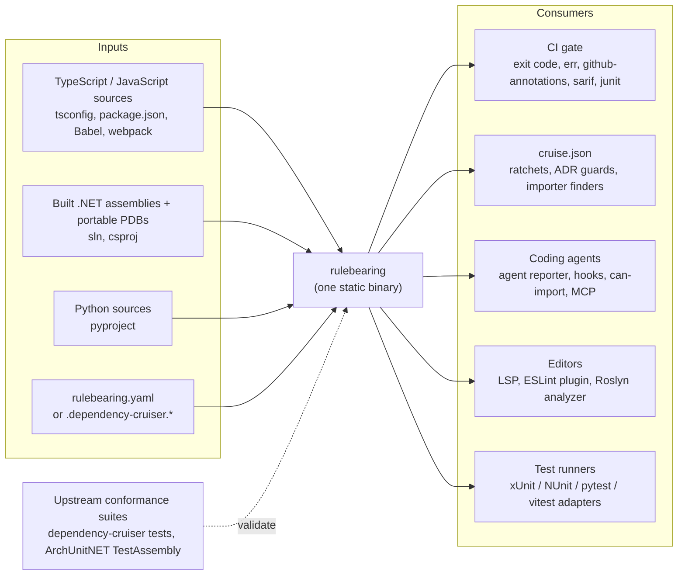
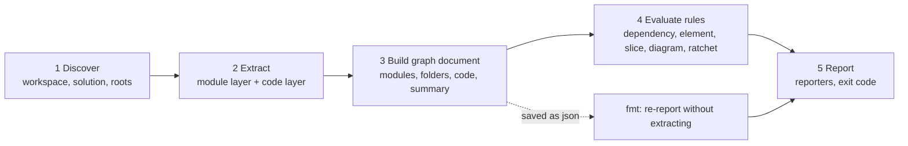
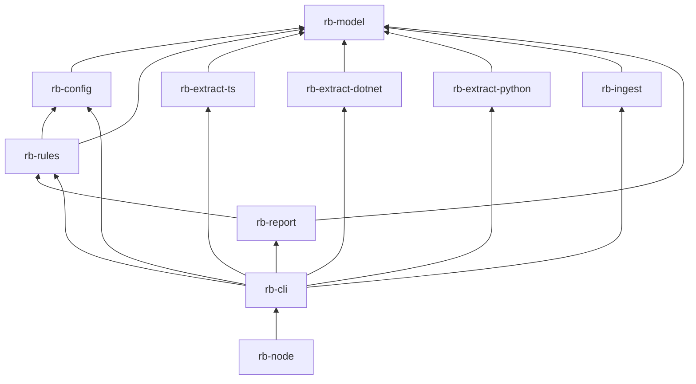
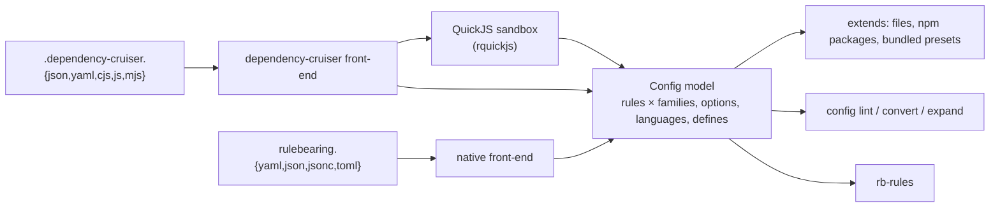
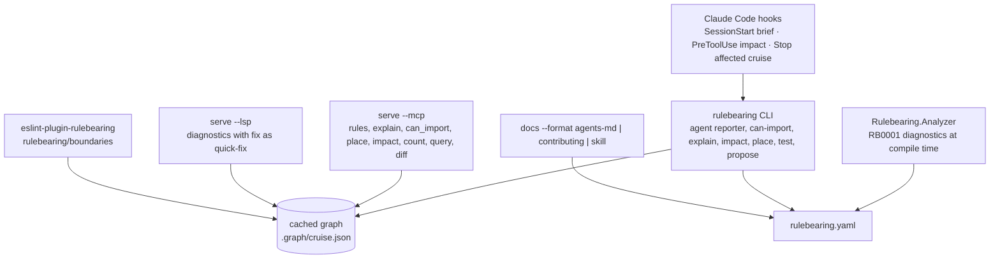

# Rulebearing: target architecture

**Status:** to-be architecture, version 1, 2026-09-20. This document describes the system the [plans](plans/README.md) build. It derives from the [design document](artifacts/design.md) and the two coverage tabs ([dependency-cruiser 18.2.0](artifacts/dependency-cruiser-18.2.0-coverage.md), [ArchUnitNET 0.13.4](artifacts/archunitnet-0.13.4-coverage.md)); every decision it relies on is an [ADR](adr/README.md). Requirements are in the [PRD](prd.md).

## Contents

1. [Purpose and scope](#purpose-and-scope)
2. [Architectural drivers](#architectural-drivers)
3. [System context](#system-context)
4. [The five stages](#the-five-stages)
5. [Crate layout](#crate-layout)
6. [The graph document](#the-graph-document)
7. [Extractors](#extractors)
8. [Configuration and the rule language](#configuration-and-the-rule-language)
9. [The rule engine](#the-rule-engine)
10. [Outputs and CI contract](#outputs-and-ci-contract)
11. [Agent surface](#agent-surface)
12. [Distribution](#distribution)
13. [Technology choices](#technology-choices)
14. [Security posture](#security-posture)
15. [Performance model](#performance-model)
16. [Verification strategy](#verification-strategy)
17. [Repository layout](#repository-layout)
18. [Risks and their mitigations](#risks-and-their-mitigations)
19. [Glossary](#glossary)

## Purpose and scope

Rulebearing is one open-source command-line tool and one rule language that does what dependency-cruiser does for TypeScript and JavaScript, what ArchUnitNET does for .NET, and what import-linter does for Python, over a single graph. A repository with more than one language keeps one set of architecture rules, one gate, and one answer to "may this file import that one" ([design § Why](artifacts/design.md#why)).

In scope: the binary, its three extractors, the graph document, the rule engine, every reporter, the subcommands, the npm, NuGet and pip wrappers, the test-runner adapters, the ESLint plugin, the Roslyn analyzer, the MCP and LSP servers, and the conformance harness. Out of scope: any cross-language edge the languages do not declare ([ADR-0014](adr/0014-no-invented-cross-language-edges.md)), and arbitrary-code predicates, which stay in ArchUnitNET.

## Architectural drivers

| Driver | Source | Architectural consequence |
| --- | --- | --- |
| **Superset, precisely.** Every dependency-cruiser 18.2.0 and ArchUnitNET 0.13.4 feature has a row with a status; nothing is dropped. | [design § Why](artifacts/design.md#why), coverage tabs | Two conformance gates are required checks ([ADR-0009](adr/0009-conformance-suites-as-specification.md)); the module layer is the `cruise-result` schema unchanged ([ADR-0004](adr/0004-graph-document-is-cruise-result-superset.md)). |
| **Drop-in for a heavy dependency-cruiser user.** The config file, the JSON field names, `fmt`, the `err` reporter and the exit code must be identical on day one. | [design § What a heavy dependency-cruiser user needs](artifacts/design.md#what-a-heavy-dependency-cruiser-user-needs) | Both config formats load into one model ([ADR-0005](adr/0005-native-config-superset-and-compat.md)); JavaScript configs run in an embedded sandbox ([ADR-0006](adr/0006-embedded-quickjs-config-evaluator.md)). |
| **The graph is a first-class artefact.** Other guards read it. | [design § The run and its consumers](artifacts/design.md#the-run-and-its-consumers) | One extraction feeds the gate, every ratchet, the MCP server and `fmt`. |
| **Liveness is checked.** A rule matching nothing fails. | [design § Why](artifacts/design.md#why) | Vacuous rules exit 2 by default ([ADR-0007](adr/0007-vacuous-rules-fail-by-default.md)). |
| **One binary, no runtime.** Must run in a TypeScript, a .NET and a Python pipeline. | [design § Language decision](artifacts/design.md#language-decision) | Rust, thin wrappers ([ADR-0002](adr/0002-rust-as-implementation-language.md), [ADR-0020](adr/0020-single-name-across-registries.md)). |
| **Agent-shaped.** Line-precise findings, `fix` text, a token-budgeted reporter, sub-two-second affected runs. | [design § Rules an agent can implement and follow](artifacts/design.md#rules-an-agent-can-implement-and-follow) | Stable ids and line/column on every edge ([ADR-0015](adr/0015-stable-violation-id.md)); the CLI is the primary agent surface ([ADR-0021](adr/0021-agent-surface-cli-first.md)). |
| **One maintainer.** | [design § What Rust does not solve](artifacts/design.md#what-rust-does-not-solve) | The suites are the reviewer; the crate layout keeps each piece recognisable to a specialist in its language ([ADR-0010](adr/0010-crate-layout-and-extractor-boundary.md)); 70% coverage is a floor ([ADR-0018](adr/0018-test-coverage-threshold.md)). |

## System context



The binary is the only runtime component. Everything else either produces an input it reads or consumes an output it writes. The wrappers and adapters are shells over the binary and the JSON.

## The five stages

The pipeline inside `rulebearing cruise`, from [design § The five stages](artifacts/design.md#the-five-stages):



1. **Discover** walks from `baseDir` without building anything. TypeScript: `package.json` workspaces, the `tsconfig.json` chain, `.babelrc.json`, `webpack.config.js`. .NET: `.sln` or `.slnx`, every `.csproj`, `Directory.Build.props`, `Directory.Packages.props`, yielding project nodes and `ProjectReference` / `PackageReference` edges. Python: `pyproject.toml`, source roots, package layout. Discovery alone supports project-level rules and is fast enough for a pre-commit hook.
2. **Extract** fills both layers per language (see [Extractors](#extractors)).
3. **Build the graph document** (see [The graph document](#the-graph-document)).
4. **Evaluate rules** (see [The rule engine](#the-rule-engine)).
5. **Report.** Exit code is the count of error-severity violations ([ADR-0008](adr/0008-exit-code-contract.md)). `fmt` re-reports a saved JSON without re-extracting.

## Crate layout

Fixed by [ADR-0010](adr/0010-crate-layout-and-extractor-boundary.md). Arrows point from dependant to dependency.



| Crate | Owns | Wave |
| --- | --- | --- |
| `rb-model` | Graph document types (module layer = `cruise-result` schema, code layer), the published JSON schema, serde, the violation-id hash, per-language option structs | 0 |
| `rb-config` | Native and dependency-cruiser config parsing, `extends`, presets, `defines`, `$0`–`$9` captures, the QuickJS evaluator, `config lint` / `convert` / `expand` | 1 |
| `rb-rules` | Matchers, Tarjan cycles, breadth-first reachability, dependents, instability, element predicates and conditions, slices, PlantUML adherence, ratchets, liveness, violation summary | 1, 2 |
| `rb-extract-ts` | Workspace discovery, `oxc_parser`, `oxc_resolver`, npm classification, licence and deprecation from `package.json`, Vue / Svelte splitting, JSDoc and triple-slash parsing, sidecar dispatch | 0, 1, 2, 3 |
| `rb-extract-dotnet` | MSBuild discovery, ECMA-335 and portable PDB readers, IL operand scan, edge projection to files, `--mode source` | 0, 2, 3 |
| `rb-extract-python` | `ruff_python_parser`, import resolver, per-version stdlib list, `TYPE_CHECKING` detection | 2 |
| `rb-ingest` | dependency-cruiser JSON, ArchUnitNET-style JSON and the C# fallback extractor's output in; graph document out | 1, 2 |
| `rb-report` | Every dependency-cruiser reporter plus `sarif`, `github-annotations`, `junit`, `trx`, `agent`, `plantuml` | 1, 2, 3 |
| `rb-cli` | `cruise`, `fmt`, `baseline`, `rules`, `count`, `diff`, `explain`, `can-import`, `place`, `impact`, `test`, `docs`, `config`, `init`, `adopt`, `hooks`, `attest`, `import`, `propose`, `decisions`, `guard`, `snapshot`, `changelog`, `serve`; cache; `--affected` | 1, 2, 3 |
| `rb-node` | napi-rs binding exposing `cruise()` and `format()` with dependency-cruiser's signatures | 3 |

Outside the workspace: `wrappers/npm`, `wrappers/nuget`, `wrappers/pip`; `adapters/dotnet` (`Rulebearing.TestAdapter`), `adapters/python` (`pytest-rulebearing`), `adapters/vitest`; `frontends/eslint-plugin-rulebearing`, `frontends/Rulebearing.Analyzer`; `conformance/`; `testbeds/`.

Each extractor is a Cargo feature of `rb-cli` (`extract-ts`, `extract-dotnet`, `extract-python`), on by default. The extractors are the only crates that read files other than the config, and none depends on `rb-config` or `rb-rules`.

## The graph document

Fixed by [ADR-0004](adr/0004-graph-document-is-cruise-result-superset.md) and [ADR-0015](adr/0015-stable-violation-id.md). One JSON with two layers.

**Module layer** (dependency-cruiser's `cruise-result` schema, unchanged): `modules[]` with `source`, `dependencies[]`, `dependents[]`, `orphan`, `valid`, `rules[]`, `reachable[]`, `reaches[]`, `instability`, `couldNotResolve`, `coreModule`, `followable`, `matchesDoNotFollow`, `matchesFocus`, `matchesReaches`, `matchesHighlight`, `consolidated`, `checksum`, `license`, `dependencyTypes`, `experimentalStats`; each dependency with `module`, `resolved`, `moduleSystem`, `dependencyTypes`, `dynamic`, `exoticallyRequired`, `exoticRequire`, `followable`, `coreModule`, `couldNotResolve`, `matchesDoNotFollow`, `circular`, `cycle[]`, `valid`, `rules[]`, `preCompilationOnly`, `typeOnly`, `protocol`, `mimeType`, `license`, `instability`; `folders[]` with the coupling metrics; `summary` with `violations[]`, the severity counts, `totalCruised`, `totalDependenciesCruised`, `optionsUsed`, `ruleSetUsed`, `environment`; `revisionData`.

**Additions, all additive:**

| Where | Field | Meaning |
| --- | --- | --- |
| module | `language` | `typescript`, `javascript`, `dotnet`, `python` |
| module | `project`, `namespaces[]` | the `.csproj` or package that owns the file; the namespaces it declares |
| module | `attribution` | `pdb`, `inferred`, `none` (.NET only) |
| dependency | `line`, `column` | from the AST span, PDB sequence point or Python node |
| dependency | `dependencyKind` | `import`, `inherits`, `implements`, `field`, `signature`, `body`, `attribute`, `generic-argument`, `typeof`, `call` |
| dependency | `member` | the member reference that formed the edge (`TodoItemsController.Get calls ApplicationDbContext.SaveChanges`) |
| dependency | `sidecar`, `declared` | edge produced by the Node sidecar; edge declared rather than detected (wave 4) |
| violation | `id` | `RB-` plus eight hex characters of SHA-256 over rule, from, to, dependencyKind |
| violation | `fix`, `decision` | the rule's `fix` text and the decision token parsed from `comment` |
| summary | `inspected` | counts of files, assemblies and modules per language: the receipt |
| summary | `vacuousRules[]` | rules whose selection was empty |
| top level | `code` | `types[]`, `members[]`, `attributes[]`, `calls[]`, each with `language`, `file`, `line`, `column`, and the properties the element predicates read (visibility, `sealed`, `abstract`, `static`, `readonly`, `record`, `virtual`, base types, interfaces, attribute arguments, return type, accessors) |

`--strict-schema` strips every addition and the result validates against the pinned 18.2.0 schema. The superset schema is generated from `rb-model` with `schemars`, committed under `schema/`, and served at `https://benbahrenburg.github.io/rulebearing/schema/v1.json`.

## Extractors

From [design § What each extractor has to get right](artifacts/design.md#what-each-extractor-has-to-get-right) and [§ One engine, three languages](artifacts/design.md#one-engine-three-languages-one-monorepo). Each extractor's whole job is to produce modules, dependencies and code elements in the document shape; nothing after it is language-aware.

| Concern | TypeScript ([ADR-0012](adr/0012-oxc-for-typescript.md)) | .NET ([ADR-0011](adr/0011-read-dotnet-assemblies-not-source.md), [ADR-0003](adr/0003-dotnet-extractor-fallback.md)) | Python ([ADR-0013](adr/0013-ruff-parser-for-python.md)) |
| --- | --- | --- | --- |
| Discovery | `package.json` workspaces, `tsconfig` chain, Babel and webpack configs | `.sln` / `.slnx`, `.csproj`, `Directory.*.props`; `IsTestProject`, `OutputPath`, `TargetFramework` | `pyproject.toml`, `src/` layout, `setup.cfg` |
| Module identity | the file | the PDB document path, normalised; `/_/` deterministic-build prefixes unmapped through `SourceRoot` | the file; `__init__.py` stands for its package |
| Edge source | every dependency form dependency-cruiser extracts | metadata tables and IL operands | `import`, `from ... import`, `__all__`, literal `importlib.import_module` |
| Resolution | `oxc_resolver` with tsconfig, webpack and Babel alias tables | `TypeRef` to `TypeDef` across solution assemblies; external to `package` or `framework` | roots, relative, stdlib list, installed distributions, `unresolved` |
| `dependencyTypes` | dependency-cruiser's forty | `local`, `project`, `package`, `framework`, `test-only`, `signature-only`, `unresolved` | `local`, `stdlib`, `site`, `type-only`, `dynamic`, `unresolved` |
| Code layer | classes, interfaces, enums, type aliases, functions, exports, decorators, `extends` / `implements`, accessors, modifiers, visibility | everything ArchUnitNET reads | classes, functions, methods, decorators, bases, `@property`, `@staticmethod`, `@classmethod`, `@dataclass`, underscore visibility |
| `dynamic` | `import()` | literal `Assembly.Load`, `Type.GetType`, `Activator.CreateInstance` | literal `importlib.import_module`, `__import__` |
| Default excludes | `node_modules/`, `.next/`, `dist/`, `coverage/` | `obj/`, `bin/`, `*.g.cs`, `*.Designer.cs`, `GlobalUsings.g.cs` | `.venv/`, `site-packages/`, `__pycache__/`, `*.pyi` unless `--stubs` |
| Default orphan exclusions | framework entry files (Next.js `page.tsx`, `route.ts`, config files) | `Program.cs`, `Startup.cs`, `AssemblyInfo.cs`, migrations | `__main__.py`, `conftest.py`, console-script targets |
| Not native | CoffeeScript, LiveScript: Node sidecar ([ADR-0017](adr/0017-coffeescript-livescript-sidecar.md)) | source mode is approximate and never the gate | none |

**The .NET reader.** Eight ECMA-335 tables are needed for the edge set (`TypeDef`, `TypeRef`, `MemberRef`, `MethodDef`, `Field`, `InterfaceImpl`, `CustomAttribute`, `TypeSpec`, plus the blob and string heaps), and the portable PDB's `Document` and `MethodDebugInformation` tables for attribution. IL is scanned for `call`, `callvirt`, `newobj`, `ldfld`, `stfld`, `ldtoken`, `box`, `castclass`, `isinst` operands. The reader is about 3,000 lines against two stable specifications and lives entirely in `rb-extract-dotnet`; the fallback in [ADR-0003](adr/0003-dotnet-extractor-fallback.md) replaces it with a C# program writing the same document.

## Configuration and the rule language

Fixed by [ADR-0005](adr/0005-native-config-superset-and-compat.md), [ADR-0006](adr/0006-embedded-quickjs-config-evaluator.md), [ADR-0016](adr/0016-linear-time-regex-and-strict-compat.md). Both formats load into one internal model in `rb-config`.



**Four rule families over one graph**, sharing `name`, `comment`, `severity`, `fix`, `examples`, `owner`, `expires` and the liveness default:

| Family | Vocabulary | Reads |
| --- | --- | --- |
| `rules.dependencies` (`forbidden`, `allowed`, `required`) | the whole of dependency-cruiser 18.2.0 ([coverage § Rules](artifacts/dependency-cruiser-18.2.0-coverage.md#rules)), plus `language`, `namespace`, `project`, `assembly`, `dependencyKind` on `from` and `to` | module layer |
| `rules.elements` (`select … should`) | ArchUnitNET's selectors, predicates and conditions in camelCase ([coverage](artifacts/archunitnet-0.13.4-coverage.md)), `all` / `any` / `not`, nested selectors, `because`, `allowEmpty` | code layer |
| `rules.slices` | `matching` with `(*)` / `(**)`, `notDependOnEachOther`, `beFreeOfCycles`, `ignore`, `where` | both |
| `rules.diagrams` | `adhereTo: <file>.puml` with `<<pattern>>` stereotypes | both |
| `rules.ratchets` | `from`, `to`, `budget` file; the ceiling may only fall | module layer |
| Shorthands `layers`, `independence` | expand to `forbidden` rules; `config expand` shows the expansion | module layer |

`languages` holds per-language settings; dependency-cruiser's flat option names are accepted at the top level as aliases. `defines` reads a named value from a JSON file with a small path expression and substitutes `${name}` into any pattern, replacing computed JavaScript.

## The rule engine

`rb-rules` reads the document and the config model and writes `violations[]`, `rules[]` on modules and dependencies, and `vacuousRules[]`. It contains no `match language`.

| Concern | Mechanism |
| --- | --- |
| Path, namespace, name matching | `regex` crate, linear-time ([ADR-0016](adr/0016-linear-time-regex-and-strict-compat.md)); `$0`–`$9` substituted escaped |
| Cycles | Tarjan's strongly connected components with the path enumerated, at module and folder scope |
| Reachability (`reachable`, `reaches`, `via*`) | breadth-first search from the `from` matches, with `maxDepth` |
| Dependents, orphans, instability, folder metrics | consolidated folder graph; afferent and efferent couplings |
| Element predicates and conditions | one function per ArchUnitNET predicate over `code`; a per-language capability table decides whether a predicate is answerable, and an unanswerable one is a validation error ([ADR-0014](adr/0014-no-invented-cross-language-edges.md)) |
| Slices | group by the capture of `matching`; evaluate pairwise dependencies and cycles |
| Diagram adherence | parse a PlantUML component diagram; map components to types by stereotype; fail undrawn dependencies |
| Ratchets | count direct edges; compare to the budget file; `--write` may only lower it |
| Liveness | every rule reports `fromMatches` and `toMatches`; zero on the selecting side is vacuous ([ADR-0007](adr/0007-vacuous-rules-fail-by-default.md)) |
| Severity | `error`, `warn`, `info`, `ignore`; only `error` counts toward the exit code |
| Baseline | `knownViolations` keyed by the stable id, with `expires`, `owner`, `reason`; `shrink-only` fails when a baselined entry no longer occurs |
| Determinism | modules, dependencies and violations are sorted before output so a local run and CI agree byte for byte |

## Outputs and CI contract

From [design § Outputs and CI integration](artifacts/design.md#outputs-and-ci-integration). The contract is four things: an exit code ([ADR-0008](adr/0008-exit-code-contract.md)), a `json` document, `fmt`, and a reporter the host's review surface understands.

| Reporter group | Reporters | Wave |
| --- | --- | --- |
| Terminal and data | `err`, `err-long`, `text`, `csv`, `json`, `null` | 1 |
| Review annotations | `teamcity`, `azure-devops`, `github-annotations` | 1 |
| Agent | `agent` (token-budgeted, fix-cost ordered, `--max-findings`) | 1 |
| Code scanning and tests | `sarif`, `junit`, `trx` | 2 |
| Graphs | `dot`, `ddot`, `archi` / `cdot`, `flat` / `fdot`, `mermaid`, `d2` | 2 |
| Data | `metrics`, `baseline`, `err-html` | 2 |
| Remaining | `x-dot-webpage`, `html`, `markdown`, `anon`, `plugin:<path>`, `plantuml`, `wrap-html` | 3 |

Every reporter is byte-compared against dependency-cruiser's `test/report` fixtures where one exists ([ADR-0009](adr/0009-conformance-suites-as-specification.md)). Every report carries the receipt (`inspected`) and every violation its stable id, `fix` and decision link.

**Subcommands a guard reaches for:** `cruise`, `fmt`, `rules --json`, `count`, `diff`, `explain`, `baseline`, `config convert | lint | expand`, `test`, `docs`, `can-import`, `place`, `impact`, `serve`.

## Agent surface

Fixed by [ADR-0021](adr/0021-agent-surface-cli-first.md). The CLI with `--output-type agent` is the primary surface; every other front-end reads the same config and the same cached graph, so none can disagree with the gate.



Authoring guardrails: a rule needs a decision token (`--require-comment-token`); a vacuous rule fails; a rule ships with `examples` that `test` runs; `propose` drafts a rule with current match counts; `config lint` catches patterns that match nothing, shadowed rules, permit-everything lists and unanswerable predicates; ratchets only fall; runs are hermetic.

## Distribution

Fixed by [ADR-0002](adr/0002-rust-as-implementation-language.md) and [ADR-0020](adr/0020-single-name-across-registries.md).

| Host | Package | Mechanism |
| --- | --- | --- |
| TypeScript repository | `rulebearing` on npm | platform binaries under `optionalDependencies`, the ruff and oxc pattern; `rulebearing/vitest` reporter; `rb-node` napi binding for library callers |
| .NET repository | `Rulebearing` on NuGet | `dotnet tool` wrapper carrying the binary under `runtimes/`; `Rulebearing.TestAdapter`; `Rulebearing.Analyzer` |
| Python repository | `rulebearing` on PyPI | pip wheel wrapper per platform; `pytest-rulebearing` |
| Any | crates.io `rulebearing`, GitHub Releases, a GitHub Action, Homebrew (later) | static binaries for macOS (arm64, x64), Linux (x64, arm64, musl), Windows (x64) |

Release is one tag: `cargo-dist` builds the binaries, and the three wrappers are published from the same workflow with the same version.

## Technology choices

| Concern | Choice | ADR |
| --- | --- | --- |
| Language, packaging | Rust 2024 edition, Cargo workspace, `cargo-dist` | [0002](adr/0002-rust-as-implementation-language.md) |
| TypeScript parsing and resolution | `oxc_parser`, `oxc_resolver` | [0012](adr/0012-oxc-for-typescript.md) |
| .NET metadata | hand-written ECMA-335 and portable PDB reader; fallback `System.Reflection.Metadata` in C# | [0011](adr/0011-read-dotnet-assemblies-not-source.md), [0003](adr/0003-dotnet-extractor-fallback.md) |
| Python parsing | `ruff_python_parser` | [0013](adr/0013-ruff-parser-for-python.md) |
| JavaScript config evaluation | QuickJS via `rquickjs`, sandboxed | [0006](adr/0006-embedded-quickjs-config-evaluator.md) |
| Regex | `regex` crate | [0016](adr/0016-linear-time-regex-and-strict-compat.md) |
| Serialisation, schema | `serde`, `serde_json`, `serde_yaml`, `toml`, `schemars` | [0004](adr/0004-graph-document-is-cruise-result-superset.md) |
| CLI | `clap` with derive; `--help` byte-compared for the shared flags | [0008](adr/0008-exit-code-contract.md) |
| Hashing | `sha2` for violation ids and `attest` | [0015](adr/0015-stable-violation-id.md) |
| Node binding | `napi-rs` | [0002](adr/0002-rust-as-implementation-language.md) |
| .NET source mode | `tree-sitter-c-sharp` | [0011](adr/0011-read-dotnet-assemblies-not-source.md) |
| Licence policy | `cargo deny` | [0019](adr/0019-mit-licence.md) |
| Coverage | `cargo-llvm-cov`, vitest, coverlet, pytest-cov, 70% floor | [0018](adr/0018-test-coverage-threshold.md) |
| Linters | rustfmt and clippy, eslint and prettier, ruff and mypy, dotnet format, behind `cargo xtask lint` | [0023](adr/0023-documentation-link-and-lint-gates.md) |
| Test quality | `cargo-mutants`, `proptest`, committed snapshots | [0024](adr/0024-test-quality-gates.md) |
| CI and supply chain | least privilege, SHA-pinned actions, `cargo deny` sources, `cargo-hack`, Dependabot, `typos`, `actionlint`, `shellcheck` | [0025](adr/0025-ci-and-supply-chain-hardening.md) |
| Documentation links | `xtask/src/doclinks.rs`, run by `crates/rb-model/build.rs` on every compile | [0023](adr/0023-documentation-link-and-lint-gates.md) |

## Security posture

- **No network, ever.** The binary makes no outbound connection; opt-in usage counts (wave 4) are printed before sending and off by default.
- **No code execution outside the sandbox.** The QuickJS evaluator has no filesystem access beyond the repository, no `process`, no timers ([ADR-0006](adr/0006-embedded-quickjs-config-evaluator.md)). Escaping it is a test case that must fail.
- **The sidecar is explicit.** Node is spawned only with `--sidecar node` or `--config-via-node`, and the report records that it was.
- **Inputs are untrusted.** Assemblies, PDBs and source files are parsed defensively; a malformed input produces exit 2 with a named reason, never a panic. Fuzz targets exist for the metadata reader and the config parsers.
- **Hermetic runs.** Deterministic ordering, no ambient state, so `attest` can hash config, inputs and results and CI can verify the hash against `HEAD`.
- **Supply chain.** `cargo deny` for licences and advisories; dependencies pinned; release binaries built in CI from a tag.

## Performance model

| Target | Figure | Source |
| --- | --- | --- |
| Full cruise of a 5,500-module TypeScript monorepo | 1 to 2 s (13 s today) | [design § Three pipelines](artifacts/design.md#three-pipelines) |
| Stop hook with `--affected`, p95 | under 2 s, including aspnetcore in source mode | [design § How to know](artifacts/design.md#how-to-know-rather-than-believe) |
| `can-import` from the cached graph | milliseconds | [design § Questions an agent can ask](artifacts/design.md#questions-an-agent-can-ask-before-it-writes-the-import) |
| `guard --watch` re-check of a saved file | under 100 ms | [design § The agentic engineering hat](artifacts/design.md#the-agentic-engineering-hat-turn-two) |
| Nightly scale table regression | fail over 20% | [design § Test beds](artifacts/design.md#test-beds-open-source-repositories-to-validate-against) |

Mechanisms: parallel parsing with `rayon`; a content-addressed cache keyed by file hashes (and assembly plus PDB hashes for .NET) under `.graph/`, worktree-aware; `--affected` computes the changed files' dependent closure from the cache; the MCP and LSP servers keep the graph warm.

## Verification strategy

Fixed by [ADR-0009](adr/0009-conformance-suites-as-specification.md) and [ADR-0018](adr/0018-test-coverage-threshold.md).

| Layer | What | Where | Required |
| --- | --- | --- | --- |
| Unit and property tests | every crate; fixed-vector test for the violation hash; regex compatibility table | `crates/*/src`, `crates/*/tests` | yes, ≥ 70% lines per crate |
| Conformance gate 1 | dependency-cruiser 18.2.0: extract fixtures, validate and graph-utl specs unmodified, report fixtures, schema, oracle zero-diff and mutation branch | `conformance/dependency-cruiser/` | yes, ratcheting `excluded.json` |
| Conformance gate 2 | ArchUnitNET 0.13.4 and NetArchTest: `TestAssembly` fixture, ported element tests, oracle agreement with `dotnet test` | `conformance/archunitnet/` | yes, ratcheting unported count |
| Test beds | oracle zero-diff, greenfield `init` fixtures, scale timing | `testbeds/manifest.yaml`, nightly workflow | nightly; timing regression fails |
| Wrapper and adapter tests | vitest, xUnit with coverlet, pytest-cov | `wrappers/`, `adapters/`, `frontends/` | yes, ≥ 70% lines |
| Documentation links | every relative link and `#anchor` in Markdown and in Rust doc comments resolves; runs inside every compile, in `cargo xtask lint` and as its own CI job ([ADR-0023](adr/0023-documentation-link-and-lint-gates.md)) | `xtask/src/doclinks.rs`, `crates/rb-model/build.rs` | yes |
| Linters, all languages | rustfmt and clippy; eslint and prettier; ruff and mypy; dotnet format. One entry point, `cargo xtask lint --strict` | `eslint.config.mjs`, `pyproject.toml`, `Directory.Build.props`, `.editorconfig`, `rustfmt.toml` | yes |
| Self-check | this repository's own `rulebearing.yaml` enforcing the crate boundary, citing ADRs | repo root | yes, from wave 1 |
| Mutation testing | `cargo mutants` over `rb-model`, `rb-rules` and `xtask`; a surviving mutant fails ([ADR-0024](adr/0024-test-quality-gates.md)) | `.cargo/mutants.toml` | yes |
| Property tests | invariants for the violation id, the anchor slug and path normalisation | beside the example tests | yes |
| Snapshots and determinism | the command-line help is a committed snapshot; serialising the same graph twice gives the same bytes | `crates/rb-cli/tests/`, `crates/rb-model/src/lib.rs` | yes |
| Reproducibility | minimum Rust version, every feature combination, rustdoc with warnings denied, doc tests | `.github/workflows/ci.yml` | yes |
| Supply chain | licences, advisories, banned crates, allowed registries; actions pinned by SHA; Dependabot ([ADR-0025](adr/0025-ci-and-supply-chain-hardening.md)) | `deny.toml`, `.github/dependabot.yml` | yes |
| Spelling and scripts | `typos`, `actionlint`, `shellcheck` | `.typos.toml` | yes |
| Fuzzing | metadata reader, config parsers | `fuzz/` | nightly |

## Repository layout

Fixed by [ADR-0001](adr/0001-record-architecture-decisions.md) and [ADR-0010](adr/0010-crate-layout-and-extractor-boundary.md).

```
rulebearing/
├── CLAUDE.md                  # working agreement for humans and agents
├── Cargo.toml                 # workspace
├── rulebearing.yaml           # this repo's own rules (wave 1)
├── crates/
│   ├── rb-model/  rb-config/  rb-rules/
│   ├── rb-extract-ts/  rb-extract-dotnet/  rb-extract-python/
│   ├── rb-ingest/  rb-report/  rb-cli/  rb-node/
├── wrappers/    npm/  nuget/  pip/
├── adapters/    dotnet/  python/  vitest/
├── frontends/   eslint-plugin-rulebearing/  Rulebearing.Analyzer/
├── xtask/       doclinks.rs (link gate) and the one lint entry point
├── conformance/ dependency-cruiser/  archunitnet/  excluded.json
├── testbeds/    manifest.yaml
├── schema/      v1.json (generated)
├── presets/     recommended, typescript, dotnet, python, framework presets
├── docs/
│   ├── architecture.md  prd.md
│   ├── adr/             NNNN-*.md
│   ├── artifacts/       design.md and the two coverage tabs
│   └── plans/           pending/  implemented/
├── .cargo/config.toml            # cargo lint, cargo check-links, cargo ci
├── .cargo/mutants.toml           # mutation-testing scope and exclusions
├── .githooks/                    # opt-in pre-commit and pre-push
├── .typos.toml  deny.toml        # spelling; licences, advisories, sources
├── eslint.config.mjs  .prettierrc.json  tsconfig.base.json  package.json
├── pyproject.toml                # ruff, mypy, pytest
├── Directory.Build.props  .editorconfig   # C# analyzers and style
└── .github/workflows/  ci.yml  nightly-testbeds.yml  release.yml
```

Every language's linter is configured at the root and runs from one command, and the
documentation link check runs inside every compile; both are fixed by
[ADR-0023](adr/0023-documentation-link-and-lint-gates.md).

## Risks and their mitigations

| Risk | Likelihood | Impact | Mitigation | Owner plan |
| --- | --- | --- | --- | --- |
| The Rust .NET metadata reader cannot attribute 99% of types | medium | high | Measured trigger and a pre-decided C# fallback ([ADR-0003](adr/0003-dotnet-extractor-fallback.md)) | [Wave 0](plans/pending/0000-wave-0-spike.md) |
| `oxc_resolver` diverges from enhanced-resolve on an edge case | medium | medium | 546 extraction fixtures byte-compared; divergences filed upstream and pinned | [Wave 0](plans/pending/0000-wave-0-spike.md), [Wave 1](plans/pending/0001-wave-1-typescript-parity.md) |
| A JavaScript config needs more than the sandbox allows | low | medium | `--config-via-node`, `--webpack-config-json`, `defines` | [Wave 1](plans/pending/0001-wave-1-typescript-parity.md) |
| Regex semantics differ between JavaScript and Rust | medium | medium | compatibility table, exit 3 on unsupported syntax, `--strict-compat` ([ADR-0016](adr/0016-linear-time-regex-and-strict-compat.md)) | [Wave 1](plans/pending/0001-wave-1-typescript-parity.md) |
| .NET Framework projects without portable PDBs | medium | low | measured in the spike; `DebugType=portable` guidance; `attribution: none` handled | [Wave 0](plans/pending/0000-wave-0-spike.md) |
| Single maintainer stalls | medium | high | suites as reviewer, public nightly, small crates, second maintainer by end of wave 2 | all |
| Name lost on a registry | low | medium | placeholder `0.0.1` on all four on day one ([ADR-0020](adr/0020-single-name-across-registries.md)) | [Wave 0](plans/pending/0000-wave-0-spike.md) |
| Agents ignore the tool | medium | high | six measured adoption signals; cut back if the first two do not move ([ADR-0021](adr/0021-agent-surface-cli-first.md)) | [Wave 1](plans/pending/0001-wave-1-typescript-parity.md) onward |
| Stop hook exceeds 2 s on a large solution | medium | medium | cache, `--affected`, `--mode source`, `guard --watch` | [Wave 3](plans/pending/0003-wave-3-operations-surface-inner-loop.md) |

## Glossary

| Term | Meaning |
| --- | --- |
| Cruise | one extraction plus evaluation run; the verb dependency-cruiser uses |
| Graph document | the JSON with the module layer and the code layer |
| Module layer | files and the edges between them; dependency-cruiser's model |
| Code layer | types, members, attributes, calls; ArchUnitNET's model |
| Vacuous rule | a rule whose selecting side matches nothing; fails by default |
| Oracle repository | a public repository that already carries one of the three tools' configs; Rulebearing must reproduce its findings with zero difference |
| Greenfield repository | a public repository with no architecture tool; exercises `init` and `propose` |
| Scale repository | a public repository used only for timing |
| Parity, Parity+, Kept, Sidecar, Stays | the statuses used in the coverage tabs |
| Ratchet | a numeric ceiling that may only fall |
| Receipt | `summary.inspected`, the proof a run looked at something |
| Decision token | `adr:NNNN` or `plan:<slug>` in a rule's `comment` |
