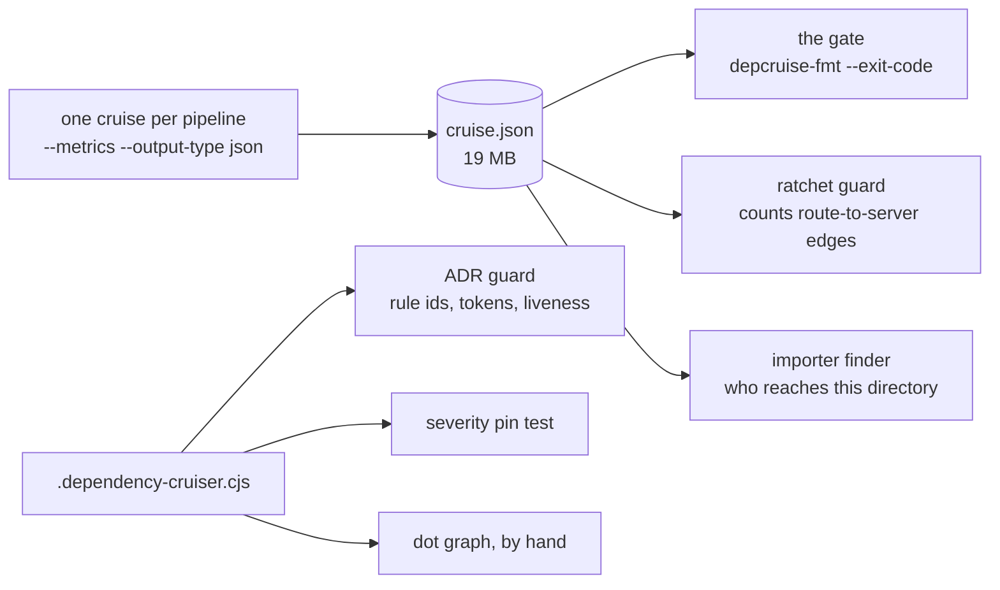
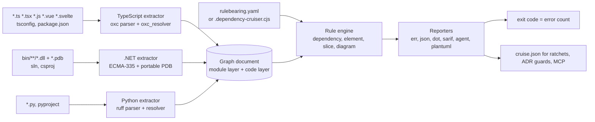

# Rulebearing: one architecture rule set for TypeScript, .NET and Python

2026-09-18 · @Someone

## Why

Rulebearing is one open-source command-line tool and one rule language that does what dependency-cruiser does for TypeScript and JavaScript, what ArchUnitNET does for .NET, and what import-linter does for Python, over a single graph, so a repository with more than one language keeps one set of architecture rules, one gate, and one answer to "may this file import that one". It is a personal project, built on my own time, at [github.com/benbahrenburg/rulebearing](https://github.com/benbahrenburg/rulebearing), under the MIT licence. Each of the three tools it draws on has a real user base: a GitHub filename search on 2026-09-19 returned 112 repositories carrying a `.dependency-cruiser.*` config, 88 carrying a NetArchTest or ArchUnitNET project reference, and 109 carrying an import-linter contract, capped by the search limits rather than by the population. None of those tools reads the others' repositories, none of the .NET or Python ones emits a graph another script can consume, and none was designed for a coding agent as the reader of its findings.

**Superset, precisely.** Every rule attribute, option, command-line flag, reporter and result field in dependency-cruiser 18.2.0, and every selector, predicate, condition, slice rule, loader option and PlantUML feature in ArchUnitNET 0.13.4, has a row in the two coverage tabs of this doc with its status. A feature that only makes sense for one language is kept for that language; nothing is dropped. The features of both that do not exist in the other are what make the union worth having: ArchUnitNET gains a declarative rule file, a graph other scripts read, and cycle and reachability rules over files; dependency-cruiser gains type and member selectors, slices, and diagram adherence; all three languages gain line-precise findings, fix text, and an agent-shaped output.

What has to carry over is not a tool but the practice around it, learned from running dependency-cruiser daily in a private 5,500-module monorepo:

- **A rule is a named, commented fence with a severity**, and its name is a stable id another guard can cite from an architecture decision record.
- **Matchers hit the resolved target**, so a boundary cannot be evaded by switching import style. In .NET that is the resolved type, never the `using` text; in Python the resolved module.
- **The graph is a first-class artefact.** In that monorepo the cruise JSON is read by three other guards that count edges, lower ceilings and find a directory's importers; a tool that only prints violations covers a third of the use.
- **Liveness is checked.** A rule whose from-side matches zero files is a fence that is not standing. ArchUnitNET fails an empty selection by default; dependency-cruiser does not, and heavy users bolt the check on. Rulebearing makes it the default for every rule kind.

### The name

A load-bearing wall is the one you cannot take out; a rule-bearing codebase is one whose rules carry real weight. The name is that phrase with the load swapped for what this tool adds, and it turns the tool's most distinctive check into a question anyone can ask: is this rule bearing anything? A rule that matches nothing bears nothing, and the tool fails it by default.

The name was validated on 2026-09-20 by direct lookup and a second source on each registry: `rulebearing` is free on npm, PyPI, crates.io and NuGet, as are `rule-bearing`, `rule_bearing` and `RuleBearing` (PyPI normalises punctuation, NuGet ignores case, npm rejects names that differ from an existing one only by punctuation) and the near names `rulebearings`, `rulesbearing`, `rulebear` and `rulebearer`, so no similarity rule has anything to object to. The GitHub organisation `rulebearing` and the repository `benbahrenburg/rulebearing` are free, there is no Homebrew formula of that name, and the Docker Hub namespace is free. The npm organisation `@rulebearing` could not be verified without signing in.

So one name everywhere: `rulebearing` on npm, PyPI and crates.io, `Rulebearing` on NuGet, the binary `rulebearing`, the config file `rulebearing.yaml`. An earlier working name was dropped because its bare form was already taken on npm and PyPI. About 170 candidates were checked; `plumbrule` (a mason's tool, a board with a plumb line for checking that a wall is true) and `trussworthy` are free on all four registries and are the reserves.

## What a heavy dependency-cruiser user needs

The private monorepo I run dependency-cruiser in every day uses a narrow slice of its rule language and a wide slice of its output: one 13-second cruise over 5,574 modules writes a 19 MB JSON that five guards then read or reason about. The whole 18.2.0 specification is the parity target (see the coverage tab); this slice is what must be bit-for-bit identical on day one, because a repo like it is the kind that will switch first, and its config file is what it will switch with.

### The rule file

| Feature | Used | Count in the config |
| --- | --- | --- |
| `forbidden` rules | yes | 48 (47 `error`, 1 `info`) |
| `allowed` / `allowedSeverity` / `required` rules | no | 0 |
| `from.path`, `to.path`, `pathNot`, as string or array | yes | 39 `pathNot` uses |
| `$1` capture from `from.path` reused in `to.path` / `to.pathNot` | yes | 7 rules (same-app, same-package, same-feature fences) |
| `to.circular: true` | yes | 1 |
| `from.orphan: true` with a long `pathNot` exclusion list | yes | 1 |
| `to.dependencyTypesNot: ["type-only"]` | yes | 5 (a type import is not a runtime edge) |
| `comment` carrying a decision token (`adr:NNNN` or `plan:<slug>`) | yes, mandatory | every rule; a separate guard fails one without it |
| `reachable`, `via`, `dynamic`, `license`, `couldNotResolve`, `numberOfDependents*`, `moreUnstable` | no | 0 |
| Config computed in JavaScript (a `require` of an exceptions JSON spliced into a regex) | yes | 1 |
| `options`: `exclude`, `doNotFollow`, `tsPreCompilationDeps`, `tsConfig` paths, `enhancedResolveOptions` (exports conditions), `reporterOptions.dot` / `archi` collapse patterns | yes | one block |
| `knownViolations` baseline, `--ignore-known`, `cache` | no (retired once the baseline reached zero) | 0 |

Two details shape the design more than the counts suggest. Matchers hit the **resolved** path, so a path alias, a workspace package name and a relative import are one edge and a fence cannot be dodged by import style. And dependency-cruiser rejects nested quantifiers through safe-regex, which is why one naming regex there is looser in the cruiser than in the guard beside it.

### The run and its consumers



| Consumer | What it reads | What it computes | Why it matters for parity |
| --- | --- | --- | --- |
| The gate | `summary.violations` through `depcruise-fmt --exit-code --output-type err` | exit code is the error count | The `fmt` subcommand and the `err` reporter must exist and the exit-code contract must match |
| A ratchet guard | `modules[].source`, `modules[].dependencies[].resolved`, `modules.length` | direct edges from route files to server code per app, ratcheted down in a budget file; fails hard on a missing JSON and on an implausible zero | The JSON field names are a public contract |
| An importer finder | the same two fields | importers of a directory from outside it, before a deletion | Same contract |
| An ADR guard | the config **module**: `name`, `comment`, `from.path` | resolves `rule:<name>` ids cited in ADR frontmatter; every comment must carry a decision token; every `from.path` must match at least one tracked file | The tool needs a `rules --json` listing so a guard does not `require` a JavaScript file |
| A severity pin test | the config module | pins nine rules at `error` | Same listing |
| A toolchain guard | dependency-cruiser's internal `meta.cjs` | guards the TypeScript version the cruiser can parse, because outside it the cruiser reports zero modules, exits 0 and only warns on stderr | A silent empty cruise is the one failure mode to design out |
| A graph script | a second cruise, `--output-type dot` | one zone's import graph, committed as `.dot` | `dot` output with `collapsePattern` |

## Prior art

All three .NET tools answer "does type A depend on type B" from compiled assemblies, and that is the right source of truth for .NET: the compiler has already resolved every reference, so there is no equivalent of dependency-cruiser's TypeScript path-alias resolution to reimplement. What none of them offers is a declarative, path-addressed rule file whose output is a graph other guards read. The .NET repositories found by the search keep their rules as C# tests in one project ([evolutionary-architecture-by-example](https://github.com/evolutionary-architecture/evolutionary-architecture-by-example) with NetArchTest, [ardalis/RiverBooks](https://github.com/ardalis/RiverBooks) with ArchUnitNET), loaded against one assembly, and nothing else in those repos can cite or count them.

| Tool | Source of truth | Rule form | Graph export | Baseline / ratchet | Liveness of a rule | Licence | Fit |
| --- | --- | --- | --- | --- | --- | --- | --- |
| [ArchUnitNET](https://github.com/TNG/ArchUnitNET) | Assemblies loaded with Mono.Cecil | Fluent C# in a test (`Classes().That()...Should().NotDependOnAny(...)`) | None | None; a failing rule fails the test | Fails an empty selection unless `WithoutRequiringPositiveResults` | Apache 2.0; [0.13.4, Aug 2026](https://www.nuget.org/packages/TngTech.ArchUnitNET) | The richest type-level and member-level vocabulary; no file paths, no cross-project graph as data |
| [NetArchTest](https://github.com/BenMorris/NetArchTest) | Assemblies via Mono.Cecil | Fluent C# (`Types.InAssembly(...).That().ResideInNamespace(...).ShouldNot().HaveDependencyOn(...)`) | None | None | Silent pass on an empty selection | MIT; [1.3.2, May 2021](https://www.nuget.org/packages/NetArchTest.Rules) | Simpler than ArchUnitNET; the more common choice in the repos found |
| [NDepend](https://www.ndepend.com/docs/getting-started-with-ndepend) | Assemblies plus PDBs and source | CQLinq queries in a licensed project file | Graph and matrix inside the product; HTML reports | Yes, baseline diff and trend | Yes | Commercial | The closest in capability, but the rule file is product-owned and the graph is not a plain JSON other scripts consume |
| [import-linter](https://github.com/seddonym/import-linter) (Python) | Source imports resolved by grimp | INI or TOML contracts: forbidden, protected, layers, independence, acyclic siblings | Via grimp as a library | `ignore_imports` per contract | Unmatched ignores can alert | BSD-2 | The Python precedent for exactly this shape; its contract kinds map onto dependency-cruiser rule kinds one to one |

What the table settles for the design:

- **Read assemblies, not C# source, for the .NET edge set.** Cecil-style metadata reading is what all three .NET tools do, and it is compiler-accurate. The portable PDB is what gives each type back its source file, which is what makes path matchers work.
- **Keep the rule file declarative and text.** A test assembly cannot be cited by an ADR guard, counted by a ratchet, or diffed in review the way a config file is. ArchUnitNET's fluent surface is carried over as declarative element rules with the same vocabulary.
- **Emit the graph.** NDepend is the only one that has a graph, and it keeps it.
- **Take both test suites as the specification.** dependency-cruiser's tests and ArchUnitNET's test assemblies are MIT and Apache 2.0 respectively, data-heavy, and pinned to versions. Conformance to them is measured, not claimed.

## Test beds: open-source repositories to validate against

The repositories below were found by searching GitHub for the three tools' config files on 2026-09-19 and ranking by stars; each row's role says what it validates. **Oracle** repos already carry a config, so Rulebearing must reproduce their existing tool's findings on a pinned commit with zero difference. **Greenfield** repos have no architecture tool and exercise `init`, `propose` and the multi-language path. **Scale** repos exist to be timed. All are read-only test beds: cloned at a pinned SHA in the nightly conformance run, never modified, and a pull request is offered only where a repo's contributing guide invites it.

| Repository | Stars | Languages | Carries | Role |
| --- | --- | --- | --- | --- |
| [sverweij/dependency-cruiser](https://github.com/sverweij/dependency-cruiser) | 7.2k | JavaScript, TypeScript | its own `.dependency-cruiser.cjs` and the whole test suite | TypeScript oracle and the conformance suite itself |
| [langfuse/langfuse](https://github.com/langfuse/langfuse) | 34.8k | TypeScript | `.dependency-cruiser` config | TypeScript oracle, Next.js and worker monorepo |
| [microsoft/FluidFramework](https://github.com/microsoft/FluidFramework) | 4.9k | TypeScript | `.dependency-cruiser` config | TypeScript oracle, large pnpm monorepo with many packages |
| [ag-grid/ag-grid](https://github.com/ag-grid/ag-grid), [tsparticles/tsparticles](https://github.com/tsparticles/tsparticles), [liveblocks/liveblocks](https://github.com/liveblocks/liveblocks), [remult/remult](https://github.com/remult/remult), [invertase/react-native-firebase](https://github.com/invertase/react-native-firebase), [infinitered/ignite](https://github.com/infinitered/ignite), [aws/aws-toolkit-vscode](https://github.com/aws/aws-toolkit-vscode) | 15.6k, 9.0k, 4.7k, 3.2k, 12.3k, 19.9k, 2.0k | TypeScript | `.dependency-cruiser` config | TypeScript oracles across library, app and extension shapes |
| [evolutionary-architecture/evolutionary-architecture-by-example](https://github.com/evolutionary-architecture/evolutionary-architecture-by-example) | 3.5k | C# | NetArchTest tests | .NET oracle, modular monolith with explicit layer rules |
| [phongnguyend/Practical.CleanArchitecture](https://github.com/phongnguyend/Practical.CleanArchitecture) | 2.5k | C# | NetArchTest tests | .NET oracle, clean architecture with many projects |
| [ardalis/RiverBooks](https://github.com/ardalis/RiverBooks), [nager/Nager.Date](https://github.com/nager/Nager.Date), [karaoke-dev/karaoke](https://github.com/karaoke-dev/karaoke), [onebeyond/monaco](https://github.com/onebeyond/monaco) | 134, 1.4k, 237, 43 | C# | ArchUnitNET tests | .NET oracles for the element-rule vocabulary; RiverBooks is a modular monolith |
| [dennisdoomen/packageguard](https://github.com/dennisdoomen/packageguard), [NeVeSpl/NetArchTest.eNhancedEdition](https://github.com/NeVeSpl/NetArchTest.eNhancedEdition), [DrJohnMelville/Pdf](https://github.com/DrJohnMelville/Pdf) | 74, 53, 76 | C# | NetArchTest tests | .NET oracles; the second is itself a NetArchTest fork with its own fixtures |
| [TNG/ArchUnitNET](https://github.com/TNG/ArchUnitNET), [BenMorris/NetArchTest](https://github.com/BenMorris/NetArchTest) | 1.4k, 1.8k | C# | their own test assemblies | The .NET conformance suites |
| [seddonym/import-linter](https://github.com/seddonym/import-linter) | 1.2k | Python | its own contracts and tests | Python oracle and the contract-kind mapping |
| [kedro-org/kedro](https://github.com/kedro-org/kedro), [sqlfluff/sqlfluff](https://github.com/sqlfluff/sqlfluff), [bridgecrewio/checkov](https://github.com/bridgecrewio/checkov), [openedx/openedx-platform](https://github.com/openedx/openedx-platform), [napari/napari](https://github.com/napari/napari), [nolar/kopf](https://github.com/nolar/kopf), [online-ml/river](https://github.com/online-ml/river), [wemake-services/wemake-python-styleguide](https://github.com/wemake-services/wemake-python-styleguide) | 11.0k, 9.9k, 9.0k, 8.2k, 2.8k, 2.6k, 6.1k, 2.9k | Python | import-linter contracts | Python oracles; openedx-platform is the largest layered one, wemake-python-styleguide is itself a linter |
| [google/langextract](https://github.com/google/langextract), [microsoft/promptflow](https://github.com/microsoft/promptflow), [HKUDS/DeepTutor](https://github.com/HKUDS/DeepTutor) | 38.6k, 11.2k, 40.0k | Python | import-linter contracts | Python oracles in the current generation of AI tooling |
| [langgenius/dify](https://github.com/langgenius/dify) | 156k | TypeScript, Python | import-linter contracts on the Python half | Mixed-language oracle: one run over both halves, the Python contracts must reproduce |
| [open-metadata/OpenMetadata](https://github.com/open-metadata/OpenMetadata) | 15.3k | TypeScript, Python, Java | import-linter contracts | Mixed-language oracle |
| [microsoft/semantic-kernel](https://github.com/microsoft/semantic-kernel) | 28.6k | C#, Python, TypeScript | nothing | Greenfield, all three languages in one repo; the `init` and `propose` proving ground |
| [microsoft/autogen](https://github.com/microsoft/autogen) | 61.1k | Python, C#, TypeScript | nothing | Greenfield, Python and .NET side by side |
| [jasontaylordev/CleanArchitecture](https://github.com/jasontaylordev/CleanArchitecture), [abpframework/abp](https://github.com/abpframework/abp), [umbraco/Umbraco-CMS](https://github.com/umbraco/Umbraco-CMS) | 20.6k, 14.4k, 5.3k | C#, TypeScript | nothing | Greenfield .NET plus TypeScript; the first is the template whose layer names the rule examples in this doc use |
| [apache/superset](https://github.com/apache/superset), [getsentry/sentry](https://github.com/getsentry/sentry), [zulip/zulip](https://github.com/zulip/zulip), [PostHog/posthog](https://github.com/PostHog/posthog) | 74.8k, 44.8k, 25.9k, 39.9k | Python, TypeScript | nothing | Greenfield Python plus TypeScript, each with a strong informal layering to propose rules against |
| [n8n-io/n8n](https://github.com/n8n-io/n8n), [grafana/grafana](https://github.com/grafana/grafana), [elastic/kibana](https://github.com/elastic/kibana) | 205k, 76.8k, 21.3k | TypeScript (n8n with Vue) | nothing | Scale: parse and resolve time, Vue single-file components, memory |
| [dotnet/aspnetcore](https://github.com/dotnet/aspnetcore), [jellyfin/jellyfin](https://github.com/jellyfin/jellyfin) | 38.5k, 57.3k | C# | nothing | Scale: hundreds of projects, generated code, source-link PDB paths |
| [home-assistant/core](https://github.com/home-assistant/core) | 90.8k | Python | nothing | Scale: thousands of integrations, namespace packages, dynamic imports |

How the test beds are used:

1. **Oracle zero-diff.** For each oracle repo, at a pinned commit, run the incumbent tool and Rulebearing with the repo's own config and diff the violation sets. dependency-cruiser oracles diff `summary.violations`; NetArchTest and ArchUnitNET oracles diff the pass or fail outcome of each imported rule against the `dotnet test` result; import-linter oracles diff each contract's broken-import list. Any difference is a bug in Rulebearing or a documented divergence with a reason.
2. **Greenfield `init`.** For each greenfield repo, `rulebearing init` must produce a config that passes, and `rulebearing propose` over the repo's obvious layers (`Domain`, `Application`, `Infrastructure`, `Web` in the clean-architecture template; `python/` and `dotnet/` in autogen) must propose rules with non-zero matches on both sides. The output is committed as a fixture so a regression in discovery is visible in review.
3. **Scale timing.** A table of wall-clock and peak memory per scale repo, regenerated nightly, published in the README. A regression over 20% fails the nightly run.
4. **Upstream offers.** Where a repo's contributing guide welcomes tooling changes, a pull request offering Rulebearing as a drop-in beside the incumbent, never replacing it, is the adoption test that matters most: a maintainer who did not ask for the tool accepting it.

## Architecture

One binary, three extractors, one graph document with two layers, and a rule engine that never knows which language a node came from. The module layer is dependency-cruiser's model (files and the edges between them); the code layer is ArchUnitNET's (types, members, attributes, calls, inheritance). Every language fills both layers as far as it can, and every rule family reads one or both.



Read left to right: three languages become one graph, the rules annotate it, the reporters only format what the engine decided.

### The five stages

1. **Discover** the workspace without building anything. TypeScript: `package.json` workspaces, `tsconfig.json` with `extends`, `paths`, `baseUrl` and project references, `.babelrc.json`, `webpack.config.js`. .NET: `.sln` or `.slnx`, every `.csproj`, `Directory.Build.props`, `Directory.Packages.props`, giving project nodes and `ProjectReference` / `PackageReference` edges. Python: `pyproject.toml`, source roots, the package layout. Discovery alone supports project-level rules and is fast enough for a pre-commit hook.
2. **Extract** both layers. The TypeScript extractor parses with `oxc_parser` (JS, TS, JSX, TSX, `.mjs` `.cjs` `.mts` `.cts`, decorators, the `<script>` blocks of Vue and Svelte files), reads every dependency form dependency-cruiser knows (ES imports and re-exports, `import type`, `import()`, `require`, AMD `define` and `require`, exotic require names, `import =`, triple-slash directives, JSDoc imports, `process.getBuiltinModule`) and resolves each with `oxc_resolver`, the Rust port of enhanced-resolve, so `exportsFields`, `conditionNames`, `mainFields`, `aliasFields`, tsconfig paths, symlinks and Yarn PnP behave as they do today. The .NET extractor reads the built assemblies' metadata tables and IL operands, and the portable PDB's `Document` and `MethodDebugInformation` tables to map every type and method to a source file and line. The Python extractor parses with `ruff_python_parser`, resolves absolute and relative imports against the discovered roots, and classifies each target as local, standard library, third-party or unresolved. All three also populate the code layer: classes, interfaces, functions, members, attributes or decorators, base types, implemented interfaces, and call edges, as far as the language has them.
3. **Build the graph document.** The module layer is dependency-cruiser's `cruise-result` schema, unchanged: `modules[]` with `source`, `dependencies[]`, `dependents[]`, `orphan`, `reachable`, `reaches`, `instability`, `valid`, `rules[]`; `folders[]` with the coupling metrics; `summary` with `violations[]` and the counts; `revisionData`. The code layer is an additive `code` section: `types[]`, `members[]`, `attributes[]`, `calls[]`, each with `language`, `file`, `line`, `column`. A script that reads `modules[].dependencies[].resolved` today reads the new document unchanged, and every edge now also carries `line` and `column`, which dependency-cruiser does not record.
4. **Evaluate rules.** Dependency rules (`forbidden`, `allowed`, `required`) run over the module layer with the full restriction set; element rules (`select ... should`) run over the code layer; slice rules and diagram rules run over both. Cycles come from Tarjan's strongly connected components with the path enumerated; reachability from breadth-first search from the `from` matches; folder-level rules from the consolidated folder graph. A rule whose selection is empty is **vacuous** and fails by default, as ArchUnitNET's `Check` does; `allowEmpty: true` per rule or `WithoutRequiringPositiveResults` in compatibility mode turns that off.
5. **Report.** Exit code is the count of error-severity violations. `fmt` re-reports a saved JSON without re-extracting, as `depcruise-fmt` does, so one extraction feeds the gate, the graph, every ratchet, and the MCP server.

### Crate layout

| Crate | Owns | Depends on |
| --- | --- | --- |
| `rb-model` | Graph document types (module layer = `cruise-result` schema, code layer), JSON schema, serde | nothing |
| `rb-config` | Native config and dependency-cruiser config parsing, `extends`, presets, `defines`, `$0`–`$9` captures, the embedded JavaScript evaluator for `.cjs` / `.js` / `.mjs` configs (QuickJS through `rquickjs`, MIT) | model |
| `rb-rules` | Matchers, cycle / reachability / dependents / instability analysis, element predicates and conditions, slices, PlantUML adherence, violation summary | model, config |
| `rb-extract-ts` | Workspace discovery, `oxc_parser`, `oxc_resolver`, npm classification, licence and deprecation from `package.json`, Vue / Svelte script splitting, JSDoc and triple-slash parsing | model |
| `rb-extract-dotnet` | MSBuild discovery, ECMA-335 and portable PDB readers, IL operand scan, edge projection to files | model |
| `rb-extract-python` | `ruff_python_parser`, import resolver, per-version stdlib list, `TYPE_CHECKING` detection | model |
| `rb-ingest` | dependency-cruiser and ArchUnitNET-style JSON in, graph document out; the migration bridge | model |
| `rb-report` | Every dependency-cruiser reporter plus `sarif`, `github-annotations`, `junit`, `trx`, `agent`, `plantuml` | model, rules |
| `rb-cli` | `cruise`, `fmt`, `baseline`, `rules`, `count`, `diff`, `explain`, `can-import`, `place`, `impact`, `test`, `docs`, `config`, `serve`; cache; `--affected` | all |
| `rb-node` | napi-rs binding exposing `cruise()` and `format()` with dependency-cruiser's API signatures, for scripts that call dependency-cruiser as a library today | cli |
| `Rulebearing.TestAdapter`, `pytest-rulebearing`, `rulebearing/vitest` | one test case per rule in the host test runner, reading the JSON | binary |

The extractors are the only crates that read files other than the config, and each is a Cargo feature, so a Python-only build never links the metadata reader.

### What each extractor has to get right

- **TypeScript: parity is measured against 546 extraction fixtures.** dependency-cruiser's `test/extract` directory is the specification for what counts as a dependency and what its `dependencyTypes` and `moduleSystem` are; the extractor is done when those fixtures produce the same edges. Two things are deliberately not native: CoffeeScript and LiveScript, which run through `--sidecar node` (the tool spawns dependency-cruiser for those files) and are listed as such in the coverage tab; and Babel, whose syntax `oxc` already parses, so only `babel-plugin-module-resolver` aliases are read from a Babel config.
- **.NET: a type is not a file.** Partial classes span files and one file can hold several types. The PDB maps each method to a document and line; a type's fields and attributes are attributed to the document of its first constructor or first method. A type with no methods and no PDB row is attributed by naming convention and flagged `attribution: inferred`. The reference set is wider than `using`: a body call, a generic instantiation, an attribute, a base type, an interface, a parameter type and a `typeof` are all edges, each with a `dependencyKind`, which is why the .NET side reads IL rather than source and requires a build.
- **Python: resolution is the whole job.** Absolute against the roots, relative against the file's package, then the stdlib list for the configured interpreter version, then installed distributions, then `unresolved`. A `TYPE_CHECKING`-guarded import is `type-only`; a literal `importlib.import_module` is `dynamic`.

## Configuration: a native format, and dependency-cruiser's as it is

Both formats load into one internal model, and the native format is a strict superset: every dependency-cruiser key is legal in a native file at the same place with the same meaning, and a dependency-cruiser file needs no conversion to run. Every one of the 112 `.dependency-cruiser.*` files the search found is a valid Rulebearing configuration on day one.

### The dependency-cruiser format

- **Detected by name**: `.dependency-cruiser.json`, `.yaml`, `.yml`, `.cjs`, `.js`, `.mjs`, or anything passed with `--config-format dependency-cruiser`.
- **JavaScript configs are evaluated in an embedded engine**, QuickJS through the `rquickjs` crate, with a CommonJS and ESM shim whose `require` and `import` resolve JSON files, other config modules on disk, and the bundled `dependency-cruiser/configs/*` presets, and nothing else: no filesystem beyond the repo, no network, no `process`. A computed pattern of the common kind (a `require` of an exceptions JSON spliced into a regex) works unchanged. A config that needs more than that runs through `--config-via-node`, which asks a local Node to print the evaluated object as JSON.
- **Semantics are dependency-cruiser's**, proven by its own test suite (delivery plan). One deliberate difference: Rulebearing's regex engine is linear-time and accepts patterns safe-regex rejects; in compatibility mode such a pattern is accepted with a warning, and `--strict-compat` refuses it so a config stays portable back to dependency-cruiser.
- **`extends`** resolves files, npm packages, and the bundled presets (`recommended`, `recommended-strict`, `recommended-warn-only`), exactly as today.

### The native format

`rulebearing.yaml` (also `.json`, `.jsonc`, `.toml`), with a published `$schema`. It groups rules by family and adds what dependency-cruiser has no place for. The example uses the layer names of the clean-architecture template ([jasontaylordev/CleanArchitecture](https://github.com/jasontaylordev/CleanArchitecture)) for the .NET rules and a conventional `apps/` plus `packages/` layout for TypeScript.

```yaml
$schema: https://benbahrenburg.github.io/rulebearing/schema/v1.json
extends: [rulebearing:recommended, ./eng/base-rules.yaml]
defines:
  legacyApps: { fromJson: .arch-exceptions.json, select: "[*].app", joinWith: "|" }

languages:
  typescript: { tsConfig: tsconfig.json, tsPreCompilationDeps: true, enhancedResolveOptions: { exportsFields: [exports], conditionNames: [import, require, node, default] } }
  dotnet:     { solution: CleanArchitecture.slnx, configuration: Release, excludeProjects: ["^tools/"] }
  python:     { version: "3.13", roots: [src] }

options:            # every dependency-cruiser option key is accepted here unchanged
  exclude: { path: ["(^|/)node_modules/", "(^|/)obj/", "(^|/)bin/", "(^|/)__pycache__/"] }
  skipAnalysisNotInRules: true
  reporterOptions: { dot: { collapsePattern: "^(apps|packages|src)/[^/]+" } }

rules:
  dependencies:     # dependency-cruiser's forbidden / allowed / required, full restriction set
    forbidden:
      - name: no-cross-app-imports
        comment: "Apps share only packages/* and HTTP. adr:0003"
        fix: "Call the other app over its API, or move the shared code into packages/*."
        severity: error
        from: { path: "^apps/([^/]+)/" }
        to:   { path: "^apps/([^/]+)/", pathNot: "^apps/$1/" }
        examples:
          forbidden: ["apps/web/src/x.ts -> apps/worker/src/y.ts"]
          allowed:   ["apps/web/src/x.ts -> packages/format/src/index.ts"]
      - name: domain-depends-on-nothing
        comment: "The Domain project is the centre of the clean-architecture template. adr:0001"
        severity: error
        from: { path: "^src/Domain/" }
        to:   { path: "^src/(Application|Infrastructure|Web)/" }
    required:
      - name: endpoints-reach-the-auth-filter
        comment: "adr:0004"
        module: { path: "^src/Web/Endpoints/.*\\.cs$" }
        to:     { path: "^src/Web/Infrastructure/AuthorizationFilter\\.cs$", reachable: true }
  elements:         # ArchUnitNET's selectors, predicates and conditions, declarative
    - name: handlers-are-internal-and-sealed
      comment: "adr:0002"
      select: { kind: class, where: { all: [ { haveNameEndingWith: Handler }, { resideInNamespaceMatching: "^CleanArchitecture\\.Application\\." } ] } }
      should: { all: [ { beInternal: true }, { beSealed: true } ] }
    - name: endpoints-do-not-return-http-response-message
      comment: "adr:0004"
      select: { kind: method, where: { all: [ { declaredInTypesThat: { resideInNamespaceMatching: "^CleanArchitecture\\.Web\\.Endpoints" } }, { arePublic: true } ] } }
      should: { notHaveReturnType: ["System.Net.Http.HttpResponseMessage", "System.Threading.Tasks.Task<System.Net.Http.HttpResponseMessage>"] }
  slices:
    - name: features-are-independent
      comment: "adr:0005"
      matching: "apps/web/src/features/(*)/"
      should: notDependOnEachOther
  diagrams:
    - name: matches-the-context-diagram
      comment: "adr:0001"
      select: { kind: type, where: { resideInAssemblyMatching: "^CleanArchitecture\\." } }
      adhereTo: docs/architecture/components.puml
  ratchets:         # a budget that may only fall, as config
    - name: routes-via-service
      from: { path: "^apps/([^/]+)/src/app/.*/(page|route)\\.tsx?$" }
      to:   { path: "^apps/$1/src/(server|domain)/" }
      budget: eng/routes-via-service-budget.json
```

- **`languages`** holds what is per-language; dependency-cruiser's flat option names (`tsConfig`, `tsPreCompilationDeps`, `babelConfig`, `webpackConfig`, `enhancedResolveOptions`, `moduleSystems`, `parser`) are accepted at the top level too, as aliases into `languages.typescript`.
- **`defines`** is the declarative replacement for computed JavaScript: a named value read from a JSON file, selected with a small path expression, joined into an alternation, referenced as `${legacyApps}` in any pattern.
- **`rulebearing config convert`** translates between the two formats. Native to dependency-cruiser is lossy and says exactly what it dropped (element, slice, diagram and ratchet rules; `fix`; `examples`). dependency-cruiser to native is lossless.
- **`rulebearing config lint`** reports a rule that can never match, a rule shadowed by an earlier one, overlapping `allowed` entries, a severity below `error` on a rule with zero current violations, and a rule with no `fix`.

## The rule language

Four rule families over one graph: dependency rules are dependency-cruiser's, element rules are ArchUnitNET's, slice and diagram rules are ArchUnitNET's too, and all four share the same metadata (`name`, `comment`, `severity`, `fix`, `examples`, `owner`, `expires`) and the same liveness default. A rule may name any language, or several, because paths, namespaces and type names are all matchers over one document.

### Dependency rules: the whole of dependency-cruiser 18.2.0

| Part | What is supported | Notes |
| --- | --- | --- |
| Rule kinds | `forbidden` (regular, reachability and dependents variants), `allowed` with `allowedSeverity`, `required` | `scope: module` or `scope: folder` on forbidden rules, for folder-level cycles and `moreUnstable` |
| `from` | `path`, `pathNot`, `orphan`; dependents rules: `path`, `pathNot` | arrays or strings |
| `to` | `path`, `pathNot`, `circular`, `via`, `viaOnly`, `viaNot`, `viaSomeNot`, `dependencyTypes`, `dependencyTypesNot`, `dynamic`, `exoticallyRequired`, `exoticRequire`, `exoticRequireNot`, `license`, `licenseNot`, `moreThanOneDependencyType`, `moreUnstable`, `preCompilationOnly`, `couldNotResolve`, `ancestor`; reachability: `reachable` | every one, with the language it applies to in the coverage tab |
| `module` (dependents and required rules) | `path`, `pathNot`, `numberOfDependentsLessThan`, `numberOfDependentsMoreThan`; required `to`: `path`, `reachable` |  |
| Group matching | `$0` to `$9` captured in `from.path`, substituted into any `to` or `module` pattern | substituted escaped, so a captured segment can never become a wildcard |
| Severity | `error`, `warn`, `info`, `ignore` | exit code counts `error` only |
| Cross-language additions | `language`, `namespace` / `namespaceNot`, `project` / `projectNot`, `assembly` / `assemblyNot`, `dependencyKind` / `dependencyKindNot` (`inherits`, `implements`, `field`, `signature`, `body`, `attribute`, `generic-argument`, `typeof`) on `from` and `to` | additive; a dependency-cruiser config never sees them |

`dependencyTypes` keeps dependency-cruiser's forty values for TypeScript and JavaScript exactly (`aliased-tsconfig-paths`, `npm-dev`, `type-only`, `pre-compilation-only`, `triple-slash-type-reference`, `jsdoc-import-tag` and the rest). .NET adds `local`, `project`, `package`, `framework`, `test-only`, `signature-only`, `unresolved`; Python adds `local`, `stdlib`, `site`, `type-only`, `dynamic`, `unresolved`. `type-only` has no .NET meaning, a signature reference still loads the assembly, and the validator warns when a .NET rule names it.

### Element rules: ArchUnitNET, declarative

```yaml
- name: repositories-are-internal-and-sealed
  comment: "adr:0002"
  select:
    kind: class                       # type | class | interface | attribute | member | field | method | property | function | module
    where:
      all:
        - haveNameEndingWith: Repository
        - resideInNamespaceMatching: "^CleanArchitecture\\.Infrastructure\\."
        - not: { areAbstract: true }
  should:
    all: [ { beInternal: true }, { beSealed: true }, { onlyDependOn: { resideInNamespaceMatching: "^(CleanArchitecture\\.(Domain|Application)|System|Microsoft)\\." } } ]
  because: "A repository is an implementation detail of the infrastructure project."
  allowEmpty: false
```

- **`select.kind`** is ArchUnitNET's eight selectors (`Types`, `Classes`, `Interfaces`, `Attributes`, `Members`, `FieldMembers`, `MethodMembers`, `PropertyMembers`) plus `function` and `module` for languages that have top-level functions.
- **`where`** is the predicate vocabulary, one key per ArchUnitNET predicate in camelCase (`haveNameMatching`, `resideInAssembly`, `arePublic`, `areSealed`, `areRecord`, `areImmutable`, `areNestedIn`, `areAssignableTo`, `implementInterface`, `haveAnyAttributesWithNamedArguments`, `dependOnAny`, `onlyDependOn`, `callAny`, `haveMethodMemberWithName`, `areDeclaredIn`, `areStatic`, `areReadOnly`, `areVirtual`, `areConstructors`, `haveReturnType`, `haveDependencyInMethodBodyTo`, `areCalledBy`, `havePublicGetter`, `haveInitSetter`, and the rest; the full list is in the ArchUnitNET coverage tab). `all`, `any`, `not` are `And`, `Or` and the `AreNot`/`DoNot` forms. A value may be a name, a regex, a list, or a nested selector, which is ArchUnitNET's `...TypesThat(...)` form.
- **`should`** is the condition vocabulary, the same keys in their `Be` / `Have` / `Not` forms, plus `exist`, `be`, `notBe`, `onlyHaveAttributesThat`, `dependOnAnyTypesThat`, and `adhereToPlantUmlDiagram`.
- **`because`** is `Because`; **`allowEmpty`** is `WithoutRequiringPositiveResults`, default false in both.
- **Custom predicates and conditions** (`FollowCustomPredicate`, `IPredicate<T>`) have no declarative form and stay in ArchUnitNET. Everything else in its fluent API is a row in the coverage tab.

The vocabulary is cross-language where the concept exists. `kind: class` with `areSealed` is C#; `kind: class` with `haveAnyAttributes` reads decorators in TypeScript and Python; `kind: function` with `arePublic` reads `export` in TypeScript and a leading underscore in Python. A predicate the language cannot answer is a validation error, not a silent false.

### Slice rules

```yaml
- name: bounded-contexts-do-not-know-each-other
  comment: "adr:0005"
  matching: "RiverBooks.(*)"          # ArchUnitNET pattern syntax; "(**)" for MatchingWithPackages
  should: [notDependOnEachOther, beFreeOfCycles]
  ignore: ["RiverBooks.SharedKernel"]
```

A slice pattern is a namespace pattern for .NET, a dotted module pattern for Python, and a path pattern for TypeScript (`apps/(*)/`). `notDependOnEachOther` and `beFreeOfCycles` are the two conditions ArchUnitNET has; both are also expressible as dependency rules, and the slice form exists because it reads as the architecture rather than as a regex.

### Diagram rules

`adhereTo: <file>.puml` parses a PlantUML component diagram, matches types to components by the component's `<<pattern>>` stereotype, and fails any dependency the diagram does not draw, exactly as `AdhereToPlantUmlDiagram` does. The reverse direction is the `plantuml` reporter, which writes a component diagram from slices or folders with ArchUnitNET's `LimitDependencies`, `C4Style` and `FocusOn` options, so a diagram can be generated once and then enforced.

### Shorthands

`layers` expands to one `forbidden` rule per lower-to-higher pair; `independence` expands to one `$1` fence; both exist for import-linter users and for the many dependency-cruiser configs that write a layer model out longhand as five or six rules. `rulebearing config expand` prints the expansion, so nothing is hidden.

## Specification coverage

The superset claim is a pair of tables, not a sentence. Every attribute, option, flag, output type and result field of dependency-cruiser 18.2.0 is a row in [dependency-cruiser 18.2.0 coverage](file/1704a18f-ee24), and every selector, predicate, condition, slice rule, loader method, PlantUML feature and test adapter of ArchUnitNET 0.13.4 is a row in [ArchUnitNET 0.13.4 coverage](file/6eb75df7-6f94). Each row names the Rulebearing equivalent, the languages it applies to, and the wave it lands in. The two tables are also the ledger the delivery plan's conformance gates report against, so a row cannot say **Parity** until the pinned test suite says so.

The short version of both tables:

| Source | Rows | Parity or Parity+ | Kept TypeScript-only | Sidecar | Stays in the original |
| --- | --- | --- | --- | --- | --- |
| dependency-cruiser 18.2.0 | 24 rule attributes, 41 options, 18 command-line items, 21 output types, 6 result-document groups, 40 dependency types, 4 module systems, 10 extraction capabilities, 6 API functions | everything except the next two columns | `exoticRequire*`, `moreThanOneDependencyType`, `preCompilationOnly`, `exoticRequireStrings` (npm and TypeScript concepts, unchanged) | CoffeeScript and LiveScript files | nothing |
| ArchUnitNET 0.13.4 | 8 selectors, 13 shared predicate groups, 9 type groups, 4 class and attribute groups, 13 member groups, 6 combinators, 5 slice items, 4 PlantUML items, 6 loader methods, 6 test adapters | everything except the last column | not applicable | not applicable | `FollowCustomPredicate` / `FollowCustomCondition` (arbitrary C#) |

What neither source has, and Rulebearing adds for all three languages: line and column on every edge, `fix` and `examples` on every rule, a stable violation id, a receipt of what was inspected, ratchets as config, `can-import`, `place`, `impact`, `propose`, the `agent`, `sarif`, `junit` and `trx` reporters, test-runner adapters, and an MCP server. The agent section describes each.

## Language decision

Rust, with one named fallback. The engine, the rule language, the reporters and the Python extractor are a natural fit for a single static binary, and the one real cost of Rust here, the .NET metadata reader, is isolated behind the extractor boundary and can be swapped for a small C# program without touching anything else.

| Criterion | Rust | C# (NativeAOT `dotnet tool`) | TypeScript (fork or extend dependency-cruiser) |
| --- | --- | --- | --- |
| Parsing and resolving TypeScript and JavaScript | `oxc_parser` and `oxc_resolver` (MIT, Void Zero): the resolver is a port of enhanced-resolve, the library dependency-cruiser itself uses, so `exportsFields`, `conditionNames`, tsconfig paths and Yarn PnP carry over by construction | No maintained TypeScript parser or node resolver for .NET; would shell out to Node | dependency-cruiser itself |
| Reading .NET assemblies and portable PDBs | No usable crate: `dotnetdll` 0.3.0 is GPL-3, `windows-metadata` is MIT but built for WinMD and decodes no IL. A hand-written reader over the eight ECMA-335 tables needed plus the PDB `Document` and `MethodDebugInformation` tables is about 3,000 lines against two stable specifications | `System.Reflection.Metadata` in the BCL does all of it, including IL operand decoding, in a few hundred lines | a native addon or a sidecar |
| Parsing Python | `ruff_python_parser` (MIT, Astral) | none maintained; shell out to an interpreter | `tree-sitter` bindings, with Node required in a Python repo |
| Evaluating a `.dependency-cruiser.cjs` config | QuickJS through `rquickjs` (MIT), sandboxed | Jint or ClearScript, sandboxed | native |
| Regex safety | `regex` crate is linear-time by construction | `RegexOptions.NonBacktracking`, opt-in | safe-regex rejects patterns, which every heavy user eventually hits |
| Distribution to a TypeScript repo | one binary plus an npm package with the binary under `optionalDependencies`, the ruff and oxc pattern | one binary via NativeAOT | npm |
| Distribution to a .NET repo | one binary plus a NuGet `dotnet tool` wrapper carrying it under `runtimes/` | one binary via NativeAOT, or a framework-dependent tool | requires Node, which a .NET-only repo does not have |
| Distribution to a Python repo | one binary plus a pip wheel wrapper | one binary via NativeAOT | requires Node |
| Speed on the scale test beds (n8n at 205k stars, aspnetcore, home-assistant) and on a 5,500-module private monorepo that takes 13 s today | `oxc` parses a file in well under a millisecond; the target is 1 to 2 s for the private monorepo and a published nightly table for the test beds | same order on .NET; a TypeScript repo would need Node anyway | 13 s |
| My own familiarity | Rust is the language of my two most recent side projects; TypeScript, Swift and Python are the day-to-day ones | C# occasionally | TypeScript daily |
| Precedent | ruff, uv, oxc, biome, turborepo: the current generation of multi-language developer tools | NDepend, ArchUnitNET | dependency-cruiser itself |

### Why Rust wins

- **The TypeScript side decides it.** The resolver dependency-cruiser depends on has a maintained Rust port and no .NET port. Choosing C# would mean the TypeScript extractor spawning Node, which is the two-toolchain outcome the single binary exists to avoid.
- **One binary is the feature.** The tool has to run in a TypeScript pipeline, a .NET pipeline and a Python pipeline. Only Rust gives one artefact with no runtime on every host, and the three wrappers (npm, `dotnet tool`, pip) are thin shells over that artefact.
- **The metadata reader is a bounded, one-time cost.** ECMA-335 partition II has not changed materially since 2012; the portable PDB format has not changed since 2015. A reader written once is maintained rarely, and the extractor boundary means it can be replaced.

### The fallback, decided now rather than under pressure

If the wave-0 spike cannot attribute at least 99% of the types in the .NET oracle repos to a source file within three weeks of part-time work, the .NET extractor becomes `Rulebearing.Extract`, a C# `dotnet tool` over `System.Reflection.Metadata` that writes the same graph document, and the Rust binary consumes it through the ingest crate. The rule engine, reporters, config, TypeScript and Python sides are unchanged. The price is two toolchains to build and a .NET runtime on the host, which every .NET repo has.

### What Rust does not solve

A single maintainer. This is one person's evenings, so the risk is not a team learning Rust but a project stalling. Three mitigations are in the plan: the two conformance suites act as the reviewer, so a contributor can change an extractor and know within minutes whether it still agrees with dependency-cruiser and ArchUnitNET; the crate layout keeps each piece small enough that a C# engineer reading the ECMA-335 tables in `rb-extract-dotnet` recognises them from `System.Reflection.Metadata`, and a TypeScript engineer reading `rb-extract-ts` recognises `oxc_resolver`'s options as enhanced-resolve's; and the test-bed nightly run is public, so the state of the project is visible without asking.

## One engine, three languages, one monorepo

The graph document is the contract between languages: an extractor's whole job is to produce modules, dependencies and code elements in that shape, and nothing after it is language-aware. A repository with TypeScript apps, a .NET service and a Python pipeline (semantic-kernel and autogen in the test beds are exactly this) runs one `rulebearing cruise`, gets one graph, one rule pass, one exit code and one JSON, and a rule may span languages because paths, namespaces and names are matchers over one document.

| Concern | Shared | TypeScript | .NET | Python |
| --- | --- | --- | --- | --- |
| Discovery | walk from `baseDir`; `languages` block selects roots | `package.json` workspaces, `tsconfig` chain, Babel and webpack configs | `.sln` / `.slnx`, `.csproj`, `Directory.*.props`; `IsTestProject`, `OutputPath`, `TargetFramework` | `pyproject.toml`, `src/` layout, `setup.cfg` fallback |
| Module identity | repo-relative file path | the file | the PDB document path, normalised; `/_/` deterministic-build prefixes unmapped through `SourceRoot` | the file; `__init__.py` stands for its package |
| Edge source |  | every dependency form dependency-cruiser extracts | metadata tables and IL operands | `import`, `from ... import`, `__all__`, literal `importlib.import_module` |
| Resolution |  | `oxc_resolver` with the tsconfig, webpack and Babel alias tables | `TypeRef` to `TypeDef` across solution assemblies; external to `package` or `framework` | roots, relative, stdlib list, installed distributions, `unresolved` |
| `dependencyTypes` | strings compared by the engine | dependency-cruiser's forty | `local`, `project`, `package`, `framework`, `test-only`, `signature-only`, `unresolved` | `local`, `stdlib`, `site`, `type-only`, `dynamic`, `unresolved` |
| Code layer | `types[]`, `members[]`, `attributes[]`, `calls[]` | classes, interfaces, enums, type aliases, functions, exports, decorators, `extends` / `implements`, accessors, `static` / `readonly` / `abstract`, `public` / `private` / `protected` | everything ArchUnitNET reads: types, members, attributes with arguments, visibility, sealed, record, virtual, getters and setters, calls and body dependencies | classes, functions, methods, decorators, bases, `@property`, `@staticmethod`, `@classmethod`, `@dataclass`, underscore visibility |
| Line and column on every edge | yes | AST spans | PDB sequence points | AST spans |
| `dynamic` |  | `import()` | literal `Assembly.Load`, `Type.GetType`, `Activator.CreateInstance` | literal `importlib.import_module`, `__import__` |
| Default excludes | `exclude` | `node_modules/`, `.next/`, `dist/`, `coverage/` | `obj/`, `bin/`, `*.g.cs`, `*.Designer.cs`, `GlobalUsings.g.cs` | `.venv/`, `site-packages/`, `__pycache__/`, `*.pyi` unless `--stubs` |
| Default orphan exclusions |  | framework entry files by convention (Next.js `page.tsx` and `route.ts`, config files) | `Program.cs`, `Startup.cs`, `AssemblyInfo.cs`, migrations | `__main__.py`, `conftest.py`, console-script targets |
| Cycles, reachability, dependents, metrics, matchers, element rules, slices, diagrams, reporters | all |  |  |  |

### What stays honest across the boundary

- **No cross-language edges are invented.** A C# service that calls a Python process over HTTP, or a TypeScript app that calls a .NET API, has no import edge to it, and the tool does not guess. That relationship belongs in a service-contract check, not here.
- **Rules may still span languages**, because paths are the shared namespace. `from: { path: "^python/" }, to: { path: "^dotnet/src/Shared/" }` is expressible and matches nothing until an edge exists, which the liveness default points out.
- **A predicate the language cannot answer is a validation error**, not a silent false. `areSealed` on a Python class fails config validation; `haveAnyAttributes` on it reads decorators.
- **The Python stdlib list is versioned.** `languages.python.version` selects the bundled `sys.stdlib_module_names` snapshot, so a module that entered or left the standard library is classified for the interpreter the repo targets.
- **Per-language defaults are presets**, `rulebearing:typescript`, `rulebearing:dotnet`, `rulebearing:python`, composed by `rulebearing:recommended`, so a repo with one language does not carry the others' excludes.

### import-linter contracts, for the Python teams who know them

| import-linter contract | Rulebearing equivalent |
| --- | --- |
| `forbidden` | a `forbidden` dependency rule |
| `layers` | the `layers` shorthand, which expands to one `forbidden` rule per lower-to-higher pair, for any language |
| `independence` | the `independence` shorthand, or a slice rule with `notDependOnEachOther` |
| `protected` | an `allowed` rule naming the permitted importers |
| `acyclic siblings` | a slice rule with `beFreeOfCycles`, or `circular: true` with `via` |
| `ignore_imports` with unmatched-ignore alerting | `knownViolations` with `baseline --baseline-mode shrink-only`, which fails when a baselined entry no longer occurs |

## Outputs and CI integration

The contract with a pipeline is four things: an exit code, a `json` document other scripts read, the `fmt` command that re-reports it, and a reporter the host's review surface understands. Every dependency-cruiser output type exists under its own name (the coverage tab lists all twenty-one); the additions are for review surfaces and test runners.

### Exit codes

| Code | Meaning | dependency-cruiser today |
| --- | --- | --- |
| 0 | no error-severity violation | same |
| 1 to 255 | the number of error-severity violations, capped | same |
| 2 | the run cannot be trusted: zero modules found, a solution with no built assemblies, a PDB that is not portable, an unsupported file the sidecar could not handle, or a vacuous rule under the default liveness setting | none; an empty cruise exits 0 with a stderr warning, which heavy users have to guard against with a separate toolchain-version check |
| 3 | the config is invalid against the schema, or a predicate names a concept the language lacks | throws |

### Reporters

| Reporter | Purpose | Wave |
| --- | --- | --- |
| `err`, `err-long`, `err-html`, `text`, `csv`, `json`, `null` | dependency-cruiser's terminal and data formats; `err-long` prints the rule comment and now the `fix` under each finding | 1 (`err-html` 2) |
| `teamcity`, `azure-devops`, `github-annotations` | inline review annotations; the last is new | 1 |
| `sarif` | code-scanning upload for GitHub and Azure DevOps Advanced Security; one SARIF rule per config rule with the comment as help text and the `fix` as the recommendation; stable `partialFingerprints` from the violation id | 2 |
| `junit`, `trx` | one test case per rule, so a rule failure appears in the test tab of any CI with the `fix` text as the message; what the test adapters read | 2 |
| `agent` | a JSON shaped for a model: each violation with from, to, line, the member reference that formed the edge, `fix`, decision link, and a token budget (`--max-findings`, grouped by rule with counts) | 1 |
| `dot`, `ddot`, `archi` / `cdot`, `flat` / `fdot`, `x-dot-webpage`, `mermaid`, `d2` | graphs with `collapsePattern`, `theme` and `filters`; `mermaid` renders in a pull request without Graphviz | 2 (`x-dot-webpage` 3) |
| `plantuml` | a component diagram from slices, folders, namespaces or types with ArchUnitNET's generation options; the file a diagram rule can then enforce | 3 |
| `metrics`, `baseline`, `markdown`, `html`, `anon`, `plugin:<path>` | as dependency-cruiser | 2 to 3 |

### The subcommands a guard reaches for

- **`rulebearing cruise`** extracts, evaluates and reports. `--output-type json > .graph/cruise.json` is the one call per pipeline; everything after it is `fmt`.
- **`rulebearing fmt <json>`** re-reports without extracting, with `--exit-code`, `--output-type`, `--include-only`, `--focus`, `--reaches`, `--collapse`, `--highlight`, `--prefix`, and `--from dependency-cruiser` to accept a cruise dependency-cruiser produced.
- **`rulebearing rules --json`** lists every rule with `name`, `family`, `severity`, `comment`, `fix`, `from`, `to`, `select`, `fromMatches`, `toMatches`, `violations`. This is what an ADR guard needs and currently gets by `require`-ing a JavaScript file.
- **`rulebearing count --from <regex> --to <regex> [--budget file] [--write]`** counts matching direct edges and applies the ratchet rule: the ceiling may only fall, `--write` lowers it, a count above it fails. A hand-written ratchet script becomes one line of config under `rules.ratchets`.
- **`rulebearing diff <old.json> <new.json>`** prints added and removed edges and new violations, for a review comment; `--base main` does the same against the base branch's cruise.
- **`rulebearing explain <rule>`** prints the rule, its `fix`, what it matched on both sides, and the first ten edges.
- **`rulebearing baseline`**, **`config convert`**, **`config lint`**, **`config expand`**, **`test`**, **`docs`**, **`can-import`**, **`place`**, **`impact`**, **`serve`** are described in the configuration and agent sections.

### Three pipelines

```yaml
# a TypeScript monorepo already on dependency-cruiser: a drop-in, the config file is unchanged
- run: rulebearing cruise --config .dependency-cruiser.cjs --metrics --output-type json apps packages > .graph/cruise.json
- run: rulebearing fmt --exit-code --output-type err .graph/cruise.json
- run: rulebearing count --from '^apps/([^/]+)/src/app/.*/(page|route)\.tsx?$' --to '^apps/$1/src/(server|domain)/' --budget eng/routes-via-service-budget.json

# a .NET solution
- run: dotnet build CleanArchitecture.slnx -c Release -p:DebugType=portable
- run: rulebearing cruise --config rulebearing.yaml --output-type json > .graph/cruise.json
- run: rulebearing fmt --exit-code --output-type github-annotations .graph/cruise.json
- run: rulebearing fmt --output-type sarif .graph/cruise.json > .graph/rulebearing.sarif
- uses: github/codeql-action/upload-sarif@v3
  with: { sarif_file: .graph/rulebearing.sarif }

# a Python service
- run: rulebearing cruise --config rulebearing.yaml --output-type junit > reports/architecture.xml
```

The build step is the only cost the .NET pipeline adds to nothing: a .NET repo already builds before its tests, and `DebugType=portable` is the default for SDK-style projects. The TypeScript step gets faster: `oxc` parses and resolves a 5,500-module monorepo in an estimated 1 to 2 seconds against 13 today, and the `--metrics` flag, the roots and the output path are the same.

## Rules an agent can implement and follow

A rule file is already the best interface a coding agent has to an architecture: it is text, it is in the repo, it names the fence and the reason, and CI runs it. What daily use in an agent-developed monorepo shows is where that interface leaks. The contributing guide still documents an invocation that changed months ago; four rules matched zero files for months and read as standing fences; the fix-it advice lives in a `comment` string that only `err-long` prints; a finding names two files and no line; and an agent that wants to know "may this file import that one" has to run a 13-second cruise or reason from regexes. Each has a concrete answer, and together they are the difference between a check an agent trips over and a check an agent uses.

### Rule metadata that says what to do

Four optional fields on every rule of every family, surfaced by `explain`, `err-long`, `sarif`, `junit` and the `agent` reporter:

```yaml
- name: domain-depends-on-nothing
  comment: "The Domain project is the centre of the clean-architecture template. adr:0001"
  fix: "Move the shared type into Domain, or invert the edge: Application references Domain. Never add a ProjectReference from Domain to Application, Infrastructure or Web."
  examples:
    allowed:   ["src/Application/TodoItems/CreateTodoItem.cs -> src/Domain/Entities/TodoItem.cs"]
    forbidden: ["src/Domain/Entities/TodoItem.cs -> src/Application/Common/Interfaces/IApplicationDbContext.cs"]
  owner: "@benbahrenburg"
  expires: null        # only for a temporary exception; the run fails the day after
```

`comment` stays the why, with its decision token. `fix` is the imperative an agent follows when the rule fires. `examples` are the edges that make the rule concrete, and `rulebearing test` asserts the allowed ones pass and the forbidden ones fail against a synthetic graph, so a rule cannot merge without proof that it fires. `expires` on a rule or a `knownViolations` entry turns a temporary exception into one with a date, which heavy users do today with a separate exceptions file and a separate guard.

### Precision an agent can act on

- **Every finding has a line and a column**, from the AST span, the PDB sequence point, or the Python node. dependency-cruiser and ArchUnitNET both stop at the file or the type; an agent given a line edits the right import on the first try.
- **Every finding has a stable id**, a hash of rule, from, to and dependency kind, used as the SARIF fingerprint, the baseline key and the reference in a review comment, so "fix RB-4f2a" is unambiguous across runs.
- **The `agent` reporter is token-budgeted**: `--max-findings N` groups by rule with counts and shows the first N per rule, each with its member reference (`TodoItemsController.Get calls ApplicationDbContext.SaveChanges`), `fix`, and decision link. No prose to parse, no regex to interpret.
- **Every report carries a receipt**: `inspected` counts of files, assemblies and modules per language, so "the check passed" is distinguishable from "the check looked at nothing".

### Questions an agent can ask before it writes the import

- **`rulebearing can-import <from> <to>`** answers yes or no with the rule that decides it, from the cached graph, in milliseconds.
- **`rulebearing place --imports a,b --imported-by c --language ts`** lists the directories where a new module with those edges would be legal, which is the answer to "where should this code live" as a query rather than a document.
- **`rulebearing impact <file>`** prints the rules that mention the file, its dependents to depth N, whether it sits on a cycle, and which ratchets its edges count toward, before an edit rather than after.
- **`rulebearing explain <rule>`** prints the rule, its `fix`, what it currently matches on both sides and the first ten edges.

### Docs derived from the rules, never written beside them

`rulebearing docs --format agents-md` renders the rule file as the section of `AGENTS.md` or `CLAUDE.md` an agent reads: one line per rule with its fence in words, its `fix`, and its decision link, grouped by the `from` tree, with `--verify` to fail a stale copy. `--format contributing` produces the "what does this error mean and how do I fix it" table that contributing guides maintain by hand and let drift. `--format skill` writes a Claude Code skill (`SKILL.md`) that teaches an agent the repo's rule families, the commands above, and how to read the `agent` reporter, so the tool arrives with its own instructions.

### Hooks, test runners, an MCP server, an LSP

- **A Claude Code Stop hook** runs `rulebearing cruise --affected HEAD --output-type agent` and feeds violations back before the turn ends. `--affected` keeps it to the changed files' closure.
- **A pre-commit hook** runs the same with `--exit-code`.
- **Test adapters** (`Rulebearing.TestAdapter`, `pytest-rulebearing`, the vitest reporter) turn each rule into a test case with the `fix` in the failure message. An agent already knows how to read a failing test, and a rule that is a test cannot be forgotten by a pipeline.
- **`rulebearing serve --mcp`** exposes `rules`, `explain`, `can_import`, `place`, `impact`, `count`, `query` (edges matching a from and to pair) and `diff` over the cached graph, so an agent has the architecture as tools rather than as a document it may not have read. It is the same binary and a thin loop over the query commands.
- **`rulebearing serve --lsp`** publishes the same findings as editor diagnostics with the `fix` as a quick-fix title, for humans and for agents working through an IDE. Wave 3, and the same incremental graph the MCP server keeps warm.

### Rules an agent writes, held to the same bar

An agent asked to "stop Domain from reaching Web" will write the regex. The tool makes that safe rather than trusting it:

- **A rule needs a decision token** (`--require-comment-token`), so an agent cannot add a fence without naming the decision record it serves.
- **A vacuous rule fails by default**, so an agent cannot write a fence that matches nothing and call the job done. The four dead rules in the monorepo above would have failed the pull request that orphaned them.
- **A rule ships with examples**, and `rulebearing test` runs them, so the agent proves the rule fires before CI has to.
- **`rulebearing propose --from <glob> --to <glob>`** and **`propose --select <kind> --where <predicate>`** draft a rule from globs or a selector with the current match counts on both sides and the edges it would flag today, which is the starting point an agent should be given instead of a blank regex. `propose --from-example "a.ts -> b.ts"` generalises one forbidden edge to the narrowest rule that covers it.
- **`rulebearing config lint`** catches the mistakes an agent makes when it writes rules by hand: a pattern that matches nothing, a rule shadowed by an earlier `allowed`, an `allowed` list that admits everything, a predicate the language cannot answer.
- **Ratchets only fall.** `count --write` lowers a ceiling and refuses to raise it, so an agent clearing a check by editing the budget file gets a failure, not a green build.
- **Runs are hermetic.** No network, no code execution except the sandboxed config evaluator, deterministic output ordering, so an agent's local run and CI's agree byte for byte.

### Where each lands

`fix`, `examples`, `expires`, line and column, stable ids, receipts, `test`, `explain`, `can-import`, the `agent` reporter, the Stop hook recipe and `config lint` are wave 1. `docs`, `propose`, `impact`, `place`, the test adapters, `sarif` and `junit` are wave 2. The MCP server and the LSP are wave 3.

## Will agentic developers embrace it?

Yes for the part that checks and explains, conditionally for the part that authors rules, and only if it lives inside the loops agents already run rather than beside them. The strongest evidence I have is the private monorepo I work in: a repo developed largely through agents has grown 48 cruiser rules, over two hundred custom guards, ratchets, a Stop hook and a 40 KB `AGENTS.md` whose every section records a rule that has already cost something. That is a team that has learned, expensively, that prose rules do not hold and executable rules do. The public evidence points the same way: 112 dependency-cruiser configs, 88 .NET architecture-test projects and 109 import-linter contracts found by one search, in repos that include the current generation of agent tooling (dify, langfuse, promptflow, langextract, semantic-kernel, autogen). The tool is a consolidation of what those projects already do by hand, which is a better adoption signal than any survey.

### What agents actually do with rules

| Behaviour | Observed | What it implies for the design |
| --- | --- | --- |
| **They follow what fails fast and locally.** A rule that fails only in CI after merge documents drift rather than preventing it. | A guard that ran only at release time let ten files drift for years in the private monorepo | The Stop hook with `--affected` and a sub-two-second run is the product. A 13-second full cruise is not something an agent runs per turn. |
| **They act on the message, not the rule.** An agent given `from -> to` fixes the import; given a rule name it searches for the rule. | `err-long` exists because `err` was not enough; every custom guard there prints its fix advice | `fix`, line and column, and the member reference are what get followed. The rule name is for the decision record. |
| **They write rules when asked, and they write vacuous ones.** Four rules matched nothing for months. | Recorded in that repo's decision log; a liveness check was added afterwards | Liveness-by-default and `examples` with `rulebearing test` are not polish; they are the difference between a rule an agent wrote and a rule that exists. |
| **They take the cheapest path to green.** Widening a `pathNot`, raising a budget, adding an allow marker, or `WithoutRequiringPositiveResults`. | Every budget there ratchets down only; a `--write` that would raise a ceiling refuses | Ratchets that only fall, tokens required on every rule, `config lint` on widened permit lists. |
| **They trust output they can parse.** JSON with a schema is used correctly; a prose report is skimmed. | The cruise JSON is read by three guards; the config is `require`d as a module rather than parsed | `rules --json`, the `agent` reporter and the published schema are how an agent learns the architecture. `docs --format agents-md` is how it learns it without a tool call. |

### Where it would be ignored

| Risk | Why it is real | Mitigation in the design |
| --- | --- | --- |
| **A new dialect the model has never seen.** Models know `.dependency-cruiser.js` and ArchUnitNET's fluent names from training; `rulebearing.yaml` is new. | An agent writing rules from memory will write dependency-cruiser syntax | The dependency-cruiser format is accepted verbatim, element-rule keys are ArchUnitNET's method names in camelCase, the JSON schema ships with descriptions, and `docs --format skill` writes the instructions the agent reads first. The native format adds keys; it does not rename any. |
| **Boilerplate metadata.** Asked for `fix` text, an agent produces "Remove the forbidden import". | Same failure as auto-generated commit messages | `fix` is optional; `examples` are required for a new rule and are executable. `config lint` flags a `fix` that restates the rule name. |
| **Another ritual beside `tsc`, `eslint`, `vitest`, `dotnet build`.** Agents run the checks the repo's scripts and hooks run; a separate command is skipped. | Every mature repo wires its guards into one batch for this reason | Rulebearing ships as one entry in the existing batch for TypeScript and as a test case in the existing test run for .NET and Python. No new command in the agent's loop. |
| **The .NET build requirement.** `dotnet build` on a large solution is minutes; an agent will not build to check one import. | Compiled mode is the CI truth and the inner loop cannot afford it | Add `--mode source` for .NET in wave 3: `tree-sitter-c-sharp` over `using` directives and qualified names gives namespace-level edges in under a second, marked `approximate`, with compiled mode remaining the gate. |
| **MCP over CLI.** Agents in Claude Code reach for `Bash` first; an MCP server is used when it is the only door. | Observed in daily use | The CLI with `--output-type agent` is the primary surface; `serve --mcp` is wave 3 and additive. |
| **The tool competes with the compiler.** In .NET, a Roslyn analyzer already puts a rule into the build output with a line number, which is the most agent-native form a rule can take. | An agent reads `dotnet build` errors before it reads anything else | See the two front-ends below. |

### Two front-ends that will matter more than the MCP server

Agents live in compiler and linter output. The rule engine should therefore have two thin front-ends that report the same findings where agents already look, without a second rule file:

- **`Rulebearing.Analyzer`**, a Roslyn analyzer that reads `rulebearing.yaml` and evaluates dependency and element rules on the semantic model at compile time, reporting `RB0001`-style diagnostics with the `fix` as the message. Not a replacement for the metadata extractor, which sees IL and every assembly, but the inner-loop form: it fails `dotnet build` in the IDE and in the agent's terminal, with the line. Wave 3.
- **`eslint-plugin-rulebearing`**, one rule (`rulebearing/boundaries`) that asks the cached graph `can-import` for each import statement and reports inline. Agents run ESLint on every edit; a boundary violation appearing there is fixed before the cruise ever runs. Wave 2.

Both read the same config and the same graph, so they cannot disagree with the gate; both are what makes the gate rarely fire.

### How to know, rather than believe

Adoption is measured from wave 1 on the repositories where I can see agent-authored pull requests: my own, the private monorepo where dependency-cruiser runs today, and any test bed whose maintainers accept the drop-in.

| Signal | Target after two months | Why this one |
| --- | --- | --- |
| Share of agent-authored pull requests whose first CI run passes the boundary gate | above 90%, from a baseline measured before the switch | The loop is working if violations are caught locally |
| Median time from a violation appearing to green, in agent turns | one turn | `fix` and line precision are doing their job |
| Rules added by agents that fail `rulebearing test` or liveness before merge | any number, as long as it is caught | The authoring guardrails are load-bearing |
| p95 of the Stop-hook run with `--affected` | under 2 seconds | Above that, the hook gets disabled |
| Rules carrying `fix` text | above 80% | The metadata is being written, not skipped |
| Budget-file edits that raise a ceiling | zero merged | The ratchet holds against the cheapest path |

If the first two numbers do not move, the tool is a better dependency-cruiser and nothing more, which is still worth having for the .NET and Python repos, and the agent surface should be cut back to the `agent` reporter and the hook.

## Features a three-person team would add

A solo project still benefits from three points of view, so these are three hats: the architect who wrote the sections above, a developer relations hat whose job is the first ten minutes and the first ten repos, and an agentic engineering hat whose job is what an agent does on turn two. Each list is ordered by how much adoption it buys per week of work, and the section ends with the five to fund first.

### The developer relations hat: the first ten minutes and the brownfield repo

| Feature | What it buys | Cost |
| --- | --- | --- |
| **`rulebearing init`** that reads the repo before it asks anything: detects the languages, an `apps/` and `packages/` split, layered namespaces, a `src/features/*` layout, and proposes a starter config with every rule commented and every rule already passing or baselined | Zero to a first passing run in two minutes, on any of the three languages, with rules that describe the repo it found rather than a template | M |
| **`rulebearing adopt`** for brownfield: writes the baseline (`knownViolations` with `expires` and an owner per entry), the CI step, the hook, and a `docs/architecture/rulebearing.md`, in one pull request that is green on day one and ratchets from there | A large solution will have hundreds of findings on first run; a tool that opens red does not get merged | S |
| **Importers**: `import archunit` reads an existing ArchUnitNET or NetArchTest test project and emits element rules with the C# kept as a comment; `import import-linter` reads `.importlinter` or the `[tool.importlinter]` table; `import eslint` reads `import/no-restricted-paths` and `eslint-plugin-boundaries` configs | Every one of the 88 .NET and 109 Python repos found already has rules somewhere; migration is a command, not a rewrite | M |
| **A browser playground** built from the same crates compiled to WebAssembly: paste a config and a cruise JSON, or drop a small repo, and see the violations, the graph and `explain` output with no install | Try before install; the docs site embeds it beside every rule kind; Rust makes this nearly free | M |
| **Framework presets** (`rulebearing:nextjs`, `rulebearing:clean-architecture`, `rulebearing:django`, `rulebearing:fastapi`, `rulebearing:vertical-slices`), off by default, each a documented opinion | The first rule most teams want is "the usual one for our framework" | S each |
| **A rules cookbook** in the style of dependency-cruiser's recipes, one page per architecture question ("features must not know each other", "controllers only through services", "nothing imports the producer"), each with the rule in both config formats, the failing edge, and the fix | The doc an agent and a human both read when they do not know the syntax | S |
| **A pull-request app** for GitHub and an Azure DevOps extension: one comment per run with new violations, the `fix`, an `explain` link and the architecture diff, updated in place | The place a reviewer and an agent both see the same finding | M |
| **`rulebearing changelog --since v1.2.0`**: the architecture diff between two revisions in words: new edges across boundaries, retired rules, ratchets that fell | Release notes gain a paragraph nobody has to write; the tool becomes visible outside CI | S |
| **A public rule library** (`rulebearing-rules` on GitHub, published to all three registries) that any repo `extends`, versioned, with a changelog | A rule improves in one place; the presets live there | S |
| **Opt-in, anonymous usage counts** per rule and per command, off by default and printed before sending | Tells me which rules fire and which commands nobody uses, which decides the next cookbook page | S |

### The agentic engineering hat: turn two

| Feature | What it buys | Cost |
| --- | --- | --- |
| **`rulebearing hooks install --claude-code`** writing three hooks: SessionStart injects a token-budgeted architecture brief (`summary --format agent`: tiers, hot boundaries, open violations, ratchet headroom); PreToolUse on Edit and Write runs `impact` on the file about to change; Stop runs the affected cruise | The agent starts every session knowing the architecture and is told before, not after, that the file it is editing sits on a boundary | S |
| **`rulebearing attest`**: a run receipt (config hash, inputs hash, results hash, tool version) written to `.graph/attest.json` and verified by CI against `HEAD` | Proof that an agent ran the check it claims to have run, which is the recurring review question on agent-authored pull requests | S |
| **`rulebearing fix --plan <rule>`**: for each violation, the three cheapest refactors that clear it, as a machine-readable plan (move file to a legal directory, introduce a port in package X, invert the edge), each with the number of edges it touches | `place` says where; `fix --plan` says how; an agent picks the cheapest and executes it | L |
| **Fix-cost ordering in the `agent` reporter**: violations sorted by estimated cost (edges to move, fan-in of the target) with the cost shown | An agent given twenty findings clears the cheap ones first and reports the expensive ones instead of thrashing | S |
| **An eval harness for `fix` text**: a benchmark of violations with their `fix` strings, run against an agent, scoring whether the fix cleared the rule without widening it | Turns "is our fix text any good" into a number, and catches the boilerplate the config linter cannot | M |
| **`explain --plain`**: every rule rendered to one deterministic English sentence from a template ("Files under `apps/<x>/` may not import files under `apps/<y>/` unless x = y"), used by `docs --format agents-md` and the pull-request comment | An agent reads the sentence, not the regex, and gets it right more often; no model call involved | S |
| **Worktree-aware cache** keyed by worktree and `HEAD`, with `diff --base` working across worktrees | Parallel agents in separate worktrees do not invalidate each other's caches or share stale graphs | S |
| **`test --generate`**: writes `examples` for a new rule from the edges it currently matches and does not match | An agent that proposes a rule gets its fixtures for free and the rule ships with proof | S |
| **`decisions`**: lists rule to decision-record links, fails a dangling one, and `decisions new` scaffolds a record with the enforcement ids filled in | An agent adding a rule gets the decision stub in the same turn | S |
| **`guard --watch`**: a daemon that re-checks a saved file within 100 ms and writes findings to a file the Stop hook reads, so the hook itself does no work | Keeps the per-turn cost under the two-second line even on a large solution | M |

### The architect's hat: across repos and across time

| Feature | What it buys | Cost |
| --- | --- | --- |
| **`rulebearing fleet`** over a workspace manifest listing sibling repositories: one run, one report across ten repositories, with per-repo and fleet-wide rules | A microservice estate is a fleet, not a repo, and its boundaries are between repos | M |
| **Declared cross-service edges** (`edges.yaml`, or read from OpenAPI clients), marked `declared` rather than detected | Lets a rule span a TypeScript app and the .NET service it calls, without pretending the tool found the edge | M |
| **Rule lifecycle fields** `since`, `deprecated`, `replacedBy`, and `rules --unused` (a rule with zero matches on both sides for N releases) | Rule files grow and never shrink; this is how they shrink honestly | S |
| **`snapshot`** committed per release: a small summary JSON (counts, instability per folder or project, violations) that `changelog` and a trend chart read | Architecture drift becomes visible across releases rather than per pull request | S |
| **A `--mode source` for .NET** (`tree-sitter-c-sharp`, namespace-level, marked approximate) | The inner-loop answer on a large solution without a build; already argued in the adoption section | M |

### The five to fund first

1. **`init` plus `adopt`**: a green first run on a brownfield repo in one pull request. Nothing else matters if the tool opens red.
2. **`hooks install` with the SessionStart brief and the PreToolUse `impact` check**: the agent knows the architecture on turn one and is warned on turn two.
3. **`attest`**: the review question on agent pull requests answered by a file.
4. **`import archunit` and `import import-linter`**: the migration is a command, which is what makes the 88 .NET and 109 Python repos found by the search possible adopters.
5. **`explain --plain` feeding `docs --format agents-md` and the pull-request comment**: every rule has an English sentence, generated, never stale.

These five join waves 1 and 2 of the delivery plan; the playground, the pull-request app, `fix --plan`, `fleet` and the eval harness are a fourth wave, funded on the adoption numbers from the section above.

## Delivery plan

Five waves of part-time work, TypeScript first because the largest set of oracle repos is TypeScript and dependency-cruiser's own repo is one of them, two conformance suites that run from wave 0, the five adoption features folded into waves 1 and 2, and the test beds as the nightly proof. Durations are calendar weeks at roughly ten hours a week; wave 4 is funded on the adoption numbers, not in advance.

### Conformance gate 1: dependency-cruiser's tests validate Rulebearing

dependency-cruiser is MIT-licensed and its [test suite](https://github.com/sverweij/dependency-cruiser/tree/v18.2.0/test) is data-heavy: `test/extract/` (546 files) fixes what counts as a dependency and what its types are; `test/validate/` (25 specs) fixes rule semantics; `test/graph-utl/` fixes cycles, consolidation and comparison; `test/report/` holds one directory per reporter with inputs and expected output; `test/main/` and `test/cli/` hold whole-cruise and command-line expectations. That suite is the specification, in five layers:

1. **Extraction, byte-compared.** Every `test/extract` fixture runs through `rb-extract-ts` and its modules and dependencies are diffed against the expected output. This is what makes "parses the same edges" a measurement.
2. **Rule semantics, the original specs unmodified.** A Node harness in `conformance/` installs `dependency-cruiser@18.2.0` and runs its `test/validate` and `test/graph-utl` specs with the `#validate` and `#graph-utl` imports remapped to a shim that calls `rulebearing validate --rules - --module -`. The specs are not copied or rewritten, so bumping the pinned version re-runs the newer specs. A spec that exercises a feature routed through the sidecar (CoffeeScript, LiveScript) is listed in `conformance/excluded.json` with a reason, and that list may only shrink.
3. **Reporters, byte-compared.** Every `test/report/<reporter>` fixture runs through `rulebearing fmt --from dependency-cruiser --output-type <reporter>` and is diffed against the expected output, version string normalised.
4. **Schema.** Every `json` the tool emits validates against dependency-cruiser's `cruise-result` schema from the pinned version once extension fields are stripped, and every dependency-cruiser config Rulebearing accepts validates against its `configuration` schema.
5. **The live diff on the oracle repos.** Cruise each TypeScript oracle at its pinned commit with its own `.dependency-cruiser.*` unchanged, and require `modules[]`, `dependencies[]` and `summary.violations` to be identical to dependency-cruiser's. Then the mutation half: a fixture branch of dependency-cruiser's own repo with twelve deliberate violations, one per rule shape, that both tools must report.

### Conformance gate 2: ArchUnitNET's test assemblies validate the element rules

ArchUnitNET is Apache 2.0 and its repository carries `TestAssembly`, a C# project of deliberately shaped types, and `ArchUnitNETTests`, whose fluent assertions over that assembly are the specification of every predicate and condition. The harness builds `TestAssembly` with a portable PDB and commits it as a fixture, then ports each test in `ArchUnitNETTests/Fluent/Syntax/Elements/**` to a data-driven case: the same selection as an element rule, the same expected pass or fail set. NetArchTest's own test project is treated the same way. Ported tests are counted against the total and the count may only rise; the element vocabulary is complete when the only unported tests are the custom-predicate ones. The .NET oracle repos then supply the live diff: each of their NetArchTest or ArchUnitNET tests, imported by `import archunit`, must pass or fail exactly as `dotnet test` reports it.

Both gates are required checks from the first pull request, and both ratchet: `conformance/excluded.json` and the unported count can only go down.

### Waves

| Wave | Weeks | Delivers | Exit criterion |
| --- | --- | --- | --- |
| 0 spike | 4 | `rb-extract-ts` over `oxc` against `test/extract`; the ECMA-335 and portable PDB reader over the built assemblies of the .NET oracle repos; both conformance harness skeletons; the nightly test-bed runner | `test/extract` fixtures pass at 95% or better; 99% of the oracle repos' types attributed to a source file, or the C# extractor fallback is invoked |
| 1 TypeScript parity, the native format, the first-run experience | 10 | The full dependency-cruiser rule language and option set; both config formats with the embedded evaluator; `json`, `err`, `err-long`, `text`, `csv`, `null`, `teamcity`, `azure-devops`, `github-annotations`, `agent` (with fix-cost ordering); `fmt`, `rules --json`, `count`, `test`, `explain` and `explain --plain`, `can-import`, `config lint`; line and column, stable ids, receipts; **`init`, `adopt`, `hooks install --claude-code`, `attest`**; npm package and GitHub Action | Gate 1 layers 1 to 5 green; zero-diff on dependency-cruiser's own repo, langfuse and FluidFramework at pinned commits; `adopt` opens a green pull request on a repo with a non-empty baseline; the drop-in offered upstream to at least one oracle repo |
| 2 .NET, Python, element rules, migration | 10 | `rb-extract-dotnet` and `rb-extract-python`; element, slice and diagram-adherence rules with the full ArchUnitNET vocabulary; `sarif`, `junit`, `trx`, `dot` family, `mermaid`, `d2`, `metrics`, `baseline`, `err-html`; `docs` (`agents-md`, `contributing`, `skill`), `propose`, `impact`, `place`, `test --generate`, `decisions`; **`import archunit`, `import import-linter`, `import eslint`**; the ESLint plugin front-end; worktree-aware cache; test adapters; `dotnet tool` and pip wrappers | Gate 2 unported count at zero except custom predicates; every .NET oracle's imported tests agree with `dotnet test`; every Python oracle's contracts reproduce; `init` produces a passing config on semantic-kernel and autogen |
| 3 operations, the rest of the surface, the inner loop | 8 | `--cache`, `--affected`, `diff`, `plantuml` reporter and generation options, `markdown`, `html`, `anon`, `x-dot-webpage`, `plugin:` reporters, `wrap-html`, the CoffeeScript / LiveScript sidecar, `--init` presets and framework presets; `--mode source` for .NET; `guard --watch`; the Roslyn analyzer front-end; rule lifecycle fields and `rules --unused`; `snapshot` and `changelog`; `serve --mcp`, `serve --lsp`, the napi binding; the public rule library | `conformance/excluded.json` empty; all twenty-one dependency-cruiser output types byte-compared; Stop hook p95 under 2 s on aspnetcore in source mode; the scale table published |
| 4 reach, funded on the numbers | 8 | The WebAssembly playground and docs site with the cookbook and live coverage tables; the pull-request app and Azure DevOps extension; `fix --plan`; `fleet` and declared cross-service edges; the `fix`-text eval harness; opt-in usage counts | The six adoption signals met for two consecutive months on the repos where they can be measured; one greenfield test bed maintainer accepting a proposed rule set |

### Adoption order

1. **My own repositories**, from wave 0, as the first users of every command; a TypeScript one and a Rust one with a small TypeScript surface are enough to catch the first-run mistakes.
2. **The TypeScript oracle repos**, in wave 1, as a drop-in offered upstream: same config file, same output path, faster. dependency-cruiser's own maintainer is the first person to show it to.
3. **The .NET oracle repos**, in wave 2, through `import archunit`, starting with evolutionary-architecture-by-example and RiverBooks, whose authors write about architecture rules and will have opinions.
4. **The Python oracle repos**, in wave 2, through `import import-linter`, starting with kedro and sqlfluff.
5. **The greenfield mixed-language repos**, in wave 3, through `init` and `propose`, where a proposed rule set is the conversation starter.

### Open questions

- **Name ownership.** `rulebearing` was free on npm, PyPI, crates.io and NuGet on 2026-09-20, with its punctuation and case variants, and free as a GitHub organisation and as `benbahrenburg/rulebearing`. A lookup proves a name is free now, not that it stays free: publish a placeholder `0.0.1` to all four registries on the same day in wave 0, and create the GitHub repository and organisation then too. The npm organisation `@rulebearing` still needs checking from a signed-in session if scoped packages are wanted.
- **Licence.** MIT, matching dependency-cruiser and NetArchTest, so the conformance harness can vendor their fixtures without a notice problem; ArchUnitNET's Apache 2.0 fixtures carry their notice file.
- **One maintainer.** The bus factor is one. The conformance suites and the public nightly run are the mitigation; a second maintainer is the goal by the end of wave 2.
- **.NET Framework projects.** If an oracle repo targets .NET Framework, the assemblies are still readable, but a classic Windows PDB is not portable and gives no file attribution. The spike measures how many projects are affected and whether `DebugType=portable` can be set for them.
- **The sidecar.** CoffeeScript and LiveScript are the one place the tool spawns Node. None of the oracle repos found uses either, so the sidecar ships but is exercised only by dependency-cruiser's own fixtures, and the coverage tab says so.
- **Custom predicates.** `FollowCustomPredicate` stays in ArchUnitNET by design. Revisit only if a test bed's imported tests need one that the declarative vocabulary cannot express, and record the gap in the coverage tab.
- **Upstream etiquette.** A drop-in pull request to a repo that did not ask for it is a request for the maintainer's time. Each offer goes to an issue first, with the zero-diff result attached, and is withdrawn without argument if declined.
