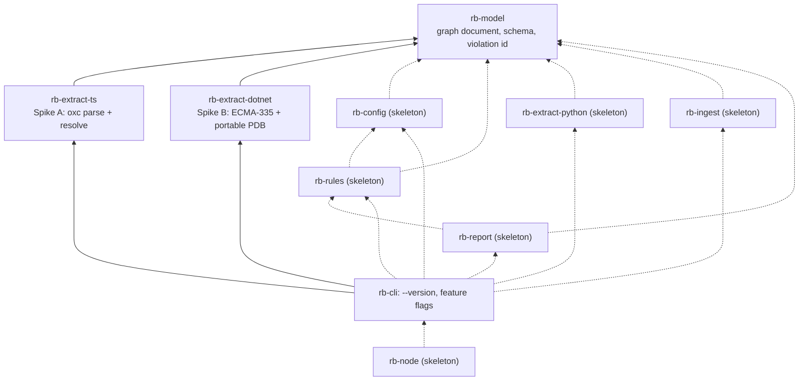
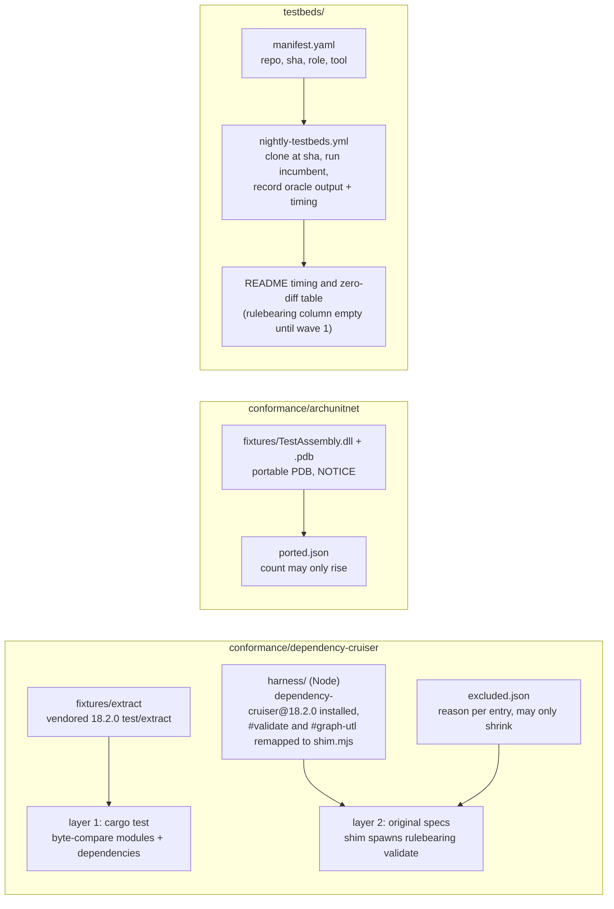
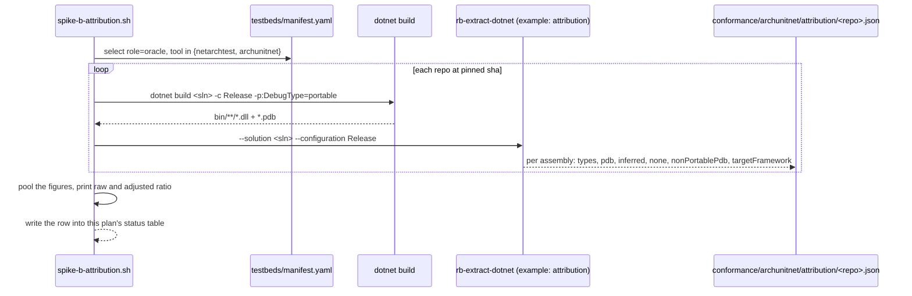

# Plan 0000: Wave 0: Spike: TypeScript extractor, .NET metadata reader, conformance skeletons, foundation

- **Status:** In progress: 0A to 0D done, 0E done except the registry day and the seven-night nightly record
- **Owner:** Ben Bahrenburg (@benbahrenburg)
- **Created:** 2026-09-20
- **Calendar estimate:** 4 weeks at ~10 h/week (from design § Waves)
- **Derives from:** [design § Waves](../../artifacts/design.md#waves) (row "0 spike"), [design § Crate layout](../../artifacts/design.md#crate-layout), [design § What each extractor has to get right](../../artifacts/design.md#what-each-extractor-has-to-get-right), [design § The fallback, decided now rather than under pressure](../../artifacts/design.md#the-fallback-decided-now-rather-than-under-pressure), [design § Conformance gate 1](../../artifacts/design.md#conformance-gate-1-dependency-cruisers-tests-validate-rulebearing), [design § Conformance gate 2](../../artifacts/design.md#conformance-gate-2-archunitnets-test-assemblies-validate-the-element-rules), [design § Test beds](../../artifacts/design.md#test-beds-open-source-repositories-to-validate-against), [design § Open questions](../../artifacts/design.md#open-questions), [design § Adoption order](../../artifacts/design.md#adoption-order); [coverage tab § Extraction and resolution](../../artifacts/dependency-cruiser-18.2.0-coverage.md#extraction-and-resolution), [coverage tab § Result document](../../artifacts/dependency-cruiser-18.2.0-coverage.md#result-document-cruise-result-schema), [coverage tab § Dependency types and module systems](../../artifacts/dependency-cruiser-18.2.0-coverage.md#dependency-types-and-module-systems)
- **Satisfies:** [FR-CORE-01](../../prd.md#fr-core-01) (workspace and crate skeletons), [FR-CORE-03](../../prd.md#fr-core-03) (graph document types and schema), [FR-EXT-TS-01](../../prd.md#fr-ext-ts-01) (to 95%), [FR-EXT-DN-01](../../prd.md#fr-ext-dn-01) (discovery for the spike), [FR-EXT-DN-02](../../prd.md#fr-ext-dn-02) (metadata and PDB reader, attribution), [FR-DIST-01](../../prd.md#fr-dist-01) (placeholder 0.0.1), [NFR-CONF-01](../../prd.md#nfr-conf-01), [NFR-CONF-02](../../prd.md#nfr-conf-02), [NFR-CONF-03](../../prd.md#nfr-conf-03) (skeletons and nightly runner), [NFR-QUAL-01](../../prd.md#nfr-qual-01), [NFR-QUAL-02](../../prd.md#nfr-qual-02), [NFR-COMPAT-01](../../prd.md#nfr-compat-01), [NFR-DOC-01](../../prd.md#nfr-doc-01), [NFR-ADOPT-02](../../prd.md#nfr-adopt-02) (own repositories as first users)
- **Applies:** [ADR-0024](../../adr/0024-test-quality-gates.md), [ADR-0025](../../adr/0025-ci-and-supply-chain-hardening.md), [ADR-0001](../../adr/0001-record-architecture-decisions.md), [ADR-0002](../../adr/0002-rust-as-implementation-language.md), [ADR-0003](../../adr/0003-dotnet-extractor-fallback.md), [ADR-0004](../../adr/0004-graph-document-is-cruise-result-superset.md), [ADR-0009](../../adr/0009-conformance-suites-as-specification.md), [ADR-0010](../../adr/0010-crate-layout-and-extractor-boundary.md), [ADR-0011](../../adr/0011-read-dotnet-assemblies-not-source.md), [ADR-0012](../../adr/0012-oxc-for-typescript.md), [ADR-0015](../../adr/0015-stable-violation-id.md), [ADR-0018](../../adr/0018-test-coverage-threshold.md), [ADR-0019](../../adr/0019-mit-licence.md), [ADR-0020](../../adr/0020-single-name-across-registries.md)
- **Architecture:** [Crate layout](../../architecture.md#crate-layout), [The graph document](../../architecture.md#the-graph-document), [Extractors](../../architecture.md#extractors), [Verification strategy](../../architecture.md#verification-strategy), [Repository layout](../../architecture.md#repository-layout), [Distribution](../../architecture.md#distribution), [Technology choices](../../architecture.md#technology-choices), [Risks and their mitigations](../../architecture.md#risks-and-their-mitigations)
- **Depends on:** none; **Enables:** [Plan 0001 (Wave 1)](0001-wave-1-typescript-parity.md), [Plan 0002 (Wave 2)](0002-wave-2-dotnet-python-element-rules.md)
- **Exit criterion (from design § Waves):** "`test/extract` fixtures pass at 95% or better; 99% of the oracle repos' types attributed to a source file, or the C# extractor fallback is invoked"

## 1. Architect section (for the architectural review board)

### 1.1 Purpose and business value

Wave 0 answers the two questions on which the language decision rests and lays the foundation every later wave builds on. The design chose Rust on the strength of `oxc_resolver` being the Rust port of enhanced-resolve and accepted one named risk, the hand-written ECMA-335 and portable PDB reader ([design § Why Rust wins](../../artifacts/design.md#why-rust-wins), [ADR-0002](../../adr/0002-rust-as-implementation-language.md)). Spike A measures the first assumption against dependency-cruiser's 546 extraction fixtures; Spike B measures the second against the .NET oracle repositories and applies the fallback rule fixed in [ADR-0003](../../adr/0003-dotnet-extractor-fallback.md). Neither question may be answered by opinion: the design's whole verification stance is that conformance is measured, not claimed ([design § Prior art](../../artifacts/design.md#prior-art), [ADR-0009](../../adr/0009-conformance-suites-as-specification.md)).

The foundation half exists because the two conformance gates "are required checks from the first pull request" ([design § Conformance gate 2](../../artifacts/design.md#conformance-gate-2-archunitnets-test-assemblies-validate-the-element-rules)), the 70% coverage floor must be in place "before any feature code lands" ([ADR-0018](../../adr/0018-test-coverage-threshold.md)), and the name must be held on all four registries on the same day ([ADR-0020](../../adr/0020-single-name-across-registries.md)). The business value is that wave 1 starts on a repository whose reviewer of record is the upstream test suite, not the maintainer, which is the design's mitigation for a bus factor of one ([design § What Rust does not solve](../../artifacts/design.md#what-rust-does-not-solve)).

### 1.2 Scope

**In scope**

| Item | Source |
| --- | --- |
| Cargo workspace with the ten crates of [ADR-0010](../../adr/0010-crate-layout-and-extractor-boundary.md), `rb-model` complete, the others as compiling skeletons with module docs | [architecture § Crate layout](../../architecture.md#crate-layout) |
| `rb-model`: the graph document types (module layer = `cruise-result` schema, code layer), `schemars`-generated `schema/v1.json`, the violation-id hash with a fixed-vector test | [ADR-0004](../../adr/0004-graph-document-is-cruise-result-superset.md), [ADR-0015](../../adr/0015-stable-violation-id.md) |
| CI: `cargo fmt --check`, `cargo clippy -D warnings`, `cargo deny`, `cargo-llvm-cov` with the 70% per-crate floor, the two conformance skeletons as required checks | [ADR-0018](../../adr/0018-test-coverage-threshold.md), [ADR-0019](../../adr/0019-mit-licence.md), [ADR-0009](../../adr/0009-conformance-suites-as-specification.md) |
| Nightly test-bed runner over `testbeds/manifest.yaml` with pinned SHAs | [design § Test beds](../../artifacts/design.md#test-beds-open-source-repositories-to-validate-against) |
| `conformance/dependency-cruiser`: the pinned 18.2.0 fixtures for layer 1, the Node shim harness for layer 2, the ratcheting `excluded.json` | [design § Conformance gate 1](../../artifacts/design.md#conformance-gate-1-dependency-cruisers-tests-validate-rulebearing) |
| `conformance/archunitnet`: `TestAssembly` built with a portable PDB and committed as a fixture, the ported-test counter | [design § Conformance gate 2](../../artifacts/design.md#conformance-gate-2-archunitnets-test-assemblies-validate-the-element-rules) |
| Spike A: `rb-extract-ts` over `oxc_parser` and `oxc_resolver` against `test/extract`, 95% exit criterion | [design § Waves](../../artifacts/design.md#waves), [ADR-0012](../../adr/0012-oxc-for-typescript.md) |
| Spike B: the ECMA-335 and portable PDB reader in `rb-extract-dotnet`, measured on the .NET oracle repos, the 99% trigger, the fallback decision as a superseding ADR | [ADR-0003](../../adr/0003-dotnet-extractor-fallback.md), [ADR-0011](../../adr/0011-read-dotnet-assemblies-not-source.md) |
| Name reservation: placeholder `0.0.1` on npm, PyPI, crates.io and NuGet; GitHub organisation and repository | [ADR-0020](../../adr/0020-single-name-across-registries.md) |
| MIT `LICENSE`, `NOTICE` handling for Apache 2.0 fixtures, `cargo deny` allow-list | [ADR-0019](../../adr/0019-mit-licence.md) |
| The repository's documentation conventions: `CLAUDE.md`, linked module docs, plan lifecycle | [ADR-0001](../../adr/0001-record-architecture-decisions.md) |

**Out of scope** (and where it lands)

| Item | Plan |
| --- | --- |
| Any rule evaluation, any reporter, any subcommand a user runs; the QuickJS evaluator; the native config format | [Plan 0001](0001-wave-1-typescript-parity.md) |
| The IL operand scan, the .NET code layer, MSBuild discovery beyond what the spike needs to find built assemblies | [Plan 0002](0002-wave-2-dotnet-python-element-rules.md) |
| The Python extractor | [Plan 0002](0002-wave-2-dotnet-python-element-rules.md) |
| Gate 1 layers 2 to 5 going green; gate 2 ported tests | Plans 0001 and 0002 |
| Wrappers with real content (npm, NuGet, pip); the GitHub Action | Plans 0001 and 0002 |
| The repository's own `rulebearing.yaml` (needs the engine) | [Plan 0001](0001-wave-1-typescript-parity.md) |

### 1.3 Requirements traceability

| Requirement | What this wave delivers for it | Verification |
| --- | --- | --- |
| [FR-CORE-01](../../prd.md#fr-core-01) | The workspace, the ten crates, the extractor feature flags on `rb-cli`, one `rulebearing` binary that prints `--version` | `cargo build --workspace`; `cargo build -p rb-cli --no-default-features --features extract-python` links no `oxc` or metadata code (checked with `cargo tree`) |
| [FR-CORE-03](../../prd.md#fr-core-03) | `rb-model` types for every field in [coverage § Result document](../../artifacts/dependency-cruiser-18.2.0-coverage.md#result-document-cruise-result-schema) plus the additive fields; `schema/v1.json` generated and committed | Round-trip test: dependency-cruiser's own `cruise.json` fixtures deserialise and re-serialise without loss; `schema-check` CI job fails if the committed schema is stale |
| [FR-CORE-04](../../prd.md#fr-core-04) (partial) | `violation_id()` in `rb-model` per [ADR-0015](../../adr/0015-stable-violation-id.md) | Fixed-vector unit test |
| [FR-EXT-TS-01](../../prd.md#fr-ext-ts-01) | Spike A: parser, dependency-form walker and resolver producing modules and dependencies for the `test/extract` fixtures | Gate 1 layer 1 pass rate at or above 95% |
| [FR-EXT-DN-01](../../prd.md#fr-ext-dn-01) (partial) | Enough `.sln`/`.slnx` and `.csproj` reading to locate built assemblies and PDBs by `OutputPath`, `Configuration`, `TargetFramework` | Spike B runs unattended over every .NET oracle in the manifest |
| [FR-EXT-DN-02](../../prd.md#fr-ext-dn-02) (partial) | The PE, metadata-table and portable PDB reader; `attribution: pdb`, `inferred`, `none` per type; a non-portable PDB reported by name | Attribution report per oracle repo; the pooled figure against the 99% trigger |
| [FR-DIST-01](../../prd.md#fr-dist-01) (partial) | Placeholder `0.0.1` on all four registries; the GitHub organisation and repository | Registry pages linked in the status table |
| [NFR-CONF-01](../../prd.md#nfr-conf-01) | Gate 1 layer 1 as a `#[test]`; layers 2 to 5 wired, all specs initially in `excluded.json` with reason `wave-1` | `conformance-gate-1` is a required check; `excluded.json` ratchet job |
| [NFR-CONF-02](../../prd.md#nfr-conf-02) | `TestAssembly` fixture with portable PDB; `ported.json` counter at zero | `conformance-gate-2` is a required check; unported count ratchet |
| [NFR-CONF-03](../../prd.md#nfr-conf-03) | `testbeds/manifest.yaml`; nightly workflow that clones at SHA, runs the incumbent tool, records its output and a timing row | Nightly workflow green for one week; the README table is written between markers |
| [NFR-QUAL-01](../../prd.md#nfr-qual-01) | `cargo llvm-cov` with `--fail-under-lines 70` and a per-crate check | Required `coverage` job |
| [NFR-QUAL-02](../../prd.md#nfr-qual-02) | `fmt`, `clippy -D warnings`, `cargo deny check`; fuzz target skeleton for the metadata reader | Required jobs; nightly fuzz job |
| [NFR-COMPAT-01](../../prd.md#nfr-compat-01) | MIT `LICENSE`; `deny.toml` allow-list; `conformance/archunitnet/NOTICE` | `cargo deny check licenses` |
| [NFR-DOC-01](../../prd.md#nfr-doc-01) | `CLAUDE.md`; every `lib.rs` links its architecture section and this plan | A `docs-links` CI script greps each crate's `lib.rs` for `architecture.md#` and `plans/` |
| [NFR-ADOPT-02](../../prd.md#nfr-adopt-02) | The maintainer's own TypeScript repository and this repository are the first entries with role `own` in the manifest | Manifest rows present; nightly runs them |

### 1.4 Architecture of what this wave builds

The workspace after wave 0. Solid boxes carry code; dashed boxes are skeletons with a module doc, a `lib.rs` and one test so that the coverage floor is meaningful from the first feature pull request.



The conformance harness and the test-bed runner sit outside the workspace, as [architecture § Repository layout](../../architecture.md#repository-layout) places them:



Spike B's measurement, which is the decision the board cares most about, runs as a sequence over every .NET oracle in the manifest:



### 1.5 Interfaces and contracts frozen by this wave

**The graph document types in `rb-model`.** Field names are the `cruise-result` schema's, unchanged, and the additions are the ones in [architecture § The graph document](../../architecture.md#the-graph-document). Changing a name after this wave is a breaking change that needs an ADR ([ADR-0004](../../adr/0004-graph-document-is-cruise-result-superset.md)). The shapes below are the contract; `Option` marks a field dependency-cruiser omits when absent, and `#[serde(skip_serializing_if = "Option::is_none")]` keeps the emitted JSON identical to dependency-cruiser's for a document with no additions.

```rust
// crates/rb-model/src/lib.rs (excerpt)
#[derive(Serialize, Deserialize, JsonSchema, Clone, Debug, PartialEq)]
#[serde(rename_all = "camelCase")]
pub struct GraphDocument {
    pub modules: Vec<Module>,
    pub folders: Option<Vec<Folder>>,
    pub summary: Summary,
    pub revision_data: Option<RevisionData>,
    /// Additive code layer; empty until an extractor fills it.
    pub code: Option<CodeLayer>,
}

#[derive(Serialize, Deserialize, JsonSchema, Clone, Debug, PartialEq)]
#[serde(rename_all = "camelCase")]
pub struct Module {
    pub source: String,
    pub dependencies: Vec<Dependency>,
    pub dependents: Option<Vec<String>>,
    pub orphan: Option<bool>,
    pub valid: Option<bool>,
    pub rules: Option<Vec<RuleSummary>>,
    pub reachable: Option<Vec<Reachable>>,
    pub reaches: Option<Vec<Reaches>>,
    pub instability: Option<f64>,
    pub could_not_resolve: Option<bool>,
    pub core_module: Option<bool>,
    pub followable: Option<bool>,
    pub matches_do_not_follow: Option<bool>,
    pub matches_focus: Option<bool>,
    pub matches_reaches: Option<bool>,
    pub matches_highlight: Option<bool>,
    pub consolidated: Option<bool>,
    pub checksum: Option<String>,
    pub license: Option<String>,
    pub dependency_types: Option<Vec<DependencyType>>,
    pub experimental_stats: Option<ExperimentalStats>,
    // additions (ADR-0004)
    pub language: Option<Language>,
    pub project: Option<String>,
    pub namespaces: Option<Vec<String>>,
    pub attribution: Option<Attribution>,
}

#[derive(Serialize, Deserialize, JsonSchema, Clone, Copy, Debug, PartialEq, Eq)]
#[serde(rename_all = "lowercase")]
pub enum Attribution { Pdb, Inferred, None }

/// ADR-0015: "RB-" + first eight hex chars of SHA-256 over
/// rule name, from, to, dependencyKind, joined with "\n".
pub fn violation_id(rule: &str, from: &str, to: &str, dependency_kind: &str) -> ViolationId;
```

`DependencyType` is an enum with dependency-cruiser's forty string values from [coverage § Dependency types and module systems](../../artifacts/dependency-cruiser-18.2.0-coverage.md#dependency-types-and-module-systems) plus the .NET and Python values from [design § Dependency rules](../../artifacts/design.md#dependency-rules-the-whole-of-dependency-cruiser-1820); `ModuleSystem` is `cjs`, `es6`, `amd`, `tsd`, `clr`, `py`. The per-language option structs the extractors receive (`TypeScriptOptions`, `DotnetOptions`, `PythonOptions`) also live here, because an extractor may not depend on `rb-config` ([ADR-0010](../../adr/0010-crate-layout-and-extractor-boundary.md) rule 2). Their fields are the `languages.*` keys of [design § The native format](../../artifacts/design.md#the-native-format).

**The extractor trait.** One signature, three implementations, no language reaching past it:

```rust
// crates/rb-model/src/extract.rs
pub trait Extractor {
    type Options;
    fn extract(&self, roots: &[PathBuf], options: &Self::Options) -> Result<Extraction, ExtractError>;
}
pub struct Extraction {
    pub modules: Vec<Module>,
    pub code: Option<CodeLayer>,
    pub inspected: Inspected,      // the receipt, per language
    pub warnings: Vec<Warning>,
}
/// Reasons that make a run untrustworthy (exit 2 in wave 1, ADR-0008).
pub enum ExtractError { NoModulesFound, NoBuiltAssemblies { solution: PathBuf }, NonPortablePdb { assembly: PathBuf }, UnsupportedFile { path: PathBuf, reason: String }, Io(std::io::Error) }
```

**`schema/v1.json`**, generated by `cargo run -p rb-model --example emit-schema`, committed, and diffed in CI. Its `$id` is the URL named in the design's example config, `https://benbahrenburg.github.io/rulebearing/schema/v1.json` ([design § The native format](../../artifacts/design.md#the-native-format)); serving it from Pages is a wave 1 task.

**`testbeds/manifest.yaml`.** One row per repository from [design § Test beds](../../artifacts/design.md#test-beds-open-source-repositories-to-validate-against):

```yaml
# testbeds/manifest.yaml
- repo: sverweij/dependency-cruiser
  sha: <pinned on the day the manifest is written>
  role: oracle            # oracle | greenfield | scale | own
  languages: [javascript, typescript]
  tool: dependency-cruiser  # dependency-cruiser | netarchtest | archunitnet | import-linter | none
  config: .dependency-cruiser.cjs
  build: null               # .NET rows: "dotnet build X.slnx -c Release -p:DebugType=portable"
- repo: evolutionary-architecture/evolutionary-architecture-by-example
  sha: <pinned>
  role: oracle
  languages: [csharp]
  tool: netarchtest
  build: dotnet build Src/EvolutionaryArchitecture.sln -c Release -p:DebugType=portable
```

**`conformance/excluded.json`** and **`conformance/archunitnet/ported.json`**, the two ratchets of [ADR-0009](../../adr/0009-conformance-suites-as-specification.md):

```json
[ { "spec": "test/validate/index.circular.spec.mjs", "reason": "wave-1: rule engine not yet implemented", "plan": "0001" } ]
```

```json
{ "total": 0, "ported": 0, "customPredicate": 0, "note": "total is filled when the port inventory is taken in wave 2" }
```

**CI check names**, which branch protection references and later plans cite as evidence: `fmt`, `clippy`, `deny`, `test`, `coverage`, `schema-check`, `docs-links`, `conformance-gate-1`, `conformance-gate-2`, `ratchets`. Nightly: `nightly-testbeds`, `fuzz`.

### 1.6 Decisions applied and decisions to make

| ADR | Why it matters in this wave |
| --- | --- |
| [ADR-0001](../../adr/0001-record-architecture-decisions.md) | This plan's lifecycle, the `CLAUDE.md` working agreement and the linked module docs are wave 0 deliverables |
| [ADR-0002](../../adr/0002-rust-as-implementation-language.md) | Rust 2024 edition workspace; the spikes test the two assumptions behind it |
| [ADR-0003](../../adr/0003-dotnet-extractor-fallback.md) | The 99% trigger, the three-week window, the measurement and the superseding ADR are Spike B's deliverables |
| [ADR-0004](../../adr/0004-graph-document-is-cruise-result-superset.md) | `rb-model` freezes the field names; the schema is generated from it |
| [ADR-0009](../../adr/0009-conformance-suites-as-specification.md) | Both gates are required checks from the first pull request, so their skeletons come before feature code |
| [ADR-0010](../../adr/0010-crate-layout-and-extractor-boundary.md) | The ten crates, the dependency direction, the feature flags, the rule that extractors take options as `rb-model` structs |
| [ADR-0011](../../adr/0011-read-dotnet-assemblies-not-source.md) | Spike B reads metadata and PDBs, never C# source; attribution states `pdb`, `inferred`, `none` |
| [ADR-0012](../../adr/0012-oxc-for-typescript.md) | Spike A uses `oxc_parser` and `oxc_resolver`; parity is measured against the 546 fixtures |
| [ADR-0015](../../adr/0015-stable-violation-id.md) | The hash lives in `rb-model` with a fixed-vector test because a change would invalidate every baseline |
| [ADR-0018](../../adr/0018-test-coverage-threshold.md) | `cargo-llvm-cov` and the 70% per-crate floor are installed before feature code |
| [ADR-0019](../../adr/0019-mit-licence.md) | MIT `LICENSE`, the `cargo deny` allow-list, `NOTICE` for ArchUnitNET fixtures |
| [ADR-0020](../../adr/0020-single-name-across-registries.md) | The placeholder publish and the organisation and repository creation happen on one day |

**Decisions this wave must make**

| Decision | Decision rule | Recorded where |
| --- | --- | --- |
| Rust reader or C# fallback for .NET | Pooled attribution across the .NET oracle repos at or above 99% within the three-week window (weeks 2 to 4) keeps the Rust reader; otherwise `Rulebearing.Extract` over `System.Reflection.Metadata` is the extractor and `rb-ingest` consumes its document ([ADR-0003](../../adr/0003-dotnet-extractor-fallback.md)) | ADR-0022, superseding the open branch of ADR-0003; this plan's 0D status row |
| What counts in the attribution denominator | The design says "types in the .NET oracle repos" and does not define the denominator. Rule: every `TypeDef` row in the solution's own assemblies except `<Module>` and types carrying `CompilerGeneratedAttribute`, which no tool attributes to a file; the report prints the raw ratio too so the choice is auditable | The attribution report and ADR-0022 |
| .NET Framework projects in the oracle set | Count projects whose `TargetFramework` is `net4*`; for each, record whether `-p:DebugType=portable` yields a portable PDB. Types behind a non-portable PDB report `attribution: none` and are counted in the denominator, because a user would hit the same wall ([design § Open questions](../../artifacts/design.md#open-questions)) | 0D status row; the wave 2 plan's `DebugType` guidance |
| Whether to use a scoped npm organisation | Check `@rulebearing` from a signed-in session ([ADR-0020](../../adr/0020-single-name-across-registries.md)). If free, reserve it; platform binary packages in wave 1 are then `@rulebearing/cli-<platform>`, otherwise `rulebearing-cli-<platform>` unscoped | 0E status row |
| Spike A fixture expectations without Node at test time | The `test/extract` expectations live in `.spec.mjs` files. Rule: a one-time Node script under the harness serialises each spec's expected module list to JSON beside the vendored inputs so layer 1 is a plain `#[test]` (which is what lets it count toward coverage per [ADR-0018](../../adr/0018-test-coverage-threshold.md)); the script is re-run when the pin is bumped | `conformance/dependency-cruiser/README.md` |
| Which metadata tables the spike reads | [architecture § Extractors](../../architecture.md#extractors) names eight tables for the edge set. Attribution needs `TypeDef`, `MethodDef`, `NestedClass` (for nested type names), the PDB `Document` and `MethodDebugInformation` tables and the heaps. The spike reads those and stubs the rest; the IL scan is wave 2 | `rb-extract-dotnet` module doc |

### 1.7 Quality attributes

| Attribute | Target in this wave | How measured |
| --- | --- | --- |
| Correctness (TypeScript) | Gate 1 layer 1 at or above 95% of fixtures identical | The layer 1 test prints `passed/total` and fails under the threshold held in `conformance/dependency-cruiser/threshold.json` (95 in wave 0, 100 from wave 1) |
| Correctness (.NET) | Pooled attribution at or above 99% | The attribution report |
| Performance | No target yet; the spike records parse and resolve wall-clock for the fixture set and for one scale repository so wave 1 has a baseline for [NFR-PERF-01](../../prd.md#nfr-perf-01) | A `--timing` line in the layer 1 test output; one row per scale repo in the nightly table |
| Security | No network in any crate; `cargo deny` advisories clean; the metadata reader never panics on malformed input | `deny` job; a fuzz target `fuzz/fuzz_targets/metadata_reader.rs` run nightly; a unit test feeding truncated PE files |
| Reliability | Nightly runner tolerates a repository failing to clone or build and reports the row as `error` rather than failing the whole run | Workflow step continues on error per repo; a summary step fails only on a timing regression (none yet) |
| Compatibility | `rb-model` round-trips dependency-cruiser's own JSON output byte-for-byte after key sorting | Round-trip test over the `test/report` input fixtures |
| Observability | Every CI job uploads its report (coverage HTML, layer 1 diff, attribution JSON) as an artefact | Workflow `actions/upload-artifact` steps |
| Coverage | 70% lines per crate; skeleton crates carry one real test each so the floor is not vacuous | `coverage` job |

### 1.8 Dependencies

| Dependency | Version policy | Licence | Used by |
| --- | --- | --- | --- |
| Rust toolchain | stable, pinned in `rust-toolchain.toml`; 2024 edition | MIT/Apache-2.0 | all |
| `oxc_parser`, `oxc_ast`, `oxc_span`, `oxc_allocator` | pinned exact version in `Cargo.toml`, bumped by pull request that re-runs gate 1 ([ADR-0012](../../adr/0012-oxc-for-typescript.md)) | MIT | `rb-extract-ts` |
| `oxc_resolver` | pinned exact | MIT | `rb-extract-ts` |
| `serde`, `serde_json` | caret | MIT/Apache-2.0 | `rb-model` |
| `schemars` | caret | MIT | `rb-model` |
| `sha2` | caret | MIT/Apache-2.0 | `rb-model` |
| `rayon` | caret | MIT/Apache-2.0 | `rb-extract-ts` (parallel parse) |
| `clap` | caret | MIT/Apache-2.0 | `rb-cli` |
| `thiserror` | caret | MIT/Apache-2.0 | all |
| `cargo-llvm-cov`, `cargo-deny`, `cargo-dist` | CI-installed, pinned versions in the workflow | MIT/Apache-2.0 | CI |
| dependency-cruiser | `18.2.0` exactly, in `conformance/dependency-cruiser/harness/package.json`, vendored `test/extract` and `test/report` inputs | MIT | gate 1 |
| ArchUnitNET | `0.13.4` exactly; `TestAssembly` source at that tag, built once | Apache-2.0 | gate 2 |
| NetArchTest | `1.3.2`; its test project treated the same way in wave 2 | MIT | gate 2 |
| Node | 22 LTS, only inside `conformance/` and the nightly runner, never in the binary | MIT | harness |
| .NET SDK | 8.0 and 9.0 in CI (the oracle repos span both); `DebugType=portable` | MIT | Spike B, gate 2 fixture build |
| Nothing GPL | `dotnetdll` is GPL-3 and is refused by `deny.toml` ([ADR-0019](../../adr/0019-mit-licence.md)) | | |

### 1.9 Risks

| Risk | Likelihood | Impact | Mitigation | Trigger |
| --- | --- | --- | --- | --- |
| The Rust metadata reader cannot reach 99% attribution | medium | high | The fallback is pre-decided and scoped to `rb-extract-dotnet` plus `rb-ingest` ([ADR-0003](../../adr/0003-dotnet-extractor-fallback.md)); the report is produced weekly from week 2 so the trend is visible before the deadline | Pooled ratio under 99% at the end of week 4 |
| `oxc_resolver` diverges from enhanced-resolve on fixture edge cases | medium | medium | Every failing fixture is classified (parser, walker, resolver, fixture-serialisation) in the layer 1 diff artefact; resolver divergences are filed upstream with the fixture attached ([architecture § Risks](../../architecture.md#risks-and-their-mitigations)) | Layer 1 under 95% with more than half the failures in the resolver class |
| Oracle repos will not build unattended (private feeds, Windows-only targets) | medium | low | The manifest records `build`; a repo that fails to build is reported as `error` and excluded from the pooled ratio with the reason written in the report | Any `error` row |
| .NET Framework projects with non-portable PDBs | medium | low | Counted, reported, and answered with `DebugType=portable` guidance; `attribution: none` is a defined state ([ADR-0011](../../adr/0011-read-dotnet-assemblies-not-source.md)) | More than 5% of types behind non-portable PDBs |
| Name taken on a registry between lookup and publish | low | medium | Publish all four on the same day, first task of 0E; reserves `plumbrule`, `trussworthy` ([ADR-0020](../../adr/0020-single-name-across-registries.md)) | Any registry rejects the publish |
| CI minutes on a personal account | medium | low | Nightly clones are shallow at the pinned SHA; the .NET builds are cached by SHA; gate 2's `TestAssembly` is built once and committed | Monthly minutes over the free allowance |
| Single maintainer stalls in the spike | medium | high | The spikes are time-boxed (0C one week, 0D three weeks) and the fallback rule removes the temptation to extend | A sub-wave overruns its window by a week |

### 1.10 Compliance and licence review

- The repository is MIT ([ADR-0019](../../adr/0019-mit-licence.md)); `LICENSE` carries the maintainer's copyright line.
- `conformance/dependency-cruiser/fixtures/` vendors MIT material and carries dependency-cruiser's `LICENSE` beside it; the harness installs the package from npm and copies nothing else.
- `conformance/archunitnet/` carries ArchUnitNET's `NOTICE` and `LICENSE` (Apache 2.0) beside the built `TestAssembly.dll` and `.pdb`; the C# source of `TestAssembly` is fetched at the tag by script, not committed, so the only Apache 2.0 material in the repository is the binary fixture and its notice.
- `deny.toml` allows MIT, Apache-2.0, BSD-2-Clause, BSD-3-Clause, ISC, Zlib and Unicode-3.0 and nothing else; the job fails on any other licence or any advisory.
- Test-bed repositories are cloned read-only in CI and never modified ([design § Test beds](../../artifacts/design.md#test-beds-open-source-repositories-to-validate-against)); nothing from them is committed except the incumbent tool's output for the oracle diff, which is data produced by the maintainer's own run.
- The placeholder packages state in their README that they reserve the name and link to the repository; they carry no code.

### 1.11 Operational impact

| Area | Impact |
| --- | --- |
| CI minutes | Pull request: about 6 to 10 minutes (build, tests, coverage, layer 1, gate 2 skeleton). Nightly: one hour budget for clones, .NET builds and incumbent runs; the scale repos are the bulk |
| Release | No release; the placeholder `0.0.1` is a manual publish documented in `docs/release.md` so wave 1's `cargo-dist` pipeline replaces a known procedure |
| Docs | `CLAUDE.md`, `conformance/README.md`, `testbeds/README.md`, `docs/release.md`, crate module docs; the plans index already lists this plan |
| Secrets | Registry tokens for the four placeholders are held by the maintainer, not in CI, until wave 1's release workflow |

### 1.12 ARB checklist

| Question | Answer |
| --- | --- |
| What is decided at the end of this wave that cannot be reversed cheaply? | The `rb-model` field names (public contract, [ADR-0004](../../adr/0004-graph-document-is-cruise-result-superset.md)), the violation-id hash ([ADR-0015](../../adr/0015-stable-violation-id.md)), the crate boundary ([ADR-0010](../../adr/0010-crate-layout-and-extractor-boundary.md)) and the .NET extractor implementation language ([ADR-0003](../../adr/0003-dotnet-extractor-fallback.md)) |
| What is the evidence for each spike's outcome? | A CI artefact: the layer 1 diff report with `passed/total`, and the attribution JSON per oracle repo with the pooled ratio; both linked from the status table |
| What happens if Spike B fails? | ADR-0022 invokes the fallback; wave 2's .NET sub-waves are re-planned around `Rulebearing.Extract`; nothing outside `rb-extract-dotnet` and `rb-ingest` changes |
| Why do the conformance skeletons come before any feature? | Because both gates are required checks from the first pull request ([ADR-0009](../../adr/0009-conformance-suites-as-specification.md)) and the ratchets must have a starting value |
| Is anything in this wave visible to users? | Only the placeholder packages and the public nightly table, which the design uses as the project's visibility mechanism ([design § What Rust does not solve](../../artifacts/design.md#what-rust-does-not-solve)) |
| How is the 70% floor meaningful on skeleton crates? | Each skeleton has one real unit of behaviour (for example `rb-config` parses an empty native file into the default model) with a test, so the per-crate check is not trivially satisfied or trivially failed |
| Does this wave introduce any network access or code execution in the binary? | No. Node and `dotnet` run only in the harness and the nightly runner ([architecture § Security posture](../../architecture.md#security-posture)) |
| What is cut first if the wave slips? | The nightly runner's scale rows and the fuzz target; never the two spikes or the gate skeletons (see § 3) |

## 2. Lead developer section (step-by-step implementation)

**Conventions used throughout.** Trunk-based on `main` with short-lived branches named `w0/<sub-wave>-<slug>`; one pull request per step or smaller; squash merges; every pull request description links the step number here and the requirement IDs. Branch protection requires the check names in § 1.5. Commit messages are imperative and mention the crate. Nothing merges with a failing ratchet.

### Step 1: Repository, licence, docs conventions (0A)

Requirements: [NFR-COMPAT-01](../../prd.md#nfr-compat-01), [NFR-DOC-01](../../prd.md#nfr-doc-01). ADRs: [0001](../../adr/0001-record-architecture-decisions.md), [0019](../../adr/0019-mit-licence.md), [0020](../../adr/0020-single-name-across-registries.md).

1. Create the GitHub organisation `rulebearing` and the repository `benbahrenburg/rulebearing`; push the existing `docs/` tree.
2. Add `LICENSE` (MIT), `.gitignore`, `.editorconfig`, `rust-toolchain.toml` (stable, pinned), `deny.toml` with the allow-list from [ADR-0019](../../adr/0019-mit-licence.md).
3. Write `CLAUDE.md` with these sections: purpose and links (design, architecture, PRD, ADR index, plans index); the crate boundary rules from [ADR-0010](../../adr/0010-crate-layout-and-extractor-boundary.md) in one table; testing and coverage (the 70% floor, the coverage exclusions list required by [ADR-0018](../../adr/0018-test-coverage-threshold.md)); how to run the conformance harness locally; the plan lifecycle from [ADR-0001](../../adr/0001-record-architecture-decisions.md); the style rules of this document (plain prose, cite the design, no invented features).
4. Add `scripts/check-doc-links.sh`: for every `crates/*/src/lib.rs`, require a `//!` block containing `architecture.md#` and `docs/plans/`; for every file under `docs/plans/` and `docs/adr/`, require at least one relative link that resolves. Wire it as the `docs-links` job.

Definition of done: repository public, `LICENSE` present, `docs-links` green on an empty workspace.

### Step 2: Cargo workspace and the ten crates (0A)

Requirements: [FR-CORE-01](../../prd.md#fr-core-01). ADRs: [0002](../../adr/0002-rust-as-implementation-language.md), [0010](../../adr/0010-crate-layout-and-extractor-boundary.md).

1. Root `Cargo.toml` with `[workspace] members = ["crates/*"]`, `resolver = "3"`, shared `[workspace.package]` (edition 2024, licence MIT, repository URL) and `[workspace.dependencies]` pinning `oxc_*` and `oxc_resolver` exactly.
2. Create `crates/rb-model`, `rb-config`, `rb-rules`, `rb-extract-ts`, `rb-extract-dotnet`, `rb-extract-python`, `rb-ingest`, `rb-report`, `rb-cli`, `rb-node`, each with `Cargo.toml`, `src/lib.rs` carrying the module doc required by Step 1, and one unit test.
3. `crates/rb-cli/Cargo.toml`: package name `rulebearing` (the one crate that carries the public name, [ADR-0020](../../adr/0020-single-name-across-registries.md)), `[[bin]] name = "rulebearing"`, features `extract-ts`, `extract-dotnet`, `extract-python`, `default = [all three]`, each gating the optional dependency on its extractor crate. `main.rs` implements `--version` and `--help` through `clap` and nothing else.
4. Enforce the dependency direction with a test in `rb-cli/tests/crate_boundary.rs` that parses `cargo metadata` and asserts the edges of [ADR-0010](../../adr/0010-crate-layout-and-extractor-boundary.md): no extractor depends on `rb-config` or `rb-rules`; `rb-model` depends on nothing in the workspace. This is the placeholder for the repository's own `rulebearing.yaml`, which wave 1 replaces it with.

Tests: the boundary test; `cargo build -p rulebearing --no-default-features --features extract-python` in CI with a `cargo tree` assertion that `oxc_parser` is absent.

Definition of done: `cargo build --workspace` and `cargo test --workspace` green; `rulebearing --version` prints `rulebearing 0.0.1`.

### Step 3: `rb-model`: graph document, schema, violation id (0A)

Requirements: [FR-CORE-03](../../prd.md#fr-core-03), [FR-CORE-04](../../prd.md#fr-core-04) (hash only). ADRs: [0004](../../adr/0004-graph-document-is-cruise-result-superset.md), [0015](../../adr/0015-stable-violation-id.md).

1. `src/document.rs`: `GraphDocument`, `Module`, `Dependency`, `Folder`, `Summary`, `Violation`, `RevisionData`, `Inspected`, `VacuousRule`, `CodeLayer` with `TypeElement`, `MemberElement`, `AttributeElement`, `CallElement`, exactly the fields of [coverage § Result document](../../artifacts/dependency-cruiser-18.2.0-coverage.md#result-document-cruise-result-schema) and [architecture § The graph document](../../architecture.md#the-graph-document). Use `#[serde(rename_all = "camelCase")]` and `skip_serializing_if` on every `Option`.
2. `src/vocab.rs`: `DependencyType` (forty dependency-cruiser values, the .NET and Python additions), `ModuleSystem`, `Language`, `Attribution`, `DependencyKind`, `Severity`. String forms match the coverage tab exactly; a round-trip test over every variant.
3. `src/options.rs`: `TypeScriptOptions`, `DotnetOptions`, `PythonOptions` mirroring the `languages` block ([design § The native format](../../artifacts/design.md#the-native-format)) and the flat dependency-cruiser option names that alias into `languages.typescript` ([coverage § Options](../../artifacts/dependency-cruiser-18.2.0-coverage.md#options)); every option a `Option<T>` with the documented default.
4. `src/id.rs`: `violation_id()` as in § 1.5. Fixed-vector test: the id for (`no-cross-app-imports`, `apps/web/src/x.ts`, `apps/worker/src/y.ts`, `import`) is computed once, pasted into the test, and never changes.
5. `src/extract.rs`: the `Extractor` trait and `ExtractError` from § 1.5.
6. `examples/emit-schema.rs`: writes `schema/v1.json` from `schemars::schema_for!(GraphDocument)` with the `$id` above. CI job `schema-check` runs it and fails on a diff.
7. Tests: deserialise every `test/report/**/input*.json` fixture vendored in Step 6 into `GraphDocument` and re-serialise; compare after canonical key ordering. Any field the fixtures carry that the types lack is a bug.

Coverage expectation: above 85% (the round-trip fixtures drive it).

Definition of done: `schema/v1.json` committed; round-trip test green over every vendored input; fixed-vector test green.

### Step 4: CI workflows (0A)

Requirements: [NFR-QUAL-01](../../prd.md#nfr-qual-01), [NFR-QUAL-02](../../prd.md#nfr-qual-02). ADRs: [0018](../../adr/0018-test-coverage-threshold.md), [0019](../../adr/0019-mit-licence.md).

`.github/workflows/ci.yml`, one job per check name:

The `lint` job is one step, `cargo xtask lint --strict`, which runs the documentation link check
and every language's linter ([ADR-0023](../../adr/0023-documentation-link-and-lint-gates.md)); the
individual names below stay as the description of what that step covers.

```yaml
jobs:
  lint:     { run: cargo xtask lint --strict }   # doc links, fmt, clippy, eslint, prettier, ruff, mypy, dotnet format
  fmt:      { run: cargo fmt --all --check }
  clippy:   { run: cargo clippy --workspace --all-targets --all-features -- -D warnings }
  deny:     { run: cargo deny check licenses advisories bans sources }
  test:     { run: cargo test --workspace --all-features }
  coverage:
    run: |
      cargo llvm-cov --workspace --all-features --fail-under-lines 70 --json --output-path coverage.json
      scripts/coverage-per-crate.sh coverage.json 70   # fails if any crate is below 70
  schema-check: { run: cargo run -p rb-model --example emit-schema && git diff --exit-code schema/ }
  docs-links:   { run: scripts/check-doc-links.sh }
  conformance-gate-1: { run: cargo test -p rb-extract-ts --test extract_fixtures -- --nocapture }
  conformance-gate-2: { run: scripts/gate2-check.sh }      # fixture present, ported.json valid
  ratchets:     { run: scripts/ratchets.sh }               # excluded.json and ported.json may only move one way
```

`scripts/coverage-per-crate.sh` reads the `llvm-cov` JSON and prints a table per crate; the coverage exclusions (`schema/`, generated stdlib snapshots later) are listed in `CLAUDE.md` and in `.cargo/llvm-cov.toml`'s `ignore-filename-regex`. `scripts/ratchets.sh` compares the file on the pull request to the base branch: `excluded.json` length may not grow, `ported.json.ported` may not fall.

Nightly: `.github/workflows/nightly-testbeds.yml` (Step 7) and `fuzz.yml` running `cargo fuzz run metadata_reader -- -max_total_time=600`.

Definition of done: every job green on `main`; branch protection lists all of them as required.

### Step 5: Conformance gate 1 skeleton (0B)

Requirements: [NFR-CONF-01](../../prd.md#nfr-conf-01). ADRs: [0009](../../adr/0009-conformance-suites-as-specification.md), [0007](../../adr/0007-vacuous-rules-fail-by-default.md) (the harness passes `--no-liveness`, documented now).

Layout:

```
conformance/
├── README.md                      # how to run each layer locally, the --no-liveness note
├── excluded.json                  # gate 1 layer 2 exclusions, reason per entry
├── dependency-cruiser/
│   ├── LICENSE                    # dependency-cruiser's MIT licence
│   ├── PIN                        # 18.2.0
│   ├── fixtures/extract/          # vendored test/extract inputs + expected/*.json
│   ├── fixtures/report/           # vendored test/report inputs and expected outputs (used from wave 1)
│   ├── harness/package.json       # "dependency-cruiser": "18.2.0", mocha
│   ├── harness/shim.mjs           # #validate and #graph-utl replacement: spawns rulebearing validate --rules - --module -
│   ├── harness/run-layer-2.mjs    # runs the original specs with the import map, honours excluded.json
│   └── scripts/vendor.sh          # fetches the tag, copies test/extract and test/report, runs export-expectations.mjs
└── archunitnet/                   # Step 6
```

1. `scripts/vendor.sh` clones `sverweij/dependency-cruiser` at `v18.2.0` into a temp dir, copies `test/extract/**` and `test/report/**` inputs, and runs `export-expectations.mjs`, which loads each `test/extract/**/*.spec.mjs` under the pinned package and writes the expected module lists as JSON beside the inputs (decision in § 1.6). It records the count of specs and fixtures in `fixtures/extract/INDEX.json` (the 546 the design cites; the actual number from the script is what the threshold divides by).
2. `crates/rb-extract-ts/tests/extract_fixtures.rs`: for every entry in `INDEX.json`, run the extractor with the spec's options, normalise (sort modules by `source`, dependencies by `resolved`), compare to the expected JSON, and collect pass or fail with a unified diff. Print `layer1: passed=<n> total=<t> ratio=<r>`; fail if `ratio < threshold.json`. Write the diff report to `target/conformance/layer1.md` and upload it as an artefact.
3. `harness/shim.mjs` implements the `#validate` and `#graph-utl` module surface by spawning `rulebearing validate --rules - --module - --no-liveness` with JSON on stdin and parsing JSON from stdout. In wave 0 the subcommand does not exist; the shim returns a sentinel and `run-layer-2.mjs` writes every spec into `excluded.json` with reason `wave-1: rule engine not yet implemented`, plan `0001`. The `ratchets` job now has a starting count.
4. `harness/run-layer-2.mjs` uses Node's `--import` with a loader that remaps the two specifiers and runs mocha over `node_modules/dependency-cruiser/test/validate/**/*.spec.mjs` and `test/graph-utl/**/*.spec.mjs`, skipping entries in `excluded.json` and failing on any non-excluded failure.
5. Layers 3, 4 and 5 get a `run-layer-N.sh` that prints `not implemented until wave 1` and exits 0, so that the job names exist and wave 1 turns them on without a workflow change. Layer 4 vendors the two 18.2.0 schemas (`configuration.schema.json`, `cruise-result.schema.json`) now, since `rb-model`'s round-trip test uses the second.

Definition of done: `conformance-gate-1` runs layer 1 and reports a ratio; `excluded.json` populated; `conformance/README.md` explains each layer and the `--no-liveness` rule.

### Step 6: Conformance gate 2 skeleton (0B)

Requirements: [NFR-CONF-02](../../prd.md#nfr-conf-02). ADRs: [0009](../../adr/0009-conformance-suites-as-specification.md), [0019](../../adr/0019-mit-licence.md).

1. `conformance/archunitnet/scripts/build-test-assembly.sh`: clones `TNG/ArchUnitNET` at `v0.13.4`, runs `dotnet build TestAssembly/TestAssembly.csproj -c Release -p:DebugType=portable -p:Deterministic=true`, copies `TestAssembly.dll` and `TestAssembly.pdb` into `fixtures/`, and copies `LICENSE` and `NOTICE`. Deterministic build so that a rebuild yields the same bytes and the committed fixture is reviewable.
2. `fixtures/README.md` records the tag, the SDK version and the `sha256` of both files.
3. `ported.json` as in § 1.5 with `ported: 0`; `scripts/gate2-check.sh` verifies the fixture files and hashes exist and that `ported.json` parses. The port inventory (`total`) is a wave 2 task; the ratchet only checks that `ported` never falls.
4. A `#[test]` in `rb-extract-dotnet/tests/test_assembly.rs` opens the fixture with the Step 9 reader and asserts it parses, that the PDB is portable, and prints the attribution ratio for `TestAssembly` (expected to be 100% because it is a plain SDK project; a lower figure is the first bug report for the reader).

Definition of done: fixture committed with `NOTICE`; `conformance-gate-2` green; the `TestAssembly` test is the reader's first end-to-end test.

### Step 7: Test-bed manifest and nightly runner (0B)

Requirements: [NFR-CONF-03](../../prd.md#nfr-conf-03), [NFR-ADOPT-02](../../prd.md#nfr-adopt-02). ADR: [0009](../../adr/0009-conformance-suites-as-specification.md).

1. `testbeds/manifest.yaml` with one row per repository in [design § Test beds](../../artifacts/design.md#test-beds-open-source-repositories-to-validate-against), SHAs pinned on the day of writing by `scripts/pin.sh` (which resolves the default branch head and writes it back), plus two `role: own` rows for the maintainer's repositories.
2. `testbeds/run.sh <row>`: shallow-clones at the SHA (`git fetch --depth 1 origin <sha>`), runs the incumbent tool with the repository's own config (`npx dependency-cruiser@<repo's pinned version> --output-type json`; `dotnet test` for the .NET oracles; `lint-imports` for Python), stores the output under `testbeds/out/<repo>/incumbent.json`, and records wall-clock and peak RSS (`/usr/bin/time -l` on macOS runners, `-v` on Linux) into `testbeds/out/<repo>/timing.json`. The Rulebearing column is left empty in wave 0; wave 1 fills it for TypeScript oracles.
3. `.github/workflows/nightly-testbeds.yml`: matrix over the manifest, `continue-on-error: true` per row, a summary job that assembles `testbeds/out/summary.md` (zero-diff column, timing column, error column) and commits it between `<!-- testbeds:start -->` and `<!-- testbeds:end -->` markers in `README.md`. The 20% timing regression check ([design § Test beds](../../artifacts/design.md#test-beds-open-source-repositories-to-validate-against) item 3) compares against the previous committed summary and is present but cannot fire until a Rulebearing timing exists.
4. `testbeds/README.md` documents roles, how to add a row, how to bump a SHA, and the read-only rule.

Definition of done: nightly green for seven consecutive nights; README table present; incumbent outputs stored for every oracle that builds.

### Step 8: Spike A, `rb-extract-ts` (0C)

Requirements: [FR-EXT-TS-01](../../prd.md#fr-ext-ts-01). ADRs: [0012](../../adr/0012-oxc-for-typescript.md), [0010](../../adr/0010-crate-layout-and-extractor-boundary.md).

Modules in `crates/rb-extract-ts/src/`:

| Module | Builds | Cites |
| --- | --- | --- |
| `discover.rs` | Walks roots, applies default excludes (`node_modules/`, `.next/`, `dist/`, `coverage/`), finds `tsconfig.json`, `package.json` workspaces | [design § One engine](../../artifacts/design.md#one-engine-three-languages-one-monorepo) row Discovery, row Default excludes |
| `parse.rs` | `oxc_parser` over `.js .mjs .cjs .jsx .ts .tsx .mts .cts .d.ts`, source type from extension, decorators on | [coverage § Extraction and resolution](../../artifacts/dependency-cruiser-18.2.0-coverage.md#extraction-and-resolution) row 1 |
| `walk.rs` | Visits the AST for every dependency form: ES `import` and re-`export`, `import type`, `import()`, `require()`, AMD `define`/`require`, exotic require names, `import =`, triple-slash directives, JSDoc `@import`/`{import()}` from the comment table, `process.getBuiltinModule`; records `moduleSystem`, `dependencyTypes`, `dynamic`, `typeOnly`, `line`, `column` from the span | [design § The five stages](../../artifacts/design.md#the-five-stages) stage 2, [coverage § Dependency types](../../artifacts/dependency-cruiser-18.2.0-coverage.md#dependency-types-and-module-systems) |
| `resolve.rs` | `oxc_resolver` configured from `TypeScriptOptions` (tsconfig, `enhancedResolveOptions` keys, `preserveSymlinks`, `externalModuleResolutionStrategy`); classifies the result into the alias family (`aliased-tsconfig-paths` and the rest), `core`, `npm*`, `local`, `undetermined`, `unknown`; `couldNotResolve` on failure | [coverage § Options](../../artifacts/dependency-cruiser-18.2.0-coverage.md#options) rows `enhancedResolveOptions`, `tsConfig.fileName`; [coverage § Dependency types](../../artifacts/dependency-cruiser-18.2.0-coverage.md#dependency-types-and-module-systems) row Aliases |
| `npm.rs` | Nearest `package.json` walk-up to classify `npm`, `npm-dev`, `npm-peer`, `npm-optional`, `npm-bundled`, `npm-no-pkg`, `npm-unknown` | [coverage § Extraction and resolution](../../artifacts/dependency-cruiser-18.2.0-coverage.md#extraction-and-resolution) row npm classification |
| `core.rs` | Bundled per-Node-version core module list, `node:` protocol | row Core module detection |
| `lib.rs` | `impl Extractor for TypeScriptExtractor`; `rayon` over files; returns `NoModulesFound` when the walk yields nothing | [ADR-0008](../../adr/0008-exit-code-contract.md) (the reason string), [architecture § Performance model](../../architecture.md#performance-model) |

```rust
pub struct TypeScriptExtractor;
impl Extractor for TypeScriptExtractor {
    type Options = rb_model::TypeScriptOptions;
    fn extract(&self, roots: &[PathBuf], options: &Self::Options) -> Result<Extraction, ExtractError>;
}
```

Work order for the week: get the fixture test running with zero passes, then climb the classes in the order the diff report ranks them by count. The layer 1 diff report tags each failure `parser`, `walker`, `resolver`, `classify` or `expectation`, so the daily pass rate and its breakdown are the spike log. Every fixture still failing at the end of the week is listed in `conformance/dependency-cruiser/layer1-open.json` with its class, which is wave 1's starting worklist for [FR-EXT-TS-01](../../prd.md#fr-ext-ts-01) at 100%.

Tests: the fixture test is the test. Unit tests for `npm.rs` and `core.rs` over small synthetic trees. Coverage expectation: above 80%.

Definition of done: `layer1 ratio >= 0.95`; timing line printed; `layer1-open.json` committed.

### Step 9: Spike B, `rb-extract-dotnet` (0D)

Requirements: [FR-EXT-DN-01](../../prd.md#fr-ext-dn-01) (partial), [FR-EXT-DN-02](../../prd.md#fr-ext-dn-02) (partial). ADRs: [0003](../../adr/0003-dotnet-extractor-fallback.md), [0011](../../adr/0011-read-dotnet-assemblies-not-source.md).

Modules in `crates/rb-extract-dotnet/src/`:

| Module | Builds |
| --- | --- |
| `msbuild.rs` | Parses `.sln` and `.slnx` for project paths; parses `.csproj` and `Directory.Build.props` for `TargetFramework(s)`, `OutputPath`, `AssemblyName`, `IsTestProject`, `DebugType`; locates `bin/<Configuration>/<tfm>/<AssemblyName>.dll` and `.pdb`. Just enough for the spike; the full discovery of [FR-EXT-DN-01](../../prd.md#fr-ext-dn-01) is wave 2 |
| `pe.rs` | PE headers, CLI header (`IMAGE_COR20_HEADER`), RVA to offset mapping |
| `metadata/streams.rs` | Metadata root, `#~`, `#Strings`, `#Blob`, `#GUID`, `#US`, `#Pdb`; heap size flags; coded-index widths |
| `metadata/tables.rs` | Row readers for `Module`, `TypeRef`, `TypeDef`, `Field`, `MethodDef`, `MemberRef`, `CustomAttribute`, `InterfaceImpl`, `TypeSpec`, `NestedClass`, `Assembly`, `AssemblyRef`; other tables are sized and skipped |
| `pdb.rs` | Portable PDB: `#Pdb` stream header (parent assembly id), `Document` table with the blob-encoded path, `MethodDebugInformation` keyed by `MethodDef` rid, sequence points decoded for the first line; detects a non-portable PDB by the absence of the `BSJB` signature and reports `NonPortablePdb` |
| `attribute.rs` | Per type: document of the first constructor or first method with a `MethodDebugInformation` row (`pdb`); otherwise naming convention `<Namespace>/<TypeName>.cs` under the project directory if such a file exists (`inferred`); otherwise `none`. Normalises `/_/` deterministic-build prefixes through `SourceRoot` when present ([design § One engine](../../artifacts/design.md#one-engine-three-languages-one-monorepo) row Module identity) |
| `lib.rs` | `impl Extractor for DotnetExtractor` producing one module per attributed document with `language: dotnet`, `project`, `namespaces`, `attribution`; edges are empty in the spike |

```rust
pub struct AttributionReport {
    pub solution: PathBuf,
    pub assemblies: Vec<AssemblyAttribution>,
    pub pooled: Ratio,                 // raw and adjusted
}
pub struct AssemblyAttribution {
    pub assembly: String,
    pub target_framework: String,
    pub pdb: PdbKind,                  // Portable | Windows | Missing
    pub types_total: u32,
    pub types_excluded: u32,           // <Module>, CompilerGeneratedAttribute
    pub pdb_attributed: u32,
    pub inferred: u32,
    pub none: u32,
}
```

`examples/attribution.rs` prints the report as JSON. `conformance/archunitnet/scripts/spike-b-attribution.sh` runs it over every manifest row with `tool` in `{netarchtest, archunitnet}` after the row's `build` command, writes `conformance/archunitnet/attribution/<repo>.json`, and prints the pooled line:

```
spike-b: repos=9 built=8 error=1 types=<n> excluded=<x> pdb=<p> inferred=<i> none=<z> raw=<p+i / n> adjusted=<p+i / (n-x)> net4x_projects=<k> non_portable_pdb_types=<m>
```

The adjusted ratio is the trigger figure. It is computed weekly from week 2 and written to the 0D status row with the artefact link.

Tests: `tests/test_assembly.rs` (Step 6); unit tests for coded indices and heap decoding against hand-built byte arrays; a truncated-file test asserting `Err`, never a panic; `fuzz/fuzz_targets/metadata_reader.rs`. Coverage expectation: above 75%.

Definition of done: the pooled line exists for every oracle that builds; the `TestAssembly` test passes at 100%; the fuzz target runs 10 minutes without a crash.

### Step 10: The decision, recorded as ADR-0022 (0E)

ADR: [0003](../../adr/0003-dotnet-extractor-fallback.md).

At the end of week 4, write `docs/adr/0022-*.md` from the pooled figure:

- Adjusted ratio at or above 0.99: `0022-dotnet-reader-in-rust-confirmed.md`, status Accepted, supersedes the "otherwise" branch of ADR-0003; lists the per-repo figures, the `net4x` count and the non-portable PDB guidance for wave 2.
- Below 0.99: `0022-dotnet-extractor-csharp-fallback-invoked.md`, status Accepted, supersedes the Rust branch; names `Rulebearing.Extract` (C#, `System.Reflection.Metadata`, MIT), the document it writes (the same `GraphDocument`), and the `rb-ingest` entry point. Wave 2's plan is amended by a pull request that swaps its .NET sub-waves.

In both cases ADR-0003's status line changes to "Superseded by ADR-0022" (the only edit an accepted ADR permits, [ADR-0001](../../adr/0001-record-architecture-decisions.md)) and the ADR index gains the row.

### Step 11: Name reservation and release plumbing (0E)

Requirements: [FR-DIST-01](../../prd.md#fr-dist-01). ADR: [0020](../../adr/0020-single-name-across-registries.md).

On one day, in this order, with a checklist in `docs/release.md`:

1. `cargo publish -p rulebearing` at `0.0.1` (the `rb-cli` package with only `--version`), from a tag `v0.0.1`.
2. npm: `wrappers/npm/package.json` name `rulebearing`, version `0.0.1`, a README stating the reservation, `bin` absent; `npm publish --access public`. Check `@rulebearing` while signed in and record the result.
3. PyPI: `wrappers/pip/pyproject.toml` name `rulebearing`, version `0.0.1`, README only; `python -m build && twine upload`.
4. NuGet: `wrappers/nuget/Rulebearing.nuspec` id `Rulebearing`, version `0.0.1`, README only; `dotnet nuget push`.
5. Verify each registry page; write the four URLs into the status table.

Then add `.github/workflows/release.yml` with `cargo-dist` configured for the six targets in [architecture § Distribution](../../architecture.md#distribution) but triggered only on tags; wave 1 fills the wrappers.

Definition of done: four registry pages live; `docs/release.md` written; `release.yml` dry-run green on a `v0.0.1-rc` tag.

### Step 12: Documentation, and moving this plan to implemented (0E)

Update `README.md` (status paragraph, the nightly table markers, links to design and architecture), `CLAUDE.md` (coverage exclusions, harness commands), `conformance/README.md`, `testbeds/README.md`, `docs/release.md`, `docs/adr/README.md` (ADR-0022 row), and each crate's module doc.

**How to run the conformance harness locally**

```sh
conformance/dependency-cruiser/scripts/vendor.sh          # once, or after a pin bump
cargo test -p rb-extract-ts --test extract_fixtures -- --nocapture   # layer 1
(cd conformance/dependency-cruiser/harness && npm ci && node run-layer-2.mjs)   # layer 2, honours excluded.json
conformance/archunitnet/scripts/build-test-assembly.sh    # once; rebuild only on a pin bump
cargo test -p rb-extract-dotnet --test test_assembly
conformance/archunitnet/scripts/spike-b-attribution.sh     # needs the .NET SDK and network for the clones
```

**How to regenerate fixtures:** bump `conformance/dependency-cruiser/PIN`, run `vendor.sh`, commit the diff, and expect layer 1 to change; the pull request that bumps the pin must show the new ratio.

**Checklist for moving this plan to `docs/plans/implemented/`**

- [x] Layer 1 ratio at or above 0.95 on `main`, artefact linked (0.9865; 0C row)
- [x] ADR-0022 merged, ADR-0003 status updated, index updated
- [x] All CI jobs in § 1.5 required on `main` and green (17 required checks in the `main` ruleset)
- [x] Coverage at or above 70% on every crate, per-crate table linked (lowest: `rb-extract-dotnet` 88.0%)
- [ ] Nightly green seven nights; README table present (table present; the seven nights run from 2026-09-22)
- [ ] Four registry pages live; organisation and repository exist (repository exists; the publishes and the organisation need the maintainer's credentials, docs/release.md)
- [x] `excluded.json` and `ported.json` committed with the ratchet job green
- [x] `CLAUDE.md`, `conformance/README.md`, `testbeds/README.md`, `docs/release.md` present
- [ ] Status line of this file changed to Implemented and the file moved, in one pull request that links every item above

## 3. Wave-based delivery plan

**Sizing scale** (from [docs/plans/README.md](../README.md)): XS up to 1 day, S up to 3 days, M up to 1 week, L up to 2 weeks, XL more than 2 weeks, all at part-time ~10 h/week (one day is about 2 hours of part-time effort, one week about 10).

**Tracking conventions.** GitHub milestone `Wave 0`; labels `wave-0`, `sub-wave:0A` to `0E`, `spike-a`, `spike-b`; project board columns Not started, In progress, Blocked, Done. An issue moves to Done only when the evidence column below links a green CI run or artefact. Status tables below are edited in place by the pull request that closes each item.

**Calendar.** Weeks 1 to 4. 0A and 0B occupy week 1 and the first half of week 2; 0C runs in weeks 2 to 3; 0D runs from week 2 to the end of week 4, which is the three-week window [ADR-0003](../../adr/0003-dotnet-extractor-fallback.md) names; 0E closes week 4. The calendar-weeks column in each sub-wave is that sub-wave's share of the 40-hour budget, so the column sums to 4.

### Wave 0A: Foundation and CI

**Goal:** a workspace whose first feature pull request already faces every required check.

**Deliverables:** Steps 1 to 4: repository, `LICENSE`, `deny.toml`, `CLAUDE.md`, the ten crates, `rb-model` complete, `schema/v1.json`, `ci.yml` with all check names, branch protection, and the `xtask` crate carrying the documentation link gate and the one lint entry point for all four languages ([ADR-0023](../../adr/0023-documentation-link-and-lint-gates.md)).

| Sub-wave | Item | Status | Evidence |
| --- | --- | --- | --- |
| 0A | Organisation, repository, `LICENSE`, `CLAUDE.md`, `docs-links` | Done, except the organisation | Repository `benbahrenburg/rulebearing` (private), `LICENSE`, `CLAUDE.md`; `docs-links` green in [run](https://github.com/benbahrenburg/rulebearing/actions/runs/35733265491); the link check also requires every crate header to link its architecture section and plan. The GitHub organisation cannot be created through the API and moves to the 0E registry day |
| 0A | `xtask`: link and anchor check, run by `rb-model/build.rs` on every compile | Done | [ADR-0023](../../adr/0023-documentation-link-and-lint-gates.md); `docs-links` and `lint` in [run](https://github.com/benbahrenburg/rulebearing/actions/runs/35733265491) |
| 0A | Linter configuration for Rust, TypeScript, Python and C#; `cargo xtask lint --strict` in CI | Done | `lint` in [run](https://github.com/benbahrenburg/rulebearing/actions/runs/35733265491); covers the Node scripts under `conformance/` and `testbeds/` too |
| 0A | Test-quality gates: mutation testing at zero survivors, property tests, help snapshot, determinism ([ADR-0024](../../adr/0024-test-quality-gates.md)) | Done | `mutants` in [run](https://github.com/benbahrenburg/rulebearing/actions/runs/35733265491): no survivors over rb-model, rb-rules and xtask |
| 0A | CI hardening: least privilege, SHA-pinned actions, timeouts, MSRV, feature powerset, `deny` sources, spelling, `actionlint`, `shellcheck`, Dependabot, hooks ([ADR-0025](../../adr/0025-ci-and-supply-chain-hardening.md)) | Done | `msrv`, `features`, `deny`, `typos`, `actionlint` in [run](https://github.com/benbahrenburg/rulebearing/actions/runs/35733265491); toolchain pinned in `rust-toolchain.toml` |
| 0A | Workspace, ten crates, feature flags, boundary test | Done | `crates/rb-cli/tests/crate_boundary.rs` asserts [ADR-0010](../../adr/0010-crate-layout-and-extractor-boundary.md)'s table; the `features` job asserts a Python-only build links no `oxc` or metadata code. The `rb-cli` package keeps its name: [ADR-0020](../../adr/0020-single-name-across-registries.md) says every crate is `rb-*` and only the binary and wrappers carry the public name, so Step 2.3's rename is not applied and crates.io is reserved by a placeholder crate in 0E ([PR #5](https://github.com/benbahrenburg/rulebearing/pull/5)) |
| 0A | `rb-model` types, vocabularies, options, `Extractor` trait | Done | `crates/rb-model/src/{document,code,vocab,options,extract}.rs`; round-trip test over the 34 dependency-cruiser report fixtures its own schema accepts, byte for byte after key sorting ([PR #5](https://github.com/benbahrenburg/rulebearing/pull/5)) |
| 0A | `violation_id` with fixed-vector test | Done | `crates/rb-model/src/violation_id.rs`, vector `RB-a85578a3` |
| 0A | `schema/v1.json` and `schema-check` | Done | `schema-check` in [run](https://github.com/benbahrenburg/rulebearing/actions/runs/35733265491) |
| 0A | `ci.yml`: `fmt`, `clippy`, `deny`, `test`, `coverage` (per-crate 70%) | Done | `lint`, `deny`, `test` on three operating systems and `coverage` in [run](https://github.com/benbahrenburg/rulebearing/actions/runs/35733265491); lowest crate `xtask` at 89.9% |

**Size:** S. **LOE:** 6 h, 0.6 calendar weeks. **Roles:** maintainer.

**Entry criteria:** the `docs/` tree as it stands. **Exit criteria:** all 0A rows Done; `cargo test --workspace` green; per-crate coverage table shows every crate at or above 70%; `cargo xtask lint --strict` green, with the three language trees that do not exist yet reporting "not applicable"; `cargo mutants` over the contract crates reports no survivors. **Gating metric for 0B:** the `coverage`, `schema-check` and `lint` jobs green on `main`.

### Wave 0B: Conformance skeletons and test beds

**Goal:** both gates exist as required checks with ratchets at a known starting value, and the nightly runner records the incumbents.

**Deliverables:** Steps 5 to 7: vendored 18.2.0 fixtures and expectations, layer 1 test harness (running, ratio may be 0), Node shim and layer 2 runner, `excluded.json` populated, the two schemas vendored, `TestAssembly` fixture with `NOTICE`, `ported.json`, `testbeds/manifest.yaml` with pinned SHAs, `nightly-testbeds.yml`, README table.

| Sub-wave | Item | Status | Evidence |
| --- | --- | --- | --- |
| 0B | `vendor.sh`, `export-expectations.mjs`, `fixtures/extract`, `INDEX.json` | Done | Upstream's 480 `test/extract` tests run unmodified under a recording hook: 295 call an extraction surface and give 296 cases; the other 185 are listed in `INDEX.json` with the reason (transpiler output, acorn's AST, hand-built ASTs, internal helpers) ([PR #6](https://github.com/benbahrenburg/rulebearing/pull/6)) |
| 0B | `extract_fixtures.rs` harness with diff report and threshold | Done | `layer1: passed=0 total=296` in `conformance-gate-1`, [run](https://github.com/benbahrenburg/rulebearing/actions/runs/35741332058); `threshold.json` is 0 until the extractor lands in 0C, and the `ratchets` job lets it only rise |
| 0B | `shim.mjs`, `run-layer-2.mjs`, `excluded.json` at full count | Done | All 34 `test/validate` and `test/graph-utl` specs forwarded to `rulebearing validate` over the protocol in `shim.mjs`; 34 excluded with reason `wave-1`, [run](https://github.com/benbahrenburg/rulebearing/actions/runs/35741332058) |
| 0B | Layers 3 to 5 stubs; schemas vendored | Done (schemas); stubs cut | Both 18.2.0 schemas vendored under `conformance/dependency-cruiser/fixtures/schemas/`. The empty layer 3 to 5 scripts are cut under § 3's cut order rather than added as placeholders; wave 1 adds the layers with the reporters |
| 0B | `TestAssembly` fixture, `NOTICE`, hashes, `ported.json`, `gate2-check.sh` | Done | Built deterministically from ArchUnitNET `0.13.4` (a rebuild reproduces the bytes); `conformance-gate-2` green, [run](https://github.com/benbahrenburg/rulebearing/actions/runs/35741332058) |
| 0B | `ratchets` job | Done | `scripts/ratchets.sh`, required on `main`; starting counts: 34 excluded, 0 ported, threshold 0, [run](https://github.com/benbahrenburg/rulebearing/actions/runs/35741332058) |
| 0B | `manifest.yaml` pinned; `run.sh`; `nightly-testbeds.yml`; README markers | Done | 52 rows pinned on 2026-09-22, two of them `own`. First run: [nightly](https://github.com/benbahrenburg/rulebearing/actions/runs/35741341718), 33 incumbent rows with 25 `ok`, 4 `failed` (the incumbent's own tests or contracts fail at that commit) and 4 `error`; three error causes fixed in the runner. [Second run](https://github.com/benbahrenburg/rulebearing/actions/runs/35743901729): 27 `ok`, 4 `failed`, 2 `error`, both repositories that do not build at their pinned commit (DrJohnMelville/Pdf, onebeyond/monaco). The summary is published to the `testbeds-results` branch because `main` takes only reviewed pull requests; the README table is refreshed from it |

**Size:** S. **LOE:** 6 h, 0.6 calendar weeks. **Roles:** maintainer.

**Entry criteria:** 0A exit. **Exit criteria:** `conformance-gate-1`, `conformance-gate-2`, `ratchets` required and green; `excluded.json` count recorded; nightly ran at least once with incumbent outputs stored for every oracle that builds. **Gating metric for 0C:** layer 1 harness reports `total` equal to `INDEX.json` and a ratio (any value).

### Wave 0C: Spike A, the TypeScript extractor

**Goal:** `rb-extract-ts` produces the same modules and dependencies as dependency-cruiser 18.2.0 for at least 95% of the `test/extract` fixtures.

**Deliverables:** Step 8: the six modules, the `Extractor` impl, `layer1-open.json`, the timing baseline.

| Sub-wave | Item | Status | Evidence |
| --- | --- | --- | --- |
| 0C | `discover.rs`, `parse.rs`, `lib.rs` with `rayon` | Done | As `pipeline.rs` (initial sources, walker choice, statistics, the recursive extract) and `TypeScriptExtractor` in `lib.rs`. Files are processed in order rather than with `rayon`: the recursive follow is sequential by definition, and parallel parsing is wave 1's performance work against the scale table |
| 0C | `walk.rs`: every dependency form and its `dependencyTypes` | Done | dependency-cruiser's tsc, swc and acorn extractors reproduced as three flavours over one oxc tree, with JSDoc (`jsdoc.rs`), triple-slash directives, and TypeScript's import elision when acorn reads a `.ts` file |
| 0C | `resolve.rs`: `oxc_resolver` options, alias classification | Done | enhanced-resolve's defaults as dependency-cruiser sets them, the TypeScript-variant retry, AMD resolution, and the webpack, tsconfig `paths` and `baseUrl`, subpath-import and workspace alias families |
| 0C | `npm.rs`, `core.rs` | Done | Manifest lookup (nearest and `combinedDependencies`) with keys kept in file order, the npm types, licences and deprecation; Node 24's built-in list |
| 0C | Layer 1 ratio at or above 0.95 | Done | ratio: **0.9865** (292 of 296 recorded cases); `threshold.json` raised to 0.95; artefact: `target/conformance/layer1.md`, uploaded by `conformance-gate-1` |
| 0C | `layer1-open.json` with classes; timing line | Done | Four open cases, wave 1's worklist: an acorn-loose parse artefact, a Vue component (script blocks are wave 1), and two cache-busting cases whose spec writes its files at run time. Timing baseline: all 296 replayed in about 0.25 s |

**Size:** M. **LOE:** 10 h, 1.0 calendar week (weeks 2 to 3). **Roles:** maintainer.

**Entry criteria:** 0B exit. **Exit criteria:** ratio at or above 0.95 on `main`; `layer1-open.json` committed. **Gating metric for wave 1's 1C:** the ratio and the open list; wave 1 starts from that list.

### Wave 0D: Spike B, the .NET metadata and PDB reader

**Goal:** measure the share of types the Rust reader attributes to a source file across the .NET oracle repositories, within the three-week window, and produce the evidence for the fallback decision.

**Deliverables:** Step 9: `msbuild.rs`, `pe.rs`, `metadata/*`, `pdb.rs`, `attribute.rs`, the `attribution` example, `spike-b-attribution.sh`, per-repo attribution JSON, weekly pooled figures, the fuzz target.

| Sub-wave | Item | Status | Evidence |
| --- | --- | --- | --- |
| 0D | `pe.rs`, streams, table row readers, coded indices (unit tests on byte arrays) | Done | `crates/rb-extract-dotnet/src/{bytes,pe,metadata/*,assembly}.rs`: every table 0x00 to 0x2C and 0x30 to 0x37 sized from its column list, coded indices per II.24.2.6, embedded portable PDBs inflated; unit tests on hand-built byte arrays and a truncation test at every offset |
| 0D | `pdb.rs`: portable detection, `Document`, `MethodDebugInformation`, sequence points | Done | Also Roslyn's `TypeDefinitionDocuments` record, which gives interfaces and enums (no method bodies) a PDB attribution; a Windows PDB is reported as `NotPortable` |
| 0D | `attribute.rs`: `pdb`, `inferred`, `none`; `SourceRoot` unmapping | Done | `/_/` paths mapped to the repository root. `inferred` covers a nested type taking its enclosing type's file and the `<TypeName>.cs` convention. The § 1.6 denominator rule is applied as written: `<Module>` and `CompilerGeneratedAttribute` types excluded, compiler-synthesised types without the attribute counted against the reader |
| 0D | `msbuild.rs`: locate built assemblies and PDBs per project | Done | `.sln` and `.slnx`, project and `Directory.Build.props` properties with `$(MSBuildProjectName)` and similar expanded, `OutputPath`, `bin/<Configuration>/<tfm>`, the `artifacts/` layout, and a search fallback |
| 0D | `TestAssembly` at 100% | Done | 45 of 45 types attributed by the PDB (the 46th is `<Module>`); `crates/rb-extract-dotnet/tests/test_assembly.rs` |
| 0D | Week 2 pooled figure | Done | adjusted: **0.9929**, raw: 0.5584, over 10 of the 11 .NET oracles (4,495 attributable types, 32 unattributed), measured 2026-09-22; artefact: `conformance/archunitnet/attribution/*.json`. TNG/ArchUnitNET was not measured locally because its `global.json` requires a newer SDK than the measuring machine; the weekly `spike-b` workflow measures it with the current SDK |
| 0D | Week 3 pooled figure | Scheduled | The weekly `spike-b` workflow (Mondays) records it; the decision does not wait on it, because the trigger was met in week 2 |
| 0D | Week 4 pooled figure (the trigger) | Met early | ADR-0003's rule is 99% reached within the window, and the week 2 figure already clears it: adjusted 0.9929, net4x: 1 project (Nager.Date), non-portable types: 0. Weekly runs continue as monitoring |
| 0D | Fuzz target 10 minutes clean | Done | The first run found a crash: a `NestedClass` row naming row 0 underflowed an index. It was fixed with checked arithmetic at every row-to-index site, and the input is kept as a regression test. After the fix: 4,002,105 runs in 601 s with no crash. The `fuzz` workflow runs nightly |

**Size:** L. **LOE:** 14 h, 1.4 calendar weeks of budget spread over the three-week window (weeks 2 to 4). **Roles:** maintainer; a C# reviewer is welcome on the table readers, since [design § What Rust does not solve](../../artifacts/design.md#what-rust-does-not-solve) expects a C# engineer to recognise them from `System.Reflection.Metadata`.

**Entry criteria:** 0A exit (the `Extractor` trait and `Attribution` enum) and the `TestAssembly` fixture from 0B. **Exit criteria:** the week 4 pooled figure recorded with its artefact; every oracle either measured or listed as `error` with a reason. **Gating metric for 0E:** the adjusted pooled ratio.

### Wave 0E: Decision and release plumbing

**Goal:** the fallback decision is an ADR, the name is held on four registries, and the plan can move.

**Deliverables:** Steps 10 to 12: ADR-0022, ADR-0003 status update, four placeholder packages, organisation check for `@rulebearing`, `docs/release.md`, `release.yml` dry run, documentation updates, the move pull request.

| Sub-wave | Item | Status | Evidence |
| --- | --- | --- | --- |
| 0E | ADR-0022 written from the week 4 figure; index and ADR-0003 status updated | Done | [ADR-0022](../../adr/0022-dotnet-reader-in-rust-confirmed.md): the trigger was met in week 2 (adjusted 0.9929, locally and in the [`spike-b` run](https://github.com/benbahrenburg/rulebearing/actions/runs/35746468152)). The ADR records that a PDB-only reading (0.9335) would not have cleared the bar and sets a two-week reopening condition. ADR-0003 marked superseded; index updated |
| 0E | crates.io `rulebearing` 0.0.1 | Ready, not published | Name free on 2026-09-22. `wrappers/crates/rulebearing` passes `cargo publish --dry-run`. Publishing needs the maintainer's `cargo login` (docs/release.md). URL: |
| 0E | npm `rulebearing` 0.0.1; `@rulebearing` checked | Ready, not published | Name free; `npm publish --dry-run` clean. The scope check runs from the signed-in session in `publish-placeholders.sh`. URL: , org: |
| 0E | PyPI `rulebearing` 0.0.1 | Ready, not published | Name free; wheel and sdist build, and `twine check` passes. URL: |
| 0E | NuGet `Rulebearing` 0.0.1 | Ready, not published | Name free; `dotnet pack` builds `Rulebearing.0.0.1.nupkg`. URL: |
| 0E | `docs/release.md`; `release.yml` dry run | Done (doc); dry run pending merge | [docs/release.md](../../release.md) is written. `release.yml` is rewritten to the ADR-0025 standard (it had unpinned actions and called echo-only publish scripts), builds the six targets, and dry-runs on an `-rc` tag or a manual run. The dry run is dispatched once this is on `main` |
| 0E | README, `CLAUDE.md`, module docs; move pull request | Done (docs); move waits on the checklist | README, PRD and architecture carry the measured figures instead of the design's 546; `CLAUDE.md` lists the new harnesses. The move waits on the unticked checklist items below |

**Size:** S. **LOE:** 4 h, 0.4 calendar weeks. **Roles:** maintainer.

**Entry criteria:** 0C and 0D exit. **Exit criteria:** the checklist at the end of § 2 fully ticked. **Gating metric for Plan 0001:** this plan in `docs/plans/implemented/` and ADR-0022 accepted.

### Wave summary

| Sub-wave | Size | LOE hours | Calendar weeks | Gating metric |
| --- | --- | --- | --- | --- |
| 0A Foundation and CI | S | 6 | 0.6 | `coverage` and `schema-check` green; every crate at or above 70% |
| 0B Conformance skeletons and test beds | S | 6 | 0.6 | gates required and green; `excluded.json` count recorded; nightly ran |
| 0C Spike A TypeScript | M | 10 | 1.0 | layer 1 ratio at or above 0.95 |
| 0D Spike B .NET | L | 14 | 1.4 | adjusted pooled attribution ratio recorded |
| 0E Decision and release plumbing | S | 4 | 0.4 | ADR-0022 accepted; four registry pages live |
| **Total** | | **40** | **4.0** | matches the 4-week calendar estimate at ~10 h/week |

**What could slip and what we cut first.** The spikes are the wave; they are not cut. If time runs short, cut in this order: the nightly runner's scale rows (keep the oracle rows, which 0D and wave 1 need); the fuzz target (move to wave 1's first sub-wave); layers 3 to 5 stubs (wave 1 adds them with the reporters); the `release.yml` dry run (the placeholder publishes are manual anyway). If Spike A is under 95% at the end of week 3, the week 4 budget goes to it before 0E, because wave 1 cannot start from a resolver that disagrees with enhanced-resolve on more than a twentieth of the fixtures. If Spike B has no pooled figure by the end of week 4 because the oracle repos will not build, the trigger is evaluated on `TestAssembly` plus whichever oracles did build, the fact is recorded in ADR-0022, and the remaining repos are re-measured in wave 2's first sub-wave; an unmeasurable figure is not a pass.

**Exit criterion checklist for moving this plan to `docs/plans/implemented/`** (the design's criterion, verbatim: "`test/extract` fixtures pass at 95% or better; 99% of the oracle repos' types attributed to a source file, or the C# extractor fallback is invoked")

- [x] `test/extract` fixtures pass at 95% or better (0C row "Layer 1 ratio", artefact linked)
- [x] 99% of the oracle repos' types attributed to a source file (0D week 4 row, adjusted ratio at or above 0.99), **or** the C# extractor fallback is invoked (ADR-0022 names `Rulebearing.Extract`)
- [ ] Every foundation item in § 2 Step 12's checklist ticked
