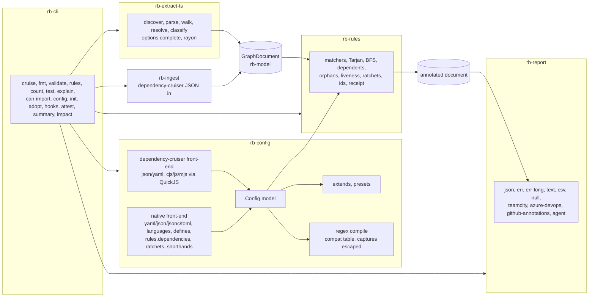
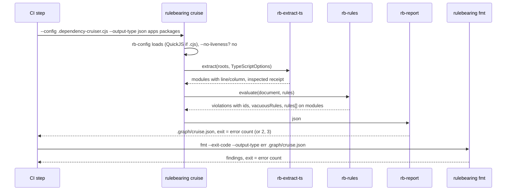

# Plan 0001: Wave 1: TypeScript parity, the native format, the first-run experience

- **Status:** Pending
- **Owner:** Ben Bahrenburg (@benbahrenburg)
- **Created:** 2026-09-20
- **Calendar estimate:** 10 weeks at ~10 h/week (from design § Waves)
- **Derives from:** [design § Waves](../../artifacts/design.md#waves) (row 1), [design § What a heavy dependency-cruiser user needs](../../artifacts/design.md#what-a-heavy-dependency-cruiser-user-needs), [design § The rule file](../../artifacts/design.md#the-rule-file), [design § The run and its consumers](../../artifacts/design.md#the-run-and-its-consumers), [design § The five stages](../../artifacts/design.md#the-five-stages), [design § Configuration](../../artifacts/design.md#configuration-a-native-format-and-dependency-cruisers-as-it-is), [design § The dependency-cruiser format](../../artifacts/design.md#the-dependency-cruiser-format), [design § The native format](../../artifacts/design.md#the-native-format), [design § Dependency rules](../../artifacts/design.md#dependency-rules-the-whole-of-dependency-cruiser-1820), [design § Shorthands](../../artifacts/design.md#shorthands), [design § Outputs and CI integration](../../artifacts/design.md#outputs-and-ci-integration), [design § Exit codes](../../artifacts/design.md#exit-codes), [design § Reporters](../../artifacts/design.md#reporters), [design § The subcommands a guard reaches for](../../artifacts/design.md#the-subcommands-a-guard-reaches-for), [design § Three pipelines](../../artifacts/design.md#three-pipelines), [design § Rules an agent can implement and follow](../../artifacts/design.md#rules-an-agent-can-implement-and-follow), [design § Where each lands](../../artifacts/design.md#where-each-lands), [design § The developer relations hat](../../artifacts/design.md#the-developer-relations-hat-the-first-ten-minutes-and-the-brownfield-repo), [design § The agentic engineering hat](../../artifacts/design.md#the-agentic-engineering-hat-turn-two), [design § The five to fund first](../../artifacts/design.md#the-five-to-fund-first), [design § Conformance gate 1](../../artifacts/design.md#conformance-gate-1-dependency-cruisers-tests-validate-rulebearing), [design § Adoption order](../../artifacts/design.md#adoption-order), [design § Open questions](../../artifacts/design.md#open-questions); every Wave 1 row of the [dependency-cruiser 18.2.0 coverage tab](../../artifacts/dependency-cruiser-18.2.0-coverage.md) (§ Rules, § Options, § Command line, § Output types, § Result document, § Dependency types and module systems, § Extraction and resolution)
- **Satisfies:** [FR-CORE-01](../../prd.md#fr-core-01), [FR-CORE-02](../../prd.md#fr-core-02), [FR-CORE-03](../../prd.md#fr-core-03), [FR-CORE-04](../../prd.md#fr-core-04), [FR-CORE-05](../../prd.md#fr-core-05), [FR-CORE-06](../../prd.md#fr-core-06), [FR-CORE-07](../../prd.md#fr-core-07), [FR-CFG-01](../../prd.md#fr-cfg-01), [FR-CFG-02](../../prd.md#fr-cfg-02), [FR-CFG-03](../../prd.md#fr-cfg-03), [FR-CFG-04](../../prd.md#fr-cfg-04), [FR-CFG-05](../../prd.md#fr-cfg-05), [FR-CFG-06](../../prd.md#fr-cfg-06) (TypeScript preset), [FR-CFG-07](../../prd.md#fr-cfg-07), [FR-RULE-01](../../prd.md#fr-rule-01), [FR-RULE-06](../../prd.md#fr-rule-06), [FR-RULE-07](../../prd.md#fr-rule-07) (shorthands), [FR-RULE-08](../../prd.md#fr-rule-08), [FR-RULE-10](../../prd.md#fr-rule-10), [FR-EXT-TS-01](../../prd.md#fr-ext-ts-01), [FR-EXT-TS-02](../../prd.md#fr-ext-ts-02), [FR-EXT-TS-03](../../prd.md#fr-ext-ts-03), [FR-OUT-01](../../prd.md#fr-out-01) (wave 1 set), [FR-OUT-02](../../prd.md#fr-out-02) (`agent`, `github-annotations`), [FR-OUT-03](../../prd.md#fr-out-03), [FR-CLI-01](../../prd.md#fr-cli-01) (wave 1 set), [FR-CLI-02](../../prd.md#fr-cli-02) (`can-import`), [FR-CLI-03](../../prd.md#fr-cli-03), [FR-CLI-08](../../prd.md#fr-cli-08) (wave 1 set), [FR-DIST-01](../../prd.md#fr-dist-01) (npm, GitHub Action, Releases), [NFR-PERF-01](../../prd.md#nfr-perf-01), [NFR-CONF-01](../../prd.md#nfr-conf-01), [NFR-CONF-03](../../prd.md#nfr-conf-03), [NFR-SEC-01](../../prd.md#nfr-sec-01), [NFR-ADOPT-01](../../prd.md#nfr-adopt-01), [NFR-ADOPT-02](../../prd.md#nfr-adopt-02)
- **Applies:** [ADR-0004](../../adr/0004-graph-document-is-cruise-result-superset.md), [ADR-0005](../../adr/0005-native-config-superset-and-compat.md), [ADR-0006](../../adr/0006-embedded-quickjs-config-evaluator.md), [ADR-0007](../../adr/0007-vacuous-rules-fail-by-default.md), [ADR-0008](../../adr/0008-exit-code-contract.md), [ADR-0009](../../adr/0009-conformance-suites-as-specification.md), [ADR-0010](../../adr/0010-crate-layout-and-extractor-boundary.md), [ADR-0012](../../adr/0012-oxc-for-typescript.md), [ADR-0015](../../adr/0015-stable-violation-id.md), [ADR-0016](../../adr/0016-linear-time-regex-and-strict-compat.md), [ADR-0017](../../adr/0017-coffeescript-livescript-sidecar.md) (exit 2 without the sidecar), [ADR-0018](../../adr/0018-test-coverage-threshold.md), [ADR-0020](../../adr/0020-single-name-across-registries.md), [ADR-0021](../../adr/0021-agent-surface-cli-first.md)
- **Architecture:** [The five stages](../../architecture.md#the-five-stages), [Crate layout](../../architecture.md#crate-layout), [The graph document](../../architecture.md#the-graph-document), [Extractors](../../architecture.md#extractors), [Configuration and the rule language](../../architecture.md#configuration-and-the-rule-language), [The rule engine](../../architecture.md#the-rule-engine), [Outputs and CI contract](../../architecture.md#outputs-and-ci-contract), [Agent surface](../../architecture.md#agent-surface), [Distribution](../../architecture.md#distribution), [Security posture](../../architecture.md#security-posture), [Performance model](../../architecture.md#performance-model), [Verification strategy](../../architecture.md#verification-strategy)
- **Depends on:** [Plan 0000 (Wave 0)](0000-wave-0-spike.md); **Enables:** [Plan 0002 (Wave 2)](0002-wave-2-dotnet-python-element-rules.md)
- **Exit criterion (from design § Waves):** "Gate 1 layers 1 to 5 green; zero-diff on dependency-cruiser's own repo, langfuse and FluidFramework at pinned commits; `adopt` opens a green pull request on a repo with a non-empty baseline; the drop-in offered upstream to at least one oracle repo"

## 1. Architect section (for the architectural review board)

### 1.1 Purpose and business value

Wave 1 makes Rulebearing a drop-in for every TypeScript and JavaScript repository that runs dependency-cruiser today, and adds the parts of the native format and the agent surface that the design says must exist on day one. The design's own measure of a drop-in is the heavy user's slice: the config file unchanged, the JSON field names unchanged, `fmt` and the `err` reporter present, and the exit code identical ([design § What a heavy dependency-cruiser user needs](../../artifacts/design.md#what-a-heavy-dependency-cruiser-user-needs), [§ The run and its consumers](../../artifacts/design.md#the-run-and-its-consumers)). The whole 18.2.0 specification is the parity target, and its proof is conformance gate 1, all five layers green ([design § Conformance gate 1](../../artifacts/design.md#conformance-gate-1-dependency-cruisers-tests-validate-rulebearing)).

The business value is the adoption order: the TypeScript oracle repositories come first because they are the largest set and dependency-cruiser's own repository is one of them ([design § Adoption order](../../artifacts/design.md#adoption-order)). A faster run over the same config is what a maintainer who did not ask for the tool can accept ([design § Test beds](../../artifacts/design.md#test-beds-open-source-repositories-to-validate-against) item 4). The agent features in this wave (`agent` reporter, `explain`, `can-import`, `test`, `config lint`, hooks, `attest`, `init`, `adopt`) are the ones the design ranks as buying the most adoption per week ([design § The five to fund first](../../artifacts/design.md#the-five-to-fund-first)), and the six adoption signals start being measured here ([design § How to know, rather than believe](../../artifacts/design.md#how-to-know-rather-than-believe)).

### 1.2 Scope

**In scope** (the design's wave 1 row, verbatim): "The full dependency-cruiser rule language and option set; both config formats with the embedded evaluator; `json`, `err`, `err-long`, `text`, `csv`, `null`, `teamcity`, `azure-devops`, `github-annotations`, `agent` (with fix-cost ordering); `fmt`, `rules --json`, `count`, `test`, `explain` and `explain --plain`, `can-import`, `config lint`; line and column, stable ids, receipts; `init`, `adopt`, `hooks install --claude-code`, `attest`; npm package and GitHub Action" ([design § Waves](../../artifacts/design.md#waves)). Plus, from the same design: `config convert` and `config expand` ([design § The native format](../../artifacts/design.md#the-native-format), [§ Shorthands](../../artifacts/design.md#shorthands)), the liveness default and the exit-code contract ([ADR-0007](../../adr/0007-vacuous-rules-fail-by-default.md), [ADR-0008](../../adr/0008-exit-code-contract.md)), `--require-comment-token` ([design § Rules an agent writes](../../artifacts/design.md#rules-an-agent-writes-held-to-the-same-bar)), the repository's own `rulebearing.yaml` enforcing the crate boundary ([ADR-0010](../../adr/0010-crate-layout-and-extractor-boundary.md)), and the performance target of 1 to 2 s on a 5,500-module monorepo ([design § Three pipelines](../../artifacts/design.md#three-pipelines)).

**Out of scope** (with the wave the coverage tab assigns)

| Item | Wave |
| --- | --- |
| `to.license` / `licenseNot`, `to.moreUnstable`, `metrics`, `collapse`, `highlight`, `experimentalStats`, `knownViolations` parity with `--ignore-known` and `baseline`, `webpackConfig`, `reporterOptions.archi/dot/ddot/flat/mermaid/metrics`, `--init`, `--metrics` | 2 |
| `err-html`, `dot` family, `mermaid`, `d2`, `baseline`, `metrics` reporters; `sarif`, `junit`, `trx` | 2 |
| Vue and Svelte splitting, Markdown code fences, licence and `deprecated` from the installed package | 2 |
| Element, slice and diagram rules; the .NET and Python extractors; `docs`, `propose`, `impact` beyond what the hook needs (§ 1.6), `place`, `test --generate`, `decisions`, importers | 2 |
| `--affected`, `--cache`, `diff`, `plugin:` reporters, `wrap-html`, `x-dot-webpage`, `html`, `markdown`, `anon`, the CoffeeScript and LiveScript sidecar, `serve`, `rb-node` | 3 |

### 1.3 Requirements traceability

Every Wave 1 row of the coverage tab is listed, grouped by tab section, so that a row cannot say Parity until the evidence column says so ([ADR-0009](../../adr/0009-conformance-suites-as-specification.md)).

**Core and configuration**

| Requirement | What this wave delivers | Verification |
| --- | --- | --- |
| [FR-CORE-02](../../prd.md#fr-core-02) | `cruise` runs the five stages; `fmt` re-reports a saved JSON without extracting | Gate 1 layer 3 runs every reporter through `fmt`; a test that `fmt` never touches the source tree |
| [FR-CORE-04](../../prd.md#fr-core-04) | `line`, `column` on every TypeScript edge; `id` on every violation; `summary.inspected` | Fixture tests; layer 4 with `--strict-schema` proves the additions strip cleanly |
| [FR-CORE-05](../../prd.md#fr-core-05) | Liveness: `vacuousRules[]`, exit 2, `allowEmpty`, `--no-liveness` | Unit tests; layer 2 runs with `--no-liveness` per [ADR-0007](../../adr/0007-vacuous-rules-fail-by-default.md) |
| [FR-CORE-06](../../prd.md#fr-core-06) | One exit-code function, codes 0 to 255, 2, 3 | Table-driven test; `depcruise-fmt --exit-code` parity in layer 3 |
| [FR-CORE-07](../../prd.md#fr-core-07) | Sorted output, no network, sandboxed evaluator | Determinism test (two runs, byte-identical); sandbox escape tests |
| [FR-CFG-01](../../prd.md#fr-cfg-01) | Detection by name; `.json`, `.yaml`, `.yml`, `.cjs`, `.js`, `.mjs`; `extends` for files, npm packages, bundled presets (coverage § Rules row `extends`) | Every oracle config loads; layer 4 validates accepted configs against `configuration.schema.json` |
| [FR-CFG-02](../../prd.md#fr-cfg-02) | `rulebearing.{yaml,json,jsonc,toml}`; `$schema` served from Pages | Schema test: every dependency-cruiser key legal at the same place |
| [FR-CFG-03](../../prd.md#fr-cfg-03) | QuickJS through `rquickjs`; CJS and ESM shim; `--config-via-node`; `--webpack-config-json` accepted (its consumer is wave 2) | Sandbox tests; the reference `require`-an-exceptions-JSON pattern from [design § The rule file](../../artifacts/design.md#the-rule-file) as a fixture |
| [FR-CFG-04](../../prd.md#fr-cfg-04) | `defines` with `fromJson`, `select`, `joinWith`, `${name}` substitution | Fixture from the design example |
| [FR-CFG-05](../../prd.md#fr-cfg-05) | `config convert` (lossless dc to native, lossy native to dc with a report), `config lint`, `config expand` | Round-trip tests; lint fixtures for each finding class in [design § The native format](../../artifacts/design.md#the-native-format) |
| [FR-CFG-06](../../prd.md#fr-cfg-06) | `languages.typescript`; flat option names as aliases; `rulebearing:typescript` and `rulebearing:recommended` presets | Alias test: flat and nested forms load to the same model |
| [FR-CFG-07](../../prd.md#fr-cfg-07) | `fix`, `examples`, `owner`, `expires` on dependency rules; `--require-comment-token` | `test` runs `examples`; `expires` in the past fails the run the day after |
| [FR-RULE-10](../../prd.md#fr-rule-10) | `regex` crate; warning for safe-regex-rejected patterns; `--strict-compat`; escaped captures; compatibility table; exit 3 on lookaround or backreference | Compatibility table is a test fixture ([ADR-0016](../../adr/0016-linear-time-regex-and-strict-compat.md)) |

**Coverage tab § Rules, Wave 1 rows** ([FR-RULE-01](../../prd.md#fr-rule-01), [FR-RULE-08](../../prd.md#fr-rule-08))

| Row | Delivered as | Verification |
| --- | --- | --- |
| `forbidden[]` regular with `name`, `comment`, `severity`, `scope`, `from`, `to` | `DependencyRule::Forbidden` | Layer 2 `test/validate` specs |
| `forbidden[]` reachability (`to.reachable`) | BFS from `from` matches | Layer 2 |
| `forbidden[]` dependents (`module.numberOfDependentsLessThan` / `MoreThan`) | dependents count from the derived `dependents[]` | Layer 2 |
| `allowed[]`, `allowedSeverity` | allowed evaluation with the configured severity | Layer 2 |
| `required[]` with `module` and `to.reachable` | required evaluation | Layer 2 |
| `scope: module` / `scope: folder` (folder-level `circular`) | folder consolidation and Tarjan at folder scope; `moreUnstable` at folder scope waits for the `metrics` option (wave 2), see § 1.6 | Layer 2 `graph-utl` consolidation specs |
| `extends` (string or array; file, npm package, bundled presets) | `rb-config::extends` | Fixture per source kind |
| `$0` to `$9` group matching | captures substituted escaped | Layer 2; escape test |
| `severity`: `error`, `warn`, `info`, `ignore` | `Severity` enum; only `error` counts | Exit-code test |
| `from.path`, `from.pathNot`, `from.orphan` | matchers | Layer 2 |
| `to.path`, `to.pathNot` | matchers | Layer 2 |
| `to.circular`, `to.via`, `to.viaOnly`, `to.viaNot`, `to.viaSomeNot` | cycle path enumeration and via filters | Layer 2 |
| `to.dependencyTypes`, `to.dependencyTypesNot` | vocabulary comparison | Layer 2 |
| `to.dynamic` | `dynamic` flag from `import()` | Layer 1 and 2 |
| `to.exoticallyRequired`, `to.exoticRequire`, `to.exoticRequireNot` (Kept) | TypeScript-only matchers, unchanged | Layer 2 |
| `to.moreThanOneDependencyType` (Kept) | count of `dependencyTypes` | Layer 2 |
| `to.preCompilationOnly` (Kept) | from `tsPreCompilationDeps: "specify"` | Layer 1 and 2 |
| `to.couldNotResolve` | resolver failure flag | Layer 2 |
| `to.ancestor` | path-ancestor test | Layer 2 |
| `to.reachable` (forbidden and required) | BFS | Layer 2 |
| `module.path`, `module.pathNot` | matchers | Layer 2 |

**Coverage tab § Options, Wave 1 rows** ([FR-EXT-TS-02](../../prd.md#fr-ext-ts-02), [FR-EXT-TS-03](../../prd.md#fr-ext-ts-03), [FR-CLI-08](../../prd.md#fr-cli-08))

| Row | Delivered as | Verification |
| --- | --- | --- |
| `babelConfig.fileName` | Babel config read for `babel-plugin-module-resolver` aliases only | Fixture with an alias |
| `baseDir` | root of every relative path | Layer 1 |
| `builtInModules` (`add`, `override`) | core list per Node version, extended or replaced | Unit test |
| `combinedDependencies` | monorepo `package.json` walk-up | Layer 1 |
| `detectJSDocImports` | comment-table scan | Layer 1 |
| `detectProcessBuiltinModuleCalls` | `process.getBuiltinModule` walker | Layer 1 |
| `doNotFollow.path`, `doNotFollow.dependencyTypes` | `followable` and `matchesDoNotFollow` | Layer 1 and 5 |
| `enhancedResolveOptions` (all keys; `cacheDuration` accepted and ignored) | `oxc_resolver` options mapping | Layer 1; oracle zero-diff (FluidFramework uses `exportsFields`) |
| `exclude.path`, `exclude.dynamic` | discovery and edge filters | Layer 1 and 5 |
| `exoticRequireStrings` (Kept) | walker names | Layer 1 |
| `externalModuleResolutionStrategy`: `node_modules` / `yarn-pnp` | `oxc_resolver` PnP | Fixture with a PnP tree |
| `extraExtensionsToScan` | discovery; scanned files carry no dependencies until wave 2's Markdown fences | Unit test |
| `focus.path`, `focus.depth` | `matchesFocus` and neighbourhood filter | Layer 5 |
| `forceDeriveDependents` | dependents derived always | Unit test |
| `includeOnly.path` | filter | Layer 5 |
| `maxDepth` | BFS bound | Layer 2 |
| `moduleSystems`: `cjs`, `es6`, `amd`, `tsd` | walker selection | Layer 1 |
| `parser`: `acorn` / `swc` / `tsc` | accepted, recorded in `optionsUsed` | Layer 3 (`optionsUsed` appears in reports) |
| `prefix`, `suffix` | reporter link prefix and suffix | Layer 3 |
| `preserveSymlinks` | resolver flag | Fixture with a symlink |
| `progress`: `none`, `cli-feedback`, `performance-log`, `ndjson` | stderr progress writer | CLI test |
| `reaches.path` | `matchesReaches`, reverse BFS | Layer 5 |
| `reporterOptions.err` / `err-long`: `showAliasedModulesUnresolved`, `showExternalModulesUnresolved` | reporter flags (`err-html` itself is wave 2) | Layer 3 |
| `reporterOptions.text.highlightFocused` | text reporter flag | Layer 3 |
| `skipAnalysisNotInRules` | engine skips derivations no rule needs | Layer 2 and timing |
| `tsConfig.fileName` (`extends`, `paths`, `baseUrl`, references) | `oxc_resolver` tsconfig support | Layer 1; oracle zero-diff |
| `tsPreCompilationDeps`: `true` / `false` / `"specify"` | both dependency sets; `pre-compilation-only` marked | Layer 1 |

**Coverage tab § Command line, Wave 1 rows** ([FR-CLI-01](../../prd.md#fr-cli-01), [FR-CLI-08](../../prd.md#fr-cli-08))

| Row | Delivered as | Verification |
| --- | --- | --- |
| positional files, directories and globs | `cruise <paths...>` | `test/cli` expectations in layer 5 |
| `--config` / `--validate`, `--no-config`; also `--config-format`, `--config -`, `--config-via-node` | `clap` flags on `cruise` | CLI tests |
| `--info` | per-extractor supported extensions and transpilers | CLI test |
| `--output-type`, `--output-to` | reporter selection and file output | Layer 3 |
| `--include-only`, `--focus`, `--focus-depth`, `--reaches`, `--exclude`, `--do-not-follow`, `--max-depth`, `--module-systems`, `--prefix` (the wave 1 part of the "1 to 2" row; `--highlight` and `--collapse` follow their options in wave 2) | flags overriding the config | CLI tests |
| `--ts-pre-compilation-deps`, `--ts-config`, `--preserve-symlinks` (wave 1 part of the "1 to 2" row; `--webpack-config` follows `webpackConfig` in wave 2) | flags | CLI tests |
| `--progress [type]`, `--no-progress` | flags | CLI test |
| `--version`, `--help` | `clap`; `--help` byte-compared for the shared flags ([architecture § Technology choices](../../architecture.md#technology-choices)) | Snapshot test |
| exit code = error count, plus 2 and 3 | § 1.5 | Table-driven test |
| `depcruise-fmt` (`-f`, `-T`, `-I`, `-F`, `-x`, `-S`, `-e`, `-p`, `--highlight`) | `rulebearing fmt`, same short flags, plus `--from dependency-cruiser` | Layer 3 |

**Coverage tab § Output types, Wave 1 rows** ([FR-OUT-01](../../prd.md#fr-out-01), [FR-OUT-02](../../prd.md#fr-out-02), [FR-OUT-03](../../prd.md#fr-out-03))

| Row | Delivered as | Verification |
| --- | --- | --- |
| `err`, `err-long` | `rb-report::err`; `err-long` prints comment and `fix` ([design § Reporters](../../artifacts/design.md#reporters)) | Layer 3 byte-compare (the `fix` line only appears when a rule has one, so dependency-cruiser fixtures are unchanged) |
| `json` with `--strict-schema` | serde of the document; strip additions | Layer 4 |
| `text`, `csv` | reporters | Layer 3 |
| `teamcity`, `azure-devops` | reporters | Layer 3 |
| `null` | reporter | Layer 3 |
| New: `github-annotations`, `agent` | § 1.5 | Fixture snapshots under `crates/rb-report/tests/fixtures` |

**Coverage tab § Result document, § Dependency types and module systems** ([FR-CORE-03](../../prd.md#fr-core-03)): every module, dependency, folder and summary field, the forty dependency types and the four module systems are produced by the wave 1 extractor and engine for TypeScript and JavaScript; the additions `line`, `column`, `language`, `inspected`, `vacuousRules` are filled; `dependencyKind` is `import` for every TypeScript edge; `code` is emitted empty (§ 1.6). Verification: layers 1, 4 and 5.

**Coverage tab § Extraction and resolution, Wave 1 rows** ([FR-EXT-TS-01](../../prd.md#fr-ext-ts-01) to 100%, [FR-EXT-TS-03](../../prd.md#fr-ext-ts-03))

| Row | Delivered as | Verification |
| --- | --- | --- |
| JavaScript and TypeScript extensions, decorators, stage-3 syntax | `oxc_parser` (from wave 0) | Layer 1 at 100% |
| Babel-transformed syntax, `.babel` files | `oxc` parses; module-resolver aliases read | Fixture |
| Resolution (the wave 1 part of "1 to 2"): node resolution, `exports` and `imports` fields, `conditionNames`, `mainFields`, `aliasFields`, tsconfig `paths` / `baseUrl` / `extends` / references, workspaces, symlinks, Yarn PnP; webpack `resolve.alias` follows `webpackConfig` in wave 2 | `oxc_resolver` | Layer 1; oracle zero-diff |
| npm classification from the nearest `package.json` (wave 1 part; licence and `deprecated` are wave 2 with `to.license`) | `npm.rs` | Layer 1 |
| Core module detection per Node version, `node:` protocol, `process.getBuiltinModule` | `core.rs`, walker | Layer 1 |
| Unsupported-transpiler failure mode: exit 2 with a named reason | `ExtractError::UnsupportedFile` for `.coffee`, `.litcoffee`, `.ls`, `.cjsx`, `.csx` without `--sidecar node` ([ADR-0017](../../adr/0017-coffeescript-livescript-sidecar.md)); `NoModulesFound` | CLI test with a `.coffee` file; CLI test over an empty directory |

**Agent surface, first run, distribution, performance**

| Requirement | What this wave delivers | Verification |
| --- | --- | --- |
| [FR-RULE-06](../../prd.md#fr-rule-06) | `rules.ratchets` and `count --from --to [--budget] [--write]`; `--write` refuses to raise | Unit tests; the reference pipeline line from [design § Three pipelines](../../artifacts/design.md#three-pipelines) as a CLI test |
| [FR-RULE-07](../../prd.md#fr-rule-07) (shorthands) | `layers`, `independence`; `config expand` | Expansion fixtures |
| [FR-CLI-01](../../prd.md#fr-cli-01) (wave 1 set) | `cruise`, `fmt`, `rules --json`, `count`, `explain`, `explain --plain`, `test` | CLI tests; `rules --json` field list from [design § The subcommands](../../artifacts/design.md#the-subcommands-a-guard-reaches-for) |
| [FR-CLI-02](../../prd.md#fr-cli-02) (`can-import`) | `can-import <from> <to>` from the saved graph, in milliseconds | Timing test under 50 ms on the 5,500-module synthetic graph |
| [FR-CLI-03](../../prd.md#fr-cli-03) | `init`, `adopt`, `hooks install --claude-code`, `attest` | `init` fixtures on the maintainer's own repos; `adopt` on a test bed with a non-empty baseline; hook files snapshot; `attest` verified against `HEAD` in CI |
| [FR-DIST-01](../../prd.md#fr-dist-01) (wave 1 part) | npm package with platform binaries under `optionalDependencies`; GitHub Releases from `cargo-dist`; GitHub Action | Install test on three platforms in CI; the Action used by this repository's own workflow |
| [NFR-PERF-01](../../prd.md#nfr-perf-01) | 1 to 2 s on 5,500 modules | § 2 Step 20 |
| [NFR-CONF-01](../../prd.md#nfr-conf-01) | Layers 1 to 5 green; `excluded.json` shrinks to the sidecar specs only | `conformance-gate-1` and `ratchets` jobs |
| [NFR-CONF-03](../../prd.md#nfr-conf-03) | Rulebearing column filled for the TypeScript oracles; timing regression check live | Nightly table |
| [NFR-SEC-01](../../prd.md#nfr-sec-01) | Sandbox tests; defensive parsing of configs and sources; sidecar explicit | Test cases that must fail |
| [NFR-ADOPT-01](../../prd.md#nfr-adopt-01), [NFR-ADOPT-02](../../prd.md#nfr-adopt-02) | Signal collection script and the first upstream offer | `docs/adoption.md` with the baseline figures; the issue link |

### 1.4 Architecture of what this wave builds



The path a gate takes, which is the sequence gate 1 layer 5 and the reference pipeline exercise ([design § Three pipelines](../../artifacts/design.md#three-pipelines)):



### 1.5 Interfaces and contracts frozen by this wave

**The config model** in `rb-config`, one model for both formats ([ADR-0005](../../adr/0005-native-config-superset-and-compat.md)):

```rust
pub struct Config {
    pub schema: Option<String>,
    pub extends: Vec<ExtendsRef>,
    pub defines: BTreeMap<String, Define>,
    pub languages: Languages,               // typescript: TypeScriptOptions (rb-model), others reserved
    pub options: Options,                   // every dependency-cruiser option key
    pub rules: Rules,                       // dependencies { forbidden, allowed, allowed_severity, required }, ratchets, shorthands
    pub known_violations: Vec<KnownViolation>,  // read path only in wave 1 (§ 1.6)
    pub compat: CompatMode,                 // DependencyCruiser | Native
}
pub struct RuleMeta { pub name: String, pub comment: Option<String>, pub severity: Severity, pub fix: Option<String>,
    pub examples: Option<Examples>, pub owner: Option<String>, pub expires: Option<NaiveDate>, pub allow_empty: bool }
pub fn load(path: &Path, opts: &LoadOptions) -> Result<Config, ConfigError>;   // ConfigError maps to exit 3
```

**The engine entry point** in `rb-rules`:

```rust
pub struct Evaluation { pub document: GraphDocument, pub violations: Vec<Violation>, pub vacuous: Vec<VacuousRule>, pub rule_stats: Vec<RuleStats> }
pub struct RuleStats { pub name: String, pub family: Family, pub from_matches: usize, pub to_matches: usize, pub violations: usize }
pub fn evaluate(doc: GraphDocument, cfg: &Config, opts: &EvalOptions) -> Evaluation;   // EvalOptions { liveness: bool, strict_compat: bool, skip_analysis_not_in_rules: bool }
```

**The exit-code function** in `rb-cli`, one for every subcommand ([ADR-0008](../../adr/0008-exit-code-contract.md)): `fn exit_code(outcome: &Outcome) -> u8` returning `min(errors, 255)`, `2` for `Untrustworthy(reason)` (zero modules, unsupported file without the sidecar, a vacuous rule under liveness), `3` for `InvalidConfig`. The ambiguity of a run with exactly two or three errors is documented in `--help` as the ADR says.

**The `agent` reporter shape** ([design § Precision an agent can act on](../../artifacts/design.md#precision-an-agent-can-act-on), [§ The agentic engineering hat](../../artifacts/design.md#the-agentic-engineering-hat-turn-two) row "Fix-cost ordering"):

```json
{
  "inspected": { "typescript": { "files": 5574, "modules": 5574 } },
  "vacuousRules": [],
  "rules": [
    { "name": "no-cross-app-imports", "severity": "error", "count": 12, "shown": 5, "fix": "...", "decision": "adr:0003",
      "violations": [
        { "id": "RB-4f2a9c1e", "from": "apps/web/src/x.ts", "to": "apps/worker/src/y.ts", "line": 3, "column": 1,
          "member": null, "dependencyKind": "import", "cost": { "edgesToMove": 1, "targetFanIn": 14, "score": 15 } } ] } ],
  "budget": { "maxFindings": 5, "truncated": true }
}
```

Rules are ordered by ascending minimum `cost.score` within the rule, then by rule name; `score` is `edgesToMove + targetFanIn`, which is the two quantities the design names, and the cost is shown so an agent can reorder. `member` is `null` for TypeScript in wave 1 because the code layer is empty (§ 1.6).

**The `github-annotations` reporter** writes one GitHub workflow command per violation: `::error file=<from>,line=<line>,col=<column>,title=<rule>::<from> -> <to>: <comment> Fix: <fix>`, with `warning` and `notice` for `warn` and `info`. The design names the reporter and its purpose ([design § Reporters](../../artifacts/design.md#reporters)); the line format is this plan's decision and is fixed by a snapshot fixture.

**The `attest` receipt** at `.graph/attest.json`: `{ "tool": "rulebearing <version>", "configHash", "inputsHash", "resultsHash", "head": "<git sha>", "createdAt" }`, all hashes SHA-256 ([design § The agentic engineering hat](../../artifacts/design.md#the-agentic-engineering-hat-turn-two) row `attest`); `attest --verify` recomputes against `HEAD` and exits 1 on mismatch.

**The hook files** written by `hooks install --claude-code` into `.claude/settings.json` (merged, never overwritten): `SessionStart` runs `rulebearing summary --format agent`; `PreToolUse` on `Edit` and `Write` runs `rulebearing impact <file>`; `Stop` runs `rulebearing cruise --output-type agent` over the repository (wave 3 narrows it to `--affected HEAD`, [design § Hooks](../../artifacts/design.md#hooks-test-runners-an-mcp-server-an-lsp)).

**The npm package**: `rulebearing` with `bin: { rulebearing: "bin/rulebearing.js" }`, a launcher that resolves the platform package from `optionalDependencies` (`@rulebearing/cli-darwin-arm64` and five siblings if the organisation was reserved in wave 0, otherwise `rulebearing-cli-<platform>`), the ruff and oxc pattern ([architecture § Distribution](../../architecture.md#distribution)).

**The GitHub Action**: `benbahrenburg/rulebearing@v1` with inputs `version`, `args`, `output-type`; it downloads the release binary for the runner, runs `rulebearing cruise ${args}`, and sets the step's exit code; with `output-type: github-annotations` the annotations appear inline.

### 1.6 Decisions applied and decisions to make

| ADR | Why it matters in this wave |
| --- | --- |
| [ADR-0004](../../adr/0004-graph-document-is-cruise-result-superset.md) | `--strict-schema` and layer 4 prove the additions are additive |
| [ADR-0005](../../adr/0005-native-config-superset-and-compat.md) | Two front-ends, one model, `convert` / `lint` / `expand` |
| [ADR-0006](../../adr/0006-embedded-quickjs-config-evaluator.md) | The sandbox is a security boundary with escape tests |
| [ADR-0007](../../adr/0007-vacuous-rules-fail-by-default.md) | Liveness on by default; layer 2 runs with `--no-liveness` |
| [ADR-0008](../../adr/0008-exit-code-contract.md) | One exit-code function; codes 2 and 3 |
| [ADR-0009](../../adr/0009-conformance-suites-as-specification.md) | Layers 1 to 5 and the mutation branch are the wave's proof |
| [ADR-0010](../../adr/0010-crate-layout-and-extractor-boundary.md) | The repository's own `rulebearing.yaml` replaces the wave 0 boundary test |
| [ADR-0012](../../adr/0012-oxc-for-typescript.md) | Option mapping to `oxc_resolver`; `parser` accepted and recorded |
| [ADR-0015](../../adr/0015-stable-violation-id.md) | Ids on every violation, receipts on every report |
| [ADR-0016](../../adr/0016-linear-time-regex-and-strict-compat.md) | Compatibility table, warnings, `--strict-compat` |
| [ADR-0017](../../adr/0017-coffeescript-livescript-sidecar.md) | Exit 2 with a named reason for the five extensions; the sidecar specs stay in `excluded.json` |
| [ADR-0020](../../adr/0020-single-name-across-registries.md) | The npm package name and the platform package naming |
| [ADR-0021](../../adr/0021-agent-surface-cli-first.md) | The wave 1 agent surface list is this ADR's item 1 |

**Decisions this wave must make**

| Decision | Decision rule |
| --- | --- |
| `impact` and `summary --format agent` are needed by the hooks in wave 1, but [design § Where each lands](../../artifacts/design.md#where-each-lands) puts `impact` in wave 2 | Everything `impact` prints (rules mentioning the file, dependents to depth N, cycle membership, ratchets) exists in the wave 1 graph, so `impact` and a `summary --format agent` limited to open violations, ratchet headroom and vacuous rules land in 1E; the wave 2 plan drops `impact` and the status table records the move |
| `adopt` needs a baseline, but `knownViolations` parity is a wave 2 row | Wave 1 ships the `knownViolations` read path keyed by the stable id, and `adopt` writes entries with `expires` and `owner` ([design § The developer relations hat](../../artifacts/design.md#the-developer-relations-hat-the-first-ten-minutes-and-the-brownfield-repo)); the `baseline` subcommand, `--ignore-known` and the shrink-only mode stay in wave 2 |
| `scope: folder` is wave 1 but `to.moreUnstable` and `metrics` are wave 2 | Folder consolidation and folder-level `circular` land in 1B; `moreUnstable` is parsed, and a rule using it reports "requires `metrics`, wave 2" as a config warning until wave 2 adds instability |
| When the TypeScript code layer is populated | No wave 1 rule reads `code`; the extractor emits it empty and wave 2 fills it with element rules, so `member` is `null` in the `agent` reporter for TypeScript until then |
| Tarjan and cycle path order | Hand-written in `rb-rules`; `petgraph` (MIT/Apache-2.0) only if its enumeration order matches dependency-cruiser's `cycle[]` order byte for byte in layer 2, since the reporters print the path |
| `serde_yaml` maintenance status | Use the crate the architecture names; if `cargo deny` raises an advisory, switch to a maintained fork with the same API and record it in the status table |
| Where `can-import` reads the graph from | `.graph/cruise.json` by default, or `--graph <file>`; the content-addressed `--cache` is wave 3, so wave 1's "cached graph" is the last saved JSON |
| The 5,500-module measurement | The private monorepo is not public. The maintainer measures it and records the number; a synthetic generator produces a public 5,500-module tree with the same shape so CI has a reproducible figure (Step 20) |

### 1.7 Quality attributes

| Attribute | Target | Measurement |
| --- | --- | --- |
| Parity | Gate 1 layers 1 to 5 green; `excluded.json` contains only sidecar specs | CI jobs |
| Performance | Full cruise of 5,500 modules in 1 to 2 s ([NFR-PERF-01](../../prd.md#nfr-perf-01)); `can-import` under 50 ms; `fmt` of a 19 MB JSON under 500 ms | `hyperfine` in `bench.yml`; Step 20 |
| Security | No network; sandbox escape tests fail; `.cjs` that reads outside the repo is refused; malformed config or source never panics | Tests; fuzz targets for both config parsers |
| Reliability | Deterministic output; `attest` verifiable; exit 2 never masked | Determinism test; CI verifies `attest` |
| Compatibility | Every dependency-cruiser config in the manifest loads without edits; `--strict-schema` output validates | Layer 4 and 5 |
| Observability | Every reporter carries `inspected`; `--progress performance-log` prints stage timings | Snapshot tests |
| Coverage | Above 70% per crate; `rb-rules` and `rb-extract-ts` expected above 85% | `coverage` job |

### 1.8 Dependencies

| Dependency | Licence | Used by |
| --- | --- | --- |
| `rquickjs` (QuickJS) | MIT | `rb-config` |
| `regex`, `regex-syntax` | MIT/Apache-2.0 | `rb-rules`, `rb-config` |
| `serde_yaml` (or maintained fork), `toml`, `jsonc-parser` | MIT/Apache-2.0, MIT | `rb-config` |
| `jsonschema` | MIT | `rb-cli` (`--validate`, layer 4) |
| `globset`, `ignore` | MIT/Unlicense | discovery, positional globs |
| `clap`, `clap_complete` | MIT/Apache-2.0 | `rb-cli` |
| `rayon`, `sha2`, `chrono` | MIT/Apache-2.0 | engine, ids, `expires` |
| `insta` (dev) | MIT | snapshot tests |
| `hyperfine` (CI) | MIT/Apache-2.0 | benchmarks |
| `cargo-dist`, `napi-rs` (not yet used) | MIT/Apache-2.0 | release |
| dependency-cruiser `18.2.0`, its `configs/*` presets vendored under `presets/dependency-cruiser/` with `LICENSE` | MIT | `extends` |
| Node 22 (harness, npm publish only) | MIT | conformance, wrappers |

### 1.9 Risks

| Risk | Likelihood | Impact | Mitigation | Trigger |
| --- | --- | --- | --- | --- |
| A layer 2 spec depends on Node-specific behaviour the shim cannot reproduce | medium | medium | The shim passes the spec's rule set and module verbatim; a spec that needs more goes to `excluded.json` with a reason and a follow-up issue, and the count must still be sidecar-only at exit | Any non-sidecar entry left at week 9 |
| An oracle config uses JavaScript beyond the sandbox | low | medium | `--config-via-node`, `--webpack-config-json`, `defines` ([architecture § Risks](../../architecture.md#risks-and-their-mitigations)) | An oracle fails to load |
| Regex semantics differ (JavaScript `\d`, Unicode classes, lookaround) | medium | medium | Compatibility table; exit 3 on unsupported syntax; every oracle config's patterns run through the table in a test | A zero-diff run differs only in matched sets |
| Reporter byte-compare fails on whitespace, colour or version strings | high | low | Layer 3 normalises the version string only; colour is off unless a TTY, as in dependency-cruiser; each remaining diff is a real bug | Layer 3 under 100% at week 7 |
| The 1 to 2 s target is missed | medium | medium | Profile stage by stage with `--progress performance-log`; `skipAnalysisNotInRules`; `rayon` in parse and resolve; the design's figure is an estimate, and the nightly table publishes the real one | Synthetic bench over 2 s at week 8 |
| The upstream offer is declined | medium | low | The offer goes to an issue first with the zero-diff attached and is withdrawn without argument ([design § Open questions](../../artifacts/design.md#open-questions)); the exit criterion is the offer, not the merge | None needed |
| `adopt` opens a red pull request on a test bed | low | high | `adopt` runs the cruise a second time with the written baseline before opening anything and refuses if the exit code is not 0 | Any red `adopt` PR |
| Agents ignore the tool | medium | high | The six signals are collected from wave 1 ([ADR-0021](../../adr/0021-agent-surface-cli-first.md)); the cut-back rule applies after two months | First two signals flat |

### 1.10 Compliance and licence review

- The bundled presets `recommended`, `recommended-strict`, `recommended-warn-only` are copied from dependency-cruiser's `configs/` (MIT) under `presets/dependency-cruiser/` with its `LICENSE`; `rulebearing:recommended` and `rulebearing:typescript` are original.
- The QuickJS sandbox has no filesystem access outside the repository, no network, no `process` ([ADR-0006](../../adr/0006-embedded-quickjs-config-evaluator.md)); the sandbox tests are part of the security review of every pull request that touches `rb-config/src/js/`.
- The npm package publishes prebuilt binaries; provenance is attached with `npm publish --provenance` from the release workflow.
- The GitHub Action runs only the binary it downloaded by version and checksum from GitHub Releases.
- `adopt` and the upstream offer touch other people's repositories only through a pull request they can decline; the nightly runner remains read-only.

### 1.11 Operational impact

| Area | Impact |
| --- | --- |
| CI minutes | Pull request: 10 to 15 minutes (gate 1 layers 1 to 4 run on every PR; layer 5 runs on `main` and nightly because it clones three repositories). Nightly adds the Rulebearing column for every TypeScript oracle |
| Release | `cargo-dist` on tag builds six binaries; the same workflow publishes the npm package and the platform packages; `Rulebearing` NuGet and PyPI stay at the placeholder until wave 2 |
| Docs | README quick start, `docs/config.md` (both formats), `docs/rules.md`, `docs/reporters.md`, `docs/cli.md`, `docs/agents.md` (hooks, `attest`, `agent` reporter), `docs/adoption.md`, `schema/` served from Pages |
| Support | Issues from the oracle repositories' maintainers after the offer; the maintainer answers within the week |

### 1.12 ARB checklist

| Question | Answer |
| --- | --- |
| What proves "the full dependency-cruiser rule language" rather than most of it? | Layer 2 runs the original 18.2.0 `test/validate` and `test/graph-utl` specs unmodified; `excluded.json` is sidecar-only at exit |
| What proves the JSON is a drop-in? | Layer 4 (`--strict-schema` validates) and layer 5 (identical `modules[]`, `dependencies[]`, `summary.violations` on three oracles) |
| Which parts of the native format ship here, and which wait? | Dependency rules, ratchets, shorthands, `defines`, `languages.typescript`, metadata fields; element, slice, diagram rules and the other `languages` blocks are wave 2 |
| Is the sandbox a security boundary? | Yes; escape attempts are tests that must fail; `--config-via-node` is the explicit way out and is recorded in the report |
| How does the wave avoid shipping a slower tool? | The 1 to 2 s target is measured in CI on a synthetic 5,500-module tree and nightly on the scale repositories; a regression over 20% fails the nightly |
| What does an agent see on turn one? | `hooks install --claude-code` writes the three hooks; the SessionStart brief and the `agent` reporter are token-budgeted |
| What is cut first if the wave slips? | § 3, "what could slip" |

## 2. Lead developer section (step-by-step implementation)

**Conventions.** Branches `w1/<sub-wave>-<slug>`; one pull request per step or smaller; every PR links the step, the requirement IDs and, for a coverage-tab row, the row text. The `ratchets` job blocks any PR that grows `excluded.json`. A PR that touches a reporter must include or update a `test/report` fixture or a snapshot. The self-check `rulebearing cruise --config rulebearing.yaml` runs in CI from Step 18 on, using the binary built in the same job.

### Step 1: Config model and the two front-ends (1A)

[FR-CFG-01](../../prd.md#fr-cfg-01), [FR-CFG-02](../../prd.md#fr-cfg-02), [FR-CFG-06](../../prd.md#fr-cfg-06); [ADR-0005](../../adr/0005-native-config-superset-and-compat.md). In `crates/rb-config/src/`: `model.rs` (§ 1.5), `dc/mod.rs` (JSON and YAML readers for the dependency-cruiser shape; every key of [coverage § Options](../../artifacts/dependency-cruiser-18.2.0-coverage.md#options) mapped; unknown keys are an error in `--strict-compat` and a warning otherwise), `native/mod.rs` (YAML, JSON, JSONC, TOML; `languages`, `defines`, `rules.*`, metadata fields; flat option names aliased into `languages.typescript`), `detect.rs` (by file name, `--config-format`, `--config -` from stdin). Schema: `schemars` over `Config`, published as `schema/config-v1.json`, with descriptions taken from the design's tables. Tests: every oracle config in the manifest loads (`tests/oracle_configs.rs`); alias test; a table test that every dependency-cruiser key is legal in a native file at the same path. Coverage above 80%. Done when every manifest config loads without edits.

### Step 2: The QuickJS evaluator (1A)

[FR-CFG-03](../../prd.md#fr-cfg-03), [NFR-SEC-01](../../prd.md#nfr-sec-01); [ADR-0006](../../adr/0006-embedded-quickjs-config-evaluator.md). `rb-config/src/js/`: `runtime.rs` (an `rquickjs` context with no `std` module, no `os`, memory and time limits), `shim.rs` (a CommonJS `module`, `exports`, `require` and an ESM loader whose resolution is limited to JSON files under the repository, other config modules under the repository, and `dependency-cruiser/configs/*` from `presets/dependency-cruiser/`), `via_node.rs` (`--config-via-node`: spawns `node --input-type=module -e` to print the evaluated object as JSON, and records `viaNode: true` in `optionsUsed`). `--webpack-config-json <file>` is parsed into the model now; its consumer arrives in wave 2. Tests: the design's `require`-an-exceptions-JSON-into-a-regex config; `require("fs")` fails; `require("../../etc/passwd")` fails; `fetch` is undefined; an infinite loop hits the time limit and yields exit 3. Fuzz target `config_js`. Coverage above 75%.

### Step 3: `extends`, presets, `defines`, captures, regex (1A)

[FR-CFG-04](../../prd.md#fr-cfg-04), [FR-RULE-10](../../prd.md#fr-rule-10); [ADR-0016](../../adr/0016-linear-time-regex-and-strict-compat.md). `extends.rs`: file paths, npm packages (resolved through `oxc_resolver` from the config's directory), `dependency-cruiser/configs/<name>`, `rulebearing:<preset>` from `presets/`; merge semantics as dependency-cruiser's (rules concatenated, options overridden per key) proven by layer 2's `extends` specs. `defines.rs`: `fromJson`, `select` (a small path expression: keys, `[*]`, `[n]`), `joinWith`; `${name}` substituted before regex compilation with each value escaped. `pattern.rs`: compile with `regex`; classify the JavaScript pattern against the compatibility table (`\d` and Unicode classes mapped, lookaround and backreferences rejected with exit 3 naming the rule); safe-regex's nested-quantifier check re-implemented to emit the warning in compatibility mode and the refusal under `--strict-compat`; `$0` to `$9` substitution with `regex::escape`. Tests: the compatibility table as a fixture; an escape test where a capture contains `.*`. Coverage above 85%.

### Step 4: `config convert`, `config expand`, `config lint`, shorthands (1A)

[FR-CFG-05](../../prd.md#fr-cfg-05), [FR-RULE-07](../../prd.md#fr-rule-07). `shorthands.rs`: `layers` expands to one `forbidden` per lower-to-higher pair, `independence` to one `$1` fence ([design § Shorthands](../../artifacts/design.md#shorthands)); `expand` prints the result in the native format. `convert.rs`: dc to native lossless (a round-trip test through both directions on every oracle config); native to dc drops element, slice, diagram and ratchet rules, `fix`, `examples`, and prints exactly what it dropped. `lint.rs`: the findings from [design § The native format](../../artifacts/design.md#the-native-format) and [§ Rules an agent writes](../../artifacts/design.md#rules-an-agent-writes-held-to-the-same-bar): a rule that can never match (needs the graph, so `lint` accepts `--graph`), a rule shadowed by an earlier one, overlapping `allowed` entries, an `allowed` list admitting everything, a severity below `error` on a rule with zero current violations, a rule with no `fix`, a `fix` that restates the rule name, a missing decision token when `--require-comment-token` is set. One fixture per finding under `rb-config/tests/lint/`. Coverage above 80%.

### Step 5: Matchers and restriction evaluation (1B)

[FR-RULE-01](../../prd.md#fr-rule-01); coverage § Rules Wave 1 rows. `rb-rules/src/match/`: `path.rs` (`path`, `pathNot`, arrays, captures), `module.rs` (`orphan`, `numberOfDependents*`, `couldNotResolve` on the module), `dependency.rs` (`dependencyTypes`, `dependencyTypesNot`, `dynamic`, `exoticallyRequired`, `exoticRequire`, `exoticRequireNot`, `moreThanOneDependencyType`, `preCompilationOnly`, `couldNotResolve`, `ancestor`, `circular`, `via`, `viaOnly`, `viaNot`, `viaSomeNot`, `reachable`). `families.rs`: `forbidden` (regular, reachability, dependents), `allowed` with `allowedSeverity`, `required`. `annotate.rs` writes `valid` and `rules[]` onto modules and dependencies as dependency-cruiser does. Tests: layer 2 is the test; unit tests for each matcher with a hand-built document. Coverage above 90%.

### Step 6: Graph analysis (1B)

[FR-RULE-08](../../prd.md#fr-rule-08). `rb-rules/src/graph/`: `tarjan.rs` (strongly connected components, cycle path enumerated from the edge, at module and folder scope), `reach.rs` (BFS with `maxDepth`; `reachable[]` and `reaches[]` on modules; `via` filters over enumerated paths), `dependents.rs` (`dependents[]`, `forceDeriveDependents`, dependents counts), `orphan.rs`, `folders.rs` (consolidation into `folders[]` with `moduleCount`, `dependencies[]`, `dependents[]`, `afferentCouplings`, `efferentCouplings`; `instability` computed here so `moreUnstable` needs only the option gate in wave 2), `filters.rs` (`includeOnly`, `exclude`, `focus` with `depth`, `reaches`, `doNotFollow`, `matches*` flags). `skipAnalysisNotInRules` skips any derivation no rule reads. Tests: layer 2 `graph-utl` specs; a cycle-order test against a `test/report` fixture that prints a cycle. Coverage above 90%.

### Step 7: Liveness, severity, ids, receipts, `expires`, ratchets (1B)

[FR-CORE-04](../../prd.md#fr-core-04), [FR-CORE-05](../../prd.md#fr-core-05), [FR-RULE-06](../../prd.md#fr-rule-06), [FR-CFG-07](../../prd.md#fr-cfg-07); [ADR-0007](../../adr/0007-vacuous-rules-fail-by-default.md), [ADR-0015](../../adr/0015-stable-violation-id.md). `liveness.rs`: `from_matches` and `to_matches` per rule; zero on the selecting side with `allow_empty == false` and liveness on lists the rule in `vacuousRules[]` and marks the outcome untrustworthy. `summary.rs`: `violations[]` with `id` from `rb_model::violation_id`, `fix`, `decision` (token parsed from `comment`: `adr:NNNN` or `plan:<slug>`), the severity counts, `totalCruised`, `totalDependenciesCruised`, `optionsUsed`, `ruleSetUsed`, `inspected`. `expires.rs`: a rule or `knownViolations` entry past its date fails the run the day after. `ratchet.rs`: count direct edges matching `from` and `to` (with captures), compare to the budget file `{ "ceiling": n }`, `--write` lowers only. `known.rs`: `knownViolations` read path matched by id, and by dependency-cruiser's `from`/`to`/`rule` shape for entries written by dependency-cruiser. Tests: table tests; the fixed-vector id test already in `rb-model`; a ratchet test that `--write` with a higher count exits non-zero. Coverage above 85%.

### Step 8: `rulebearing validate` for gate 1 layer 2 (1B)

[NFR-CONF-01](../../prd.md#nfr-conf-01); [ADR-0009](../../adr/0009-conformance-suites-as-specification.md). A hidden subcommand `validate --rules - --module - [--dependency -] --no-liveness` reading the rule set and the module (or the dependency pair) as JSON from stdin and printing dependency-cruiser's `validate` result shape. The shim from wave 0 stops returning a sentinel. Work through `excluded.json` spec by spec; each PR removes entries and the `ratchets` job confirms the count fell. Done when only the sidecar specs remain ([ADR-0017](../../adr/0017-coffeescript-livescript-sidecar.md)).

### Step 9: The repository's own `rulebearing.yaml` (1B)

[ADR-0010](../../adr/0010-crate-layout-and-extractor-boundary.md), [ADR-0001](../../adr/0001-record-architecture-decisions.md). Written as soon as the engine evaluates a native file over a graph; the graph for a Rust workspace does not exist until a Rust extractor exists, which the design does not include, so the file's rules run over `cargo metadata` converted by a small script into a graph document (`scripts/cargo-graph.sh`, one module per crate, one edge per dependency). Rules cite ADRs as the design requires of every user:

```yaml
$schema: https://benbahrenburg.github.io/rulebearing/schema/v1.json
rules:
  dependencies:
    forbidden:
      - name: extractors-never-see-config-or-rules
        comment: "Extractors take options as rb-model structs. adr:0010"
        fix: "Move the option into rb-model's per-language options struct and read it there."
        severity: error
        from: { path: "^crates/rb-extract-" }
        to:   { path: "^crates/rb-(config|rules|report|cli)" }
      - name: model-depends-on-nothing
        comment: "adr:0010"
        severity: error
        from: { path: "^crates/rb-model" }
        to:   { path: "^crates/rb-" }
      - name: engine-and-reporters-know-no-language
        comment: "adr:0010"
        severity: error
        from: { path: "^crates/rb-(rules|report)" }
        to:   { path: "^crates/rb-extract-" }
```

CI runs `rulebearing cruise --config rulebearing.yaml --output-type err` over that document and it replaces the wave 0 boundary test. Every rule carries a token; the run is itself the first user of `--require-comment-token`.

### Step 10: `rb-extract-ts` to 100% and the option set (1C)

[FR-EXT-TS-01](../../prd.md#fr-ext-ts-01), [FR-EXT-TS-02](../../prd.md#fr-ext-ts-02), [FR-EXT-TS-03](../../prd.md#fr-ext-ts-03); coverage § Options and § Extraction Wave 1 rows. Start from `layer1-open.json`. Add: `tsPreCompilationDeps` `true` / `false` / `"specify"` (two passes when `specify`: with and without type-only edges, marking `pre-compilation-only`), `moduleSystems` selection, `exclude`, `doNotFollow` (edge not followed, `followable: false`), `includeOnly`, `focus`, `reaches`, `maxDepth` at extraction time, `combinedDependencies`, `builtInModules add/override`, `detectJSDocImports`, `detectProcessBuiltinModuleCalls`, `extraExtensionsToScan`, `babelConfig` alias table, `preserveSymlinks`, `externalModuleResolutionStrategy: yarn-pnp`, `parser` recorded, `checksum` per module, `dependencyTypes` on modules, `experimentalStats` left absent until wave 2. `line` and `column` on every edge from the `oxc_span`. Set `threshold.json` to 100. Every new option gets a fixture under `rb-extract-ts/tests/options/`. Coverage above 85%. Done when layer 1 is 100% and every option row has a fixture.

### Step 11: `rb-ingest` for dependency-cruiser JSON (1D)

[FR-CLI-01](../../prd.md#fr-cli-01) (`fmt --from dependency-cruiser`). `rb-ingest/src/dependency_cruiser.rs`: a dependency-cruiser `cruise-result` deserialises straight into `GraphDocument` (wave 0 proved the round trip); ingest adds `language: javascript|typescript` by extension, leaves `line` and `column` absent, and sets `inspected` from `totalCruised`. Tests: every `test/report` input. Coverage above 80%.

### Step 12: Reporters (1D)

[FR-OUT-01](../../prd.md#fr-out-01), [FR-OUT-02](../../prd.md#fr-out-02), [FR-OUT-03](../../prd.md#fr-out-03); coverage § Output types Wave 1 rows. `rb-report/src/`: `json.rs` (`--strict-schema` strips every addition listed in [ADR-0004](../../adr/0004-graph-document-is-cruise-result-superset.md)), `err.rs` and `err_long.rs` (comment and `fix` under each finding; `showAliasedModulesUnresolved`, `showExternalModulesUnresolved`), `text.rs` (`highlightFocused`), `csv.rs`, `null.rs`, `teamcity.rs`, `azure_devops.rs`, `github_annotations.rs` (§ 1.5), `agent.rs` (§ 1.5, `--max-findings`, fix-cost ordering), `prefix.rs` (the `prefix` and `suffix` options). Gate 1 layer 3: `conformance/dependency-cruiser/scripts/run-layer-3.sh` runs `rulebearing fmt --from dependency-cruiser --output-type <reporter> <input>` for every `test/report/<reporter>` fixture in the wave 1 set and diffs against the expected output with the version string normalised. Layer 4: `run-layer-4.sh` validates every `json` produced in layers 3 and 5 with `--strict-schema` against the vendored `cruise-result.schema.json` and every accepted config against `configuration.schema.json`. Tests: layer 3; `insta` snapshots for `github-annotations` and `agent`. Coverage above 85%.

### Step 13: `rb-cli`: `cruise`, `fmt`, exit codes, flags (1D)

[FR-CORE-02](../../prd.md#fr-core-02), [FR-CORE-06](../../prd.md#fr-core-06), [FR-CORE-07](../../prd.md#fr-core-07), [FR-CLI-08](../../prd.md#fr-cli-08); [ADR-0008](../../adr/0008-exit-code-contract.md). `rb-cli/src/cmd/cruise.rs` with every wave 1 flag from § 1.3; `cmd/fmt.rs` with the `depcruise-fmt` short flags, `--exit-code`, `--from dependency-cruiser`; `exit.rs` (§ 1.5); `progress.rs` (`none`, `cli-feedback`, `performance-log` with stage timings, `ndjson`); `info.rs`; `--output-to`; positional globs through `globset`. Output ordering: modules by `source`, dependencies by `resolved`, violations by (`rule`, `from`, `to`), so two runs are byte-identical. Tests: table-driven exit codes; determinism; `--help` snapshot for the shared flags; the three reference pipeline lines from [design § Three pipelines](../../artifacts/design.md#three-pipelines) as an integration test over a fixture repo. Coverage above 75%.

### Step 14: `rules --json`, `explain`, `explain --plain`, `test`, `can-import` (1E)

[FR-CLI-01](../../prd.md#fr-cli-01), [FR-CLI-02](../../prd.md#fr-cli-02), [FR-CFG-07](../../prd.md#fr-cfg-07); [ADR-0021](../../adr/0021-agent-surface-cli-first.md). `rules --json` lists `name`, `family`, `severity`, `comment`, `fix`, `from`, `to`, `select`, `fromMatches`, `toMatches`, `violations` ([design § The subcommands](../../artifacts/design.md#the-subcommands-a-guard-reaches-for)); the match counts need a graph, so `--graph` or a fresh extraction. `explain <rule>` prints the rule, `fix`, both match sets and the first ten edges. `explain --plain` renders one deterministic English sentence per rule shape from templates in `rb-cli/src/plain/` ("Files under `apps/<x>/` may not import files under `apps/<y>/` unless x = y" for the `$1` fence, [design § The agentic engineering hat](../../artifacts/design.md#the-agentic-engineering-hat-turn-two)); one snapshot per rule shape. `test` builds a synthetic graph from each rule's `examples`, evaluates, and asserts allowed edges pass and forbidden edges fail. `can-import <from> <to>` loads the saved graph, adds the hypothetical edge, evaluates the dependency rules for that edge only, and prints yes or no with the deciding rule. Tests: CLI tests per command; a timing test for `can-import`. Coverage above 75%.

### Step 15: `hooks install --claude-code`, `summary --format agent`, `impact`, `attest`, `--require-comment-token` (1E)

[FR-CLI-03](../../prd.md#fr-cli-03), [FR-CFG-07](../../prd.md#fr-cfg-07); [ADR-0021](../../adr/0021-agent-surface-cli-first.md). `hooks.rs` merges the three hooks of § 1.5 into `.claude/settings.json` and is idempotent. `summary.rs --format agent`: `inspected`, open violation counts by rule, ratchet headroom, vacuous rules, token-budgeted like the `agent` reporter (tiers and hot boundaries wait for the wave 2 metrics). `impact.rs <file>`: rules whose `from` or `to` matches the file, dependents to `--depth N`, cycle membership, ratchets the file's edges count toward (§ 1.6 decision). `attest.rs`: writes and verifies the receipt of § 1.5; CI runs `attest --verify` after the self-check cruise. `--require-comment-token` on `cruise`, `rules`, `config lint`: a rule whose `comment` has no `adr:NNNN` or `plan:<slug>` is a config error (exit 3). Tests: hook file snapshots; `attest` round trip and a tamper test; token test. Coverage above 75%.

### Step 16: `init` (1F)

[FR-CLI-03](../../prd.md#fr-cli-03); [design § The developer relations hat](../../artifacts/design.md#the-developer-relations-hat-the-first-ten-minutes-and-the-brownfield-repo). `init.rs` reads the repository before asking anything: detects TypeScript (`package.json`, `tsconfig.json`), an `apps/` and `packages/` split, a `src/features/*` layout, and framework entry files for the default orphan exclusions ([design § One engine](../../artifacts/design.md#one-engine-three-languages-one-monorepo)); proposes `rulebearing.yaml` extending `rulebearing:recommended` with every rule commented, each with `fix`, and runs a cruise to confirm every rule passes or moves its findings into a baseline entry (Step 17) so the first run is green. Writes the config only if the cruise exits 0. The greenfield fixture procedure from [design § Test beds](../../artifacts/design.md#test-beds-open-source-repositories-to-validate-against) item 2 starts here for the TypeScript-only greenfield beds (n8n, grafana, kibana are scale beds but serve as `init` inputs; the mixed-language beds wait for wave 2): the output is committed under `testbeds/init/<repo>.yaml` so a regression in discovery is visible in review. Tests: `init` on the maintainer's own repositories and on the layer 5 oracles with their config moved aside. Coverage above 70%.

### Step 17: `adopt` (1F)

[FR-CLI-03](../../prd.md#fr-cli-03). `adopt.rs` for a brownfield repository: runs the cruise, writes `knownViolations` entries for every current finding with `expires` (default 90 days, `--expires`) and `owner` (`--owner`, default the git user), adds the CI step (a GitHub workflow using the Action from Step 19, or an Azure Pipelines step with `--output-type azure-devops`), installs the pre-commit hook ([design § Hooks](../../artifacts/design.md#hooks-test-runners-an-mcp-server-an-lsp)), writes `docs/architecture/rulebearing.md` from `explain --plain`, re-runs the cruise with the baseline and refuses to proceed unless the exit code is 0, then opens one pull request through `gh` (or prints the branch when `gh` is absent). The exit criterion's evidence is that pull request on a repository with a non-empty baseline: the maintainer's own TypeScript repository first ([design § Adoption order](../../artifacts/design.md#adoption-order) item 1). Tests: a fixture repository with three violations; the PR body snapshot. Coverage above 70%.

### Step 18: Gate 1 layer 5, the mutation branch, oracle zero-diff (1G)

[NFR-CONF-01](../../prd.md#nfr-conf-01), [NFR-CONF-03](../../prd.md#nfr-conf-03). `conformance/dependency-cruiser/scripts/run-layer-5.sh`: for `sverweij/dependency-cruiser`, `langfuse/langfuse` and `microsoft/FluidFramework` at their manifest SHAs, run the incumbent (already stored by the nightly) and `rulebearing cruise` with the repository's own config and roots, and diff `modules[]`, `dependencies[]` and `summary.violations` after sorting; any difference fails or is entered in `conformance/divergences.md` with a reason, which the design allows only as "a documented divergence" ([design § Test beds](../../artifacts/design.md#test-beds-open-source-repositories-to-validate-against) item 1). The mutation half: a branch `conformance/mutations-v18.2.0` of dependency-cruiser's own repository held as a patch file under `conformance/dependency-cruiser/mutations/`, applied at run time, with twelve deliberate violations, one per rule shape (regular forbidden, `pathNot`, `$1` fence, `circular`, `orphan`, `dependencyTypesNot`, `reachable` forbidden, `required`, dependents, `allowed`, `via`, `couldNotResolve`), that both tools must report. The nightly's Rulebearing column is filled for every TypeScript oracle, and the 20% timing regression check goes live. Done when layer 5 is green on `main` and the nightly table shows zero-diff for the three named oracles.

### Step 19: npm package, GitHub Action, release (1G)

[FR-DIST-01](../../prd.md#fr-dist-01); [ADR-0020](../../adr/0020-single-name-across-registries.md). `wrappers/npm/`: the launcher, the platform packages, `postinstall`-free (the launcher resolves at run time), vitest tests at the 70% threshold ([ADR-0018](../../adr/0018-test-coverage-threshold.md)). `release.yml`: `cargo-dist` builds the six targets on tag, uploads to GitHub Releases with checksums, publishes the npm packages with provenance at the same version. `action.yml` at the repository root (§ 1.5). This repository's own CI switches to the Action for the self-check once `v0.1.0` exists. Tests: an install matrix (macOS arm64, Linux x64, Windows x64) running `npx rulebearing --version`. Done when `v0.1.0` is on GitHub Releases and npm and the Action runs in this repository.

### Step 20: Performance measurement for NFR-PERF-01 (1G, started in 1C)

[NFR-PERF-01](../../prd.md#nfr-perf-01); [architecture § Performance model](../../architecture.md#performance-model). Two measurements, both with `hyperfine --warmup 2 --runs 10`:

1. **The private monorepo** (5,574 modules, 13 s with dependency-cruiser): the maintainer runs `rulebearing cruise --config .dependency-cruiser.cjs --output-type json apps packages` (without `--metrics`, which is wave 2) and records mean and p95 in `docs/perf.md` with the date, machine and commit. This is the design's number and it cannot run in CI.
2. **A public synthetic tree**: `testbeds/synth/gen.mjs` writes 5,500 TypeScript modules across 4 apps and 40 packages with tsconfig paths, workspace imports, type-only imports and two cycles, checked in as a generator, not as files; `bench.yml` generates it and runs the same command. The target is a mean of 2 s or better on the standard Linux runner; the figure is committed to `docs/perf.md` by the workflow and the nightly table carries it.

`--progress performance-log` gives the stage split (discover, parse, resolve, evaluate, report) so a miss is attributed to a stage. If the synthetic mean is above 2 s at the end of 1C, the remaining budget in 1G goes to the slowest stage before the upstream offer is made, because a slower drop-in is not an offer.

### Step 21: The upstream offer and the adoption baseline (1G)

[NFR-ADOPT-01](../../prd.md#nfr-adopt-01), [NFR-ADOPT-02](../../prd.md#nfr-adopt-02). Following [design § Open questions](../../artifacts/design.md#open-questions) (upstream etiquette): open an issue on one TypeScript oracle whose contributing guide welcomes tooling changes, attaching the zero-diff result and the timing, offering Rulebearing as a drop-in beside dependency-cruiser, never replacing it; dependency-cruiser's maintainer is the first person to show it to ([design § Adoption order](../../artifacts/design.md#adoption-order)). A pull request follows only on a yes; the offer is withdrawn without argument on a no. `scripts/adoption-signals.sh` computes the six signals of [design § How to know](../../artifacts/design.md#how-to-know-rather-than-believe) from the maintainer's repositories (first-run gate pass rate of agent-authored PRs, turns to green, rules caught by `test` or liveness, hook p95, share of rules with `fix`, merged budget raises) and writes `docs/adoption.md`; the wave records the pre-switch baseline.

### Step 22: Documentation, and moving this plan

Update `README.md` (quick start for the three pipeline shapes, the nightly table), `CLAUDE.md` (self-check, new coverage exclusions), `docs/config.md`, `docs/rules.md`, `docs/reporters.md`, `docs/cli.md`, `docs/agents.md`, `docs/perf.md`, `docs/adoption.md`, `conformance/README.md` (layers 2 to 5), `schema/` on Pages, and every touched crate's module doc.

**How to run gate 1 locally**

```sh
cargo test -p rb-extract-ts --test extract_fixtures                      # layer 1
(cd conformance/dependency-cruiser/harness && node run-layer-2.mjs)      # layer 2
conformance/dependency-cruiser/scripts/run-layer-3.sh                    # layer 3
conformance/dependency-cruiser/scripts/run-layer-4.sh                    # layer 4
conformance/dependency-cruiser/scripts/run-layer-5.sh --repo sverweij/dependency-cruiser   # layer 5, clones at the manifest sha
```

**How to regenerate fixtures:** bump `PIN`, run `vendor.sh`, re-run all layers; the PR shows every ratio. Reporter snapshots: `cargo insta review`.

**Checklist for moving this plan to `docs/plans/implemented/`**

- [ ] Layers 1 to 5 green on `main`; `excluded.json` sidecar-only; artefacts linked
- [ ] Zero-diff rows for dependency-cruiser, langfuse, FluidFramework in the nightly table
- [ ] `adopt` pull request link with a non-empty baseline
- [ ] Upstream offer issue link
- [ ] `docs/perf.md` with both measurements; synthetic mean at or under 2 s, or the miss recorded with the stage split and a wave 2 issue
- [ ] `v0.1.0` on GitHub Releases and npm; the Action in use here
- [ ] `rulebearing.yaml` self-check green with `attest --verify`
- [ ] Coverage at or above 70% per crate and for `wrappers/npm`
- [ ] `docs/adoption.md` baseline recorded
- [ ] Status line changed and the file moved in one pull request

## 3. Wave-based delivery plan

**Sizing scale** (from [docs/plans/README.md](../README.md)): XS up to 1 day, S up to 3 days, M up to 1 week, L up to 2 weeks, XL more than 2 weeks, at part-time ~10 h/week (one week is about 10 hours).

**Tracking conventions.** Milestone `Wave 1`; labels `wave-1`, `sub-wave:1A` to `1G`, `gate-1`, `coverage-row` (one issue per coverage-tab row, titled with the row text, closed by the PR whose evidence proves it); project columns Not started, In progress, Blocked, Done. The CI metric that proves Done is named per sub-wave.

**Calendar.** Weeks 1 to 10, sequential with two overlaps: 1C starts in week 3 while 1B finishes, and the performance measurement of Step 20 starts in 1C and closes in 1G.

### Wave 1A: `rb-config`

**Goal:** every dependency-cruiser config in the manifest loads unchanged, and the native format's wave 1 subset loads into the same model.

**Deliverables:** Steps 1 to 4: model, both front-ends, QuickJS evaluator with sandbox tests, `--config-via-node`, `extends`, presets, `defines`, captures, regex compatibility table, `--strict-compat`, `config convert` / `expand` / `lint`, `schema/config-v1.json`.

| Sub-wave | Item | Status | Evidence |
| --- | --- | --- | --- |
| 1A | Model, dependency-cruiser front-end, native front-end, detection | Done | `crates/rb-config/src/{model,load,read,native,normalize}.rs`; YAML, JSON/JSON5, JSONC, TOML, JavaScript; `tests/keys_at_the_same_place.rs` (every option key of the 18.2.0 schema; both formats load to the same model); `schema/config-v1.json` generated and checked by `schema::tests::schema_is_current`. `serde_yaml` 0.9 kept: `cargo deny check advisories` raises nothing |
| 1A | QuickJS runtime, shim, sandbox tests, `--config-via-node` | Done | `crates/rb-config/src/js/`: escape tests (`fs`, `node:fs`, `child_process`, `../../etc/passwd`, a symlink out of the repository, `process`, timers, `fetch`, an infinite loop hits the time limit, a memory bomb hits the heap limit); `via_node.rs`; fuzz targets `config_js` and `config_data` (60 s each locally, no crash; nightly in `fuzz.yml`); [ADR-0027](../../adr/0027-pure-path-and-url-modules-in-the-config-sandbox.md) adds pure `path` and `url` |
| 1A | `extends`, bundled and native presets | Done | `extends.rs`: files, npm packages, `dependency-cruiser/configs/*` (vendored under `presets/dependency-cruiser/` with its `LICENSE`), `rulebearing:recommended` and `rulebearing:typescript`; merge ported from `merge-configs.mjs`, circular chains refused |
| 1A | `defines`, captures, regex table, `--strict-compat` | Done | `defines.rs`; `pattern.rs` (compatibility table as tests, safe-regex heuristics, escaped `$0` to `$9`); backreferences by instantiation, [ADR-0028](../../adr/0028-backreferences-by-instantiation-on-the-linear-engine.md) (langfuse needs one) |
| 1A | `config convert`, `expand`, `lint`; shorthands | Done | `convert.rs` (dc to native to dc is identity), `shorthands.rs`, `lint.rs` with one fixture per finding under `crates/rb-config/tests/lint/` |
| 1A | Every manifest config loads | Done | `tests/oracle_configs.rs` over `scripts/fetch-oracle-configs.sh`: 10 of 10 rows; 9 load in the sandbox, `invertase/react-native-firebase` (reads and writes `fs`) is refused naming `--config-via-node`. `rb-config` line coverage 95.85% |

**Size:** L. **LOE:** 16 h, 1.6 weeks. **Roles:** maintainer.
**Entry:** Plan 0000 implemented. **Exit:** `oracle_configs` test green over every manifest config; sandbox tests green; coverage above 70%. **Gating metric for 1B:** the config model is frozen (a `#[non_exhaustive]` review) and `rules --json` can be built on it.

### Wave 1B: `rb-rules`

**Goal:** the whole dependency-cruiser rule language evaluates over the graph document; layer 2 is sidecar-only; the repository enforces its own boundary.

**Deliverables:** Steps 5 to 9: matchers, families, Tarjan, BFS, dependents, orphans, folders, filters, liveness, ids, receipts, `expires`, ratchets, `knownViolations` read path, `validate`, `rulebearing.yaml`.

| Sub-wave | Item | Status | Evidence |
| --- | --- | --- | --- |
| 1B | Matchers and families | Not started | |
| 1B | Graph analysis and filters | Not started | |
| 1B | Liveness, ids, receipts, `expires`, ratchets, known violations | Not started | |
| 1B | `validate` subcommand; `excluded.json` sidecar-only | Not started | count: |
| 1B | `rulebearing.yaml` self-check in CI | Not started | |

**Size:** L. **LOE:** 18 h, 1.8 weeks. **Roles:** maintainer.
**Entry:** 1A exit. **Exit:** layer 2 green with only sidecar exclusions; self-check green. **Gating metric for 1D:** `excluded.json` count equals the sidecar spec count.

### Wave 1C: `rb-extract-ts` completion

**Goal:** layer 1 at 100% and every Wave 1 option row honoured.

**Deliverables:** Step 10; the first synthetic benchmark run of Step 20.

| Sub-wave | Item | Status | Evidence |
| --- | --- | --- | --- |
| 1C | `layer1-open.json` cleared; threshold 100 | Done | ratio: 296/296 = 1.0; `threshold.json` layer1 = 1.0, `layer1-open.json` empty; `conformance-gate-1` on [#15](https://github.com/benbahrenburg/rulebearing/pull/15) |
| 1C | Option fixtures for every § Options Wave 1 row | Done | one mini-repo per row under `crates/rb-extract-ts/tests/options/`, asserted by `tests/options.rs` |
| 1C | `tsPreCompilationDeps: specify`, npm classification, core modules, exit 2 reasons | Done | fixtures `ts-pre-compilation-deps`, `combined-dependencies`, `built-in-modules`, `process-builtin`, `sidecar` (`UnsupportedFile`, exit 2) |
| 1C | Synthetic bench first run | Done | mean: about 350 ms to extract 5,500 modules and 21,550 edges (release, Apple M2 Pro, [testbeds/synth](../../../testbeds/synth/README.md)); stage split: with `cruise` in 1G |

**Size:** L. **LOE:** 12 h, 1.2 weeks. **Roles:** maintainer.
**Entry:** Plan 0000's `layer1-open.json`; `rb-model` options. **Exit:** layer 1 at 100%; option fixtures green. **Gating metric for 1G:** the synthetic mean, recorded.

### Wave 1D: Reporters, `fmt`, exit codes

**Goal:** the wave 1 reporter set byte-compares against `test/report`; `cruise` and `fmt` carry the wave 1 flag set; the exit-code contract holds.

**Deliverables:** Steps 11 to 13; layers 3 and 4 live.

| Sub-wave | Item | Status | Evidence |
| --- | --- | --- | --- |
| 1D | `rb-ingest` dependency-cruiser JSON | Not started | |
| 1D | `json`, `err`, `err-long`, `text`, `csv`, `null`, `teamcity`, `azure-devops` byte-compared | Not started | layer 3: |
| 1D | `github-annotations`, `agent` with fix-cost ordering and `--max-findings` | Not started | |
| 1D | `--strict-schema`; layer 4 green | Not started | |
| 1D | `cruise` and `fmt` flags, exit codes, progress, determinism | Not started | |

**Size:** L. **LOE:** 16 h, 1.6 weeks. **Roles:** maintainer.
**Entry:** 1B exit. **Exit:** layers 3 and 4 green; exit-code table test green. **Gating metric for 1E:** layer 3 at 100% for the wave 1 reporters.

### Wave 1E: Agent surface

**Goal:** the wave 1 items of [ADR-0021](../../adr/0021-agent-surface-cli-first.md) exist and read the same config and graph as the gate.

**Deliverables:** Steps 14 and 15: `rules --json`, `explain`, `explain --plain`, `test`, `can-import`, `hooks install --claude-code`, `summary --format agent`, `impact`, `attest`, `--require-comment-token`.

| Sub-wave | Item | Status | Evidence |
| --- | --- | --- | --- |
| 1E | `rules --json`, `explain`, `explain --plain` snapshots | Not started | |
| 1E | `test` over `examples` | Not started | |
| 1E | `can-import` under 50 ms | Not started | timing: |
| 1E | Hooks, `summary --format agent`, `impact` | Not started | |
| 1E | `attest` and CI verification; `--require-comment-token` | Not started | |

**Size:** L. **LOE:** 16 h, 1.6 weeks. **Roles:** maintainer.
**Entry:** 1D exit. **Exit:** all commands with CLI tests; `attest --verify` in CI. **Gating metric for 1F:** the hooks run end to end in the maintainer's own repository.

### Wave 1F: First run

**Goal:** a green first run on a fresh repository and on a brownfield one, in one command each.

**Deliverables:** Steps 16 and 17; `testbeds/init/*.yaml` fixtures for the TypeScript beds.

| Sub-wave | Item | Status | Evidence |
| --- | --- | --- | --- |
| 1F | `init` repo-aware, passing config; fixtures committed | Not started | |
| 1F | `adopt`: baseline, CI step, hook, doc, green PR | Not started | PR: |

**Size:** M. **LOE:** 10 h, 1.0 week. **Roles:** maintainer.
**Entry:** 1E exit. **Exit:** `adopt` PR open and green on a repository with a non-empty baseline. **Gating metric for 1G:** that PR link.

### Wave 1G: Distribution, zero-diff, upstream offer

**Goal:** the exit criterion's remaining clauses: layer 5 and the three zero-diffs, the npm package and Action, the performance figure, the offer.

**Deliverables:** Steps 18 to 22.

| Sub-wave | Item | Status | Evidence |
| --- | --- | --- | --- |
| 1G | Layer 5 and the twelve-mutation branch green | Not started | |
| 1G | Zero-diff: dependency-cruiser, langfuse, FluidFramework | Not started | nightly rows: |
| 1G | `v0.1.0`: Releases, npm, Action in use here | Not started | |
| 1G | `docs/perf.md`: private monorepo and synthetic figures | Not started | mean: , p95: |
| 1G | Upstream offer issue; `docs/adoption.md` baseline | Not started | issue: |
| 1G | Docs; move PR | Not started | |

**Size:** L. **LOE:** 12 h, 1.2 weeks. **Roles:** maintainer.
**Entry:** 1C, 1D, 1F exit. **Exit:** the checklist at the end of § 2. **Gating metric for Plan 0002:** this plan in `implemented/`.

### Wave summary

| Sub-wave | Size | LOE hours | Calendar weeks | Gating metric |
| --- | --- | --- | --- | --- |
| 1A `rb-config` | L | 16 | 1.6 | every manifest config loads; sandbox tests green |
| 1B `rb-rules` | L | 18 | 1.8 | layer 2 sidecar-only; self-check green |
| 1C `rb-extract-ts` completion | L | 12 | 1.2 | layer 1 at 100% |
| 1D reporters, `fmt`, exit codes | L | 16 | 1.6 | layers 3 and 4 green |
| 1E agent surface | L | 16 | 1.6 | commands tested; `attest --verify` in CI |
| 1F first run | M | 10 | 1.0 | green `adopt` PR with a non-empty baseline |
| 1G distribution, zero-diff, offer | L | 12 | 1.2 | layer 5 green; three zero-diffs; `v0.1.0`; offer issue |
| **Total** | | **100** | **10.0** | matches the 10-week calendar estimate at ~10 h/week |

**What could slip and what we cut first.** The exit criterion is gate 1 plus the three zero-diffs plus `adopt` plus the offer, so nothing on that path is cut. Cut, in order: `summary --format agent`'s content beyond counts (keep the hook wired); `impact` depth beyond 1 (keep the command); the `init` fixtures for the scale beds (keep the maintainer's repositories); the `teamcity` and `azure-devops` reporters' byte-compare can slip to the first week of wave 2 if `err`, `err-long`, `json`, `text`, `csv` and `null` are exact, because no oracle's gate reads them; `config lint`'s graph-dependent findings (keep the static ones). If the synthetic mean is above 2 s at the end of the wave, the wave still closes if every other clause holds, the miss is recorded in `docs/perf.md` with the stage split and a wave 2 issue, and the upstream offer states the measured figure honestly. If layer 5 differs on FluidFramework's `exportsFields` handling and the cause is in `oxc_resolver`, the divergence is filed upstream, pinned, and entered in `conformance/divergences.md`, which the design permits as a documented divergence with a reason.

**Exit criterion checklist for moving this plan to `docs/plans/implemented/`** (the design's criterion, verbatim: "Gate 1 layers 1 to 5 green; zero-diff on dependency-cruiser's own repo, langfuse and FluidFramework at pinned commits; `adopt` opens a green pull request on a repo with a non-empty baseline; the drop-in offered upstream to at least one oracle repo")

- [ ] Gate 1 layers 1 to 5 green (1B, 1C, 1D, 1G rows, artefacts linked)
- [ ] Zero-diff on dependency-cruiser's own repo, langfuse and FluidFramework at pinned commits (1G nightly rows)
- [ ] `adopt` opens a green pull request on a repo with a non-empty baseline (1F row, PR link)
- [ ] The drop-in offered upstream to at least one oracle repo (1G row, issue link)
- [ ] Every item in § 2 Step 22's checklist ticked
