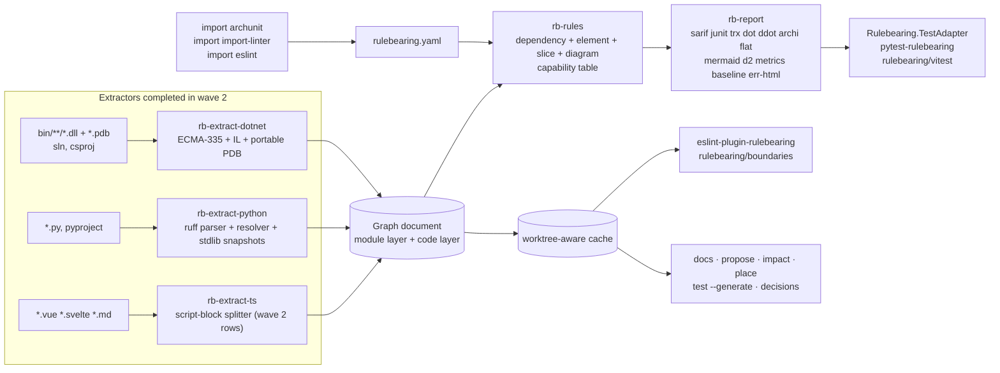
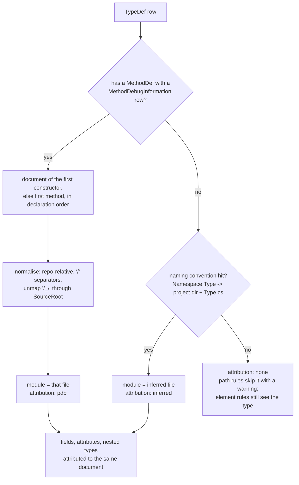
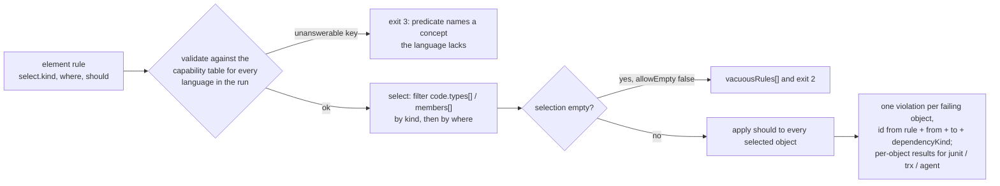

# Plan 0002: Wave 2: .NET, Python, element rules, migration

- **Status:** In progress: 2A and 2B done except the nightly links; 2C in progress
- **Owner:** Ben Bahrenburg (@benbahrenburg)
- **Created:** 2026-09-20
- **Calendar estimate:** 10 weeks at ~10 h/week (from [design § Waves](../../artifacts/design.md#waves), row 2)
- **Derives from:** [design § Prior art](../../artifacts/design.md#prior-art), [§ Architecture](../../artifacts/design.md#architecture), [§ Crate layout](../../artifacts/design.md#crate-layout), [§ What each extractor has to get right](../../artifacts/design.md#what-each-extractor-has-to-get-right), [§ The rule language](../../artifacts/design.md#the-rule-language) (element, slice, diagram rules), [§ One engine, three languages, one monorepo](../../artifacts/design.md#one-engine-three-languages-one-monorepo), [§ import-linter contracts](../../artifacts/design.md#import-linter-contracts-for-the-python-teams-who-know-them), [§ Outputs and CI integration](../../artifacts/design.md#outputs-and-ci-integration), [§ Rules an agent can implement and follow](../../artifacts/design.md#rules-an-agent-can-implement-and-follow), [§ Two front-ends](../../artifacts/design.md#two-front-ends-that-will-matter-more-than-the-mcp-server), [§ Features a three-person team would add](../../artifacts/design.md#features-a-three-person-team-would-add), [§ Conformance gate 2](../../artifacts/design.md#conformance-gate-2-archunitnets-test-assemblies-validate-the-element-rules), [§ Waves](../../artifacts/design.md#waves), [§ Adoption order](../../artifacts/design.md#adoption-order), [§ Open questions](../../artifacts/design.md#open-questions); the whole of the [ArchUnitNET 0.13.4 coverage tab](../../artifacts/archunitnet-0.13.4-coverage.md); every row marked wave 2 in the [dependency-cruiser 18.2.0 coverage tab](../../artifacts/dependency-cruiser-18.2.0-coverage.md)
- **Satisfies:** [FR-CORE-01](../../prd.md#fr-core-01), [FR-CFG-06](../../prd.md#fr-cfg-06), [FR-RULE-02](../../prd.md#fr-rule-02), [FR-RULE-03](../../prd.md#fr-rule-03), [FR-RULE-04](../../prd.md#fr-rule-04), [FR-RULE-05](../../prd.md#fr-rule-05) (the `adhereTo` half), [FR-RULE-07](../../prd.md#fr-rule-07) (the import-linter half), [FR-RULE-09](../../prd.md#fr-rule-09), [FR-EXT-TS-04](../../prd.md#fr-ext-ts-04), [FR-EXT-DN-01](../../prd.md#fr-ext-dn-01), [FR-EXT-DN-02](../../prd.md#fr-ext-dn-02), [FR-EXT-DN-03](../../prd.md#fr-ext-dn-03), [FR-EXT-PY-01](../../prd.md#fr-ext-py-01), [FR-EXT-PY-02](../../prd.md#fr-ext-py-02), [FR-OUT-01](../../prd.md#fr-out-01) (the wave 2 output types), [FR-OUT-02](../../prd.md#fr-out-02) (`sarif`, `junit`, `trx`), [FR-CLI-01](../../prd.md#fr-cli-01) (`baseline`, `test --generate`), [FR-CLI-02](../../prd.md#fr-cli-02) (`place`, `impact`, `propose`, `docs`, `decisions`), [FR-CLI-04](../../prd.md#fr-cli-04), [FR-CLI-05](../../prd.md#fr-cli-05) (the worktree-aware cache), [FR-CLI-08](../../prd.md#fr-cli-08) (`--init` presets, `--metrics`, `--ignore-known`), [FR-DIST-01](../../prd.md#fr-dist-01) (`dotnet tool` and pip wrappers), [FR-DIST-03](../../prd.md#fr-dist-03), [FR-DIST-04](../../prd.md#fr-dist-04) (the ESLint plugin), [NFR-CONF-02](../../prd.md#nfr-conf-02), [NFR-CONF-03](../../prd.md#nfr-conf-03), [NFR-QUAL-01](../../prd.md#nfr-qual-01), [NFR-SEC-01](../../prd.md#nfr-sec-01), [NFR-DOC-01](../../prd.md#nfr-doc-01), [NFR-ADOPT-02](../../prd.md#nfr-adopt-02)
- **Applies:** [ADR-0003](../../adr/0003-dotnet-extractor-fallback.md), [ADR-0004](../../adr/0004-graph-document-is-cruise-result-superset.md), [ADR-0005](../../adr/0005-native-config-superset-and-compat.md), [ADR-0007](../../adr/0007-vacuous-rules-fail-by-default.md), [ADR-0008](../../adr/0008-exit-code-contract.md), [ADR-0009](../../adr/0009-conformance-suites-as-specification.md), [ADR-0010](../../adr/0010-crate-layout-and-extractor-boundary.md), [ADR-0011](../../adr/0011-read-dotnet-assemblies-not-source.md), [ADR-0012](../../adr/0012-oxc-for-typescript.md) (Vue and Svelte splitting), [ADR-0013](../../adr/0013-ruff-parser-for-python.md), [ADR-0014](../../adr/0014-no-invented-cross-language-edges.md), [ADR-0015](../../adr/0015-stable-violation-id.md), [ADR-0018](../../adr/0018-test-coverage-threshold.md), [ADR-0019](../../adr/0019-mit-licence.md), [ADR-0020](../../adr/0020-single-name-across-registries.md), [ADR-0021](../../adr/0021-agent-surface-cli-first.md)
- **Architecture:** [§ Extractors](../../architecture.md#extractors), [§ The graph document](../../architecture.md#the-graph-document), [§ Configuration and the rule language](../../architecture.md#configuration-and-the-rule-language), [§ The rule engine](../../architecture.md#the-rule-engine), [§ Outputs and CI contract](../../architecture.md#outputs-and-ci-contract), [§ Agent surface](../../architecture.md#agent-surface), [§ Distribution](../../architecture.md#distribution), [§ Verification strategy](../../architecture.md#verification-strategy), [§ Risks and their mitigations](../../architecture.md#risks-and-their-mitigations)
- **Depends on:** [Plan 0001 (Wave 1)](0001-wave-1-typescript-parity.md), and through it [Plan 0000 (Wave 0)](0000-wave-0-spike.md), whose spike B result decides which branch of [ADR-0003](../../adr/0003-dotnet-extractor-fallback.md) this plan takes. **Enables:** [Plan 0003 (Wave 3)](0003-wave-3-operations-surface-inner-loop.md) and [Plan 0004 (Wave 4)](0004-wave-4-reach.md)
- **Exit criterion (from design § Waves):** "Gate 2 unported count at zero except custom predicates; every .NET oracle's imported tests agree with `dotnet test`; every Python oracle's contracts reproduce; `init` produces a passing config on semantic-kernel and autogen"

## 1. Architect section (for the architectural review board)

### 1.1 Purpose and business value

Wave 1 leaves Rulebearing as a faster drop-in for dependency-cruiser with a native rule format, an agent reporter and a first-run experience, all for TypeScript. Wave 2 is where the product's claim becomes true: one rule set over three languages. It completes the two remaining extractors, adds the three ArchUnitNET rule families (element, slice, diagram) with the whole 0.13.4 vocabulary, and adds the migration commands that turn the 88 .NET and 109 Python repositories the design's search found into possible adopters without a rewrite ([design § Why](../../artifacts/design.md#why), [§ The five to fund first](../../artifacts/design.md#the-five-to-fund-first), item 4).

The value is stated by the design in three places and this wave delivers each:

- **ArchUnitNET gains** a declarative rule file, a graph other scripts read, and cycle and reachability rules over files; **dependency-cruiser gains** type and member selectors, slices and diagram adherence ([design § Why](../../artifacts/design.md#why), "Superset, precisely").
- **A mixed-language repository** (semantic-kernel, autogen, dify, OpenMetadata in the test beds) runs one `rulebearing cruise`, gets one graph, one rule pass, one exit code and one JSON ([design § One engine, three languages](../../artifacts/design.md#one-engine-three-languages-one-monorepo)).
- **Migration is a command**, not a rewrite: `import archunit`, `import import-linter`, `import eslint` ([design § The developer relations hat](../../artifacts/design.md#the-developer-relations-hat-the-first-ten-minutes-and-the-brownfield-repo)).

The wave also carries the second half of the agent surface listed for it in [ADR-0021](../../adr/0021-agent-surface-cli-first.md) decision 2 (`docs`, `propose`, `impact`, `place`, `test --generate`, `decisions`, the test adapters, `sarif` and `junit`, `eslint-plugin-rulebearing`) and the second and third steps of the adoption order ([design § Adoption order](../../artifacts/design.md#adoption-order)).

### 1.2 Scope

**In scope**, verbatim from [design § Waves](../../artifacts/design.md#waves) row 2 and expanded by the sections it points to:

| Area | Delivered in wave 2 | Source |
| --- | --- | --- |
| `rb-extract-dotnet`, complete | MSBuild discovery; metadata, IL and portable PDB reading; type-to-file attribution (`pdb`, `inferred`, `none`); the `dependencyKind` vocabulary; the .NET `dependencyTypes`; default excludes and orphan exclusions; the whole .NET code layer; solution-driven loading and the ArchUnitNET loader equivalents | [design § What each extractor has to get right](../../artifacts/design.md#what-each-extractor-has-to-get-right), [§ One engine](../../artifacts/design.md#one-engine-three-languages-one-monorepo), [ArchUnitNET coverage § Loader and caches](../../artifacts/archunitnet-0.13.4-coverage.md#loader-and-caches), [ADR-0011](../../adr/0011-read-dotnet-assemblies-not-source.md) |
| `rb-extract-python` | `ruff_python_parser`; resolution against roots, relative, versioned stdlib snapshots, installed distributions, `unresolved`; `TYPE_CHECKING` as `type-only`; literal `importlib.import_module` and `__import__` as `dynamic`; the Python code layer; default excludes and orphan exclusions | [ADR-0013](../../adr/0013-ruff-parser-for-python.md) |
| Element, slice and diagram rules in `rb-rules` | Every selector, predicate, condition, combinator, slice item and PlantUML `adhereTo` item in the ArchUnitNET coverage tab; the per-language capability table; an unanswerable predicate is a validation error | [design § Element rules](../../artifacts/design.md#element-rules-archunitnet-declarative), [§ Slice rules](../../artifacts/design.md#slice-rules), [§ Diagram rules](../../artifacts/design.md#diagram-rules), [ADR-0014](../../adr/0014-no-invented-cross-language-edges.md) |
| Cross-language rule additions | `language`, `namespace` / `namespaceNot`, `project` / `projectNot`, `assembly` / `assemblyNot`, `dependencyKind` / `dependencyKindNot` on `from` and `to`; per-language `dependencyTypes` vocabularies; `to.license` for .NET and Python; `to.moreUnstable` | [design § Dependency rules](../../artifacts/design.md#dependency-rules-the-whole-of-dependency-cruiser-1820), [dc coverage § Rules](../../artifacts/dependency-cruiser-18.2.0-coverage.md#rules) |
| Reporters | `sarif`, `junit`, `trx`, `dot`, `ddot`, `archi` / `cdot`, `flat` / `fdot`, `mermaid`, `d2`, `metrics`, `baseline`, `err-html`, with their `reporterOptions` | [design § Reporters](../../artifacts/design.md#reporters), [dc coverage § Output types](../../artifacts/dependency-cruiser-18.2.0-coverage.md#output-types), [§ Options](../../artifacts/dependency-cruiser-18.2.0-coverage.md#options) |
| Baseline | `knownViolations` keyed by stable id with `expires`, `owner`, `reason`; `baseline --baseline-mode full / shrink-only / format`; `--ignore-known`, `--no-ignore-known` | [dc coverage § Options](../../artifacts/dependency-cruiser-18.2.0-coverage.md#options), [§ Command line](../../artifacts/dependency-cruiser-18.2.0-coverage.md#command-line), [design § import-linter contracts](../../artifacts/design.md#import-linter-contracts-for-the-python-teams-who-know-them) |
| Agent subcommands | `docs --format agents-md / contributing / skill` with `--verify`; `propose` in its three forms; `impact`; `place`; `test --generate`; `decisions` and `decisions new` | [design § Docs derived from the rules](../../artifacts/design.md#docs-derived-from-the-rules-never-written-beside-them), [§ Questions an agent can ask](../../artifacts/design.md#questions-an-agent-can-ask-before-it-writes-the-import), [§ Rules an agent writes](../../artifacts/design.md#rules-an-agent-writes-held-to-the-same-bar), [§ The agentic engineering hat](../../artifacts/design.md#the-agentic-engineering-hat-turn-two) |
| Importers | `import archunit` (ArchUnitNET and NetArchTest test projects, C# kept as comments), `import import-linter` (`.importlinter` and `[tool.importlinter]`), `import eslint` (`import/no-restricted-paths`, `eslint-plugin-boundaries`) | [design § The developer relations hat](../../artifacts/design.md#the-developer-relations-hat-the-first-ten-minutes-and-the-brownfield-repo) |
| ESLint front-end | `eslint-plugin-rulebearing` with one rule, `rulebearing/boundaries`, over `can-import` | [design § Two front-ends](../../artifacts/design.md#two-front-ends-that-will-matter-more-than-the-mcp-server) |
| Worktree-aware cache | the cached graph keyed by worktree and `HEAD`, so parallel agents in separate worktrees do not share stale graphs | [design § The agentic engineering hat](../../artifacts/design.md#the-agentic-engineering-hat-turn-two) |
| Test adapters | `Rulebearing.TestAdapter` (xUnit v2 and v3, NUnit, MSTest v2 and v4, TUnit), `pytest-rulebearing`, `rulebearing/vitest` | [ArchUnitNET coverage § Test framework adapters](../../artifacts/archunitnet-0.13.4-coverage.md#test-framework-adapters), [design § Hooks, test runners](../../artifacts/design.md#hooks-test-runners-an-mcp-server-an-lsp) |
| Wrappers | `Rulebearing` `dotnet tool` on NuGet carrying the binary under `runtimes/`; `rulebearing` pip wheel per platform | [design § Language decision](../../artifacts/design.md#language-decision), [architecture § Distribution](../../architecture.md#distribution) |
| Presets | `rulebearing:dotnet`, `rulebearing:python`, composed by `rulebearing:recommended`; `--init` presets per language | [design § What stays honest](../../artifacts/design.md#what-stays-honest-across-the-boundary), [dc coverage § Command line](../../artifacts/dependency-cruiser-18.2.0-coverage.md#command-line) |
| TypeScript extraction rows marked wave 2 | Vue and Svelte `<script>` splitting; Markdown code fences via `extraExtensionsToScan`; `webpackConfig` evaluation; `experimentalStats`; `collapse`; `highlight` | [dc coverage § Extraction and resolution](../../artifacts/dependency-cruiser-18.2.0-coverage.md#extraction-and-resolution), [§ Options](../../artifacts/dependency-cruiser-18.2.0-coverage.md#options) |
| Conformance gate 2 to completion | `TestAssembly` and NetArchTest fixtures, ported tests, oracle agreement with `dotnet test`, Python oracle contract reproduction | [design § Conformance gate 2](../../artifacts/design.md#conformance-gate-2-archunitnets-test-assemblies-validate-the-element-rules) |
| Adoption | offers to evolutionary-architecture-by-example, RiverBooks, kedro and sqlfluff, each through an issue first; the second-maintainer goal | [design § Adoption order](../../artifacts/design.md#adoption-order), [§ Open questions](../../artifacts/design.md#open-questions) |

**Out of scope**, with the wave that owns each:

| Not in wave 2 | Owner |
| --- | --- |
| `--cache` with `folder`, `strategy`, `compress` and .NET assembly-plus-PDB keys; `--affected`; `diff` and `diff --base` across worktrees | Wave 3 ([dc coverage § Options](../../artifacts/dependency-cruiser-18.2.0-coverage.md#options) rows `affected`, `cache`) |
| `plantuml` reporter with `LimitDependencies`, `C4Style`, `FocusOn` | Wave 3 ([design § Reporters](../../artifacts/design.md#reporters)); this wave delivers only the `adhereTo` direction |
| `x-dot-webpage`, `html`, `markdown`, `anon`, `plugin:<path>`, `wrap-html` | Wave 3 |
| `--mode source` for .NET, `Rulebearing.Analyzer`, `guard --watch`, `serve --mcp`, `serve --lsp`, `rb-node` | Wave 3 ([ADR-0021](../../adr/0021-agent-surface-cli-first.md) decision 3) |
| CoffeeScript and LiveScript sidecar | Wave 3 ([ADR-0017](../../adr/0017-coffeescript-livescript-sidecar.md)) |
| Framework presets (`nextjs`, `clean-architecture`, `django`, `fastapi`, `vertical-slices`), the public rule library | Wave 3 ([FR-REACH-04](../../prd.md#fr-reach-04)) |
| Declared cross-service edges, `fleet`, `fix --plan`, the playground | Wave 4 |
| Custom predicates and conditions (`FollowCustomPredicate`, `IPredicate<T>`) | Stay in ArchUnitNET ([ArchUnitNET coverage § Stays](../../artifacts/archunitnet-0.13.4-coverage.md#stays-in-archunitnet)) |
| Greenfield offers to the mixed-language repos through `init` and `propose` | Wave 3 ([design § Adoption order](../../artifacts/design.md#adoption-order) item 5); this wave only proves `init` passes on semantic-kernel and autogen |

### 1.3 Requirements traceability

| Requirement | What this wave delivers | Verification |
| --- | --- | --- |
| [FR-CORE-01](../../prd.md#fr-core-01) | The third and second extractors; the code layer filled for all three languages | Gate 2 fixtures; oracle runs on dify and OpenMetadata produce one graph with `language` on every module |
| [FR-CFG-06](../../prd.md#fr-cfg-06) | `rulebearing:dotnet`, `rulebearing:python`; `rulebearing:recommended` composes all three | Preset snapshot tests in `rb-config`; `config expand` output fixture |
| [FR-RULE-02](../../prd.md#fr-rule-02) | `language`, `namespace(Not)`, `project(Not)`, `assembly(Not)`, `dependencyKind(Not)`; .NET and Python `dependencyTypes`; validator warning for `type-only` on a .NET rule | Unit tests per matcher; a mutation fixture per attribute over the `TestAssembly` graph |
| [FR-RULE-03](../../prd.md#fr-rule-03) | Every key in the ArchUnitNET coverage tab; `all` / `any` / `not`; nested selectors; `because`; `allowEmpty`; capability table; exit 3 on an unanswerable predicate | Gate 2 unported count zero except custom predicates; capability-table test that every key has a row for all three languages |
| [FR-RULE-04](../../prd.md#fr-rule-04) | `matching` with `(*)` and `(**)`, `notDependOnEachOther`, `beFreeOfCycles`, `ignore`, `where` | Ported `SliceRuleDefinition` tests; RiverBooks oracle |
| [FR-RULE-05](../../prd.md#fr-rule-05) | `adhereTo: <file>.puml` with stereotype matching; import exceptions as config-lint errors | Ported PlantUML tests from ArchUnitNETTests |
| [FR-RULE-07](../../prd.md#fr-rule-07) | `import import-linter` maps every contract kind to a rule kind | Python oracle contract reproduction |
| [FR-RULE-09](../../prd.md#fr-rule-09) | `knownViolations` with `expires`, `owner`, `reason`; `baseline` and its three modes; `--ignore-known` | Gate 1 layer 3 fixtures for `baseline`; unit tests for `shrink-only` and `expires` |
| [FR-EXT-TS-04](../../prd.md#fr-ext-ts-04) | Vue and Svelte splitting; Markdown fences | Gate 1 layer 1 fixtures for `.vue`, `.svelte`, `.md` |
| [FR-EXT-DN-01](../../prd.md#fr-ext-dn-01) | Discovery of `.sln` / `.slnx`, `.csproj`, `Directory.*.props`; `IsTestProject`, `OutputPath`, `TargetFramework`; every `languages.dotnet` key | Discovery fixtures under `crates/rb-extract-dotnet/tests/fixtures/solutions/`; the six loader rows |
| [FR-EXT-DN-02](../../prd.md#fr-ext-dn-02) | Metadata, IL and PDB reading; every `dependencyKind`; attribution; exit 2 on a non-portable PDB | Attribution rate on the .NET oracles at 99% or above (the wave 0 trigger, re-measured); gate 2 |
| [FR-EXT-DN-03](../../prd.md#fr-ext-dn-03) | The .NET code layer | Gate 2 |
| [FR-EXT-PY-01](../../prd.md#fr-ext-py-01) | Parser, resolver, stdlib snapshots, `type-only`, `dynamic` | Resolver fixtures; Python oracle contract reproduction |
| [FR-EXT-PY-02](../../prd.md#fr-ext-py-02) | The Python code layer | Element-rule fixtures over a Python fixture package |
| [FR-OUT-01](../../prd.md#fr-out-01) | `err-html`, `dot`, `ddot`, `archi`, `flat`, `mermaid`, `d2`, `metrics`, `baseline` | Gate 1 layer 3 byte comparison against `test/report` |
| [FR-OUT-02](../../prd.md#fr-out-02) | `sarif`, `junit`, `trx` | Schema validation (SARIF 2.1.0, JUnit XML, TRX); the test adapters consume them |
| [FR-CLI-01](../../prd.md#fr-cli-01) | `baseline`, `test --generate` | CLI fixtures |
| [FR-CLI-02](../../prd.md#fr-cli-02) | `place`, `impact`, `propose`, `docs`, `decisions` | CLI fixtures; `docs --verify` used by this repo's own CI |
| [FR-CLI-04](../../prd.md#fr-cli-04) | The three importers | Oracle agreement (NetArchTest, ArchUnitNET, import-linter); an ESLint fixture config |
| [FR-CLI-05](../../prd.md#fr-cli-05) | Worktree-aware cache key | Two-worktree integration test |
| [FR-CLI-08](../../prd.md#fr-cli-08) | `--init` presets per language, `--metrics`, `--ignore-known` | CLI fixtures |
| [FR-DIST-01](../../prd.md#fr-dist-01) | `dotnet tool` and pip wrappers | Release workflow publishes both from one tag; smoke test per platform |
| [FR-DIST-03](../../prd.md#fr-dist-03) | The three test adapters | Adapter test projects at 70% coverage ([ADR-0018](../../adr/0018-test-coverage-threshold.md)) |
| [FR-DIST-04](../../prd.md#fr-dist-04) | `eslint-plugin-rulebearing` | vitest at 70% coverage; a fixture repo where the plugin reports the same edge the gate reports |
| [NFR-CONF-02](../../prd.md#nfr-conf-02) | Gate 2 complete and ratcheting | `conformance/archunitnet/unported.json` count zero except custom predicates |
| [NFR-CONF-03](../../prd.md#nfr-conf-03) | .NET and Python oracles and scale beds in the nightly run | Nightly zero-diff table gains the .NET and Python rows; timing table gains aspnetcore, jellyfin, home-assistant |
| [NFR-QUAL-01](../../prd.md#nfr-qual-01) | 70% floor on the two new crates and on every adapter, wrapper and front-end | CI coverage checks per toolchain |
| [NFR-SEC-01](../../prd.md#nfr-sec-01) | Defensive metadata and PDB parsing; fuzz targets for the .NET reader | `fuzz/` targets in the nightly; a malformed-assembly test exits 2 |
| [NFR-DOC-01](../../prd.md#nfr-doc-01) | Every new crate, adapter and front-end carries linked references | Review checklist |
| [NFR-ADOPT-02](../../prd.md#nfr-adopt-02) | Offers to two .NET and two Python oracles, via issues | Issue links in the status table |

### 1.4 Architecture of what this wave builds

The wave fills the two empty boxes of the design's architecture diagram and the second rule engine box ([design § Architecture](../../artifacts/design.md#architecture)), then adds the consumers on the right that read the new outputs.



#### 1.4.1 The .NET attribution flow

"A type is not a file" ([design § What each extractor has to get right](../../artifacts/design.md#what-each-extractor-has-to-get-right)). The flow below is the decision procedure [ADR-0011](../../adr/0011-read-dotnet-assemblies-not-source.md) fixes, drawn once so the reader and the code agree.



Partial classes are the case the flow is written for: each method carries its own document, so a partial type contributes edges from two or more modules, and the type's own row in `code.types[]` records `file` as the document of its first constructor or method and lists every other document under `files[]` (an additive field, [ADR-0004](../../adr/0004-graph-document-is-cruise-result-superset.md)). One file holding several types is the trivial direction: several `code.types[]` rows share one `file`.

#### 1.4.2 The .NET edge set

Every reference kind is an edge with a `dependencyKind` ([ADR-0011](../../adr/0011-read-dotnet-assemblies-not-source.md), [architecture § The graph document](../../architecture.md#the-graph-document)):

| Source in metadata or IL | `dependencyKind` | `member` example |
| --- | --- | --- |
| `TypeDef.Extends` | `inherits` | `TodoItem : BaseAuditableEntity` |
| `InterfaceImpl` | `implements` | `TodoItem : IHasDomainEvents` |
| `Field` signature type | `field` | `TodoItemsController._context : IApplicationDbContext` |
| `MethodDef` signature (return, parameters) and `Property` type | `signature` | `Get(int id) : Task<TodoItem>` |
| IL operand of `call`, `callvirt`, `newobj`, `ldfld`, `stfld`, `ldtoken`, `box`, `castclass`, `isinst` | `body` (and `call` for the `calls[]` layer) | `TodoItemsController.Get calls ApplicationDbContext.SaveChanges` |
| `CustomAttribute` on a type or member | `attribute` | `[Authorize] on TodoItemsController` |
| `TypeSpec` generic instantiation argument | `generic-argument` | `List<TodoItem>` |
| `ldtoken` followed by `Type.GetTypeFromHandle` | `typeof` | `typeof(TodoItem)` |
| Literal `Assembly.Load`, `Type.GetType`, `Activator.CreateInstance` with a string operand | `body` with `dynamic: true` | [dc coverage § Rules](../../artifacts/dependency-cruiser-18.2.0-coverage.md#rules), `to.dynamic` row |

Each edge is projected from a type pair to a file pair for the module layer, keeping `line` and `column` from the sequence point of the instruction (body edges) or of the member's first sequence point (signature and field edges). `dependencyTypes` for .NET are `local` (same project), `project` (a `ProjectReference`), `package` (a `PackageReference`), `framework` (the target framework's reference assemblies), `test-only` (the edge's source project has `IsTestProject`), `signature-only` (only signature-kind edges exist between the pair), `unresolved` (a `TypeRef` whose assembly is not in the loaded set) ([design § One engine](../../artifacts/design.md#one-engine-three-languages-one-monorepo)).

#### 1.4.3 Element-rule evaluation



The engine has no `match language` ([ADR-0010](../../adr/0010-crate-layout-and-extractor-boundary.md) rule 3). Cross-language behaviour comes from two data tables: the capability table (which key each language can answer, and through what mapping: `arePublic` reads `export` in TypeScript and a leading underscore in Python; `haveAnyAttributes` reads decorators; `areSealed` is unanswerable outside .NET) and the extractors' honest filling of the code layer ([design § Element rules](../../artifacts/design.md#element-rules-archunitnet-declarative), [ADR-0014](../../adr/0014-no-invented-cross-language-edges.md)).

#### 1.4.4 Python resolution order

Resolution is the whole job ([design § What each extractor has to get right](../../artifacts/design.md#what-each-extractor-has-to-get-right)). For each import in a file: absolute against the discovered roots; relative against the file's package; then the stdlib snapshot for `languages.python.version`; then installed distributions; then `unresolved`. The classification writes `dependencyTypes` as `local`, `stdlib`, `site`, `unresolved`, with `type-only` added when the import sits under `if TYPE_CHECKING:` and `dynamic` when it is a literal `importlib.import_module` or `__import__` ([ADR-0013](../../adr/0013-ruff-parser-for-python.md)). `__init__.py` is the module identity of its package.

#### 1.4.5 Migration and oracle agreement

```mermaid
sequenceDiagram
  participant N as nightly runner
  participant O as .NET oracle repo (pinned SHA)
  participant RB as rulebearing
  N->>O: dotnet build -p:DebugType=portable; dotnet test --logger trx
  O-->>N: per-test pass/fail
  N->>RB: import archunit tests/Architecture --out rulebearing.imported.yaml
  RB-->>N: one element/slice rule per fluent chain, C# as a comment
  N->>RB: cruise --config rulebearing.imported.yaml --output-type junit
  RB-->>N: one test case per rule
  N->>N: join on the source test name; any disagreement fails the run
```

The Python half is the same shape with `lint-imports` on one side and `import import-linter` plus `cruise --output-type json` on the other, diffing each contract's broken-import list ([design § Test beds](../../artifacts/design.md#test-beds-open-source-repositories-to-validate-against), item 1).

### 1.5 Interfaces and contracts this wave freezes

| Contract | Frozen shape | Where |
| --- | --- | --- |
| `code` section of the graph document | `types[]`, `members[]`, `attributes[]`, `calls[]`, each with `language`, `file`, `line`, `column`, plus the properties the predicates read: visibility (`public`, `private`, `protected`, `internal`, `protectedInternal`, `privateProtected`), `sealed`, `abstract`, `static`, `readonly`, `record`, `immutable`, `virtual`, `nested`, `nestedIn`, `baseTypes[]`, `interfaces[]`, `assembly`, `namespace`, `fullName`, `assemblyQualifiedName`, `attributes[]` with positional and named arguments, `returnType`, `parameters[]`, `isConstructor`, `getter` / `setter` / `initSetter` with visibility, `files[]` for partial types | `rb-model`, `schema/v1.json` ([architecture § The graph document](../../architecture.md#the-graph-document)) |
| Module additions | `language`, `project`, `namespaces[]`, `attribution` (.NET only) | `rb-model` |
| Dependency additions | `line`, `column`, `dependencyKind`, `member` | `rb-model` |
| Element-rule schema | `select: { kind, where }`, `should`, `because`, `allowEmpty`, the shared metadata; every predicate key from the coverage tab; values as name, regex, list or nested selector | `rb-config`, `schema/v1.json` with descriptions carrying the capability table |
| Slice-rule schema | `matching`, `should` (one or a list of the two conditions), `ignore`, `where` | `rb-config` |
| Diagram-rule schema | `select`, `adhereTo` | `rb-config` |
| `knownViolations[]` entry | dependency-cruiser's `from`, `to`, `rule` plus `id`, `expires` (ISO date), `owner`, `reason` | `rb-config`; `baseline` writes it |
| `languages.dotnet` | `solution`, `configuration`, `targetFramework`, `assemblies` (globs), `includeDependencies`, `directories` with `filter`, `namespaces`, `excludeProjects` | `rb-model` option struct ([ArchUnitNET coverage § Loader and caches](../../artifacts/archunitnet-0.13.4-coverage.md#loader-and-caches)) |
| `languages.python` | `version`, `roots`, `stubs` | `rb-model` option struct |
| Exit codes | unchanged: 2 for a solution with no built assemblies or a non-portable PDB; 3 for an unanswerable predicate | [ADR-0008](../../adr/0008-exit-code-contract.md) |
| `sarif` | SARIF 2.1.0; one `rule` per config rule with `comment` as `help.text` and `fix` as the recommendation; `partialFingerprints.rulebearing/v1` = the violation id | [design § Reporters](../../artifacts/design.md#reporters), [ADR-0015](../../adr/0015-stable-violation-id.md) |
| `junit`, `trx` | one test case per rule; failure message carries the `fix` text and the first violations with `id`, from, to, line | [design § Reporters](../../artifacts/design.md#reporters) |
| Test adapter contract | adapters run the binary with `--output-type json` and read `summary.violations[]`, `summary.vacuousRules[]`, `ruleSetUsed`; one test per rule; the failure message is the `junit` message text | [ArchUnitNET coverage § Test framework adapters](../../artifacts/archunitnet-0.13.4-coverage.md#test-framework-adapters), [ADR-0010](../../adr/0010-crate-layout-and-extractor-boundary.md) rule 4 |
| ESLint plugin contract | `rulebearing/boundaries` calls `rulebearing can-import <from> <to> --json` against the cached graph; reports the deciding rule, its `fix` and the violation id inline | [design § Two front-ends](../../artifacts/design.md#two-front-ends-that-will-matter-more-than-the-mcp-server) |
| Cache key | `sha256(worktree root path, HEAD sha, config hash)` selects the cache directory under `.graph/`; a miss re-extracts | [design § The agentic engineering hat](../../artifacts/design.md#the-agentic-engineering-hat-turn-two) |
| `import archunit` output | native YAML; every emitted rule preceded by the original C# chain as a `#` comment; a chain with a custom predicate is emitted commented out with the reason | [design § The developer relations hat](../../artifacts/design.md#the-developer-relations-hat-the-first-ten-minutes-and-the-brownfield-repo), [ArchUnitNET coverage § Stays](../../artifacts/archunitnet-0.13.4-coverage.md#stays-in-archunitnet) |

### 1.6 Decisions applied

| ADR | Why it matters in this wave |
| --- | --- |
| [ADR-0003](../../adr/0003-dotnet-extractor-fallback.md) | The wave 0 measurement decided which branch sub-wave 2A takes: the Rust reader in `rb-extract-dotnet`, or `Rulebearing.Extract` in C# consumed through `rb-ingest`. Section 1.7 gives the plan for both. |
| [ADR-0004](../../adr/0004-graph-document-is-cruise-result-superset.md) | The `code` section and the .NET module additions are additive; `--strict-schema` still validates. |
| [ADR-0005](../../adr/0005-native-config-superset-and-compat.md) | Element-rule keys are ArchUnitNET's method names in camelCase; nothing is renamed. |
| [ADR-0007](../../adr/0007-vacuous-rules-fail-by-default.md) | Element, slice and diagram rules have the same liveness default; `allowEmpty` is `WithoutRequiringPositiveResults`. |
| [ADR-0008](../../adr/0008-exit-code-contract.md) | Exit 2 for a solution with no built assemblies or a non-portable PDB; exit 3 for an unanswerable predicate. |
| [ADR-0009](../../adr/0009-conformance-suites-as-specification.md) | Gate 2 is the reviewer of record for the element vocabulary; the unported count ratchets. |
| [ADR-0010](../../adr/0010-crate-layout-and-extractor-boundary.md) | The two extractors depend only on `rb-model`; adapters and wrappers live outside the workspace and read the JSON. |
| [ADR-0011](../../adr/0011-read-dotnet-assemblies-not-source.md) | Assemblies and portable PDBs are the .NET source of truth; the attribution rules; the `dependencyKind` set. |
| [ADR-0012](../../adr/0012-oxc-for-typescript.md) | Vue and Svelte files are split to their `<script>` blocks and parsed by `oxc`. |
| [ADR-0013](../../adr/0013-ruff-parser-for-python.md) | Parser, resolver order, stdlib snapshots, `dependencyTypes`, code layer, import-linter mapping. |
| [ADR-0014](../../adr/0014-no-invented-cross-language-edges.md) | No fabricated edges between the halves of dify or OpenMetadata; the capability table; exit 3. |
| [ADR-0015](../../adr/0015-stable-violation-id.md) | The id is the SARIF fingerprint, the baseline key and the adapter reference. |
| [ADR-0018](../../adr/0018-test-coverage-threshold.md) | 70% on `rb-extract-dotnet`, `rb-extract-python`, the adapters, the wrappers and the ESLint plugin, each in its own toolchain. |
| [ADR-0019](../../adr/0019-mit-licence.md) | ArchUnitNET's Apache 2.0 `TestAssembly` carries its `NOTICE` under `conformance/archunitnet/`; no GPL crate for the metadata reader. |
| [ADR-0020](../../adr/0020-single-name-across-registries.md) | `Rulebearing` on NuGet and `rulebearing` on PyPI replace the wave 0 placeholders. |
| [ADR-0021](../../adr/0021-agent-surface-cli-first.md) | Decision 2 lists this wave's agent surface; every command reads the same config and cached graph. |

### 1.7 Decisions this wave must make

Each is left open by the design; the decision rule is fixed here so it is not made under pressure.

| Open point | What the design says | Decision rule |
| --- | --- | --- |
| **Which branch of ADR-0003** | Wave 0 measured attribution on the oracles against a 99% trigger | Read the wave 0 status table before 2A starts. Rust branch: 2A completes `rb-extract-dotnet` as planned. Fallback branch: 2A instead builds `Rulebearing.Extract` (C#, `System.Reflection.Metadata`, MIT) writing the same graph document, and the `rb-ingest` reader for it; the sub-wave keeps its size because the attribution rules, the `dependencyKind` mapping and the code layer are the same work in another language. The fallback branch adds a `dotnet` toolchain to CI and a superseding ADR, recorded before 2A closes. |
| **The exact ECMA-335 table set** | The architecture fixes eight tables for the edge set (`TypeDef`, `TypeRef`, `MemberRef`, `MethodDef`, `Field`, `InterfaceImpl`, `CustomAttribute`, `TypeSpec`, plus the blob and string heaps) and the two PDB tables ([architecture § Extractors](../../architecture.md#extractors)); it does not list the tables the code layer needs | The edge-set tables are fixed. A further table is added only when a ported gate 2 test needs a property it holds, and the crate's module doc lists the set with the predicate that required each. Expected additions: `Property`, `PropertyMap` and `MethodSemantics` for getters, setters and init setters; `NestedClass` for `areNested`; `Param` for parameter names in `member`; `GenericParam` for generic arguments; `Assembly` and `AssemblyRef` for `resideInAssembly`. |
| **.NET Framework projects and classic PDBs** | [ADR-0011](../../adr/0011-read-dotnet-assemblies-not-source.md) and [ADR-0008](../../adr/0008-exit-code-contract.md): a PDB that is not portable is exit 2; the coverage tab's last row: an assembly with no portable PDB is read with `attribution: none` and path rules skip its types with a warning; [design § Open questions](../../artifacts/design.md#open-questions): the spike measures how many projects are affected | A **missing** PDB yields `attribution: none` plus a warning naming the project and the `DebugType=portable` fix, and the run continues (element rules still evaluate). A **present but non-portable** PDB is exit 2 with the same fix text, because it signals a build that can be corrected. If the wave 0 measurement shows an oracle repo where this rule blocks agreement, the rule is revisited in a new ADR before 2A closes, not by an undocumented flag. |
| **`record` and `immutable` detection** | C# records have no metadata flag; the coverage tab lists `areRecord` and `areImmutable` as Parity | Match ArchUnitNET 0.13.4's own detection, whatever its source reads, because the ported gate 2 tests fix the expected set; the implementation note in the crate cites the ArchUnitNET source line it mirrors. No detection heuristic of Rulebearing's own. |
| **How `import archunit` reads C#** | The design names the command and its output, not the parser | Use `tree-sitter-c-sharp`, already the wave 3 choice for `--mode source` ([architecture § Technology choices](../../architecture.md#technology-choices)), so no second C# parser enters the dependency set; the importer walks fluent chains rooted at `Types()`, `Classes()`, `Interfaces()`, `Attributes()`, `Members()`, `FieldMembers()`, `MethodMembers()`, `PropertyMembers()`, `Slices()` and NetArchTest's `Types.InAssembly` / `InNamespace` / `InCurrentDomain`. A chain that cannot be mapped is emitted commented out with the reason; the importer never guesses. |
| **Installed distributions for Python** | Resolution step four is "installed distributions"; [ADR-0013](../../adr/0013-ruff-parser-for-python.md) forbids shelling out to an interpreter | Read `site-packages` found under `.venv/` beside a root, or under `$VIRTUAL_ENV` when set, and index `*.dist-info/top_level.txt` and `RECORD`; no interpreter is executed. When neither exists, every non-local, non-stdlib import is `unresolved` and the receipt says `site: none`, so the classification is visible rather than silently wrong. |
| **`to.license` for .NET and Python** | The coverage row names the sources: NuGet `.nuspec` licence and installed `METADATA` | Read `~/.nuget/packages/<id>/<version>/<id>.nuspec` `license` or `licenseUrl` and `dist-info/METADATA` `License` / `License-Expression`; absent means no `license` field, never a guess. |
| **Second maintainer** | "a second maintainer is the goal by the end of wave 2" ([design § Open questions](../../artifacts/design.md#open-questions)) | The offer is made in the same issues as the upstream offers; the criterion is one external contributor with merge rights who has landed a pull request that passed both gates. Not meeting it does not block moving the plan, but it is recorded in the status table and carried to wave 3. |

### 1.8 Quality attributes

| Attribute | Target | Measured by |
| --- | --- | --- |
| Correctness, .NET | Gate 2 unported count zero except custom predicates; every .NET oracle's imported tests agree with `dotnet test`; attribution at 99% or above on the oracles | `conformance/archunitnet/` in CI; nightly oracle table |
| Correctness, Python | Every Python oracle's contracts reproduce with zero difference | Nightly oracle table |
| Correctness, TypeScript rows | Gate 1 layer 1 fixtures for `.vue`, `.svelte`, `.md` pass; gate 1 layer 3 for the nine new dependency-cruiser reporters byte-compares | CI |
| Performance | The design sets no absolute figure for a .NET or Python cruise; the nightly scale table gains aspnetcore, jellyfin and home-assistant and a regression over 20% fails ([design § Test beds](../../artifacts/design.md#test-beds-open-source-repositories-to-validate-against) item 3). `can-import` from the worktree-aware cache stays in milliseconds ([design § Questions an agent can ask](../../artifacts/design.md#questions-an-agent-can-ask-before-it-writes-the-import)) | Nightly table; a benchmark test on `can-import` |
| Security | No network; assemblies, PDBs and Python sources parsed defensively, exit 2 with a named reason on malformed input, never a panic; fuzz targets for the metadata reader and the PDB reader ([architecture § Security posture](../../architecture.md#security-posture)) | `fuzz/` nightly; a truncated-assembly fixture |
| Reliability | Deterministic ordering of `code.*` arrays and of the projected edges so a local run and CI agree byte for byte | A repeated-run byte-identity test per extractor |
| Compatibility | `--strict-schema` output still validates against the 18.2.0 schema with the `code` section stripped; a dependency-cruiser config never sees the cross-language keys | Gate 1 layer 4 |
| Observability | `summary.inspected` gains `assemblies`, `projects`, `pdbDocuments`, `attribution: { pdb, inferred, none }` for .NET and `roots`, `stdlibVersion`, `site` for Python | Receipt fixtures |
| Coverage | 70% line coverage per new crate, adapter, wrapper and front-end ([ADR-0018](../../adr/0018-test-coverage-threshold.md)) | CI |

### 1.9 Dependencies

| Dependency | Version policy | Licence | Used by |
| --- | --- | --- | --- |
| `ruff_python_parser` (and `ruff_python_ast`) | pinned in `Cargo.toml`; bumped by a pull request that re-runs the Python fixtures | MIT | `rb-extract-python` |
| `regex`, `serde`, `serde_json`, `serde_yaml`, `toml`, `schemars`, `sha2`, `rayon` | as wave 1 | MIT / Apache-2.0 | all |
| `tree-sitter`, `tree-sitter-c-sharp` | pinned; introduced here for `import archunit`, reused by wave 3 | MIT | `rb-cli` (importer) |
| `quick-xml` or equivalent XML writer | pinned | MIT | `rb-report` (`junit`, `trx`); `rb-extract-dotnet` (`.csproj`, `.slnx`, `Directory.*.props`) |
| ArchUnitNET 0.13.4 `TestAssembly` and `ArchUnitNETTests` sources | pinned tag, vendored under `conformance/archunitnet/` with `NOTICE` | Apache-2.0 | gate 2 |
| NetArchTest 1.3.2 test project | pinned tag, vendored | MIT | gate 2 |
| .NET SDK (build the fixtures and the oracles; `dotnet test`; the adapter and wrapper projects) | current LTS in CI | MIT | CI, `adapters/dotnet`, `wrappers/nuget` |
| xUnit v2 and v3, NUnit, MSTest v2 and v4, TUnit | latest stable of each, pinned | Apache-2.0 / MIT | `Rulebearing.TestAdapter` test projects |
| Python 3.x (`pytest`, `pytest-cov`, `build`, `import-linter` for oracle runs) | current stable in CI | MIT / BSD-2 (import-linter) | `adapters/python`, `wrappers/pip`, nightly |
| Node (`eslint`, `vitest`) | current LTS in CI | MIT | `frontends/eslint-plugin-rulebearing`, `adapters/vitest` |
| Graphviz `dot` (nightly only, to render the `dot` family for a visual check) | any | EPL-1.0, run as a tool, not linked | nightly |
| `cargo deny` allow-list | as [ADR-0019](../../adr/0019-mit-licence.md) | | CI |

No GPL crate may enter for the metadata reader ([ADR-0019](../../adr/0019-mit-licence.md)); `dotnetdll` in particular is excluded by name in `deny.toml`.

### 1.10 Risks

| Risk | Likelihood | Impact | Mitigation | Trigger to act |
| --- | --- | --- | --- | --- |
| The Rust reader passed the wave 0 trigger but the code layer (properties, nested types, attribute arguments) needs more tables than estimated | medium | medium | The table-set decision rule in 1.7; the ported gate 2 tests say which property is missing | Unported count stalls for two weeks in 2C |
| A .NET oracle's `dotnet test` result cannot be reproduced because a test uses a custom predicate | medium | low | Emitted commented out with the reason; the oracle table records the test as `stays`; [design § Open questions](../../artifacts/design.md#open-questions) allows revisiting | Any oracle with more than a quarter of its tests unmapped |
| Python oracle contracts depend on grimp behaviour the resolver does not mirror (namespace packages, `__all__` re-exports, `ignore_imports` wildcards) | medium | high | Fixtures per behaviour; import-linter's own repository is an oracle and its tests are the specification | Any diff on the import-linter oracle |
| home-assistant scale (thousands of integrations, dynamic imports) exceeds memory or time | medium | medium | `rayon` parallel parsing; the scale table is published and the regression rule applies; no absolute target is promised for wave 2 | Nightly run over 30 minutes |
| Six .NET test frameworks in one adapter multiply maintenance | high | low | One core assembly reads the JSON; six thin data-source attributes; one fixture project per framework in CI | A framework release breaks a data-source attribute |
| `import eslint` configs are computed JavaScript | medium | low | The wave 1 sandbox evaluates them ([ADR-0006](../../adr/0006-embedded-quickjs-config-evaluator.md)); `--config-via-node` remains | An oracle ESLint config the sandbox cannot evaluate |
| The wave carries nine sub-waves for one maintainer | high | high | Sub-waves 2D, 2E and 2G are cut-first candidates listed in section 3; the exit criterion depends only on 2A, 2B, 2C, 2F and 2I | Slip of one week on 2A or 2C |
| Upstream offers are declined | medium | low | Withdrawn without argument; the zero-diff result stands on the nightly table regardless ([design § Open questions](../../artifacts/design.md#open-questions)) | none |

### 1.11 Compliance and licence review

- ArchUnitNET's `TestAssembly` sources and its test expectations are Apache 2.0 and are vendored under `conformance/archunitnet/archunitnet-0.13.4/` with the upstream `LICENSE` and `NOTICE` files unchanged; the built fixture assembly and PDB are committed beside them with a `PROVENANCE.md` recording the tag and the build command ([ADR-0019](../../adr/0019-mit-licence.md)).
- NetArchTest's test project is MIT and is vendored the same way without a notice requirement.
- Oracle repositories are cloned at pinned SHAs in the nightly run and never modified; nothing from them is committed except the diff tables and the `init` fixtures the design calls for ([design § Test beds](../../artifacts/design.md#test-beds-open-source-repositories-to-validate-against)).
- `cargo deny check licenses` and `check advisories` run on every pull request; the NuGet, pip and npm packages carry the MIT licence file.
- The pip wheel and the NuGet package embed the same binary the GitHub release publishes; the release workflow verifies the SHA-256 of each embedded binary against the release manifest.

### 1.12 Operational impact

| Concern | Impact |
| --- | --- |
| CI minutes | Gate 2 adds a `dotnet build` of the fixture assembly on each pull request (about two minutes) and the six adapter test projects (about three minutes); the .NET and Python oracle runs are nightly only. Estimated pull-request CI rises from wave 1's figure by five to seven minutes. |
| Release | One tag publishes the binaries, then npm (wave 1), NuGet and PyPI from the same workflow with the same version ([architecture § Distribution](../../architecture.md#distribution)). NuGet publishing needs an API key secret; PyPI uses trusted publishing. |
| Docs | README gains the .NET and Python quick starts and the two new columns of the nightly table; `docs/` gains the element-rule reference generated from the capability table; the two coverage tabs are updated row by row as each ported test passes ([ADR-0009](../../adr/0009-conformance-suites-as-specification.md)). |
| Support | Two new issue templates: "attribution: none on my project" (asks for `DebugType`, target framework, `inspected` receipt) and "contract differs from import-linter" (asks for the contract and the two broken-import lists). |

### 1.13 ARB checklist

| Question | Answer |
| --- | --- |
| Does the wave change any public contract from wave 1? | No. Every addition to the graph document is additive ([ADR-0004](../../adr/0004-graph-document-is-cruise-result-superset.md)); every new config key is new; `--strict-schema` still validates. |
| Can the .NET extractor still be swapped for the C# fallback? | Yes. 2A touches `rb-extract-dotnet` and, on the fallback branch, `rb-ingest`; nothing downstream reads a .NET-specific type ([ADR-0010](../../adr/0010-crate-layout-and-extractor-boundary.md)). |
| How is "the full ArchUnitNET vocabulary" proven rather than claimed? | Gate 2: every test under `ArchUnitNETTests/Fluent/Syntax/Elements/**` is ported or listed in `unported.json` with a reason; the count may only fall and must reach zero except custom predicates. |
| What happens to a predicate a language cannot answer? | Exit 3 at validation, with the key, the language and the rule name ([ADR-0014](../../adr/0014-no-invented-cross-language-edges.md)); `config lint` reports the same. |
| Are cross-language edges ever inferred? | No ([ADR-0014](../../adr/0014-no-invented-cross-language-edges.md)); declared edges are wave 4. |
| Does the wave execute code from the repository under analysis? | No. Assemblies are read as bytes; Python is parsed, never imported; C# tests are parsed, never run, except by the nightly oracle harness which runs `dotnet test` on the upstream repo for comparison, not inside Rulebearing. |
| What is the security boundary of the adapters and the ESLint plugin? | They spawn the `rulebearing` binary with fixed arguments and parse its JSON; they read no other input. |
| What if the second-maintainer goal is not met? | It is recorded and carried, not a blocker (1.7). |
| Which sub-waves can be cut without breaking the exit criterion? | 2D (part), 2E (the graph reporters), 2G (the ESLint plugin), 2H (TUnit and MSTest v4 adapters); see section 3. |

## 2. Lead developer section (step-by-step implementation)

### 2.0 Conventions

- **Branches and pull requests.** One branch per step, named `wave-2/<sub-wave>-<slug>` (for example `wave-2/2a-il-scan`). Each pull request cites its step number, the requirement ids and the ADRs in its description, links the sub-wave issue, and may not merge unless gate 1, gate 2, `cargo llvm-cov --fail-under-lines 70`, `cargo clippy -D warnings`, `cargo fmt --check` and `cargo deny` are green ([ADR-0018](../../adr/0018-test-coverage-threshold.md), [NFR-QUAL-02](../../prd.md#nfr-qual-02)).
- **Labels and milestones.** Milestone `Wave 2`; labels `wave-2`, `sub-wave:2A` to `sub-wave:2I`, `gate-2`, `oracle:<repo>`; the project board has one column per sub-wave.
- **Running the harness locally.** `just conformance` runs both gates; `just gate2` builds the fixture assembly if the .NET SDK is present or uses the committed binary otherwise, then runs the ported cases under `cargo test -p rb-rules --test gate2`; `just oracles dotnet|python` runs the nightly oracle comparison for one language against the pinned manifests in `testbeds/manifest.yaml`.
- **Regenerating fixtures.** `just fixtures dotnet` rebuilds `conformance/archunitnet/fixtures/TestAssembly.{dll,pdb}` and `NetArchTest.TestStructure.{dll,pdb}` with `-p:DebugType=portable -p:Deterministic=true`, and refreshes `PROVENANCE.md`. `just fixtures stdlib` regenerates the Python stdlib snapshots from a matrix of interpreters in CI. `just fixtures init` re-runs `init` on the greenfield beds and commits the output under `testbeds/init/`.
- **Coverage.** Rust per crate with `cargo llvm-cov`; C# with coverlet; Python with `pytest --cov --cov-fail-under=70`; TypeScript with vitest thresholds. Generated stdlib snapshots and the schema are excluded by path ([ADR-0018](../../adr/0018-test-coverage-threshold.md)).
- **Documentation per step.** Every new crate's `lib.rs` module doc links [architecture § Extractors](../../architecture.md#extractors) or the relevant section and this plan ([ADR-0001](../../adr/0001-record-architecture-decisions.md)). Every coverage-tab row a step completes is flipped in the same pull request.

### 2.1 Step 1: .NET discovery and the loader options (2A)

*Requirements:* [FR-EXT-DN-01](../../prd.md#fr-ext-dn-01). *ADRs:* [0010](../../adr/0010-crate-layout-and-extractor-boundary.md), [0011](../../adr/0011-read-dotnet-assemblies-not-source.md).

**Build** in `crates/rb-extract-dotnet/src/discover/`: `sln.rs` (classic `.sln` project lines), `slnx.rs` (XML), `csproj.rs` (SDK-style, `Directory.Build.props` and `Directory.Packages.props` merged by MSBuild's walk-up rule, `ProjectReference`, `PackageReference`, `IsTestProject`, `OutputPath`, `TargetFramework(s)`, `AssemblyName`, `RootNamespace`), and `locate.rs` which maps each project to its built assembly and PDB under `OutputPath` or `bin/<Configuration>/<TargetFramework>/`. The option struct lives in `rb-model`:

```rust
// crates/rb-model/src/options/dotnet.rs
#[derive(Debug, Clone, Default, Deserialize, Serialize, JsonSchema)]
#[serde(rename_all = "camelCase")]
pub struct DotnetOptions {
    pub solution: Option<PathBuf>,
    pub configuration: Option<String>,          // default: Debug, then Release if only that exists
    pub target_framework: Option<String>,        // default: the project's first TargetFramework
    pub assemblies: Vec<String>,                 // globs; LoadAssembly / LoadAssemblies
    pub include_dependencies: bool,              // LoadAssembliesIncludingDependencies
    pub directories: Vec<DirectoryFilter>,       // LoadFilteredDirectory { dir, filter }
    pub namespaces: Vec<String>,                 // LoadNamespacesWithinAssembly
    pub exclude_projects: Vec<String>,           // regex over the project path
}
```

```rust
// crates/rb-extract-dotnet/src/discover/mod.rs
pub struct Workspace { pub projects: Vec<Project>, pub solution: Option<PathBuf> }
pub struct Project { pub path: PathBuf, pub assembly_name: String, pub root_namespace: String,
    pub is_test: bool, pub target_frameworks: Vec<String>, pub output: Option<BuiltOutput>,
    pub project_refs: Vec<PathBuf>, pub package_refs: Vec<PackageRef> }
pub struct BuiltOutput { pub dll: PathBuf, pub pdb: Option<PathBuf>, pub pdb_kind: PdbKind }
pub enum PdbKind { Portable, Embedded, Classic, Missing }
pub fn discover(root: &Path, opts: &DotnetOptions) -> Result<Workspace, ExtractError>;
```

**Tests** under `crates/rb-extract-dotnet/tests/discover.rs` over fixture solutions in `tests/fixtures/solutions/` (an `.sln`, an `.slnx`, multi-targeting, `Directory.Packages.props` central versions, a project excluded by `excludeProjects`, a test project). A solution with no built output returns `ExtractError::NoBuiltAssemblies`, which `rb-cli` maps to exit 2 with the reason text "no built assemblies under <path>; run dotnet build -p:DebugType=portable" ([ADR-0008](../../adr/0008-exit-code-contract.md)).

**Done when** every row of [ArchUnitNET coverage § Loader and caches](../../artifacts/archunitnet-0.13.4-coverage.md#loader-and-caches) has a fixture, discovery of aspnetcore's solution (nightly) completes, and the crate is at 70% or above.

### 2.2 Step 2: the metadata, IL and PDB readers (2A)

*Requirements:* [FR-EXT-DN-02](../../prd.md#fr-ext-dn-02), [NFR-SEC-01](../../prd.md#nfr-sec-01). *ADRs:* [0011](../../adr/0011-read-dotnet-assemblies-not-source.md), [0003](../../adr/0003-dotnet-extractor-fallback.md).

On the Rust branch, the wave 0 spike left `crates/rb-extract-dotnet/src/ecma335/` reading enough of the tables to attribute types. This step completes it:

- `ecma335/tables.rs`: the eight edge-set tables and the code-layer additions from section 1.7, each as a row struct with a `read(&Heaps, &[u8]) -> Row` function and coded-index decoding per partition II §24.2.6.
- `ecma335/sig.rs`: signature blob decoding for field, method, property and `TypeSpec` blobs (§23.2), yielding `TypeRefOrDef` chains with generic arguments.
- `ecma335/il.rs`: a body walker over the fat and tiny header formats that yields `(offset, opcode, operand_token)` for `call`, `callvirt`, `newobj`, `ldfld`, `stfld`, `ldtoken`, `box`, `castclass`, `isinst`, and the `ldstr` operand preceding a literal `Assembly.Load`, `Type.GetType` or `Activator.CreateInstance` call for `dynamic`.
- `pdb/`: `Document` (name decoded through the blob heap and the `/_/` source-root convention), `MethodDebugInformation` (sequence points decoded to `line`, `column`), and `CustomDebugInformation` to read `SourceLink` JSON so `/_/` prefixes unmap to repo-relative paths ([design § One engine](../../artifacts/design.md#one-engine-three-languages-one-monorepo), "Module identity" row). An embedded portable PDB (`#Pdb` debug directory entry, deflate-compressed) is supported as portable; a classic PDB is `PdbKind::Classic` and exit 2 per the decision rule in section 1.7.

```rust
// crates/rb-extract-dotnet/src/ecma335/mod.rs
pub struct Assembly<'a> { pub name: String, pub tables: Tables<'a>, pub heaps: Heaps<'a>, pub il: IlBodies<'a> }
pub fn read_assembly(bytes: &[u8]) -> Result<Assembly<'_>, ReadError>;
// crates/rb-extract-dotnet/src/pdb/mod.rs
pub struct PortablePdb<'a> { pub documents: Vec<Document>, pub methods: HashMap<MethodToken, MethodDebugInfo> }
pub fn read_pdb(bytes: &[u8]) -> Result<PortablePdb<'_>, ReadError>;
```

Every reader is bounds-checked; a malformed input returns `ReadError` with the table, row and offset, and `rb-cli` maps it to exit 2. Add `fuzz/fuzz_targets/ecma335.rs` and `pdb.rs` with `cargo fuzz`, run nightly ([architecture § Security posture](../../architecture.md#security-posture)).

On the fallback branch, this step is instead `frontends/Rulebearing.Extract/` (a C# `dotnet tool` over `System.Reflection.Metadata` and `System.Reflection.Metadata.Ecma335`) writing the graph document with the same fields, plus `crates/rb-ingest/src/dotnet_extract.rs` which reads it; the tests in step 3 are the same.

**Tests:** `tests/ecma335.rs` reads the committed `TestAssembly.dll` and asserts row counts, a sample of decoded signatures and the IL operand stream of three known methods against values printed once by a `System.Reflection.Metadata` script kept under `conformance/archunitnet/tools/`. `tests/pdb.rs` asserts the document list and the sequence points of the same three methods. A truncated-file test and a bad-heap-index test assert `ReadError`, not a panic.

**Done when** the readers cover every table in the decision-rule set, the fuzz targets run for one hour without a crash, and the crate remains at 70% or above.

### 2.3 Step 3: attribution, edge projection, the .NET code layer and defaults (2A)

*Requirements:* [FR-EXT-DN-02](../../prd.md#fr-ext-dn-02), [FR-EXT-DN-03](../../prd.md#fr-ext-dn-03), [FR-RULE-02](../../prd.md#fr-rule-02) (the `dependencyTypes` and `dependencyKind` vocabularies). *ADRs:* [0011](../../adr/0011-read-dotnet-assemblies-not-source.md), [0004](../../adr/0004-graph-document-is-cruise-result-superset.md), [0014](../../adr/0014-no-invented-cross-language-edges.md).

**Build** `crates/rb-extract-dotnet/src/attribute.rs` implementing the flow in section 1.4.1, `project.rs` implementing the edge table in section 1.4.2, and `codelayer.rs` filling `code.types[]`, `members[]`, `attributes[]`, `calls[]` with every property the ArchUnitNET predicates read: visibility from the `TypeAttributes` and `MethodAttributes` flags (including `protected internal` and `private protected`), `sealed`, `abstract`, `static` (abstract and sealed together on a type), `readonly` (`initonly` fields), `virtual`, nested and `nestedIn` from `NestedClass`, base type and interfaces, `record` and `immutable` by the decision rule in section 1.7, attribute positional and named arguments decoded from the `CustomAttribute` value blob, return type and parameters, getter, setter and init setter with their visibilities from `MethodSemantics` (an init setter is a setter whose return type carries the `IsExternalInit` modreq), `fullName` and `assemblyQualifiedName` in ArchUnitNET's spelling (verified by the ported name tests).

```rust
pub enum Attribution { Pdb, Inferred, None }
pub fn attribute_type(t: &TypeDefRow, pdb: Option<&PortablePdb>, project: &Project) -> (Option<RepoPath>, Vec<RepoPath>, Attribution);
pub fn project_edges(asm: &Assembly, pdb: Option<&PortablePdb>, resolve: &TypeResolver) -> Vec<Edge>;
pub struct Edge { pub from: RepoPath, pub to: EdgeTarget, pub kind: DependencyKind, pub member: String,
    pub line: Option<u32>, pub column: Option<u32>, pub dynamic: bool, pub dependency_types: Vec<DependencyType> }
pub enum EdgeTarget { Local(RepoPath), Project(RepoPath), Package { id: String, version: String, license: Option<String> }, Framework(String), Unresolved(String) }
```

`TypeResolver` maps a `TypeRef` to a `TypeDef` across every loaded assembly of the solution, then to `package` (the `AssemblyRef` name matches a `PackageReference` id, licence read per section 1.7), `framework` (the reference is to a target-framework assembly) or `unresolved`. Defaults land in `presets/dotnet.yaml` (step 12): excludes `obj/`, `bin/`, `*.g.cs`, `*.Designer.cs`, `GlobalUsings.g.cs`; orphan exclusions `Program.cs`, `Startup.cs`, `AssemblyInfo.cs`, migrations ([design § One engine](../../artifacts/design.md#one-engine-three-languages-one-monorepo)). `moduleSystem` is `clr` ([dc coverage § Dependency types and module systems](../../artifacts/dependency-cruiser-18.2.0-coverage.md#dependency-types-and-module-systems)). The receipt gains the counts listed in section 1.8.

**Tests:** `tests/extract.rs` runs the extractor over the fixture assembly and compares the module layer and the code layer against a committed JSON expectation (regenerated with `just fixtures dotnet`, reviewed in the diff); a partial-class fixture asserts `files[]` and the first-constructor rule; a no-PDB fixture asserts `attribution: inferred` and `none`; a repeated run is byte-identical. The attribution rate script from wave 0 is re-run against the nightly .NET oracles and must report 99% or above.

**Done when** the expectation fixture is reviewed, attribution on the oracles is 99% or above, and every .NET row of [design § One engine](../../artifacts/design.md#one-engine-three-languages-one-monorepo) has a test.

### 2.4 Step 4: the Python extractor (2B)

*Requirements:* [FR-EXT-PY-01](../../prd.md#fr-ext-py-01), [FR-EXT-PY-02](../../prd.md#fr-ext-py-02). *ADR:* [0013](../../adr/0013-ruff-parser-for-python.md).

**Build** `crates/rb-extract-python/`:

- `discover.rs`: roots from `languages.python.roots`, else `pyproject.toml` (`[tool.setuptools]` `package-dir`, `packages`, `[project]` scripts for the orphan exclusions), else a `src/` layout, else `setup.cfg`; the package tree with `__init__.py` as the package's module identity; namespace packages (a directory of `.py` files without `__init__.py`) are packages too, which the kedro and home-assistant beds exercise.
- `parse.rs`: `ruff_python_parser::parse_module`, walking `Import`, `ImportFrom` (with level for relative imports), `__all__` assignments (a name listed in `__all__` re-exported from `__init__.py` is a dependency of the package on the submodule), `if TYPE_CHECKING:` blocks (also `typing.TYPE_CHECKING` and `t.TYPE_CHECKING` aliases) marking `type-only`, and `Call` nodes whose callee is `importlib.import_module` or `__import__` with a string literal first argument marking `dynamic`; every node keeps its range for `line` and `column`.
- `resolve.rs`: the order in section 1.4.4.
- `stdlib/`: one `.txt` per supported interpreter version generated from `sys.stdlib_module_names` by `tools/gen-stdlib.py` (run in CI on a version matrix, committed, excluded from coverage). `languages.python.version` defaults to the `requires-python` lower bound when present.
- `codelayer.rs`: classes (bases, decorators, nested), functions, methods (`@staticmethod`, `@classmethod`, `@property` as `property` with a getter and a `.setter` when present), `@dataclass` (with `frozen=True` mapping to `immutable`), `ABC` bases or `abstractmethod` to `abstract`, leading-underscore visibility to `private`, everything else `public`.

```rust
// crates/rb-model/src/options/python.rs
pub struct PythonOptions { pub version: Option<String>, pub roots: Vec<PathBuf>, pub stubs: bool }
// crates/rb-extract-python/src/resolve.rs
pub enum Resolution { Local(RepoPath), Stdlib(String), Site { dist: String, license: Option<String> }, Unresolved(String) }
pub fn resolve(from: &RepoPath, spec: &ImportSpec, roots: &[PathBuf], stdlib: &StdlibSet, site: Option<&SiteIndex>) -> Resolution;
```

Defaults for `presets/python.yaml`: excludes `.venv/`, `site-packages/`, `__pycache__/`, `*.pyi` unless `--stubs`; orphan exclusions `__main__.py`, `conftest.py`, console-script targets; `moduleSystem` is `py`.

**Tests:** a fixture package under `tests/fixtures/pkg/` covering absolute, relative (`from . import`, `from ..a import b`), `__all__`, `TYPE_CHECKING`, dynamic, a namespace package, a stub, a `src/` layout; an expectation JSON compared byte for byte; the code-layer expectation for the fixture; a resolver table test per stdlib version for a module that moved (`distutils` in and out); a byte-identity repeated-run test.

**Done when** the fixtures pass, the crate is at 70% or above, and the import-linter repository's own contracts reproduce (the first Python oracle; the rest are step 10).

### 2.5 Step 5: the element-rule engine and the capability table (2C)

*Requirements:* [FR-RULE-03](../../prd.md#fr-rule-03). *ADRs:* [0005](../../adr/0005-native-config-superset-and-compat.md), [0007](../../adr/0007-vacuous-rules-fail-by-default.md), [0014](../../adr/0014-no-invented-cross-language-edges.md), [0015](../../adr/0015-stable-violation-id.md).

**Build** in `crates/rb-config/src/rules/elements.rs` the schema (deserialising every key from the coverage tab; unknown keys are exit 3 with the nearest known key suggested), and in `crates/rb-rules/src/elements/`:

```rust
pub enum Kind { Type, Class, Interface, Attribute, Member, Field, Method, Property, Function, Module }
pub enum Value { Name(String), Regex(Regex), List(Vec<Value>), Selector(Box<Selector>) }
pub struct Selector { pub kind: Kind, pub where_: Predicate }
pub enum Predicate {
    All(Vec<Predicate>), Any(Vec<Predicate>), Not(Box<Predicate>),
    Are(Value), Exist, HaveName(Value), HaveNameMatching(Regex), HaveNameStartingWith(String),
    HaveNameEndingWith(String), HaveNameContaining(String), HaveFullName(Value), /* the four HaveFullName* variants */
    HaveAssemblyQualifiedName(Value), /* its four variants */
    ArePublic, ArePrivate, AreProtected, AreInternal, AreProtectedInternal, ArePrivateProtected,
    DependOnAny(Value), OnlyDependOn(Value), CallAny(Value),
    HaveAnyAttributes(Value), OnlyHaveAttributes(Value),
    HaveAttributeWithArguments(AttrArgs), HaveAttributeWithNamedArguments(AttrArgs),
    HaveAnyAttributesWithArguments(Vec<Value>), HaveAnyAttributesWithNamedArguments(Vec<(String, Value)>),
    ResideInNamespace(Value), ResideInNamespaceMatching(Regex), ResideInAssembly(Value), ResideInAssemblyMatching(Regex),
    AreAssignableTo(Value), ImplementInterface(Value), ImplementAny(Value),
    AreEnums, AreStructs, AreValueTypes, AreNested, AreNestedIn(Value),
    HaveMemberWithName(String), HaveFieldMemberWithName(String), HaveMethodMemberWithName(String), HavePropertyMemberWithName(String),
    AreAbstract, AreSealed, AreRecord, AreImmutable,
    AreDeclaredIn(Value), DeclaredInTypesThat(Box<Selector>), AreStatic, AreReadOnly,
    AreConstructors, AreVirtual, HaveReturnType(Value), HaveDependencyInMethodBodyTo(Value), AreCalledBy(Value),
    HaveGetter, HaveSetter, HaveInitSetter, GetterVisibility(Visibility), SetterVisibility(Visibility),
}
pub enum Condition { /* the Be / Have / Not twins of every predicate, plus */ Exist, Be(Value), NotBe(Value),
    OnlyHaveAttributesThat(Selector), DependOnAnyTypesThat(Selector), OnlyDependOnTypesThat(Selector), AdhereToPlantUmlDiagram(PathBuf) }
pub fn evaluate(rule: &ElementRule, code: &CodeLayer, modules: &ModuleLayer) -> RuleOutcome; // per-object results
```

The capability table is data, `crates/rb-rules/src/elements/capability.rs`, one row per key and language with `Answerable`, `Mapped(&'static str)` (the mapping text that the schema descriptions and `docs` print, such as "reads `export`" or "reads decorators") or `Unanswerable`, filled from the Status column of every table in the coverage tab: [§ Selectors](../../artifacts/archunitnet-0.13.4-coverage.md#selectors-selectkind), [§ Predicates and conditions shared by every element](../../artifacts/archunitnet-0.13.4-coverage.md#predicates-and-conditions-shared-by-every-element-objectpredicatesdefinition-objectconditionsdefinition), [§ Type predicates](../../artifacts/archunitnet-0.13.4-coverage.md#type-predicates-and-conditions-typepredicatesdefinition-typeconditionsdefinition), [§ Class and attribute predicates](../../artifacts/archunitnet-0.13.4-coverage.md#class-and-attribute-predicates-and-conditions), [§ Member predicates](../../artifacts/archunitnet-0.13.4-coverage.md#member-predicates-and-conditions), [§ Combinators](../../artifacts/archunitnet-0.13.4-coverage.md#combinators-and-rule-operations). `validate(rule, languages_in_run)` returns `ValidationError::Unanswerable { rule, key, language }` and `rb-cli` exits 3; `config lint` reports the same. A test asserts that every `Predicate` and `Condition` variant has a row for all three languages, so a new key cannot be added without a decision about each language.

Semantics to get right, each proven by a ported test: `dependOnAny` and `onlyDependOn` read the projected edges of the object's type (all `dependencyKind`s) and, for members, the member's own edges; `callAny` and `areCalledBy` read `code.calls[]`; `haveDependencyInMethodBodyTo` reads `body`-kind edges only; `areAssignableTo` walks base types and interfaces transitively; `are` and `be` accept a name, a list or a nested selector (`BeTypesThat`, `BeMethodMembersThat`); a rule with an empty selection and `allowEmpty: false` is vacuous ([ADR-0007](../../adr/0007-vacuous-rules-fail-by-default.md)); the violation id hashes rule, the object's file, the offending target (or the object itself for a property condition) and the `dependencyKind` or the condition key ([ADR-0015](../../adr/0015-stable-violation-id.md)), and this is documented in `rb-model` beside the hash.

**Tests:** gate 2 (step 7) is the specification; unit tests here cover the combinators, the capability-table completeness, exit 3 and the TypeScript and Python mappings over the fixture packages of steps 4 and 12.

**Done when** every key in the coverage tab deserialises, evaluates and has a capability row; unit coverage is at 70% or above (the fixtures will take it far higher).

### 2.6 Step 6: slice and diagram rules (2C)

*Requirements:* [FR-RULE-04](../../prd.md#fr-rule-04), [FR-RULE-05](../../prd.md#fr-rule-05). *Design:* [§ Slice rules](../../artifacts/design.md#slice-rules), [§ Diagram rules](../../artifacts/design.md#diagram-rules), [ArchUnitNET coverage § Slices](../../artifacts/archunitnet-0.13.4-coverage.md#slices-sliceruledefinition), [§ PlantUML](../../artifacts/archunitnet-0.13.4-coverage.md#plantuml).

**Build** `crates/rb-rules/src/slices.rs`: `matching` compiled to a capture over namespace (`.NET`), dotted module path (Python) or path (TypeScript); `(*)` captures one segment, `(**)` captures the remainder (`MatchingWithPackages`); objects grouped by the capture; `ignore` removes named slices; `where` filters slices by a predicate over the slice name; `notDependOnEachOther` yields one violation per edge between two slices, `beFreeOfCycles` runs Tarjan over the slice graph and reports each cycle with its path, reusing the wave 1 cycle code ([architecture § The rule engine](../../architecture.md#the-rule-engine)).

**Build** `crates/rb-rules/src/plantuml/`: a parser for the component-diagram subset ArchUnitNET reads (`[Component] <<..pattern..>>`, `component "Name" as alias <<pattern>>`, `A --> B` and `A <-- B` associations, `A ..> B`, comments, `@startuml` / `@enduml`, `!include` not supported and reported); components mapped to objects of the rule's `select` by the stereotype pattern (a regex over the full name, as ArchUnitNET's `..pattern..` glob converts); a dependency between two matched components that the diagram does not draw is a violation, an object matching two components is `ComponentIntersectionException` and an unmatched or malformed diagram is `IllegalDiagramException`, both surfaced as config-lint errors and exit 3 with the same names ([ArchUnitNET coverage § PlantUML](../../artifacts/archunitnet-0.13.4-coverage.md#plantuml)).

```yaml
rules:
  slices:
    - name: bounded-contexts-do-not-know-each-other
      comment: "adr:0005"
      matching: "RiverBooks.(*)"
      should: [notDependOnEachOther, beFreeOfCycles]
      ignore: ["RiverBooks.SharedKernel"]
  diagrams:
    - name: matches-the-context-diagram
      comment: "adr:0001"
      select: { kind: type, where: { resideInAssemblyMatching: "^CleanArchitecture\\." } }
      adhereTo: docs/architecture/components.puml
```

**Tests:** the ported `SliceRuleDefinition` and PlantUML tests from gate 2; a TypeScript path-pattern slice over the wave 1 fixture repo; a Python dotted-pattern slice over the step 4 fixture.

**Done when** the slice and PlantUML rows of the coverage tab are Parity and the ported tests pass.

### 2.7 Step 7: gate 2 porting to completion (2C)

*Requirements:* [NFR-CONF-02](../../prd.md#nfr-conf-02). *ADR:* [0009](../../adr/0009-conformance-suites-as-specification.md). *Design:* [§ Conformance gate 2](../../artifacts/design.md#conformance-gate-2-archunitnets-test-assemblies-validate-the-element-rules).

Wave 0 built the harness skeleton: `conformance/archunitnet/` holds the vendored sources, the built fixtures, `ported/` (one YAML case per upstream test: the upstream file and test name, the element rule that expresses the same selection and condition, and the expected pass set and fail set of object full names), `unported.json` (each unported test with a reason: `custom-predicate`, `not-yet`, or another reason that must be argued in review), and `cargo test -p rb-rules --test gate2` which runs every case over the fixture graph.

**Do** in this order, so the count falls fastest where the vocabulary is widest: `ObjectPredicatesDefinition` and `ObjectConditionsDefinition` tests; type tests; class and attribute tests; member tests (field, method, property); combinator and rule-operation tests (`And`, `Or`, `Because`, `WithoutRequiringPositiveResults`, combined rules); `SliceRuleDefinition`; PlantUML; then NetArchTest's `Types.InAssembly(...).That()...Should()...GetResult()` tests, mapped through the same element rules (`ResideInNamespace`, `HaveDependencyOn`, `HaveName*`, `BeSealed`, `BePublic`, `ImplementInterface`, `Inherit`, `HaveCustomAttribute`, `BeClasses`, `BeInterfaces`, `MeetCustomRule` as `custom-predicate`). The CI check `gate2-ratchet` fails if `unported.json` grows or if any entry's reason is `not-yet` when the wave closes.

Regenerate the fixture assembly with `just fixtures dotnet` only when the pinned tag changes; the pull request that bumps the pin re-runs everything ([ADR-0009](../../adr/0009-conformance-suites-as-specification.md), "bumping a pinned upstream version re-runs the newer specs").

**Done when** `unported.json` lists only `custom-predicate` entries and every entry cites the upstream test.

### 2.8 Step 8: cross-language rule additions, per-language `dependencyTypes`, `license`, `moreUnstable` (2D)

*Requirements:* [FR-RULE-02](../../prd.md#fr-rule-02). *Design:* [§ Dependency rules](../../artifacts/design.md#dependency-rules-the-whole-of-dependency-cruiser-1820); [dc coverage § Rules](../../artifacts/dependency-cruiser-18.2.0-coverage.md#rules) rows `to.license`, `to.moreUnstable`.

**Build** in `crates/rb-config/src/rules/dependencies.rs` and `crates/rb-rules/src/matchers.rs`: `language`, `namespace` / `namespaceNot`, `project` / `projectNot`, `assembly` / `assemblyNot`, `dependencyKind` / `dependencyKindNot` on `from` and `to`, each a string-or-array matcher over the module additions (`language`, `namespaces[]`, `project`) and the dependency additions (`dependencyKind`); `assembly` reads the `.NET` assembly name recorded on the module's `project`. The keys are rejected with exit 3 when the config is in dependency-cruiser format ("additive; a dependency-cruiser config never sees them"). The `dependencyTypes` matcher stays a string comparison ([design § One engine](../../artifacts/design.md#one-engine-three-languages-one-monorepo), "strings compared by the engine"); the validator warns when a rule whose `from` or `to` can only match .NET modules names `type-only` ([design § Dependency rules](../../artifacts/design.md#dependency-rules-the-whole-of-dependency-cruiser-1820)). `to.license` and `to.licenseNot` read the `license` the three extractors now record; `to.moreUnstable` compares the instability of the two modules or folders computed in wave 1, now also for .NET project instability ([dc coverage § Options](../../artifacts/dependency-cruiser-18.2.0-coverage.md#options), `metrics` row).

```yaml
rules:
  dependencies:
    forbidden:
      - name: web-does-not-inherit-from-infrastructure
        comment: "adr:0002"
        from: { language: dotnet, namespace: "^CleanArchitecture\\.Web\\." }
        to:   { namespace: "^CleanArchitecture\\.Infrastructure\\.", dependencyKind: [inherits, implements] }
      - name: python-does-not-reach-shared-dotnet
        comment: "adr:0006"
        from: { path: "^python/" }
        to:   { path: "^dotnet/src/Shared/" }      # matches nothing until an edge exists; liveness says so
```

**Tests:** a matcher table test per key; a fixture config over the `TestAssembly` graph with one rule per key that must fire; the exit 3 test for a dependency-cruiser-format config carrying `namespace`; the `type-only` warning test.

**Done when** the five key pairs and the two coverage rows are Parity+ with fixtures.

### 2.9 Step 9: presets, `--init` presets, Vue, Svelte, Markdown, `webpackConfig`, `collapse`, `highlight`, `experimentalStats` (2D)

*Requirements:* [FR-CFG-06](../../prd.md#fr-cfg-06), [FR-EXT-TS-04](../../prd.md#fr-ext-ts-04), [FR-CLI-08](../../prd.md#fr-cli-08). *ADR:* [0012](../../adr/0012-oxc-for-typescript.md). *Coverage rows:* [dc § Extraction and resolution](../../artifacts/dependency-cruiser-18.2.0-coverage.md#extraction-and-resolution) (Vue, Svelte, Markdown), [dc § Options](../../artifacts/dependency-cruiser-18.2.0-coverage.md#options) (`webpackConfig`, `collapse`, `highlight.path`, `experimentalStats`), [dc § Command line](../../artifacts/dependency-cruiser-18.2.0-coverage.md#command-line) (`--init`).

- `presets/dotnet.yaml` and `presets/python.yaml` carry the excludes and orphan exclusions from steps 3 and 4 and nothing else; `presets/recommended.yaml` gains `extends: [rulebearing:typescript, rulebearing:dotnet, rulebearing:python]` ([design § What stays honest](../../artifacts/design.md#what-stays-honest-across-the-boundary)). `rulebearing --init` gains `--preset dotnet | python | typescript` and the `oneshot` names dependency-cruiser accepts; `init` (wave 1) selects presets from the languages it detects.
- `crates/rb-extract-ts/src/sfc.rs`: split `.vue` and `.svelte` files to their `<script>` and `<script setup>` / `<script context="module">` blocks, offset line and column so findings point into the original file, and hand the text to `oxc` with the `lang` attribute selecting TS or JS. `md.rs`: when `extraExtensionsToScan` includes `.md`, extract fenced blocks tagged `js`, `ts`, `jsx`, `tsx`, `javascript`, `typescript`, with the same offsetting.
- `webpackConfig.fileName`, `env`, `arguments`: evaluate in the wave 1 sandbox and read `resolve.alias`, `resolve.modules`, `resolve.extensions` into `oxc_resolver` options; `--webpack-config-json` accepts a pre-evaluated copy ([ADR-0006](../../adr/0006-embedded-quickjs-config-evaluator.md)).
- `collapse` (digit or regex), `highlight.path` and `experimentalStats` as dependency-cruiser defines them; the last records `experimentalStats` on modules and dependencies.

**Tests:** gate 1 layer 1 fixtures for `.vue`, `.svelte` and `.md`; gate 1 layer 2 specs that touch `collapse` and `highlight` leave `conformance/excluded.json`; a preset snapshot test; `config expand` output fixture.

**Done when** the named coverage rows flip to Parity and `excluded.json` shrinks by the entries those rows held.

### 2.10 Step 10: reporters and baseline semantics (2E)

*Requirements:* [FR-OUT-01](../../prd.md#fr-out-01), [FR-OUT-02](../../prd.md#fr-out-02), [FR-RULE-09](../../prd.md#fr-rule-09), [FR-CLI-01](../../prd.md#fr-cli-01), [FR-CLI-08](../../prd.md#fr-cli-08). *ADRs:* [0009](../../adr/0009-conformance-suites-as-specification.md), [0015](../../adr/0015-stable-violation-id.md). *Design:* [§ Reporters](../../artifacts/design.md#reporters).

**Build** in `crates/rb-report/src/`:

| Reporter | File | Notes |
| --- | --- | --- |
| `dot`, `ddot`, `archi` / `cdot`, `flat` / `fdot` | `dot/` | `reporterOptions.{dot,ddot,archi,flat}` with `collapsePattern`, `filters` (`exclude`, `focus`, `includeOnly`, `reaches`), `showMetrics`, `theme` (`graph`, `node`, `edge`, `modules[]`, `dependencies[]`, `replace`); byte-compared against `test/report/dot/**` |
| `mermaid` | `mermaid.rs` | `reporterOptions.mermaid.minify`; renders in a pull request without Graphviz |
| `d2` | `d2.rs` | as dependency-cruiser |
| `metrics` | `metrics.rs` | `reporterOptions.metrics` `hideFolders`, `hideModules`, `orderBy`; `--metrics` / `--no-metrics` on `cruise` |
| `baseline` | `baseline.rs` | writes `knownViolations[]` entries keyed by the stable id, with `expires`, `owner`, `reason` when given on the command line |
| `err-html` | `err_html.rs` | `showAliasedModulesUnresolved`, `showExternalModulesUnresolved` |
| `sarif` | `sarif.rs` | SARIF 2.1.0 per section 1.5 |
| `junit`, `trx` | `junit.rs`, `trx.rs` | one test case per rule; the receipt as a property; vacuous rules as errors, not failures |

**Build** in `crates/rb-cli/src/cmd/baseline.rs`: `rulebearing baseline [--baseline-mode full | shrink-only | format] [--expires DATE --owner NAME --reason TEXT]` with dependency-cruiser's three modes ([dc coverage § Command line](../../artifacts/dependency-cruiser-18.2.0-coverage.md#command-line)), plus `--ignore-known [file]` and `--no-ignore-known` on `cruise` and `fmt`. In `rb-rules`, a violation whose id is in `knownViolations` is downgraded to `ignore` and counted under `summary.ignore`; an entry whose `expires` is before today is not honoured and the run reports it; under `shrink-only`, an entry that no longer occurs fails the run with the entry printed, which is the import-linter unmatched-ignore behaviour ([design § import-linter contracts](../../artifacts/design.md#import-linter-contracts-for-the-python-teams-who-know-them)); a dependency-cruiser-format `knownViolations` entry without an `id` is matched on `from`, `to` and `rule` as today.

```yaml
options:
  knownViolations:
    - id: RB-4f2a9c1e
      from: src/Web/Endpoints/TodoItems.cs
      to: src/Infrastructure/Data/ApplicationDbContext.cs
      rule: { name: web-does-not-touch-dbcontext, severity: error }
      expires: 2026-12-31
      owner: "@benbahrenburg"
      reason: "Migration to the repository port lands with plan:todo-port"
```

**Tests:** gate 1 layer 3 byte comparison for every reporter that has a `test/report` directory; schema validation of `sarif` against the 2.1.0 JSON schema and of `junit` and `trx` against their XSDs, in `crates/rb-report/tests/`; baseline mode tests in `crates/rb-cli/tests/baseline.rs` including the `expires` and `shrink-only` cases.

**Done when** the nine dependency-cruiser reporters byte-compare, the three new ones validate, and the `baseline` rows of the coverage tab are Parity+.

### 2.11 Step 11: the three importers and oracle agreement (2F)

*Requirements:* [FR-CLI-04](../../prd.md#fr-cli-04), [FR-RULE-07](../../prd.md#fr-rule-07), [NFR-CONF-02](../../prd.md#nfr-conf-02), [NFR-CONF-03](../../prd.md#nfr-conf-03). *ADRs:* [0009](../../adr/0009-conformance-suites-as-specification.md), [0013](../../adr/0013-ruff-parser-for-python.md).

**Build** `crates/rb-cli/src/cmd/import/`:

- `archunit.rs`: walk a directory of `.cs` files, parse with `tree-sitter-c-sharp`, find fluent chains per the decision rule in section 1.7, map each method to its coverage-tab key, emit one element or slice rule named from the test method (kebab-case) with the C# chain as a comment line above it, `comment: "imported from <file>:<line>"` so `--require-comment-token` has something to check until the team adds a decision token, and `because` from `.Because(...)`. Loader calls (`ArchLoader().LoadAssemblies(...)`) become the `languages.dotnet` block. NetArchTest's `Types.InAssembly(typeof(X))` becomes `resideInAssembly` on the type's assembly. A chain containing `FollowCustomPredicate`, `FollowCustomCondition` or `MeetCustomRule` is emitted commented out with `# stays in ArchUnitNET: custom predicate`.
- `import_linter.rs`: read `.importlinter`, `setup.cfg` `[importlinter]` or `[tool.importlinter]` in `pyproject.toml`; `root_package(s)` becomes `languages.python.roots` and the package names; each contract maps by the table in [design § import-linter contracts](../../artifacts/design.md#import-linter-contracts-for-the-python-teams-who-know-them): `forbidden` to a `forbidden` rule with `source_modules` and `forbidden_modules` (wildcards translated to regex, `allow_indirect_imports` to `reachable: true` when false), `layers` to the `layers` shorthand (with `containers` producing one shorthand per container and the `|` independent-layer syntax preserved), `independence` to the `independence` shorthand, `protected` to an `allowed` rule, `acyclic siblings` (the contract type name in import-linter) to a slice rule with `beFreeOfCycles`, `ignore_imports` to `knownViolations` entries with `reason: "ignore_imports"` and a note that `baseline --baseline-mode shrink-only` reproduces unmatched-ignore alerting.
- `eslint.rs`: evaluate the ESLint config in the sandbox (flat and legacy), read `import/no-restricted-paths` (`zones` with `target`, `from`, `except`) and `eslint-plugin-boundaries` (`boundaries/elements` and `boundaries/element-types` rules), emit `forbidden` rules with the globs converted to regex and the original rule in a comment.

```bash
rulebearing import archunit tests/RiverBooks.ArchitectureTests --out rulebearing.yaml
rulebearing import import-linter --from pyproject.toml --out rulebearing.yaml
rulebearing import eslint --from eslint.config.js --out rulebearing.yaml
```

```yaml
rules:
  elements:
    # Classes().That().ResideInNamespace("RiverBooks.Books", true)
    #   .Should().NotDependOnAny(Classes().That().ResideInNamespace("RiverBooks.Users", true))
    #   .Check(Architecture)   [ArchitectureTests.cs:31]
    - name: books-should-not-depend-on-users
      comment: "imported from tests/RiverBooks.ArchitectureTests/ArchitectureTests.cs:31"
      select: { kind: class, where: { resideInNamespace: "RiverBooks.Books" } }
      should: { not: { dependOnAny: { kind: class, where: { resideInNamespace: "RiverBooks.Users" } } } }
```

**Build** the oracle harness in `testbeds/oracles/dotnet.sh` and `python.sh`, run by `nightly-testbeds.yml` per section 1.4.5, writing `testbeds/results/<repo>.json` with a per-test or per-contract agreement table that the README table reads. The .NET oracles are the nine repos in [design § Test beds](../../artifacts/design.md#test-beds-open-source-repositories-to-validate-against) carrying NetArchTest or ArchUnitNET tests; the Python oracles are the fourteen carrying import-linter contracts, including the Python halves of dify and OpenMetadata.

**Tests:** importer fixtures per contract kind and per fluent form under `crates/rb-cli/tests/fixtures/import/`, each with the expected YAML; a round-trip test that an imported ArchUnitNET rule over `TestAssembly` reproduces the upstream expectation; the nightly agreement tables.

**Done when** every .NET oracle's imported tests agree with `dotnet test` (custom-predicate tests recorded as `stays`), every Python oracle's contracts reproduce, and the ESLint fixture imports.

### 2.12 Step 12: agent subcommands (2G)

*Requirements:* [FR-CLI-01](../../prd.md#fr-cli-01) (`test --generate`), [FR-CLI-02](../../prd.md#fr-cli-02). *ADR:* [0021](../../adr/0021-agent-surface-cli-first.md) decision 2. *Design:* [§ Docs derived from the rules](../../artifacts/design.md#docs-derived-from-the-rules-never-written-beside-them), [§ Questions an agent can ask](../../artifacts/design.md#questions-an-agent-can-ask-before-it-writes-the-import), [§ Rules an agent writes](../../artifacts/design.md#rules-an-agent-writes-held-to-the-same-bar), [§ The agentic engineering hat](../../artifacts/design.md#the-agentic-engineering-hat-turn-two).

All in `crates/rb-cli/src/cmd/`, each a thin loop over the config model and the cached graph:

| Command | Behaviour | Output |
| --- | --- | --- |
| `docs --format agents-md [--verify] [--out FILE]` | one line per rule with its fence in words (from wave 1 `explain --plain`), its `fix` and its decision link, grouped by the `from` tree; `--verify` exits non-zero when the file on disk differs | Markdown |
| `docs --format contributing` | the "what does this error mean and how do I fix it" table: rule, plain sentence, `fix`, decision link | Markdown |
| `docs --format skill` | `SKILL.md` teaching the repo's rule families, the commands (`cruise --output-type agent`, `can-import`, `explain`, `impact`, `place`, `test`), and how to read the `agent` reporter; both ArchUnitNET-style and dependency-cruiser-style rules are listed when both exist (the coverage tab's "Stays" note) | Markdown |
| `propose --from GLOB --to GLOB` | drafts a `forbidden` rule with `fromMatches`, `toMatches` and the edges it would flag today | YAML plus counts |
| `propose --select KIND --where PREDICATE` | drafts an element rule with the current selection count and a sample | YAML plus counts |
| `propose --from-example "a -> b"` | generalises one forbidden edge to the narrowest rule that covers it: the longest common directory prefix on each side, as a regex, then widened one segment at a time until the rule matches more than the example on the `from` side | YAML plus counts |
| `impact FILE [--depth N]` | the rules that mention the file, its dependents to depth N, whether it sits on a cycle, which ratchets its edges count toward | text or `--json` |
| `place --imports a,b --imported-by c --language LANG` | the directories where a new module with those edges would be legal, by evaluating every rule against a synthetic module at each candidate directory of the language's roots | list |
| `test --generate [RULE]` | writes `examples.allowed` and `examples.forbidden` for a rule from the edges it currently matches and does not match, a bounded sample of each, and refuses to overwrite non-empty examples without `--force` | edits the config in place |
| `decisions` | lists rule-to-decision links parsed from `comment`; fails (exit 1) on a dangling `adr:NNNN` whose file is absent under the configured ADR directory | table or `--json` |
| `decisions new --title T --rules r1,r2` | scaffolds `docs/adr/NNNN-<slug>.md` with the enforcement ids filled in | file |

`propose` and `place` read the worktree-aware cache from step 13 so they answer in the same time as `can-import`.

**Tests:** one CLI fixture per command and form under `crates/rb-cli/tests/cmd/`, run against the wave 1 fixture repo and the `TestAssembly` graph; `docs --verify` is wired into this repository's own CI against `AGENTS.md`, which is the first real use.

**Done when** every command and form has a fixture and `docs --verify` passes on this repository.

### 2.13 Step 13: worktree-aware cache and the ESLint plugin (2G)

*Requirements:* [FR-CLI-05](../../prd.md#fr-cli-05), [FR-DIST-04](../../prd.md#fr-dist-04). *ADRs:* [0021](../../adr/0021-agent-surface-cli-first.md), [0018](../../adr/0018-test-coverage-threshold.md). *Design:* [§ Two front-ends](../../artifacts/design.md#two-front-ends-that-will-matter-more-than-the-mcp-server), [§ The agentic engineering hat](../../artifacts/design.md#the-agentic-engineering-hat-turn-two).

- `crates/rb-cli/src/cache/key.rs`: the cache directory under `.graph/` is `cache/<sha256(worktree root, HEAD, config hash)[..16]>/`; the worktree root comes from `git rev-parse --show-toplevel` when available, else the `baseDir`; `HEAD` from `.git/HEAD` resolution without spawning git when the file is readable. `can-import`, `propose`, `place`, `impact` and the ESLint plugin read the newest matching directory; a miss re-extracts. The full `--cache` option with `strategy` and `compress` is wave 3 and builds on this key.
- `frontends/eslint-plugin-rulebearing/`: one rule, `rulebearing/boundaries`, which for each `ImportDeclaration`, `ExportAllDeclaration`, `ExportNamedDeclaration` with a source, `ImportExpression` and `require` call resolves the target with the plugin's own path resolution off the cached graph's `modules[]` (no second resolver) and asks `rulebearing can-import <from> <to> --json`; a `no` reports at the import node with the rule name, the `fix` text and the violation id in the message. The binary is located through the npm wrapper from wave 1. Results are memoised per file per lint run. Options: `{ config, graph, severity }`.

```javascript
// eslint.config.js
import rulebearing from "eslint-plugin-rulebearing";
export default [{ plugins: { rulebearing }, rules: { "rulebearing/boundaries": "error" } }];
```

**Tests:** a two-worktree integration test in `crates/rb-cli/tests/cache_worktree.rs` that asserts two worktrees of one repo at different `HEAD`s get different cache directories and that `can-import` in one does not read the other's graph; vitest for the plugin over a fixture repo with a violation, asserting the reported message equals the `junit` message for the same edge (the two front-ends cannot disagree with the gate), at 70% or above.

**Done when** both tests pass and the plugin publishes from the release workflow as `eslint-plugin-rulebearing`.

### 2.14 Step 14: test adapters and wrappers (2H)

*Requirements:* [FR-DIST-01](../../prd.md#fr-dist-01), [FR-DIST-03](../../prd.md#fr-dist-03), [NFR-QUAL-01](../../prd.md#nfr-qual-01). *ADRs:* [0010](../../adr/0010-crate-layout-and-extractor-boundary.md) rule 4, [0018](../../adr/0018-test-coverage-threshold.md), [0020](../../adr/0020-single-name-across-registries.md). *Coverage:* [ArchUnitNET § Test framework adapters](../../artifacts/archunitnet-0.13.4-coverage.md#test-framework-adapters).

- `wrappers/nuget/`: the `Rulebearing` `dotnet tool` package carrying the binaries under `runtimes/<rid>/native/` for the five release targets, with a small launcher that selects by RID; `dotnet tool install -g Rulebearing` then `rulebearing` works. `wrappers/pip/`: one wheel per platform tag with the binary in the package data and a console script `rulebearing`; built with a `build` backend that stamps the release version.
- `adapters/dotnet/Rulebearing.TestAdapter/`: a core library that runs `rulebearing cruise --output-type json` (or reads a `--graph` path) and yields one `RuleResult` per rule; six thin packages, `Rulebearing.TestAdapter.xUnit`, `.xUnitV3`, `.NUnit`, `.MSTestV2`, `.MSTestV4`, `.TUnit`, each providing a data-source attribute for its framework, so a test project writes:

```csharp
public class ArchitectureRules
{
    [Theory]
    [RulebearingRules("rulebearing.yaml")]           // xUnit; [RulebearingTestCaseSource] for NUnit, and so on
    public void Holds(RuleResult rule) => rule.Assert();   // fails with the fix text and the first violations
}
```

  `rule.Assert()` throws the framework's assertion with the `junit` message text; a vacuous rule fails with the liveness reason ([ADR-0007](../../adr/0007-vacuous-rules-fail-by-default.md)).
- `adapters/python/pytest-rulebearing/`: a pytest plugin that collects one item per rule from `rulebearing cruise --output-type json` when `--rulebearing` is passed or `[tool.pytest.ini_options] rulebearing = true`; failure message as above.
- `adapters/vitest/` published as `rulebearing/vitest`: a vitest reporter and a `defineArchitectureTests()` helper that registers one `test` per rule from the JSON.

**Tests:** per [ADR-0018](../../adr/0018-test-coverage-threshold.md), each adapter and wrapper has its own coverage gate at 70%: coverlet for the six .NET packages (one fixture test project per framework, run in CI on the .NET SDK), `pytest --cov --cov-fail-under=70` for the plugin and the pip wrapper, vitest thresholds for `rulebearing/vitest`. A smoke job installs each wrapper from the built package on each platform and runs `rulebearing --version`.

**Done when** `dotnet tool install`, `pip install` and `npm install rulebearing/vitest` work from the release workflow output and every adapter's coverage check is green.

### 2.15 Step 15: greenfield `init` proof, the nightly tables, upstream offers, second maintainer (2I)

*Requirements:* [NFR-CONF-03](../../prd.md#nfr-conf-03), [NFR-ADOPT-02](../../prd.md#nfr-adopt-02). *Design:* [§ Test beds](../../artifacts/design.md#test-beds-open-source-repositories-to-validate-against) item 2, [§ Adoption order](../../artifacts/design.md#adoption-order) items 3 and 4, [§ Open questions](../../artifacts/design.md#open-questions) (one maintainer, upstream etiquette).

- Extend `init` (wave 1) with the .NET and Python detectors: a `.sln` / `.slnx` or `.csproj` selects `rulebearing:dotnet` and proposes rules from layered namespaces (`Domain`, `Application`, `Infrastructure`, `Web` when present); a `pyproject.toml` selects `rulebearing:python` and proposes rules from the top-level packages. `init` on semantic-kernel and autogen must produce a config that passes (every rule live, zero error violations, or baselined by `adopt`); the output is committed under `testbeds/init/<repo>/rulebearing.yaml` as the fixture the design calls for, so a regression in discovery is visible in review.
- Add the .NET and Python oracle rows and the aspnetcore, jellyfin and home-assistant scale rows to the nightly workflow and the README tables.
- Open one issue per repo, in this order, each attaching the zero-diff or agreement result and offering a pull request that adds Rulebearing beside the incumbent, never replacing it: evolutionary-architecture-by-example, RiverBooks (through `import archunit`), kedro, sqlfluff (through `import import-linter`). Withdraw without argument if declined. Record the issue links in the status table.
- Second maintainer: state the criterion from section 1.7 in `CONTRIBUTING.md`, name the two crates whose conformance suites make them safest for a newcomer (`rb-extract-python` for a Python engineer, the adapters for a C# engineer), and invite in the same issues.

**Done when** the two `init` fixtures are committed and pass in the nightly run, the tables are live, the four issues are open, and the maintainer criterion is published.

### 2.16 Documentation to update

| Document | Change |
| --- | --- |
| `README.md` | .NET and Python quick starts (the two pipelines from [design § Three pipelines](../../artifacts/design.md#three-pipelines)); the nightly tables' new rows; `import` commands |
| `CLAUDE.md` | the new crates, adapters and front-ends; how to run gate 2 and the oracle harness; coverage exclusions for the stdlib snapshots |
| `docs/architecture.md` | no structural change expected; if the fallback branch is taken, the Extractors table row and a superseding ADR |
| `docs/artifacts/*-coverage.md` | every row this wave completes flipped in the pull request that completes it ([ADR-0009](../../adr/0009-conformance-suites-as-specification.md)) |
| `schema/v1.json` | regenerated from `rb-model` with the element, slice, diagram, `knownViolations` and `languages.dotnet` / `languages.python` shapes and the capability-table descriptions |
| `docs/reference/element-rules.md` | generated from the capability table by `rulebearing docs --format reference` (a build-time use of the same generator; no new public format) |
| `AGENTS.md` | regenerated by `docs --format agents-md`; `--verify` in CI |
| `CONTRIBUTING.md` | the second-maintainer criterion; how to add a ported gate 2 case |

### 2.17 Moving this plan to `implemented`

1. Every sub-wave status table in section 3 reads `Done` with evidence links.
2. `conformance/archunitnet/unported.json` contains only `custom-predicate` entries; the `gate2-ratchet` check is green.
3. The nightly oracle table shows agreement on every .NET oracle and reproduction on every Python oracle for three consecutive nights.
4. `testbeds/init/semantic-kernel/` and `testbeds/init/autogen/` fixtures exist and the nightly `init` job passes.
5. Every coverage-tab row marked wave 2 reads Parity, Parity+ or Addition with a link to the proving test.
6. Coverage checks are green for `rb-extract-dotnet`, `rb-extract-python`, the six .NET adapter packages, `pytest-rulebearing`, the pip wrapper, `rulebearing/vitest`, `eslint-plugin-rulebearing`.
7. NuGet and PyPI carry the release version, not the placeholder.
8. The four upstream issues are linked; the second-maintainer outcome is recorded either way.
9. The pull request that moves the file changes only the status line ([ADR-0001](../../adr/0001-record-architecture-decisions.md)).

## 3. Wave-based delivery plan

**Sizing scale** (from [plans/README.md](../README.md), at ~10 h/week): XS up to 1 day (about 2 h), S up to 3 days (about 6 h), M up to 1 week (10 h), L up to 2 weeks (20 h), XL more than 2 weeks. Hours below are the maintainer's part-time hours; the roles are hats worn by one person unless a second maintainer joins, in which case the crate named per sub-wave is the natural handoff.

**Status tracking**, common to every sub-wave: the status table below is kept in this file and updated in the pull request that changes it; GitHub milestone `Wave 2`, label `sub-wave:2X`, project column `2X`; a row is `Done` only when the named CI check or metric is green and linked as evidence.

### Wave 2A: `rb-extract-dotnet` complete and the .NET code layer

- **Goal:** the .NET extractor fills both layers for every project of a solution, with the attribution and edge rules of [ADR-0011](../../adr/0011-read-dotnet-assemblies-not-source.md), on whichever branch of [ADR-0003](../../adr/0003-dotnet-extractor-fallback.md) wave 0 chose.
- **Deliverables:** steps 1 to 3; `crates/rb-extract-dotnet/` (or `frontends/Rulebearing.Extract/` plus `rb-ingest`); discovery fixtures; the reader and PDB tests; the extraction expectation over `TestAssembly`; fuzz targets; `presets/dotnet.yaml` excludes; the attribution-rate script re-run.
- **Size:** L. **LOE:** 20 h, 2 calendar weeks. **Roles:** Rust engineer; .NET engineer hat for the fixture build and the `System.Reflection.Metadata` cross-check script.
- **Entry criteria:** wave 1 plan moved to `implemented`; the wave 0 status table records the ADR-0003 outcome; `TestAssembly.{dll,pdb}` committed with `PROVENANCE.md`.
- **Exit criteria:** every loader row has a fixture; readers cover the table set with the decision rule recorded in the module doc; attribution on the .NET oracles at 99% or above; crate coverage at 70% or above; fuzz targets in the nightly.
- **Gating metric for 2B:** `cargo test -p rb-extract-dotnet` green and the attribution-rate job at 99% or above.

| Sub-wave | Item | Status | Evidence |
| --- | --- | --- | --- |
| 2A | ADR-0003 branch confirmed from the wave 0 table | Done | [ADR-0022](../../adr/0022-dotnet-reader-in-rust-confirmed.md): the Rust reader stays (trigger figure 0.9929); plan 0000 row 0D |
| 2A | Discovery (`.sln`, `.slnx`, `.csproj`, `Directory.*.props`, loader options) | Done | `crates/rb-extract-dotnet/tests/discover.rs` over `tests/fixtures/solutions/` (one test per loader row; `--no-cache` arrives with the cache in 2G), `src/discover/` unit tests |
| 2A | ECMA-335 tables, signatures, IL walker | Done | `tests/ecma335.rs`: row counts, three signatures and three IL operand streams equal what System.Reflection.Metadata reads (`conformance/archunitnet/tools/MetadataDump`); the table set and the predicate needing each are in `src/loader.rs` |
| 2A | Portable PDB, embedded PDB, SourceLink unmapping | Done | `tests/pdb.rs` (documents and every sequence point of three methods equal System.Reflection.Metadata's); `/_/` documents relative to the cruise root (`repository_prefix`) |
| 2A | Attribution flow and partial classes | Done | `tests/extract.rs` (`files[]`, the constructor's declaring file, missing PDB gives `none` and a warning, Windows PDB is exit 2) |
| 2A | Edge projection, `dependencyKind`, `dependencyTypes`, `dynamic`, `license` | Done | `tests/fixtures/sample.expected.json`, `test-assembly.expected.json` (reviewed); `src/edges.rs` table test for every .NET `dependencyTypes` value and the `.nuspec` licence |
| 2A | .NET code layer | Done | the two expectations; `tests/extract.rs` asserts ArchUnitNET's rules (record by `<Clone>$`, init setters, backing fields dropped, lambdas and iterator state machines followed, compiler-generated targets skipped) |
| 2A | Defaults and receipt | Done | `presets/rulebearing/dotnet.yaml` with `the_dotnet_preset_sets_the_dotnet_defaults` in `rb-config`; the receipt (`projects`, `pdbDocuments`, `attribution`) in both expectations |
| 2A | Fuzz targets | In progress | `fuzz/fuzz_targets/ecma335.rs` and `pdb.rs` in `.github/workflows/fuzz.yml`; ten clean minutes each locally (`ecma335`: 416,642 runs); the nightly link lands after merge |
| 2A | Attribution rate on oracles at 99% or above | Done | `conformance/archunitnet/scripts/spike-b-attribution.sh` re-run 2026-09-24: trigger figure 0.9929 (4,463 of 4,495), PDB-only share 0.9335 (ADR-0022); ten of eleven oracles built, TNG/ArchUnitNET needs the newer SDK its `global.json` pins, as in wave 0 |

### Wave 2B: `rb-extract-python`

- **Goal:** the Python extractor with the resolution order of [ADR-0013](../../adr/0013-ruff-parser-for-python.md) and the Python code layer.
- **Deliverables:** step 4; `crates/rb-extract-python/`; stdlib snapshots and their generator; fixture package and expectation; `presets/python.yaml` excludes; the import-linter repository's own contracts reproduced.
- **Size:** M. **LOE:** 10 h, 1 calendar week. **Roles:** Rust engineer; Python engineer hat for the fixture package and the site-packages index.
- **Entry criteria:** 2A gating metric met (so the graph document's `code` section shape is settled by two languages before the engine lands).
- **Exit criteria:** fixtures pass; crate coverage at 70% or above; import-linter's own repository reproduces at its pinned commit.
- **Gating metric for 2C:** the import-linter oracle row shows zero difference.

| Sub-wave | Item | Status | Evidence |
| --- | --- | --- | --- |
| 2B | Discovery: roots, `pyproject.toml`, `src/`, `setup.cfg`, namespace packages | Done | `crates/rb-extract-python/src/discover.rs` tests; `tests/fixture.rs` (`src/` layout, namespace package `src/app/plugins`) |
| 2B | Parser walk: imports, `__all__`, `TYPE_CHECKING`, dynamic | Done | `src/parse.rs` tests; `tests/fixture.rs` against `tests/fixtures/pkg.expected.json` |
| 2B | Resolver and stdlib snapshots | Done | `src/stdlib.rs` `modules_that_moved_between_versions` (3.8 to 3.14); `src/resolve.rs` resolution-order tables and proptest |
| 2B | Site index without executing Python | Done | `src/site.rs` tests; `tests/fixtures/pkg/.venv` (`fancylib`, licence `MIT`) in `tests/fixture.rs` |
| 2B | Python code layer | Done | `src/codelayer.rs` tests; `code` section of `tests/fixtures/pkg.expected.json` (`src/app/shapes.py`) |
| 2B | Defaults and receipt | Done | `presets/rulebearing/python.yaml` with `rb-config` `the_python_preset_sets_the_python_defaults`; receipt (`roots`, `stdlibVersion`, `site`) in `tests/fixtures/pkg.expected.json` |
| 2B | import-linter oracle zero difference | Done | `testbeds/oracles/python.sh seddonym/import-linter` at the pinned SHA, 2026-09-24 ([`testbeds/results/seddonym__import-linter.json`](../../../testbeds/results/seddonym__import-linter.json)): both tools keep the `layers` contract, and the import graph equals grimp's, 84 edges on each side, none on one side only. The `acyclic_siblings` contract needs slice rules and is compared in 2C (row "Slices ported"); the nightly row lands with the 2F harness |

### Wave 2C: element, slice and diagram rules, the capability table, gate 2 to zero

- **Goal:** the full ArchUnitNET vocabulary as declarative rules, proven by the ported suite.
- **Deliverables:** steps 5 to 7; `rb-config` element, slice and diagram schemas; `rb-rules/src/elements/`, `slices.rs`, `plantuml/`; the capability table; `unported.json` at zero except custom predicates; coverage-tab rows flipped.
- **Size:** L. **LOE:** 20 h, 2 calendar weeks. **Roles:** Rust engineer; .NET engineer hat for reading the upstream tests.
- **Entry criteria:** 2A and 2B gating metrics met; the wave 0 gate 2 skeleton runs at least one ported case.
- **Exit criteria:** every coverage-tab key deserialises, evaluates and has three capability rows; exit 3 on an unanswerable key; `unported.json` lists only `custom-predicate`; slice and PlantUML tests ported.
- **Gating metric for 2D:** `gate2-ratchet` green with an unported count of zero except custom predicates.

| Sub-wave | Item | Status | Evidence |
| --- | --- | --- | --- |
| 2C | Element-rule schema and predicate and condition enums | Done | `rb-config` `every_key_the_coverage_tab_names_parses` reads the coverage tab and parses every element key it names; `every_key_the_conformance_cases_use_is_described` holds `schema/config-v1.json` (element, slice and diagram rules, each key with its per-language answer) to every key the ported cases use |
| 2C | Capability table complete for three languages | Done | `rb-config` `capability.rs` `every_concept_has_a_row_for_every_language`; exit 3 on an unanswerable key in `crates/rb-rules/tests/mappings.rs` and `crates/rb-cli/tests/multi_language.rs` |
| 2C | Shared predicates and conditions ported | Done | `cargo test -p rb-rules --test gate2`: 1567 of 1567 ported cases reproduce upstream (`ObjectSyntaxElementsTests`, with `VisibilityTest` and the no-object failure); the fixtures are built Debug, as upstream's CI runs the tests |
| 2C | Type predicates ported | Done | same run: `TypeSyntaxElementsTests`, closed generic return types included |
| 2C | Class, attribute and member predicates ported | Done | same run: `Class`, `Attribute`, `Member`, `MethodMember`, `PropertyMember` syntax tests; referenced types for `DependenciesToOtherAssembliesTests` ([ADR-0035](../../adr/0035-referenced-types-in-the-code-layer.md), proposed) |
| 2C | Combinators and rule operations ported | Done | same run: `LogicalConjunctionTests` (73 cases over the `ArchUnitNETTests` fixture), `RuleEvaluationTests`, `MultipleConditionRulesTests`; `exist` / `notExist` anywhere in a condition as upstream folds them |
| 2C | `FreezeTests` (`FreezingArchRule`) ported | Done | `conformance/archunitnet/ported/FreezeTests.yaml`: 8 cases over the known-violations reader `--ignore-known` uses, gate 2 1575 of 1575; the two XML violation-store tests are `api-only` (the store is the JSON known-violations file) |
| 2C | Slices ported | Done | `SlicesTests` (13 cases) in gate 2; TypeScript path and Python dotted slices over the extractors' fixtures in `crates/rb-rules/tests/mappings.rs`; import-linter's `acyclic_siblings` compared on its own repository (`testbeds/oracles/python.sh seddonym/import-linter`: both contracts kept by both tools, 84 edges each; a mutation closing a sibling cycle breaks the contract in both) ([ADR-0034](../../adr/0034-slices-group-types-or-modules-and-segments.md), proposed) |
| 2C | PlantUML `adhereTo` ported | Done | 146 cases in gate 2 (`PlantUmlParserTest`, `ClassDiagramAssociationTest`, `PlantUmlComponentTest`, `PlantUmlErrorMessagesCheck`, `PlantUmlDependenciesTest`, the two `AdhereToPlantUmlDiagram` tests); the 12 diagram-generation tests are the wave 3 `plantuml` reporter (section 1.2) |
| 2C | NetArchTest test project ported | Done | `cargo test -p rb-rules --test gate2_netarchtest`: 326 of 326 cases, NetArchTest 1.3.2's own verdicts over its committed fixtures; `conformance/netarchtest/unported.json` gives each of the 80 others a reason |
| 2C | TypeScript and Python mappings over fixture packages | Done | `crates/rb-rules/tests/mappings.rs` (visibility by `export` and by underscore, decorators, frozen dataclasses, the unanswerable keys, slices) |
| 2C | `unported.json` lists only `custom-predicate` | Needs maintainer decision | ArchUnitNET: 16 `custom-predicate`, 12 `wave-3` (diagram generation), 7 `api-only` (rule descriptions, `IArchRule` equality, the `ConjunctionFactory` reflection factory, the XML violation store); none `not-yet`. NetArchTest: 2 `custom-predicate`, 16 `api-only`, 38 `constructed-type`, 16 `dependency-definition`, 8 `vocabulary-gap`. Each reason other than `custom-predicate` is argued in the entry; accepting, waiving or closing them is the maintainer's decision under section 3's rules |

### Wave 2D: cross-language rule additions, presets, Vue, Svelte, Markdown and the remaining wave 2 option rows

- **Goal:** the dependency-rule family learns the cross-language keys and the per-language presets exist; the TypeScript rows marked wave 2 close.
- **Deliverables:** steps 8 and 9.
- **Size:** S. **LOE:** 5 h, 0.5 calendar week. **Roles:** Rust engineer; TypeScript engineer hat for the SFC fixtures.
- **Entry criteria:** 2C gating metric met.
- **Exit criteria:** the five key pairs and the `license` and `moreUnstable` rows have fixtures; `.vue`, `.svelte`, `.md` fixtures pass in gate 1 layer 1; `webpackConfig`, `collapse`, `highlight`, `experimentalStats` and `--init` rows flip; preset snapshot tests green.
- **Gating metric for 2E:** gate 1 `excluded.json` shrinks by the entries those rows held and no other entry grows.

| Sub-wave | Item | Status | Evidence |
| --- | --- | --- | --- |
| 2D | `language`, `namespace`, `project`, `assembly`, `dependencyKind` matchers | Done | `crates/rb-rules/src/matchers.rs` table tests; `cargo test -p rb-rules --test cross_language` (one firing rule per key and `Not` form over `conformance/archunitnet/graphs/TestAssembly.json`, exact violation sets); `assembly` reads the code layer's assembly name, not the `project` path; `dependencyKind` is an edge property, on `to` only; ratchets and `can-import` read the keys |
| 2D | `to.license` for .NET and Python; `to.moreUnstable` | Done | `crates/rb-cli/tests/cross_language.rs` `dotnet_licences_and_assemblies_reach_the_rules` (a `.nuspec` licence through the real extractor); `license_on_the_python_graph`; `more_unstable_on_a_dotnet_graph` (module and folder scope). Project-level instability has no computation or document behind it; a project's folder is a folder |
| 2D | `type-only` warning on a .NET rule; exit 3 on cross-language keys in a dc config | Done | `crates/rb-config/src/normalize.rs` tests, lint fixture `crates/rb-config/tests/lint/type-only-on-dotnet.yaml`; `crates/rb-cli/tests/cross_language.rs` (exit 3 on `from.namespace` and `to.dependencyKind` in a `.dependency-cruiser.json`; the warning on stderr) |
| 2D | `rulebearing:dotnet`, `rulebearing:python`, `recommended` composition, `--init` presets | Done | `cargo test -p rb-config --test presets` (seven snapshots; `recommended` spells out the union of the three presets and a test holds it to them); `cargo test -p rb-cli --test init_presets`, `--test config_expand`; `help-cruise.txt`, `help-init.txt` snapshots |
| 2D | Vue and Svelte splitting; Markdown fences | Done | `crates/rb-extract-ts/src/sfc.rs`, `md.rs`; gate 1 layer 1 296 of 296 (the Vue case `odds-and-ends#1`); `cargo test -p rb-extract-ts --test options` (Svelte and Markdown); dependency-cruiser never reads an `extraExtensionsToScan` file, so fences are read for a native configuration only ([ADR-0036](../../adr/0036-markdown-fences-follow-the-configuration-format.md), proposed). Upstream has no graph-level Svelte or Markdown case to record |
| 2D | `webpackConfig`, `collapse`, `highlight`, `experimentalStats` | Done | gate 1 layer 2 34 of 34 specs, `excluded.json` empty; `cargo test -p rb-cli --test cruise_options`; `rb-config` webpack and sandbox-escape tests; `webpackConfig` evaluated in the sandbox, its `resolve` block reaching the resolver |

### Wave 2E: reporters and baseline semantics

- **Goal:** the wave 2 reporter set and `knownViolations` with dates and owners.
- **Deliverables:** step 10; nine dependency-cruiser reporters byte-compared; `sarif`, `junit`, `trx` schema-validated; `baseline` with three modes; `--ignore-known`.
- **Size:** M. **LOE:** 10 h, 1 calendar week. **Roles:** Rust engineer.
- **Entry criteria:** 2C gating metric met (per-object results exist for `junit` and `trx`); 2D preferred but not required.
- **Exit criteria:** gate 1 layer 3 green for the nine; the three new reporters validate; baseline mode tests green; coverage-tab rows flipped.
- **Gating metric for 2F:** `junit` output exists, because the oracle harness joins on it.

| Sub-wave | Item | Status | Evidence |
| --- | --- | --- | --- |
| 2E | `dot`, `ddot`, `archi` / `cdot`, `flat` / `fdot` with `reporterOptions` | Not started | gate 1 layer 3 |
| 2E | `mermaid`, `d2` | Not started | gate 1 layer 3 |
| 2E | `metrics`, `--metrics` | Not started | gate 1 layer 3 |
| 2E | `err-html` | Not started | gate 1 layer 3 |
| 2E | `baseline` reporter and command, three modes, `expires`, `owner`, `reason`, `--ignore-known` | Done | `crates/rb-cli/tests/baseline.rs` (full, shrink-only, format; `expires` including the same day; `owner` and `reason` kept; `--ignore-known` / `--no-ignore-known` on `cruise` and `fmt`; element rules); `crates/rb-rules/src/known.rs` unit tests; gate 1 layer 3 `test/report/baseline`. dependency-cruiser 18.2.0 has no baseline modes, so the three are defined in [ADR-0037](../../adr/0037-baseline-modes.md) (proposed) |
| 2E | `sarif` with fingerprints | Done | `crates/rb-report/tests/sarif_schema.rs`: 113 inputs validate against the vendored OASIS SARIF 2.1.0 schema; the fingerprint is the stable id, identical across runs |
| 2E | `junit`, `trx` | Done | `crates/rb-report/tests/xml_schemas.rs`: `junit` against the vendored `junit-10.xsd` (MIT); `trx` against the structure `vstst.xsd` requires, whose licence forbids vendoring it; one test case per rule, vacuous rules as errors |

### Wave 2F: importers and oracle agreement

- **Goal:** migration is a command, and the .NET and Python oracles prove it nightly.
- **Deliverables:** step 11; `import archunit`, `import import-linter`, `import eslint`; the oracle harness scripts and result tables.
- **Size:** M. **LOE:** 10 h, 1 calendar week. **Roles:** Rust engineer; .NET and Python engineer hats for reading each oracle's tests.
- **Entry criteria:** 2C and 2E gating metrics met.
- **Exit criteria:** every .NET oracle's imported tests agree with `dotnet test`; every Python oracle's contracts reproduce; the ESLint fixture imports.
- **Gating metric for 2G:** the nightly agreement tables green for the .NET and Python oracles.

| Sub-wave | Item | Status | Evidence |
| --- | --- | --- | --- |
| 2F | `import archunit`: ArchUnitNET chains | Done | `crates/rb-cli/tests/import.rs` (`archunit/fluent`, byte-compared, twice for determinism); `tests/import_corpus.rs`: 727 of the 1,560 gate 2 C# chains import, each equal to its ported rule, the rest refused with a reason; the round trip reproduces 11 of 11 upstream verdicts (`SlicesTests` over `TestAssembly`, `DependenciesToOtherAssembliesTests` over `ArchUnitNETTests`) |
| 2F | `import archunit`: NetArchTest chains | Done | `archunit/netarchtest` fixture; 70 of the 71 NetArchTest `GetResult` chains import equal to their ported rule |
| 2F | `import import-linter`: six contract kinds and `ignore_imports` | Done | six fixtures (`forbidden`, `layers`, `independence`, `protected`, `acyclic`, `own`), each cruised to break where import-linter breaks; importing import-linter's own `.importlinter` reproduces `testbeds/oracles/configs/seddonym__import-linter.yaml` exactly |
| 2F | `import eslint`: `no-restricted-paths`, `eslint-plugin-boundaries` | Done | four fixtures (flat, legacy, CommonJS, `package.json`); a cruise over a TypeScript tree reports exactly the four expected violations; the sandbox still refuses Node built-ins, `process` and endless loops |
| 2F | .NET oracle harness and table (nine repos) | Not started | nightly rows |
| 2F | Python oracle harness and table (fourteen repos, incl. dify and OpenMetadata halves) | Not started | nightly rows |

### Wave 2G: agent commands, the worktree-aware cache, the ESLint plugin

- **Goal:** the wave 2 half of the agent surface from [ADR-0021](../../adr/0021-agent-surface-cli-first.md) decision 2.
- **Deliverables:** steps 12 and 13; `docs` (three formats, `--verify`), `propose` (three forms), `impact`, `place`, `test --generate`, `decisions` and `decisions new`; the cache key; `eslint-plugin-rulebearing`.
- **Size:** M. **LOE:** 10 h, 1 calendar week. **Roles:** Rust engineer; TypeScript engineer hat for the plugin.
- **Entry criteria:** 2C gating metric met (element rules exist for `propose --select`); the wave 1 `can-import` and `explain --plain` in place.
- **Exit criteria:** one fixture per command and form; `docs --verify` in this repository's CI; the two-worktree test; plugin coverage at 70% or above; plugin message equals the `junit` message for the same edge.
- **Gating metric for 2H:** `docs --verify` green on this repository.

| Sub-wave | Item | Status | Evidence |
| --- | --- | --- | --- |
| 2G | `docs --format agents-md / contributing / skill`, `--verify` | Done | `crates/rb-cli/tests/cmd/docs.rs` (the three formats, a determinism check, `--verify` stale and current); `AGENTS.md` generated between markers; the `self-check` job runs `rulebearing docs --format agents-md --verify --out AGENTS.md` |
| 2G | `propose --from/--to`, `--select/--where`, `--from-example` | Done | `crates/rb-cli/tests/cmd/propose.rs`: each form over the wave 1 tree and the `TestAssembly` graph; every draft loads and fires |
| 2G | `impact`, `place` | Done | `crates/rb-cli/tests/cmd/impact.rs` (text snapshot, `--json`, a cycle, `--no-cache`), `crates/rb-cli/tests/cmd/place.rs` (legal folders, none legal, a cycle it would close) |
| 2G | `test --generate` | Done | `crates/rb-cli/tests/cmd/generate.rs`: examples written in place, comments kept, `--force` required to overwrite, `rulebearing test` passes afterwards |
| 2G | `decisions`, `decisions new` | Done | `crates/rb-cli/tests/cmd/decisions.rs`: table and `--json`, exit 1 on a dangling `adr:NNNN`, the ADR-0001 template scaffolded |
| 2G | Worktree-aware cache key | Done | `crates/rb-cli/tests/cache_worktree.rs` (two worktrees at different `HEAD`s: different directories, neither reads the other's graph; a commit and `git pack-refs` handled); `crates/rb-cli/src/cache/key.rs` unit tests |
| 2G | `eslint-plugin-rulebearing` | In progress | `frontends/eslint-plugin-rulebearing/test/boundaries.test.ts`: every `rulebearing/boundaries` message equals the `junit` failure message of the same edge (5 edges over import, export-from, `import()` and `require()`; from the cache, from `--graph`, after caching); vitest lines 95.78% (floor 70%); `can-import --json` id equals the cruise id (`crates/rb-cli/tests/agent.rs`); the `eslint-plugin` CI job. Publishing from `release.yml` is defined and waits for the first tag |

### Wave 2H: test adapters and wrappers

- **Goal:** Rulebearing runs as a test case in the existing test run of a .NET, Python or TypeScript repository, and installs through the host's package manager.
- **Deliverables:** step 14; `Rulebearing` on NuGet, `rulebearing` on PyPI; `Rulebearing.TestAdapter` for six frameworks; `pytest-rulebearing`; `rulebearing/vitest`; each with its own 70% gate.
- **Size:** M. **LOE:** 10 h, 1 calendar week. **Roles:** .NET engineer hat (the six packages), Python engineer hat, TypeScript engineer hat; release engineering for the workflow.
- **Entry criteria:** 2E gating metric met (`junit` message text is the adapter message); the wave 1 release workflow publishing npm.
- **Exit criteria:** the smoke job installs each wrapper on each platform; every adapter coverage check green; the release workflow publishes NuGet and PyPI from one tag.
- **Gating metric for 2I:** a tagged pre-release on all three registries at the same version.

| Sub-wave | Item | Status | Evidence |
| --- | --- | --- | --- |
| 2H | `dotnet tool` wrapper with `runtimes/` | Done | `wrappers/nuget/`: the `Rulebearing` dotnet tool, a net8.0 launcher over `runtimes/<rid>/native/` for the six release targets; `pack.sh <dist> <version> <out>` packs it and the seven TestAdapter packages; `smoke.sh` installs from the package into an empty tool path, `rulebearing --version` prints `rulebearing 0.1.0` and exit codes pass through; launcher tests 100% lines; CI `dotnet-adapters`; `release.yml` `nuget-install-check` on three hosts |
| 2H | pip wheel per platform | Done | `wrappers/pip` and `scripts/build-wheels.sh`: six `py3-none-<plat>` wheels, the binary in the package data, a `rulebearing` console script, the version stamped by `hatch_build.py`; `tests/test_wheel_smoke.py` builds, installs into a new venv and runs `rulebearing --version`; pytest-cov 99%; `release.yml` `pypi-install-check` on three hosts |
| 2H | `Rulebearing.TestAdapter` core and xUnit v2, v3 | Done | `adapters/dotnet/Rulebearing.TestAdapter` (99.8% lines), `.xUnit` (100%), `.xUnitV3` (100%), coverlet at 70% (`adapters/dotnet/test.sh`); `JunitEqualityTests` proves every message equals `rulebearing cruise -T junit` over three scenarios; a vacuous rule fails with the ADR-0007 reason; CI `dotnet-adapters` |
| 2H | NUnit, MSTest v2, v4, TUnit packages | Done | `.NUnit` (100%), `.MSTestV2` (96%), `.MSTestV4` (100%) under coverlet.msbuild, `.TUnit` (100%) under coverlet.MTP, each at the 70% floor; each fixture project asserts the failing rule's `junit` message and that the passing rule passes |
| 2H | `pytest-rulebearing` | Done | `adapters/python/pytest-rulebearing`: one item per rule behind `--rulebearing` or `rulebearing = true`; `tests/test_junit_equality.py` proves every message equals `cruise -T junit` on `adapters/fixture`; the vacuous rule fails with the ADR-0007 reason; pytest-cov 100%; CI `adapters` |
| 2H | `rulebearing/vitest` | Done | `adapters/vitest`, the `rulebearing/vitest` subpath export of the npm package: `defineArchitectureTests()` and `RulebearingReporter`; `test/junit.test.ts` and `test/e2e.test.ts` prove message equality with `cruise -T junit`; vitest 99.5% lines; CI `adapters` |
| 2H | Release workflow publishes NuGet and PyPI | In progress | `release.yml` jobs `version`, `pypi-build`, `pypi-install-check`, `pypi-publish`, `nuget-pack`, `nuget-install-check`, `nuget-publish`, from one tag at one version; actionlint clean. Waits for a workflow run and the `PYPI_TOKEN` and `NUGET_API_KEY` secrets |

### Wave 2I: greenfield `init` proof, nightly tables, upstream offers, second maintainer

- **Goal:** the exit criterion's last clause and the adoption-order actions for wave 2.
- **Deliverables:** step 15; `testbeds/init/semantic-kernel/` and `testbeds/init/autogen/`; nightly rows for the .NET and Python oracles and the three scale beds; four upstream issues; the maintainer criterion in `CONTRIBUTING.md`.
- **Size:** S. **LOE:** 5 h, 0.5 calendar week. **Roles:** maintainer.
- **Entry criteria:** 2A, 2B, 2C and 2F gating metrics met; 2H pre-release available so an offer can point at an installable package.
- **Exit criteria:** `init` passes on both greenfield repos in the nightly; the tables are live for three consecutive nights; the four issues are open; the criterion is published.
- **Gating metric for moving the plan:** section 2.17 checklist complete.

| Sub-wave | Item | Status | Evidence |
| --- | --- | --- | --- |
| 2I | `init` detectors for .NET and Python | Done | `crates/rb-cli/tests/init_detectors.rs` over a committed four-project layered solution (`tests/fixtures/init-layers`); unit tests in `init.rs` and `init_graph.rs`: a `.sln`, `.slnx`, `.csproj` or `Directory.Build.props` selects `rulebearing:dotnet` and proposes layer rules from `Domain` / `Application` / `Infrastructure` / `Web` namespaces; a `pyproject.toml`, `setup.py` or `setup.cfg` selects `rulebearing:python` and proposes rules between top-level packages |
| 2I | semantic-kernel `init` fixture passes | In progress | `testbeds/init/microsoft__semantic-kernel/rulebearing.yaml`; locally at the pinned SHA with the solution built: the proposed configuration cruises with exit 0, 0 errors, 3045 findings baselined, .NET 2426 and Python 1678 modules. The nightly `greenfield-init` job has not run yet |
| 2I | autogen `init` fixture passes | In progress | `testbeds/init/microsoft__autogen/rulebearing.yaml`; locally `testbeds/greenfield.sh microsoft/autogen` returns ok (fixture unchanged, exit 0, 1437 baselined). The nightly `greenfield-init` job has not run yet |
| 2I | Nightly oracle and scale rows (aspnetcore, jellyfin, home-assistant) | In progress | the `scale` nightly job over the three (`testbeds/scale.sh`, a regression over 20% fails); jellyfin verified locally (2299 .NET modules, 8.7 s median); home-assistant blocked by cycle-detection time and aspnetcore by its `artifacts/bin` build layout, both being fixed; the oracle rows come with the 2F harness |
| 2I | Issue: evolutionary-architecture-by-example | Not started | issue link |
| 2I | Issue: RiverBooks | Not started | issue link |
| 2I | Issue: kedro | Not started | issue link |
| 2I | Issue: sqlfluff | Not started | issue link |
| 2I | Second-maintainer criterion published; outcome recorded | In progress | the criterion and the two newcomer-safe areas (`rb-extract-python`, `adapters/dotnet`) in `CONTRIBUTING.md` § A second maintainer; the outcome waits on the upstream issues |

### Wave summary

| Sub-wave | Size | LOE hours | Calendar weeks | Gating metric |
| --- | --- | --- | --- | --- |
| 2A .NET extractor complete | L | 20 | 2.0 | `cargo test -p rb-extract-dotnet` green; attribution at 99% or above on the oracles |
| 2B Python extractor | M | 10 | 1.0 | import-linter oracle zero difference |
| 2C element, slice, diagram rules; gate 2 to zero | L | 20 | 2.0 | `gate2-ratchet` green; unported count zero except custom predicates |
| 2D cross-language keys, presets, Vue, Svelte, Markdown, option rows | S | 5 | 0.5 | gate 1 `excluded.json` shrinks by the wave 2 rows |
| 2E reporters and baseline | M | 10 | 1.0 | gate 1 layer 3 green for nine reporters; three new reporters validate |
| 2F importers and oracle agreement | M | 10 | 1.0 | nightly .NET agreement and Python reproduction tables green |
| 2G agent commands, cache, ESLint plugin | M | 10 | 1.0 | `docs --verify` green on this repository; plugin agreement test |
| 2H adapters and wrappers | M | 10 | 1.0 | pre-release on npm, NuGet, PyPI at one version; all adapter coverage gates green |
| 2I `init` proof, tables, offers, maintainer | S | 5 | 0.5 | section 2.17 checklist |
| **Total** | | **100** | **10.0** | matches the calendar estimate of 10 weeks at ~10 h/week |

Sequencing: 2A, 2B, 2C are strictly ordered and hold the critical path (5 weeks). 2D and 2E may interleave with the tail of 2C once the per-object result shape is fixed. 2F needs 2C and 2E. 2G needs 2C. 2H needs 2E. 2I closes the wave.

### What could slip and what we cut first

The exit criterion depends on 2A, 2B, 2C, 2F and 2I. If 2A or 2C slips by a week, cut in this order, moving each to the head of the wave 3 plan with its size unchanged:

1. **2H, TUnit and MSTest v4 packages** (keep xUnit v2 and v3, NUnit, MSTest v2): the coverage tab row stays "Parity in effect" for the frameworks shipped and names the two pending.
2. **2G, the ESLint plugin**: `can-import` already exists from wave 1; the plugin is a front-end over it.
3. **2E, the `dot` family, `mermaid`, `d2` and `err-html`**: they are byte-compared against fixtures and carry no risk in wave 3; `sarif`, `junit`, `trx`, `metrics` and `baseline` stay because the adapters and the oracle harness read them.
4. **2D, `webpackConfig`, `collapse`, `highlight`, `experimentalStats`**: the entries stay in `excluded.json` with a reason, which the ratchet allows as long as the list does not grow.

Nothing in 2A, 2B, 2C, 2F or the `init` proof in 2I is cut; the fallback branch of [ADR-0003](../../adr/0003-dotnet-extractor-fallback.md) is the only planned change of shape for 2A, and it was decided in wave 0.

### Exit criterion checklist for moving this plan to `docs/plans/implemented/`

- [ ] "Gate 2 unported count at zero except custom predicates": `conformance/archunitnet/unported.json` contains only `custom-predicate` entries and `gate2-ratchet` is green (2C).
- [ ] "every .NET oracle's imported tests agree with `dotnet test`": the nightly .NET agreement table shows every oracle at 100% for three consecutive nights, custom-predicate tests recorded as `stays` (2F).
- [ ] "every Python oracle's contracts reproduce": the nightly Python table shows zero difference on every oracle, including the dify and OpenMetadata halves, for three consecutive nights (2B, 2F).
- [ ] "`init` produces a passing config on semantic-kernel and autogen": both fixtures committed under `testbeds/init/` and the nightly `init` job green (2I).
- [ ] Every sub-wave status table reads `Done` with evidence (section 3).
- [ ] Every coverage-tab row marked wave 2 flipped with a link to its proving test (2C, 2D, 2E).
- [ ] Coverage gates green for every new crate, adapter, wrapper and front-end (2A, 2B, 2G, 2H).
- [ ] NuGet and PyPI carry the release version (2H).
- [ ] Four upstream issues linked; second-maintainer outcome recorded (2I).
- [ ] The pull request that moves this file changes only the status line.
