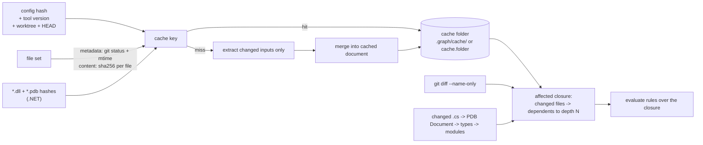
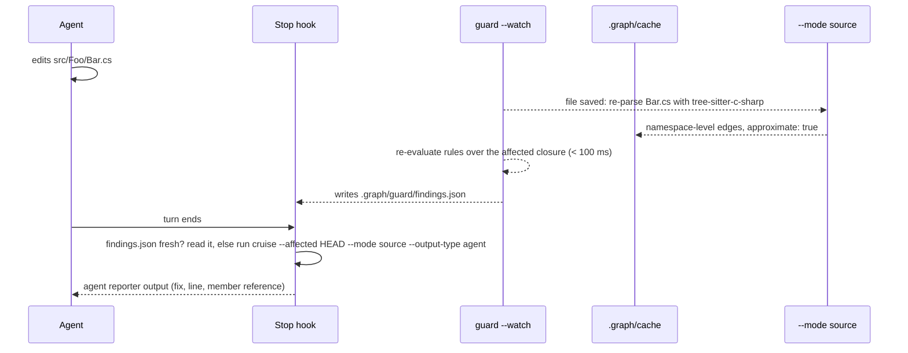
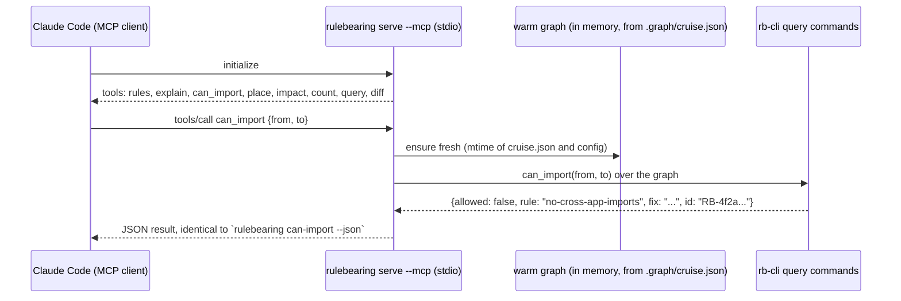

# Plan 0003: Wave 3: Operations, the rest of the surface, the inner loop

- **Status:** Pending
- **Owner:** Ben Bahrenburg (@benbahrenburg)
- **Created:** 2026-09-20
- **Calendar estimate:** 8 weeks at ~10 h/week (from design § Waves)
- **Derives from:** [design § Waves](../../artifacts/design.md#waves) (row 3), [design § Outputs and CI integration](../../artifacts/design.md#outputs-and-ci-integration), [design § Reporters](../../artifacts/design.md#reporters), [design § The subcommands a guard reaches for](../../artifacts/design.md#the-subcommands-a-guard-reaches-for), [design § Hooks, test runners, an MCP server, an LSP](../../artifacts/design.md#hooks-test-runners-an-mcp-server-an-lsp), [design § Where it would be ignored](../../artifacts/design.md#where-it-would-be-ignored), [design § Two front-ends that will matter more than the MCP server](../../artifacts/design.md#two-front-ends-that-will-matter-more-than-the-mcp-server), [design § How to know, rather than believe](../../artifacts/design.md#how-to-know-rather-than-believe), [design § The developer relations hat](../../artifacts/design.md#the-developer-relations-hat-the-first-ten-minutes-and-the-brownfield-repo), [design § The agentic engineering hat](../../artifacts/design.md#the-agentic-engineering-hat-turn-two), [design § The architect's hat](../../artifacts/design.md#the-architects-hat-across-repos-and-across-time), [design § Adoption order](../../artifacts/design.md#adoption-order), [design § Test beds](../../artifacts/design.md#test-beds-open-source-repositories-to-validate-against); [dependency-cruiser coverage § Options](../../artifacts/dependency-cruiser-18.2.0-coverage.md#options), [§ Command line](../../artifacts/dependency-cruiser-18.2.0-coverage.md#command-line), [§ Output types](../../artifacts/dependency-cruiser-18.2.0-coverage.md#output-types), [§ Extraction and resolution](../../artifacts/dependency-cruiser-18.2.0-coverage.md#extraction-and-resolution), [§ Programmatic API](../../artifacts/dependency-cruiser-18.2.0-coverage.md#programmatic-api); [ArchUnitNET coverage § PlantUML](../../artifacts/archunitnet-0.13.4-coverage.md#plantuml)
- **Satisfies:** [FR-EXT-TS-05](../../prd.md#fr-ext-ts-05), [FR-EXT-DN-04](../../prd.md#fr-ext-dn-04), [FR-RULE-05](../../prd.md#fr-rule-05), [FR-OUT-01](../../prd.md#fr-out-01), [FR-OUT-02](../../prd.md#fr-out-02), [FR-CLI-01](../../prd.md#fr-cli-01), [FR-CLI-05](../../prd.md#fr-cli-05), [FR-CLI-06](../../prd.md#fr-cli-06), [FR-CLI-07](../../prd.md#fr-cli-07), [FR-CLI-08](../../prd.md#fr-cli-08), [FR-DIST-02](../../prd.md#fr-dist-02), [FR-DIST-04](../../prd.md#fr-dist-04), [FR-REACH-04](../../prd.md#fr-reach-04), [FR-CORE-06](../../prd.md#fr-core-06), [NFR-PERF-02](../../prd.md#nfr-perf-02), [NFR-PERF-03](../../prd.md#nfr-perf-03), [NFR-CONF-01](../../prd.md#nfr-conf-01), [NFR-CONF-03](../../prd.md#nfr-conf-03), [NFR-SEC-01](../../prd.md#nfr-sec-01), [NFR-ADOPT-02](../../prd.md#nfr-adopt-02)
- **Applies:** [ADR-0004](../../adr/0004-graph-document-is-cruise-result-superset.md), [ADR-0006](../../adr/0006-embedded-quickjs-config-evaluator.md), [ADR-0007](../../adr/0007-vacuous-rules-fail-by-default.md), [ADR-0008](../../adr/0008-exit-code-contract.md), [ADR-0009](../../adr/0009-conformance-suites-as-specification.md), [ADR-0010](../../adr/0010-crate-layout-and-extractor-boundary.md), [ADR-0011](../../adr/0011-read-dotnet-assemblies-not-source.md), [ADR-0015](../../adr/0015-stable-violation-id.md), [ADR-0017](../../adr/0017-coffeescript-livescript-sidecar.md), [ADR-0018](../../adr/0018-test-coverage-threshold.md), [ADR-0019](../../adr/0019-mit-licence.md), [ADR-0020](../../adr/0020-single-name-across-registries.md), [ADR-0021](../../adr/0021-agent-surface-cli-first.md)
- **Architecture:** [§ Crate layout](../../architecture.md#crate-layout), [§ The graph document](../../architecture.md#the-graph-document), [§ Extractors](../../architecture.md#extractors), [§ Outputs and CI contract](../../architecture.md#outputs-and-ci-contract), [§ Agent surface](../../architecture.md#agent-surface), [§ Distribution](../../architecture.md#distribution), [§ Security posture](../../architecture.md#security-posture), [§ Performance model](../../architecture.md#performance-model), [§ Verification strategy](../../architecture.md#verification-strategy), [§ Risks and their mitigations](../../architecture.md#risks-and-their-mitigations)
- **Depends on:** [Plan 0002 (wave 2)](0002-wave-2-dotnet-python-element-rules.md); **Enables:** [Plan 0004 (wave 4)](0004-wave-4-reach.md)
- **Exit criterion (from design § Waves):** "`conformance/excluded.json` empty; all twenty-one dependency-cruiser output types byte-compared; Stop hook p95 under 2 s on aspnetcore in source mode; the scale table published."

## 1. Architect section (for the architectural review board)

### 1.1 Purpose and business value

Waves 1 and 2 make Rulebearing a correct gate: the rule language, the three extractors, the reporters a pipeline needs, and the migration commands. Wave 3 makes it a tool people keep running. Three things are still missing at the end of wave 2, and each is named in the design:

1. **The rest of the dependency-cruiser surface.** The superset claim is a ledger ([design § Specification coverage](../../artifacts/design.md#specification-coverage)), and the coverage tab still has rows marked wave 3: `cache`, `affected`, the `markdown`, `html`, `anon`, `x-dot-webpage` and `plugin:<path>` reporters, `wrap-html`, the CoffeeScript and LiveScript sidecar, and the Node programmatic API. Until those rows say Parity, `conformance/excluded.json` is not empty and the twenty-one output types are not all byte-compared ([design § Conformance gate 1](../../artifacts/design.md#conformance-gate-1-dependency-cruisers-tests-validate-rulebearing)).
2. **The inner loop.** The design's adoption analysis says the Stop hook with `--affected` and a sub-two-second run "is the product", and that on a large .NET solution "an agent will not build to check one import" ([design § What agents actually do with rules](../../artifacts/design.md#what-agents-actually-do-with-rules), [§ Where it would be ignored](../../artifacts/design.md#where-it-would-be-ignored)). `--cache`, `--affected`, `--mode source`, `guard --watch` and the Roslyn analyzer are the mechanisms that get the p95 under 2 s on aspnetcore.
3. **The surfaces beyond the CLI.** `serve --mcp`, `serve --lsp` and the napi binding are additive by [ADR-0021](../../adr/0021-agent-surface-cli-first.md): thin loops over the same commands and the same cached graph. Rule lifecycle fields, `snapshot` and `changelog` are how a rule file shrinks honestly and how drift becomes visible across releases ([design § The architect's hat](../../artifacts/design.md#the-architects-hat-across-repos-and-across-time)).

The business value is the fifth step of the adoption order: the greenfield mixed-language repositories, reached "through `init` and `propose`, where a proposed rule set is the conversation starter" ([design § Adoption order](../../artifacts/design.md#adoption-order)). Framework presets and the public rule library are what make a proposed rule set something a maintainer recognises.

### 1.2 Scope

**In scope**, verbatim from [design § Waves](../../artifacts/design.md#waves) row 3, with the section of the design that specifies each item:

| Item | Specified by |
| --- | --- |
| `--cache` (`folder`, `strategy: metadata` / `content`, `compress`; .NET keyed on assembly and PDB hashes) | [coverage § Options](../../artifacts/dependency-cruiser-18.2.0-coverage.md#options) row `cache`; [coverage § Command line](../../artifacts/dependency-cruiser-18.2.0-coverage.md#command-line) row `--cache [folder]`, `--cache-strategy`, `--no-cache`; [architecture § Performance model](../../architecture.md#performance-model) |
| `--affected [revision]` (changed `.cs` files mapped through the PDB to affected types) | [coverage § Options](../../artifacts/dependency-cruiser-18.2.0-coverage.md#options) row `affected`; [coverage § Command line](../../artifacts/dependency-cruiser-18.2.0-coverage.md#command-line) row `--affected [revision]` |
| `diff <old.json> <new.json>` and `diff --base <ref>` | [design § The subcommands a guard reaches for](../../artifacts/design.md#the-subcommands-a-guard-reaches-for) |
| `plantuml` reporter with `LimitDependencies`, `C4Style`, `FocusOn`, `IncludeDependenciesToOther`, `DependencyFilters`, and `--from slices | types | namespaces | folders` | [ArchUnitNET coverage § PlantUML](../../artifacts/archunitnet-0.13.4-coverage.md#plantuml); [design § Diagram rules](../../artifacts/design.md#diagram-rules); [design § Reporters](../../artifacts/design.md#reporters) |
| `markdown` reporter with its 18 `reporterOptions.markdown` keys | [coverage § Options](../../artifacts/dependency-cruiser-18.2.0-coverage.md#options) row `reporterOptions.markdown`; [coverage § Output types](../../artifacts/dependency-cruiser-18.2.0-coverage.md#output-types) |
| `html` (matrix), `anon` (`reporterOptions.anon.wordlist`), `x-dot-webpage` | [coverage § Output types](../../artifacts/dependency-cruiser-18.2.0-coverage.md#output-types); [coverage § Options](../../artifacts/dependency-cruiser-18.2.0-coverage.md#options) row `reporterOptions.anon.wordlist` |
| `plugin:<path>` reporters through the embedded QuickJS engine | [coverage § Output types](../../artifacts/dependency-cruiser-18.2.0-coverage.md#output-types) row `plugin:<path>`; [ADR-0006](../../adr/0006-embedded-quickjs-config-evaluator.md) |
| `wrap-html` (`depcruise-wrap-stream-in-html`) | [coverage § Command line](../../artifacts/dependency-cruiser-18.2.0-coverage.md#command-line) |
| CoffeeScript and LiveScript sidecar (`--sidecar node`), emptying `conformance/excluded.json` | [coverage § Extraction and resolution](../../artifacts/dependency-cruiser-18.2.0-coverage.md#extraction-and-resolution); [ADR-0017](../../adr/0017-coffeescript-livescript-sidecar.md) |
| `--init` presets and the framework presets `nextjs`, `clean-architecture`, `django`, `fastapi`, `vertical-slices` | [coverage § Command line](../../artifacts/dependency-cruiser-18.2.0-coverage.md#command-line) row `--init`; [design § The developer relations hat](../../artifacts/design.md#the-developer-relations-hat-the-first-ten-minutes-and-the-brownfield-repo) |
| `--mode source` for .NET (`tree-sitter-c-sharp`, namespace-level, marked `approximate`, never the gate) | [design § Where it would be ignored](../../artifacts/design.md#where-it-would-be-ignored); [ADR-0011](../../adr/0011-read-dotnet-assemblies-not-source.md) |
| `guard --watch` (re-check within 100 ms, findings file the Stop hook reads) | [design § The agentic engineering hat](../../artifacts/design.md#the-agentic-engineering-hat-turn-two) |
| `Rulebearing.Analyzer`, the Roslyn front-end (`RB0001` diagnostics with the `fix` as the message) | [design § Two front-ends that will matter more than the MCP server](../../artifacts/design.md#two-front-ends-that-will-matter-more-than-the-mcp-server); [ADR-0021](../../adr/0021-agent-surface-cli-first.md) |
| Rule lifecycle fields `since`, `deprecated`, `replacedBy`; `rules --unused` | [design § The architect's hat](../../artifacts/design.md#the-architects-hat-across-repos-and-across-time) |
| `snapshot` and `changelog --since` | [design § The architect's hat](../../artifacts/design.md#the-architects-hat-across-repos-and-across-time); [design § The developer relations hat](../../artifacts/design.md#the-developer-relations-hat-the-first-ten-minutes-and-the-brownfield-repo) |
| `serve --mcp` (tools `rules`, `explain`, `can_import`, `place`, `impact`, `count`, `query`, `diff`) and `serve --lsp` (diagnostics with the `fix` as the quick-fix title) | [design § Hooks, test runners, an MCP server, an LSP](../../artifacts/design.md#hooks-test-runners-an-mcp-server-an-lsp) |
| `rb-node`, the napi binding exposing `cruise()`, `format()`, `extractDepcruiseConfig`, `extractTSConfig`, `extractWebpackResolveConfig`, `extractBabelConfig`, `getAvailableTranspilers`, `allExtensions` | [coverage § Programmatic API](../../artifacts/dependency-cruiser-18.2.0-coverage.md#programmatic-api) |
| The public rule library `rulebearing-rules`, published to all three registries | [design § The developer relations hat](../../artifacts/design.md#the-developer-relations-hat-the-first-ten-minutes-and-the-brownfield-repo) |
| `--exit-code-mode strict` (`10 + n`) | [ADR-0008](../../adr/0008-exit-code-contract.md) |
| The scale table published in the README, regenerated nightly | [design § Test beds](../../artifacts/design.md#test-beds-open-source-repositories-to-validate-against) item 3 |
| Adoption-order action 5: proposed rule sets offered to the greenfield mixed-language test beds, each through an issue first | [design § Adoption order](../../artifacts/design.md#adoption-order); [design § Open questions](../../artifacts/design.md#open-questions) (upstream etiquette) |

**Out of scope** (and where it lands): the WebAssembly playground, docs site and cookbook, the pull-request app and Azure DevOps extension, `fix --plan`, `fleet`, declared cross-service edges, the `fix`-text eval harness and opt-in usage counts are all [wave 4](0004-wave-4-reach.md). Automated code edits behind the LSP quick-fix are not in the design; the design promises the `fix` as the title and nothing more. A native CoffeeScript or LiveScript parser is rejected by [ADR-0017](../../adr/0017-coffeescript-livescript-sidecar.md). Source mode as a CI gate is rejected by [ADR-0011](../../adr/0011-read-dotnet-assemblies-not-source.md).

### 1.3 Requirements traceability

| Requirement | What this wave delivers for it | Verification |
| --- | --- | --- |
| [FR-CLI-05](../../prd.md#fr-cli-05) | `--cache [folder]`, `--cache-strategy metadata|content`, `--no-cache`, `cache.compress`; .NET keys on assembly and PDB hashes; `--affected [revision]` with PDB mapping; `guard --watch` | cache hit and invalidation unit tests; `--affected` fixture on the mutation branch; `guard --watch` latency test under 100 ms |
| [FR-CLI-01](../../prd.md#fr-cli-01) | `diff <old> <new>` and `diff --base` | fixture pair with a known added edge, removed edge and new violation |
| [FR-OUT-01](../../prd.md#fr-out-01) | `markdown`, `html`, `anon`, `x-dot-webpage`, `plugin:<path>` under dependency-cruiser's names; `wrap-html` | gate 1 layer 3: every `test/report/<reporter>` fixture byte-compared; twenty-one of twenty-one |
| [FR-OUT-02](../../prd.md#fr-out-02), [FR-RULE-05](../../prd.md#fr-rule-05) | `plantuml` reporter with the five generation options and `--from` | round trip: `--output-type plantuml` then `adhereTo` the file passes with zero violations on the .NET oracles |
| [FR-EXT-TS-05](../../prd.md#fr-ext-ts-05) | `--sidecar node`; exit 2 with a named reason without it | `conformance/excluded.json` count reaches zero; sidecar edges marked `sidecar: true` |
| [FR-EXT-DN-04](../../prd.md#fr-ext-dn-04) | `--mode source` over `tree-sitter-c-sharp`; edges marked `approximate`; refused in `--exit-code` gate context unless `--allow-approximate-gate` is absent (see § 1.6) | precision and recall of source-mode edges against compiled mode on the .NET oracles, reported in the receipt |
| [FR-CLI-08](../../prd.md#fr-cli-08) | `--init` per-language presets carried from wave 2 plus five framework presets; `wrap-html` | `init --preset nextjs` on langfuse produces a passing config; preset fixtures |
| [FR-CLI-07](../../prd.md#fr-cli-07) | `since`, `deprecated`, `replacedBy`; `rules --unused`; `snapshot`; `changelog --since` | schema tests; snapshot fixture pair; `changelog` byte-compared against a committed expected output |
| [FR-CLI-06](../../prd.md#fr-cli-06) | `serve --mcp` with eight tools; `serve --lsp` with diagnostics and quick-fix titles | MCP JSON-RPC fixture transcripts; LSP fixture transcripts; each tool's output equals the CLI command's `--json` output |
| [FR-DIST-04](../../prd.md#fr-dist-04) | `Rulebearing.Analyzer` NuGet analyzer package | analyzer diagnostics equal cruise violations on the .NET oracles for the families it covers; coverlet 70% |
| [FR-DIST-02](../../prd.md#fr-dist-02) | `rb-node` with the eight names in the Programmatic API table | vitest calling `cruise()` on a fixture and comparing to the CLI JSON; 70% lines |
| [FR-REACH-04](../../prd.md#fr-reach-04) | `rulebearing-rules` on GitHub, npm, NuGet, PyPI; the framework presets | `extends` of the published package resolves from all three wrappers; CI in the library repo |
| [FR-CORE-06](../../prd.md#fr-core-06) | `--exit-code-mode strict` | exit-code table test extended with the strict rows |
| [NFR-PERF-02](../../prd.md#nfr-perf-02) | Stop hook p95 under 2 s on aspnetcore in source mode | nightly p95 measurement, published |
| [NFR-PERF-03](../../prd.md#nfr-perf-03) | `guard --watch` under 100 ms; scale table with 20% regression failure | nightly timing job |
| [NFR-CONF-01](../../prd.md#nfr-conf-01) | gate 1 complete: `excluded.json` empty, layer 3 at twenty-one reporters | required CI check |
| [NFR-CONF-03](../../prd.md#nfr-conf-03) | the scale table in the README | nightly workflow writes it |
| [NFR-SEC-01](../../prd.md#nfr-sec-01) | plugin reporters run in the sandbox; the sidecar and `--config-via-node` remain the only process spawns; MCP and LSP over stdio only | sandbox escape tests for plugin reporters; no listener sockets in `serve` |
| [NFR-ADOPT-02](../../prd.md#nfr-adopt-02) | proposed rule sets offered to greenfield mixed-language test beds via issues | issue links in the status table |

### 1.4 Architecture of what this wave builds

Nothing in this wave changes the crate boundary of [ADR-0010](../../adr/0010-crate-layout-and-extractor-boundary.md). The cache, `--affected`, `diff`, `guard`, `serve`, `snapshot` and `changelog` are `rb-cli` concerns; the new reporters are `rb-report`; source mode is a second entry point inside `rb-extract-dotnet`; the sidecar is dispatch inside `rb-extract-ts`; the analyzer and the binding are the two front-ends already listed under `frontends/` and `crates/rb-node`.

#### The cache and `--affected`



The cache is keyed as [architecture § Performance model](../../architecture.md#performance-model) states: content-addressed by file hashes, assembly plus PDB hashes for .NET, worktree-aware (the worktree-aware key was delivered in wave 2 and is reused). Two strategies come from the coverage row: `metadata` uses git status and file metadata to decide what changed, `content` hashes every file. The cache is only ever a speed-up: a cache hit must produce a document byte-identical to a cold run, and a corrupt or version-mismatched cache is discarded, never trusted ([ADR-0008](../../adr/0008-exit-code-contract.md): an untrustworthy input never silently degrades a run).

`--affected [revision]` takes the changed files since `revision` (default: the repository's default branch, as dependency-cruiser does per the coverage row) plus uncommitted changes, and reports the modules reachable from them. For .NET, a changed `.cs` file is mapped through the PDB `Document` table to the types attributed to it, and from there to modules and assemblies ([coverage § Options](../../artifacts/dependency-cruiser-18.2.0-coverage.md#options) row `affected`). When the C# fallback of [ADR-0003](../../adr/0003-dotnet-extractor-fallback.md) is in use, the ingested document carries the same `attribution` fields, so the mapping is unchanged.

#### The inner loop on a large .NET solution



Compiled mode remains the CI gate ([ADR-0011](../../adr/0011-read-dotnet-assemblies-not-source.md)); source mode exists so the hook never waits for `dotnet build`. Every edge from source mode carries `approximate: true`, the receipt records `mode: source`, and the `agent` reporter prints the word "approximate" in its header so an agent reading it knows the finding is namespace-level.

#### MCP and LSP over one warm graph



Both servers are "the same binary and a thin loop over the query commands" ([design § Hooks, test runners, an MCP server, an LSP](../../artifacts/design.md#hooks-test-runners-an-mcp-server-an-lsp)). The LSP publishes the findings of the warm graph as `textDocument/publishDiagnostics` and offers a `quickfix` code action whose title is the rule's `fix`. The two servers share one in-process graph holder with `guard --watch`, so a file save refreshes all three.

#### The two front-ends

`Rulebearing.Analyzer` reads `rulebearing.yaml` as a Roslyn `AdditionalFile` and evaluates dependency and element rules on the semantic model at compile time, reporting `RB0001`-style diagnostics with the `fix` as the message ([design § Two front-ends](../../artifacts/design.md#two-front-ends-that-will-matter-more-than-the-mcp-server)). It is not a replacement for the metadata extractor; it is the inner-loop form that fails `dotnet build` with the line. `rb-node` exposes `cruise()` and `format()` with dependency-cruiser's API signatures so a script that calls dependency-cruiser as a library today can switch its `require` ([coverage § Programmatic API](../../artifacts/dependency-cruiser-18.2.0-coverage.md#programmatic-api)).

### 1.5 Interfaces and contracts this wave freezes

**Cache options** (dependency-cruiser's keys, honoured in both config formats; [coverage § Options](../../artifacts/dependency-cruiser-18.2.0-coverage.md#options)):

```yaml
options:
  cache:
    folder: .graph/cache        # dependency-cruiser's default is node_modules/.cache/dependency-cruiser and is honoured when set
    strategy: metadata          # metadata | content
    compress: true
```

```
rulebearing cruise --cache [folder] --cache-strategy metadata|content --no-cache
rulebearing cruise --affected [revision]
rulebearing diff old.json new.json [--output-type json|markdown|agent]
rulebearing diff --base main [--output-type ...]
```

**Cache manifest** (`<folder>/manifest.json`), the file a cache hit is validated against before any cached module is reused:

```json
{
  "toolVersion": "0.3.0",
  "configHash": "sha256:...",
  "worktree": "/abs/path",
  "head": "3f2a...",
  "strategy": "metadata",
  "inputs": { "src/a.ts": "sha256:...", "bin/Release/net9.0/App.dll": "sha256:...", "bin/Release/net9.0/App.pdb": "sha256:..." }
}
```

**`diff` output** (JSON shape; `markdown` and `agent` are renderings of it):

```json
{
  "base": { "revision": "main", "sha": "..." },
  "head": { "sha": "..." },
  "addedEdges":   [ { "from": "apps/web/src/x.ts", "to": "apps/worker/src/y.ts", "line": 3, "column": 1 } ],
  "removedEdges": [],
  "newViolations": [ { "id": "RB-4f2a9c1e", "rule": "no-cross-app-imports", "from": "...", "to": "...", "fix": "..." } ],
  "resolvedViolations": [],
  "ratchets": [ { "name": "routes-via-service", "before": 12, "after": 11 } ]
}
```

**`plantuml` reporter options** (the ArchUnitNET generation option names, verbatim from [ArchUnitNET coverage § PlantUML](../../artifacts/archunitnet-0.13.4-coverage.md#plantuml)):

```yaml
options:
  reporterOptions:
    plantuml:
      from: slices               # slices | types | namespaces | folders
      LimitDependencies: true
      C4Style: false
      FocusOn: "^RiverBooks\\.Books"
      IncludeDependenciesToOther: false
      DependencyFilters: ["^System\\."]
```

`--from` on the command line overrides `from`. The file the reporter writes must be accepted by an `adhereTo` diagram rule without change; that round trip is the reporter's acceptance test.

**`markdown` reporter options**: the 18 keys listed in [coverage § Options](../../artifacts/dependency-cruiser-18.2.0-coverage.md#options) (`title`, `showTitle`, `showSummary`, `showSummaryHeader`, `summaryHeader`, `showStatsSummary`, `showRulesSummary`, `includeIgnoredInSummary`, `showDetails`, `showDetailsHeader`, `detailsHeader`, `includeIgnoredInDetails`, `collapseDetails`, `collapsedMessage`, `noViolationsMessage`, `showFooter`, `showAliasedModulesUnresolved`, `showExternalModulesUnresolved`), with dependency-cruiser's defaults, proven by the `test/report/markdown` fixtures.

**`plugin:<path>` contract**: the path names a JavaScript module evaluated in the sandbox of [ADR-0006](../../adr/0006-embedded-quickjs-config-evaluator.md); its default export is called with the cruise result object and must return `{ output: string, exitCode: number }`, as dependency-cruiser's plugin reporters do. The module has the sandbox's `require` (JSON files and modules under the repository) and nothing else. The receipt records `plugins: [path]`.

**Sidecar edges**: a dependency produced by `--sidecar node` carries `sidecar: true` ([architecture § The graph document](../../architecture.md#the-graph-document)); the receipt records `sidecar: { tool: "dependency-cruiser", version: "18.2.0", files: N }`. Without the flag, a `.coffee`, `.litcoffee`, `.ls`, `.cjsx` or `.csx` file makes the run exit 2 with reason `unsupported-file-needs-sidecar` ([ADR-0017](../../adr/0017-coffeescript-livescript-sidecar.md)).

**Source mode**: `--mode source` (also `languages.dotnet.mode: source`) adds `approximate: true` to every .NET dependency, `attribution: source` to every .NET module, and `mode: source` to `summary.inspected.dotnet`. All three are additive and stripped by `--strict-schema` ([ADR-0004](../../adr/0004-graph-document-is-cruise-result-superset.md)).

**Rule lifecycle fields**, on every family:

```yaml
- name: no-legacy-http-client
  comment: "adr:0012"
  since: "1.2.0"
  deprecated: "2.0.0"
  replacedBy: no-http-client-outside-gateway
  severity: warn
```

`rules --json` carries all three; `config lint` warns on a `replacedBy` naming a rule that does not exist; `rules --unused [--releases N]` lists rules with zero matches on both sides across the last N snapshots.

**Snapshot** (`.graph/snapshots/<version>.json`, committed per release):

```json
{ "version": "1.3.0", "sha": "...", "counts": { "modules": 5574, "dependencies": 21930, "violations": { "error": 0, "warn": 3 } },
  "instability": { "apps/web": 0.42, "src/Domain": 0.05 },
  "rules": { "no-cross-app-imports": { "fromMatches": 412, "toMatches": 412, "violations": 0 } },
  "ratchets": { "routes-via-service": 11 } }
```

`changelog --since <version>` reads two snapshots and the two cruise documents when available and prints new edges across boundaries, retired rules, and ratchets that fell ([design § The developer relations hat](../../artifacts/design.md#the-developer-relations-hat-the-first-ten-minutes-and-the-brownfield-repo)).

**MCP tools** (JSON-RPC over stdio, names verbatim from the design): `rules`, `explain`, `can_import`, `place`, `impact`, `count`, `query`, `diff`. Each tool's result is byte-identical to the corresponding CLI command with `--json`; that equality is the test.

**LSP**: `textDocument/publishDiagnostics` with `code` = the stable violation id, `source` = `rulebearing`, `message` = the rule name and `fix`; `textDocument/codeAction` returns one `quickfix` per diagnostic titled with the `fix` and carrying a command that runs `explain <rule>`.

**Roslyn diagnostics**: `RB0001` a dependency-rule violation, `RB0002` an element-rule violation, `RB0009` the config could not be read. Message = the `fix` text (or the `comment` when there is no `fix`); the rule name is the diagnostic's `helpLinkUri` fragment; severity maps `error` to Error and `warn` and `info` to Warning and Info.

**`rb-node` API** (names verbatim from [coverage § Programmatic API](../../artifacts/dependency-cruiser-18.2.0-coverage.md#programmatic-api)):

```ts
export function cruise(files: string[], options?: ICruiseOptions, resolveOptions?: IResolveOptions, transpileOptions?: ITranspileOptions): Promise<IReporterOutput>;
export function format(result: ICruiseResult, options?: IFormatOptions): Promise<IReporterOutput>;
export function extractDepcruiseConfig(path: string): Promise<ICruiseOptions>;
export function extractTSConfig(path: string): Promise<object>;
export function extractWebpackResolveConfig(path: string, env?: object, args?: object): Promise<object>;
export function extractBabelConfig(path: string): Promise<object>;
export function getAvailableTranspilers(): { name: string; version: string; available: boolean }[];
export function allExtensions(): { extension: string; available: boolean }[];
```

**Exit codes**: `--exit-code-mode strict` shifts the violation count to `10 + n` so that 2 and 3 are unambiguous ([ADR-0008](../../adr/0008-exit-code-contract.md)); the default mode is unchanged.

### 1.6 Decisions applied, and decisions this wave must make

| ADR | Why it matters in this wave |
| --- | --- |
| [ADR-0004](../../adr/0004-graph-document-is-cruise-result-superset.md) | `sidecar`, `approximate`, `attribution: source` and the receipt extensions are additive and stripped by `--strict-schema`; gate 1 layer 4 still passes |
| [ADR-0006](../../adr/0006-embedded-quickjs-config-evaluator.md) | `plugin:<path>` reporters run in the same sandbox as configs: no filesystem beyond the repository, no network, no `process` |
| [ADR-0007](../../adr/0007-vacuous-rules-fail-by-default.md) | `rules --unused` and lifecycle fields do not change liveness: a deprecated rule that matches nothing still fails unless `allowEmpty` |
| [ADR-0008](../../adr/0008-exit-code-contract.md) | `--exit-code-mode strict` lands here; the sidecar's missing-flag case is exit 2 |
| [ADR-0009](../../adr/0009-conformance-suites-as-specification.md) | gate 1 layer 3 must reach twenty-one reporters and `excluded.json` must reach zero; both are the exit criterion |
| [ADR-0010](../../adr/0010-crate-layout-and-extractor-boundary.md) | source mode lives inside `rb-extract-dotnet`; the sidecar inside `rb-extract-ts`; neither reaches `rb-config` or `rb-rules` |
| [ADR-0011](../../adr/0011-read-dotnet-assemblies-not-source.md) | source mode is approximate and never the gate |
| [ADR-0015](../../adr/0015-stable-violation-id.md) | `diff`, the LSP `code`, the MCP results and the analyzer's help link all reference the stable id |
| [ADR-0017](../../adr/0017-coffeescript-livescript-sidecar.md) | the only Node spawn; `excluded.json` must be empty once it lands |
| [ADR-0018](../../adr/0018-test-coverage-threshold.md) | the analyzer (coverlet), `rb-node` (vitest) and every crate stay at or above 70% |
| [ADR-0019](../../adr/0019-mit-licence.md), [ADR-0020](../../adr/0020-single-name-across-registries.md) | `tree-sitter-c-sharp`, `napi`, the LSP and MCP crates pass `cargo deny`; the rule library is `rulebearing-rules` on every registry |
| [ADR-0021](../../adr/0021-agent-surface-cli-first.md) | MCP, LSP, the analyzer and `guard` are thin loops over the CLI's commands and the cached graph; none has its own rule file |

Decisions the design leaves open, with the rule this plan applies:

| Open point | Decision rule |
| --- | --- |
| Whether source mode may ever feed `--exit-code` | No. `cruise --mode source --exit-code` prints a warning and exits 2 (`approximate-mode-not-a-gate`) unless `--allow-approximate-gate` is given for a local script; CI recipes never use the flag. Compiled mode is the gate ([ADR-0011](../../adr/0011-read-dotnet-assemblies-not-source.md)). |
| How the Roslyn analyzer evaluates rules without a second rule file | The analyzer ports the dependency matcher and the element predicate subset to C#, and parity is proven, not assumed: on every .NET oracle, the analyzer's diagnostics must equal the cruise's violations for the families it covers. Whole-graph families (cycles, reachability, dependents, slices, diagrams, ratchets) are not evaluated at compile time and are listed in the package README as "reported by `cruise`". If the parity test cannot be made green for a family, the analyzer ships without that family rather than with a divergent one. |
| MCP and LSP transports | stdio only. No listening socket in wave 3, so [NFR-SEC-01](../../prd.md#nfr-sec-01) ("no network") stays true of the binary. An HTTP transport would be a new ADR. |
| The `guard --watch` findings file and its freshness | `.graph/guard/findings.json` with a `writtenAt` timestamp and the graph's `configHash`; the Stop hook written by `hooks install` reads it when it is younger than 5 s and matches the current config hash, otherwise runs the affected cruise. |
| `rules --unused` window | `--releases N`, default 3; with fewer than N snapshots the command prints `insufficient history` and exits 0 rather than guessing. |
| Where framework presets live | Authored under `presets/` in sub-wave 3C and resolvable as `rulebearing:<name>` from the binary; copied into `rulebearing-rules` in 3G so `extends: rulebearing-rules/<name>` resolves from the registry package. The library is the source of truth once it has shipped its first version, and the bundled copies are regenerated from it. |
| `rb-node` packaging | The binding is the main export of the `rulebearing` npm package (so `require('rulebearing').cruise` replaces `require('dependency-cruiser').cruise`), with the native addon per platform under `optionalDependencies` beside the binary. No scoped package until `@rulebearing` is verified ([ADR-0020](../../adr/0020-single-name-across-registries.md)). |
| `unsafe_code = "forbid"` and the napi binding | `rb-node` sets `#![allow(unsafe_code)]` at the crate root with a comment citing this plan, because `#[napi]` expands to `unsafe` glue; no other crate opts out. |
| Sidecar version | The sidecar resolves `dependency-cruiser` from the repository's `node_modules` and records its version in the receipt; a version other than 18.2.0 is a warning, not an error, since the merged edges are byte-compared only in the conformance run. |

### 1.7 Quality attributes

| Attribute | Target | How measured |
| --- | --- | --- |
| Performance: Stop hook p95 | under 2 s on aspnetcore at its pinned SHA, source mode, warm cache | nightly job, 200 seeded single-file edits, p95 of wall-clock for `cruise --affected HEAD --mode source --output-type agent` |
| Performance: `guard --watch` | under 100 ms from file save to findings file written | in-process timer in the daemon, asserted in an integration test on the private-monorepo-sized fixture |
| Performance: cache | warm full cruise of the 5,500-module fixture at least 5x faster than cold; a cache hit byte-identical to a cold run | benchmark test; determinism test |
| Performance: scale table | wall-clock and peak memory for n8n, grafana, kibana, aspnetcore, jellyfin, home-assistant/core; a regression over 20% fails the nightly | nightly workflow ([design § Test beds](../../artifacts/design.md#test-beds-open-source-repositories-to-validate-against)) |
| Security | plugin reporters cannot read outside the repository or reach the network; `serve` opens no socket; the sidecar is the only Node spawn and is recorded | sandbox escape tests; `lsof`-style assertion in the serve integration test; receipt test |
| Reliability | a corrupt cache, a missing sidecar, a stale findings file or a malformed `.puml` never panics: exit 2 with a named reason or a fresh run | fuzz target for the cache manifest and the PlantUML parser; error-path tests |
| Compatibility | twenty-one reporters byte-compared; `rb-node` signatures equal dependency-cruiser's; `--strict-schema` still validates with the new fields | gate 1 layers 3 and 4; vitest type test |
| Observability | the receipt records `mode`, `sidecar`, `plugins`, `cache: { hit, strategy }`, `affected: { revision, changed, closure }` | schema test and a fixture per field |

### 1.8 Dependencies

| Dependency | Version policy | Licence | Used by |
| --- | --- | --- | --- |
| `tree-sitter`, `tree-sitter-c-sharp` | pinned in `Cargo.toml`; bumped through a PR that re-runs the source-mode precision test | MIT | `rb-extract-dotnet` (feature `source-mode`) |
| `napi`, `napi-derive`, `napi-build` | pinned | MIT | `rb-node` |
| `tower-lsp` or `lsp-server` plus `lsp-types` | pinned; choose the one that compiles without a runtime dependency the binary does not already carry | MIT / Apache-2.0 | `rb-cli` (`serve --lsp`) |
| `notify` (file watching) | pinned | CC0-1.0 / Artistic-2.0 (check `cargo deny`; if refused, use `notify-debouncer-mini` or a polling watcher) | `rb-cli` (`guard --watch`) |
| `zstd` or `flate2` (cache `compress`) | pinned | MIT / BSD-3 | `rb-cli` |
| `git2` or shelling to `git` | shell to `git` (already required by `--affected` semantics and `attest`); no libgit2 link | n/a | `rb-cli` |
| dependency-cruiser 18.2.0 (sidecar, conformance) | pinned in `conformance/package.json`; the sidecar uses whatever the repository has and records it | MIT | `rb-extract-ts` sidecar, gate 1 |
| .NET SDK 9 and `Microsoft.CodeAnalysis.CSharp` | pinned in `frontends/Rulebearing.Analyzer` | MIT | the analyzer |
| Node 22 LTS, vitest | pinned in `crates/rb-node/package.json` | MIT | `rb-node` tests |
| PlantUML (rendering only, for the docs) | not a runtime dependency; the reporter writes text | n/a | docs |

Every new crate passes `cargo deny check licenses` against the allow-list in [ADR-0019](../../adr/0019-mit-licence.md) before it is added.

### 1.9 Risks

| Risk | Likelihood | Impact | Mitigation | Trigger |
| --- | --- | --- | --- | --- |
| The Stop hook p95 on aspnetcore exceeds 2 s even in source mode | medium | high | source mode parses only changed files; `guard --watch` keeps the graph warm so the hook reads a file; the cache is keyed per worktree | the first nightly p95 above 2 s after 3D: profile, then narrow `--affected` depth by default to 1 for the hook recipe |
| `tree-sitter-c-sharp` edge precision is too low to be useful | medium | medium | source-mode precision and recall against compiled mode are measured on the .NET oracles and printed in the receipt; edges are namespace-level by design | precision under 90% on an oracle: restrict source mode to `using`-directive edges only and document it |
| The analyzer diverges from the gate | medium | high | parity test on the .NET oracles is a required check; families that cannot be made equal are dropped from the analyzer | any oracle where analyzer diagnostics differ from cruise violations |
| A `test/report` fixture depends on Node-specific formatting (`html`, `x-dot-webpage`) | high | low | version string and whitespace normalisation as in layers 1 and 3; a remaining difference is filed as a documented divergence in the coverage tab, never hidden in `excluded.json` | a fixture that cannot be normalised |
| `notify` licence refused by `cargo deny` | low | low | polling watcher fallback | `cargo deny` failure |
| MCP protocol churn | medium | low | the server implements the tool-call subset only, with fixture transcripts; protocol version pinned in the transcript | a Claude Code release that fails the transcript |
| Registry publication of `rulebearing-rules` blocked (NuGet package review, PyPI name) | low | medium | publish placeholders in the first week of 3G; the name is checked as in [ADR-0020](../../adr/0020-single-name-across-registries.md) | a registry rejecting the name |
| Single maintainer: seven sub-waves in eight weeks | high | medium | the cut order in § 3 is fixed now; 3F and 3G are the first to slip into wave 4 | any sub-wave overrunning its exit by more than a week |

### 1.10 Compliance and licence review

- All new Rust dependencies are on the [ADR-0019](../../adr/0019-mit-licence.md) allow-list or replaced (see `notify` above). `cargo deny` runs on every PR.
- The sidecar spawns the repository's own dependency-cruiser; nothing of dependency-cruiser is vendored beyond the MIT fixtures already in `conformance/`.
- The analyzer package carries the MIT licence and the `Microsoft.CodeAnalysis` package licence notice as its NuGet metadata requires.
- The rule library is MIT and its README states that presets are opinions, not defaults ([design § The developer relations hat](../../artifacts/design.md#the-developer-relations-hat-the-first-ten-minutes-and-the-brownfield-repo): "off by default, each a documented opinion").
- No data leaves the machine: `serve` is stdio, the cache is local, and usage counts are wave 4 and opt-in.

### 1.11 Operational impact

| Area | Impact |
| --- | --- |
| CI minutes | gate 1 layer 3 grows by seven reporter directories (small); the analyzer adds a .NET test job (about 4 min); `rb-node` adds a Node job per platform (about 3 min each); the nightly gains the p95 measurement on aspnetcore (about 25 min including the build) |
| Release | `cargo-dist` gains the `rb-node` native addons per platform; the NuGet workflow gains `Rulebearing.Analyzer`; a second repository (`rulebearing-rules`) gets its own release workflow publishing to npm, NuGet and PyPI with one version |
| Docs | README gains the scale table (between markers the nightly rewrites), the cache and `--affected` recipes, the MCP and LSP setup, the analyzer setup; `docs --format skill` gains the MCP tool list; the coverage tab rows flip to Parity as each lands; `CLAUDE.md` gains the new crates' coverage exclusions |
| Support | `serve` and `guard` are long-running processes for the first time; both log to stderr only, exit cleanly on stdin close, and never write outside `.graph/` |

### 1.12 ARB checklist

| Question | Answer |
| --- | --- |
| Does anything in this wave change a frozen contract? | No. Every graph-document field is additive ([ADR-0004](../../adr/0004-graph-document-is-cruise-result-superset.md)); exit codes gain an opt-in mode only ([ADR-0008](../../adr/0008-exit-code-contract.md)); `rb-node` copies dependency-cruiser's signatures. |
| Can the gate and any new surface disagree? | No by construction: MCP, LSP, `guard` and the CLI read one cached graph; the analyzer's parity with the cruise is a required check, and families that cannot be made equal are excluded. |
| What runs code? | The QuickJS sandbox (configs and now plugin reporters) and the explicit Node sidecar. Nothing else. |
| What opens a socket? | Nothing. MCP and LSP are stdio. |
| What is the proof of the 2 s claim? | A nightly, seeded, published p95 on aspnetcore at a pinned SHA, in the scale table, with the runner spec beside it. |
| What if source mode is wrong? | It is marked `approximate` on every edge, refused as a gate, and its precision against compiled mode is printed in the receipt. |
| What is cut first if the wave overruns? | 3G's library publication and 3F's `rb-node` (both without a conformance dependency), then `serve --lsp`. The exit criterion items (excluded.json, twenty-one reporters, p95, scale table) are never cut. |
| Does the wave create a second rule language? | No. The analyzer reads `rulebearing.yaml`; presets and the library are `extends` targets in the existing formats. |

## 2. Lead developer section (step-by-step implementation)

### 2.0 Conventions

- **Branches and PRs.** One branch per step below, named `w3/<step-slug>` (for example `w3/cache-metadata-strategy`). Every PR links this plan, the requirement ids in the step, and the ADRs; the PR template already demands it ([ADR-0001](../../adr/0001-record-architecture-decisions.md)). Both conformance gates, `cargo llvm-cov --fail-under-lines 70`, `cargo clippy -D warnings`, `cargo fmt --check` and `cargo deny` are required checks and stay required.
- **Issue labels.** `wave:3`, `subwave:3A` to `subwave:3G`, plus `conformance`, `perf`, `frontend`, `distribution`. Milestone `Wave 3`. Project board columns are the status vocabulary of [plans/README.md](../README.md).
- **Running gate 1 locally.** `just conformance-dc` runs the five layers; `just conformance-dc --layer 3 --reporter markdown` runs one reporter directory; the expected-versus-actual diff is written to `target/conformance/`. `conformance/excluded.json` is the ratchet: a PR that grows it fails.
- **Regenerating fixtures.** `just fixtures <area>` regenerates committed fixtures from the upstream pinned sources; never edit a fixture by hand. Upstream fixtures are not copied where the harness runs the originals (layer 2).
- **Measuring performance.** `just bench stop-hook --repo aspnetcore --edits 200 --seed 42` reproduces the nightly p95 locally and prints the runner spec; `just bench guard` measures the daemon; `just bench scale` runs the scale table on the machine at hand and labels it as local, not published.
- **Documentation per step.** Each step lists what to update; the README, `CLAUDE.md`, `docs/`, `schema/v1.json` and the coverage tab row are the five places.

### 2.1 Steps for sub-wave 3A: cache, `--affected`, `diff`, `--exit-code-mode strict`

**Step 1. Cache options and manifest** ([FR-CLI-05](../../prd.md#fr-cli-05); [ADR-0004](../../adr/0004-graph-document-is-cruise-result-superset.md), [ADR-0008](../../adr/0008-exit-code-contract.md)).
Build in `crates/rb-cli/src/cache/{mod.rs, manifest.rs, key.rs}`. Extend the options struct in `rb-model` (`CacheOptions { folder, strategy, compress }`) so both config front-ends map dependency-cruiser's `cache` key and the CLI flags onto it.

```rust
pub enum CacheStrategy { Metadata, Content }
pub struct CacheKey { pub tool_version: String, pub config_hash: [u8; 32], pub worktree: PathBuf, pub head: Option<String> }
pub struct Manifest { pub key: CacheKey, pub strategy: CacheStrategy, pub inputs: BTreeMap<PathBuf, [u8; 32]> }
pub fn load(opts: &CacheOptions, key: &CacheKey) -> Result<Option<(Manifest, GraphDocument)>, CacheError>;
pub fn store(opts: &CacheOptions, manifest: &Manifest, doc: &GraphDocument) -> Result<(), CacheError>;
```

Tests in `crates/rb-cli/tests/cache.rs`: hit, miss on config change, miss on tool version, miss on a changed input under each strategy, corrupt manifest discarded (no panic), compressed round trip, worktree isolation (two worktrees of one fixture do not share entries). Coverage: the module at 85% or better. Done when a warm run is byte-identical to a cold run on the wave 1 monorepo fixture and at least 5x faster.

**Step 2. Incremental extraction** ([FR-CLI-05](../../prd.md#fr-cli-05); [ADR-0010](../../adr/0010-crate-layout-and-extractor-boundary.md)).
Add `ExtractRequest { changed: Vec<PathBuf>, unchanged: Vec<PathBuf> }` in `rb-model` so each extractor can be asked to re-extract a subset; the cache layer merges the returned modules into the cached document and recomputes `dependents`, `orphan`, cycles and metrics in `rb-rules` (they are graph-wide). For .NET, the unit of change is the assembly: any changed `.dll` or `.pdb` hash re-extracts that assembly. Tests: partial re-extraction equals full extraction on every gate 1 layer 1 fixture (run under `cargo test`, so it counts toward coverage).

**Step 3. `--affected [revision]`** ([FR-CLI-05](../../prd.md#fr-cli-05)).
In `crates/rb-cli/src/affected.rs`: `changed_since(repo, revision) -> Vec<PathBuf>` by shelling to `git diff --name-only <revision>...HEAD` plus `git status --porcelain`; `affected_closure(doc, changed, depth)` returns the changed modules and their dependents to `depth` (default: unbounded, as the `reaches` semantics of the coverage row imply; the hook recipe sets 1). For .NET, `pdb_documents_to_modules(doc, changed_cs)` maps each changed `.cs` through `attribution` on modules. Tests: the wave 1 mutation branch with one edit per rule shape; a .NET fixture where a changed `.cs` file affects a partial class across two files. Done when `cruise --affected HEAD --output-type agent` on the mutation branch reports exactly the violations touching the edited files.

**Step 4. `diff`** ([FR-CLI-01](../../prd.md#fr-cli-01); [ADR-0015](../../adr/0015-stable-violation-id.md)).
`crates/rb-cli/src/commands/diff.rs`: `diff <old.json> <new.json>` and `diff --base <ref>`, the latter producing the base cruise from the cache keyed on the base ref, or by checking out the base into a temporary worktree when no cache entry exists (which is what the wave 2 worktree-aware key exists for). Renderers in `rb-report`: `json`, `markdown`, `agent`. Tests: a fixture pair with one added edge, one removed edge, one new violation, one resolved violation, one ratchet that fell; `--base` against a two-commit fixture repository. Done when the `markdown` rendering is committed as the expected output for the wave 4 pull-request comment.

**Step 5. `--exit-code-mode strict`** ([FR-CORE-06](../../prd.md#fr-core-06); [ADR-0008](../../adr/0008-exit-code-contract.md)).
Extend the single exit-code function in `rb-cli` with `ExitCodeMode { Default, Strict }`; strict returns `10 + n` capped at 255 for violations and leaves 0, 2 and 3 as they are. Extend the exit-code table test. Update `docs/` exit-code section and `--help`.

### 2.2 Steps for sub-wave 3B: the remaining reporters and the sidecar

**Step 6. `markdown`, `html`, `anon`, `x-dot-webpage`** ([FR-OUT-01](../../prd.md#fr-out-01); [ADR-0009](../../adr/0009-conformance-suites-as-specification.md)).
One module each under `crates/rb-report/src/{markdown.rs, html.rs, anon.rs, dot_webpage.rs}`. `markdown` implements the 18 option keys with dependency-cruiser's defaults; `html` is the dependency matrix; `anon` replaces module names using `reporterOptions.anon.wordlist` (with dependency-cruiser's bundled word list when none is given) deterministically; `x-dot-webpage` wraps the `dot` output in the same HTML page dependency-cruiser writes. Each is done when `just conformance-dc --layer 3 --reporter <name>` is byte-equal, version string normalised. Where a fixture depends on a formatting detail that cannot be reproduced, record it as a documented divergence in the coverage tab row; never add it to `excluded.json`.

**Step 7. `plugin:<path>`** ([FR-OUT-01](../../prd.md#fr-out-01); [ADR-0006](../../adr/0006-embedded-quickjs-config-evaluator.md)).
In `rb-report`, a `PluginReporter` that asks `rb-config`'s evaluator (exposed as `rb_config::js::Sandbox`) to load the module and call its default export with the cruise result serialised as a JS object; result `{ output, exitCode }`. Tests: dependency-cruiser's plugin fixture from `test/report`; a plugin that tries `require('fs')`, one that tries a network fetch, and one that reads `../../etc/passwd`, each of which must fail with a named sandbox error. Record `plugins: [path]` in the receipt.

**Step 8. `wrap-html`** ([FR-CLI-08](../../prd.md#fr-cli-08)).
`rulebearing wrap-html` reads stdin and writes the HTML wrapper `depcruise-wrap-stream-in-html` writes; byte-compared against its fixture.

**Step 9. `plantuml` reporter** ([FR-OUT-02](../../prd.md#fr-out-02), [FR-RULE-05](../../prd.md#fr-rule-05)).
`crates/rb-report/src/plantuml.rs` with `PlantUmlOptions { from, limit_dependencies, c4_style, focus_on, include_dependencies_to_other, dependency_filters }` (the ArchUnitNET names in the YAML, snake case in Rust). `from` groups the graph by slices (reusing the wave 2 slice grouping in `rb-rules`), types, namespaces or folders and emits a component diagram with `<<pattern>>` stereotypes the wave 2 `adhereTo` parser accepts. Tests: for each .NET oracle, generate the diagram from slices and check that a diagram rule over it reports zero violations (the round trip); one fixture per generation option, compared against a committed expected `.puml`. Done when the round trip holds on every .NET oracle and the coverage tab row flips to Parity.

**Step 10. The sidecar** ([FR-EXT-TS-05](../../prd.md#fr-ext-ts-05); [ADR-0017](../../adr/0017-coffeescript-livescript-sidecar.md)).
In `crates/rb-extract-ts/src/sidecar.rs`: `Sidecar::node(repo)` locates `node` and the repository's `dependency-cruiser`, runs it with `--output-type json` over the sidecar file set and the repository's own config, and merges the returned modules and dependencies with `sidecar: true`. Without `--sidecar node`, a sidecar-extension file yields `Untrustworthy::UnsupportedFileNeedsSidecar(path)` and exit 2. Then remove every entry from `conformance/excluded.json` and make the harness run those specs with `--sidecar node`. Tests: a CoffeeScript fixture from `test/extract`; the missing-flag case; the receipt fields. Done when `excluded.json` is `[]` and gate 1 is green.

### 2.3 Steps for sub-wave 3C: presets, lifecycle fields, snapshot and changelog

**Step 11. Framework presets** ([FR-REACH-04](../../prd.md#fr-reach-04), [FR-CLI-08](../../prd.md#fr-cli-08)).
Under `presets/frameworks/{nextjs,clean-architecture,django,fastapi,vertical-slices}.yaml`, each a native-format file with every rule commented, carrying `fix`, `examples` and a decision token pointing at the preset's README section. `init --preset <name>` and `extends: rulebearing:<name>` resolve them; they are off by default. Tests: `rulebearing test` on each preset's examples; `init --preset nextjs` on the langfuse test bed and `init --preset clean-architecture` on jasontaylordev/CleanArchitecture produce configs that pass or are baselined, committed as fixtures under `testbeds/fixtures/`. Coverage: preset loading in `rb-config` at 80%.

**Step 12. Lifecycle fields and `rules --unused`** ([FR-CLI-07](../../prd.md#fr-cli-07); [ADR-0007](../../adr/0007-vacuous-rules-fail-by-default.md)).
Add `since`, `deprecated`, `replacedBy` to the rule metadata struct in `rb-config`, to the schema (`schema/v1.json` regenerated), to `rules --json`, and to `config lint` (dangling `replacedBy`). `rules --unused --releases N` reads the last N snapshots (step 13) and lists rules with zero `fromMatches` and `toMatches` in all of them. Tests: schema round trip; lint case; `--unused` over three fixture snapshots; the insufficient-history case.

**Step 13. `snapshot` and `changelog --since`** ([FR-CLI-07](../../prd.md#fr-cli-07)).
`crates/rb-cli/src/commands/{snapshot.rs, changelog.rs}`. `snapshot [--version v]` writes `.graph/snapshots/<version>.json` with the shape in § 1.5; `changelog --since <version> [--to <version>]` reads two snapshots and, when the two cruise documents are available in the cache, the edge diff from step 4, and prints new edges across boundaries (edges whose `from` and `to` match different `layers` or slice captures), retired rules (present before, absent now, or `deprecated` set), and ratchets that fell. Tests: a committed fixture pair and the expected Markdown output, byte-compared.

### 2.4 Steps for sub-wave 3D: `--mode source`, `guard --watch`, the 2 s proof

**Step 14. Source mode** ([FR-EXT-DN-04](../../prd.md#fr-ext-dn-04); [ADR-0011](../../adr/0011-read-dotnet-assemblies-not-source.md), [ADR-0010](../../adr/0010-crate-layout-and-extractor-boundary.md)).
`crates/rb-extract-dotnet/src/source/{mod.rs, tree_sitter.rs, namespaces.rs}` behind the Cargo feature `source-mode` (on by default in the binary). `extract_source(roots, opts) -> GraphDocument` parses every `.cs` (excluding the default `*.g.cs`, `*.Designer.cs`, `obj/`, `bin/`) with `tree-sitter-c-sharp`, collects `namespace` and file-scoped namespace declarations, `using` directives, and qualified names in type positions, and emits namespace-level edges projected to files, every dependency `approximate: true`, every module `attribution: source`. Tests: a fixture solution with partial classes, global usings, aliases and nested namespaces; and a precision test that runs source mode and compiled mode over each .NET oracle and reports precision and recall of source edges against compiled edges into `target/source-mode-precision.json`, asserted at or above 90% precision. Done when `cruise --mode source` on aspnetcore completes in under 2 s warm and the receipt shows `mode: source`.

**Step 15. Refusal as a gate** ([ADR-0011](../../adr/0011-read-dotnet-assemblies-not-source.md), [ADR-0008](../../adr/0008-exit-code-contract.md)).
`--mode source` with `--exit-code` (or under `fmt --exit-code` on a source-mode document) exits 2 with `approximate-mode-not-a-gate` unless `--allow-approximate-gate` is present. Table test rows added.

**Step 16. `guard --watch`** ([FR-CLI-05](../../prd.md#fr-cli-05), [NFR-PERF-03](../../prd.md#nfr-perf-03)).
`crates/rb-cli/src/commands/guard.rs`: a daemon that loads the cached graph, watches the repository (`notify` or polling), re-extracts a saved file (source mode for `.cs`, native for `.ts` and `.py`), merges it, re-evaluates the affected closure at depth 1, and writes `.graph/guard/findings.json` with `writtenAt` and `configHash`. `hooks install --claude-code` gains the branch that reads the file when fresh. Tests: an integration test that saves a file and asserts the findings file within 100 ms on the wave 1 monorepo fixture; clean exit on stdin close; no writes outside `.graph/`.

**Step 17. The p95 measurement** ([NFR-PERF-02](../../prd.md#nfr-perf-02)).
`testbeds/bench/stop_hook.py` (or a Rust bin under `testbeds/`): for a repository and a seed, choose 200 files, for each apply a one-line no-op edit, run the hook command, restore, record wall-clock; print p50, p95, p99, the runner CPU and memory, and write `testbeds/results/stop-hook.json`. Wire into `nightly-testbeds.yml` for aspnetcore in source mode with a warm cache; the job fails when p95 is at or above 2 s. Done when the first nightly publishes a p95 under 2 s.

### 2.5 Steps for sub-wave 3E: `serve --mcp` and `serve --lsp`

**Step 18. The warm graph holder** ([ADR-0021](../../adr/0021-agent-surface-cli-first.md)).
`crates/rb-cli/src/serve/graph.rs`: `WarmGraph::open(repo) -> WarmGraph` loads `.graph/cruise.json` and the config, records both mtimes and the config hash, and `ensure_fresh()` reloads when either changed or when `guard` wrote a newer document. Shared by MCP, LSP and `guard`.

**Step 19. `serve --mcp`** ([FR-CLI-06](../../prd.md#fr-cli-06); [NFR-SEC-01](../../prd.md#nfr-sec-01)).
`crates/rb-cli/src/serve/mcp.rs`: JSON-RPC over stdio; `initialize`, `tools/list`, `tools/call`; eight tools whose input schemas mirror the CLI flags and whose results are the CLI commands' `--json` output verbatim. Tests: fixture transcripts (request and expected response) for every tool, and a test that asserts each tool result equals the CLI's `--json` on the same fixture. `docs --format skill` gains the tool list; `hooks install --claude-code` gains an optional `.mcp.json` entry.

**Step 20. `serve --lsp`** ([FR-CLI-06](../../prd.md#fr-cli-06)).
`crates/rb-cli/src/serve/lsp.rs`: `initialize`, `textDocument/didOpen|didChange|didSave`, `publishDiagnostics` for the open file's violations from the warm graph, `codeAction` with one `quickfix` per diagnostic titled with the `fix` and a command running `explain <rule>`. On `didSave` the server triggers the same re-check `guard` performs. Tests: fixture transcripts; an editor smoke test in CI using a headless LSP client over the mutation branch fixture.

### 2.6 Steps for sub-wave 3F: the Roslyn analyzer and `rb-node`

**Step 21. `Rulebearing.Analyzer`** ([FR-DIST-04](../../prd.md#fr-dist-04); [ADR-0018](../../adr/0018-test-coverage-threshold.md), [ADR-0021](../../adr/0021-agent-surface-cli-first.md)).
Under `frontends/Rulebearing.Analyzer/`: a netstandard2.0 analyzer project plus a test project. Components: `RuleFileReader` (YAML native format, dependency and element families only), `PathMatcher` (the same regex semantics as `rb-rules`, tested against the compatibility table fixture exported from `rb-rules`), `DependencyRuleAnalyzer` (registers symbol and operation actions; for each reference from a syntax tree at path A to a symbol declared at path B, evaluates the dependency rules with `from` = A and `to` = B), `ElementRuleAnalyzer` (evaluates the supported predicates and conditions over `INamedTypeSymbol` and member symbols), and the `RB0001`, `RB0002`, `RB0009` descriptors. Tests: analyzer unit tests with `Microsoft.CodeAnalysis.Testing`; the parity test that builds each .NET oracle with the analyzer attached and compares the diagnostic set to `cruise --output-type json` violations for the covered families (required check). Coverlet at 70%. Package README lists the families evaluated at compile time and those "reported by `cruise`". Published as `Rulebearing.Analyzer` on NuGet from the release workflow.

**Step 22. `rb-node`** ([FR-DIST-02](../../prd.md#fr-dist-02); [ADR-0002](../../adr/0002-rust-as-implementation-language.md), [ADR-0020](../../adr/0020-single-name-across-registries.md)).
`crates/rb-node/src/lib.rs` with `#![allow(unsafe_code)]` and the eight `#[napi]` exports listed in § 1.5, each delegating to `rb-cli`'s library entry points (`rulebearing::cruise`, `rulebearing::format`, the config extractors, and the extractor registry for `getAvailableTranspilers` and `allExtensions`). `index.d.ts` copies dependency-cruiser's type names. Tests in `crates/rb-node/__tests__/` with vitest: `cruise()` on a fixture equals the CLI's JSON; `format()` on a saved JSON equals `fmt`; each extractor function on its fixture; a type-level test that the signatures accept dependency-cruiser's documented call shapes. Coverage 70% lines. Wired into `wrappers/npm` as the package's main export with per-platform addons under `optionalDependencies`; `cargo-dist` and the npm workflow build them.

### 2.7 Steps for sub-wave 3G: the rule library, the scale table, adoption

**Step 23. `rulebearing-rules`** ([FR-REACH-04](../../prd.md#fr-reach-04); [ADR-0019](../../adr/0019-mit-licence.md), [ADR-0020](../../adr/0020-single-name-across-registries.md)).
A second repository `benbahrenburg/rulebearing-rules` (organisation `rulebearing` once created): the five framework presets and `recommended` mirrors, a `CHANGELOG.md`, `rulebearing test` over every preset in CI, and one release workflow publishing `rulebearing-rules` to npm, `Rulebearing.Rules` to NuGet and `rulebearing-rules` to PyPI with one version. In the main repository, `extends` resolution in `rb-config` learns to find the package in `node_modules/`, the NuGet global packages folder and `site-packages`, in that order, and `presets/frameworks/` is regenerated from the library by a script. Tests: `extends: rulebearing-rules/nextjs` resolves in a fixture repository for each of the three package layouts.

**Step 24. The scale table** ([NFR-CONF-03](../../prd.md#nfr-conf-03), [NFR-PERF-03](../../prd.md#nfr-perf-03)).
`nightly-testbeds.yml` already times the scale repositories (wave 0); this step writes `testbeds/results/scale.md` with wall-clock and peak memory per repository (n8n, grafana, kibana, aspnetcore, jellyfin, home-assistant/core; aspnetcore in both compiled and source mode) and the Stop-hook p95 from step 17, then rewrites the README between `<!-- scale-table:start -->` and `<!-- scale-table:end -->` and opens or updates a PR. A regression over 20% against the previous published row fails the job.

**Step 25. Adoption action 5** ([NFR-ADOPT-02](../../prd.md#nfr-adopt-02)).
For each greenfield mixed-language test bed (semantic-kernel, autogen, jasontaylordev/CleanArchitecture, abp, Umbraco-CMS, superset, sentry, zulip, posthog): run `init` and `propose` at the pinned SHA, commit the output as the greenfield fixture ([design § Test beds](../../artifacts/design.md#test-beds-open-source-repositories-to-validate-against) item 2), and open an issue offering the proposed rule set with the fixture attached, withdrawn without argument if declined ([design § Open questions](../../artifacts/design.md#open-questions)). Record the issue links in the 3G status table.

### 2.8 Documentation to update

| Where | What |
| --- | --- |
| `README.md` | cache and `--affected` recipes, the three pipelines with `--cache`, MCP and LSP setup, analyzer setup, the scale table markers |
| `CLAUDE.md` | new crates' coverage exclusions (`tree-sitter` grammar output, napi generated files), the `just` recipes added |
| `docs/` | exit-code page (strict mode), reporters page (seven new), source-mode page with the precision figures, `serve` page, lifecycle and snapshot page |
| `schema/v1.json` | `since`, `deprecated`, `replacedBy`, `cache`, `reporterOptions.plantuml`, the new receipt fields |
| coverage tabs | each wave 3 row flips to Parity with a link to the fixture or the test that proves it |
| `docs --format skill` template | the MCP tools and `guard` |

### 2.9 How to move this plan to implemented

1. `conformance/excluded.json` is `[]` and gate 1 is green on `main`.
2. Gate 1 layer 3 reports twenty-one of twenty-one reporters byte-compared, with any documented divergence recorded in the coverage tab.
3. The nightly has published a Stop-hook p95 under 2 s on aspnetcore in source mode for three consecutive nights.
4. The scale table is in the README and the nightly rewrites it.
5. Every row of § 3's status tables is `Done` with evidence links.
6. The PR that moves the file to `docs/plans/implemented/` shows items 1 to 5 and changes only the status line.

## 3. Wave-based delivery plan

Sizing scale (from [plans/README.md](../README.md)): XS up to 1 day, S up to 3 days, M up to 1 week, L up to 2 weeks, XL more than 2 weeks, all at about 10 hours a week. Roles: the maintainer (Rust, CLI, reporters), with the C# analyzer and the Node binding written by the maintainer wearing the .NET and TypeScript hats; a second maintainer, if wave 2 found one, takes 3F.

Status tracking: the tables below are the record; each item's `Evidence` is a link to the CI check, fixture, nightly result or issue that proves it. GitHub labels `wave:3` and `subwave:3A` to `subwave:3G`, milestone `Wave 3`, project columns `Not started`, `In progress`, `Blocked`, `Done`.

### Wave 3A: cache, `--affected`, `diff`, strict exit codes

- **Goal:** one extraction feeds every later run; the Stop hook has the primitives it needs.
- **Deliverables:** `--cache`, `--cache-strategy`, `--no-cache`, `cache.compress`; incremental extraction; `--affected [revision]` with PDB mapping; `diff` and `diff --base` with `json`, `markdown`, `agent` renderings; `--exit-code-mode strict`.
- **Status table:**

| Sub-wave | Item | Status | Evidence |
| --- | --- | --- | --- |
| 3A | cache options, manifest, both strategies, compress | Not started | `crates/rb-cli/tests/cache.rs` green; 5x warm speed-up figure |
| 3A | incremental extraction equals full extraction | Not started | gate 1 layer 1 under incremental mode green |
| 3A | `--affected` with .NET PDB mapping | Not started | mutation-branch fixture; partial-class fixture |
| 3A | `diff` and `diff --base` | Not started | fixture pair expected outputs committed |
| 3A | `--exit-code-mode strict` | Not started | exit-code table test |
| 3A | coverage tab rows `cache`, `affected`, `--cache`, `--affected` flipped to Parity | Not started | PR link |

- **Size:** L. **LOE:** 14 h, 1.4 weeks. Roles: maintainer.
- **Entry criteria:** wave 2 exit met (worktree-aware cache key exists; `attribution` populated on .NET modules).
- **Exit criteria and gating metric:** warm run byte-identical to cold and at least 5x faster on the monorepo fixture; `--affected` fixture green. Gates 3B and 3D.

### Wave 3B: the remaining reporters and the sidecar

- **Goal:** twenty-one of twenty-one output types byte-compared and `conformance/excluded.json` empty.
- **Deliverables:** `markdown` (18 keys), `html`, `anon`, `x-dot-webpage`, `plugin:<path>`, `wrap-html`, `plantuml` with the five generation options and `--from`; `--sidecar node`; `excluded.json` at `[]`.
- **Status table:**

| Sub-wave | Item | Status | Evidence |
| --- | --- | --- | --- |
| 3B | `markdown` byte-compared | Not started | gate 1 layer 3 report row |
| 3B | `html` byte-compared | Not started | gate 1 layer 3 report row |
| 3B | `anon` byte-compared | Not started | gate 1 layer 3 report row |
| 3B | `x-dot-webpage` byte-compared | Not started | gate 1 layer 3 report row |
| 3B | `plugin:<path>` in the sandbox, escape tests | Not started | layer 3 row; sandbox tests |
| 3B | `wrap-html` | Not started | fixture |
| 3B | `plantuml` round trip on every .NET oracle | Not started | round-trip test; coverage row Parity |
| 3B | sidecar; `excluded.json` count 0 | Not started | `excluded.json` diff; gate 1 green |

- **Size:** L. **LOE:** 14 h, 1.4 weeks. Roles: maintainer.
- **Entry criteria:** 3A merged (the sidecar merge reuses the incremental merge path).
- **Exit criteria and gating metric:** `just conformance-dc --layer 3` reports 21/21; `excluded.json` count is 0. Both are exit-criterion items of the wave.

### Wave 3C: presets, lifecycle fields, `snapshot`, `changelog`

- **Goal:** a rule file that can be adopted from a framework opinion and can shrink honestly over releases.
- **Deliverables:** five framework presets with tests and README sections; `since`, `deprecated`, `replacedBy`; `rules --unused`; `snapshot`; `changelog --since`; schema regenerated.
- **Status table:**

| Sub-wave | Item | Status | Evidence |
| --- | --- | --- | --- |
| 3C | `nextjs`, `clean-architecture`, `django`, `fastapi`, `vertical-slices` presets pass `rulebearing test` | Not started | CI job; `init --preset` fixtures on langfuse and CleanArchitecture |
| 3C | lifecycle fields in schema, `rules --json`, `config lint` | Not started | schema test; lint fixture |
| 3C | `rules --unused --releases N` | Not started | three-snapshot fixture |
| 3C | `snapshot` and `changelog --since` | Not started | expected Markdown byte-compared |

- **Size:** M. **LOE:** 8 h, 0.8 weeks. Roles: maintainer.
- **Entry criteria:** 3A merged (`changelog` reads the `diff` output).
- **Exit criteria and gating metric:** every preset's examples pass; `changelog` fixture byte-equal. Gates 3G.

### Wave 3D: `--mode source`, `guard --watch`, the 2 s proof

- **Goal:** the Stop hook on aspnetcore under 2 s at p95 without a build.
- **Deliverables:** `--mode source` behind `source-mode`; the precision report; gate refusal; `guard --watch` with the findings file; the hook branch that reads it; the nightly p95 job.
- **Status table:**

| Sub-wave | Item | Status | Evidence |
| --- | --- | --- | --- |
| 3D | source mode over the .NET oracles, precision at or above 90% | Not started | `target/source-mode-precision.json` published by the nightly |
| 3D | `approximate-mode-not-a-gate` refusal | Not started | exit-code table row |
| 3D | `guard --watch` under 100 ms | Not started | integration test timing |
| 3D | Stop hook p95 under 2 s on aspnetcore, source mode | Not started | `testbeds/results/stop-hook.json`, three consecutive nights |

- **Size:** L. **LOE:** 14 h, 1.4 weeks. Roles: maintainer.
- **Entry criteria:** 3A merged (cache and `--affected`).
- **Exit criteria and gating metric:** p95 under 2 s published. Exit-criterion item of the wave; gates 3E (the warm graph holder reuses `guard`'s refresh).

### Wave 3E: `serve --mcp` and `serve --lsp`

- **Goal:** the architecture available as tools and as editor diagnostics, over the same warm graph, over stdio.
- **Deliverables:** the warm graph holder; `serve --mcp` with eight tools and transcripts; `serve --lsp` with diagnostics and quick-fix titles; `docs --format skill` and `hooks install` updates.
- **Status table:**

| Sub-wave | Item | Status | Evidence |
| --- | --- | --- | --- |
| 3E | warm graph holder shared by guard, MCP, LSP | Not started | unit tests |
| 3E | MCP: eight tools equal the CLI `--json` | Not started | transcript tests; equality test |
| 3E | LSP: diagnostics and quick-fix titles | Not started | transcript tests; headless client smoke test |
| 3E | no socket opened by `serve` | Not started | integration assertion |

- **Size:** M. **LOE:** 10 h, 1.0 week. Roles: maintainer.
- **Entry criteria:** 3D merged.
- **Exit criteria and gating metric:** every MCP tool result equals the CLI's; LSP smoke test green.

### Wave 3F: the Roslyn analyzer and `rb-node`

- **Goal:** findings where agents already look: `dotnet build` output and the Node library API.
- **Deliverables:** `Rulebearing.Analyzer` on NuGet with the parity check; `rb-node` as the npm package's main export with the eight names.
- **Status table:**

| Sub-wave | Item | Status | Evidence |
| --- | --- | --- | --- |
| 3F | analyzer diagnostics equal cruise violations on every .NET oracle for covered families | Not started | required check |
| 3F | analyzer coverlet 70% | Not started | CI |
| 3F | `Rulebearing.Analyzer` published | Not started | NuGet link |
| 3F | `rb-node` eight exports; vitest equality with the CLI; 70% | Not started | CI |
| 3F | per-platform addons in the npm package | Not started | release workflow run |

- **Size:** L. **LOE:** 12 h, 1.2 weeks. Roles: maintainer (.NET and TypeScript hats), or the second maintainer.
- **Entry criteria:** 3B merged (`format()` must cover twenty-one reporters); 3E not required.
- **Exit criteria and gating metric:** the parity check and both coverage checks green; packages published.

### Wave 3G: the rule library, the scale table, adoption action 5

- **Goal:** the presets live in a versioned public library; the scale table is public; the greenfield offers are made.
- **Deliverables:** `rulebearing-rules` on GitHub, npm, NuGet and PyPI; `extends` resolution for the three package layouts; the README scale table rewritten nightly; greenfield fixtures and issues.
- **Status table:**

| Sub-wave | Item | Status | Evidence |
| --- | --- | --- | --- |
| 3G | `rulebearing-rules` repository with CI and one release workflow | Not started | repository link |
| 3G | published to npm, NuGet, PyPI with one version | Not started | three registry links |
| 3G | `extends` resolves from all three layouts | Not started | fixture tests |
| 3G | scale table in the README, nightly rewrite, 20% regression fails | Not started | nightly run link; README |
| 3G | greenfield fixtures and issues for the nine mixed-language test beds | Not started | issue links |

- **Size:** M. **LOE:** 8 h, 0.8 weeks. Roles: maintainer.
- **Entry criteria:** 3C (presets) and 3D (the p95 figure the table carries) merged.
- **Exit criteria and gating metric:** the scale table published (exit-criterion item); the library resolvable from each wrapper.

### Wave summary

| Sub-wave | Size | LOE hours | Calendar weeks | Gating metric |
| --- | --- | --- | --- | --- |
| 3A cache, `--affected`, `diff`, strict exit codes | L | 14 | 1.4 | warm run byte-identical and 5x faster; `--affected` fixture |
| 3B remaining reporters and the sidecar | L | 14 | 1.4 | layer 3 at 21/21; `excluded.json` count 0 |
| 3C presets, lifecycle, `snapshot`, `changelog` | M | 8 | 0.8 | preset tests; `changelog` fixture |
| 3D `--mode source`, `guard --watch`, 2 s proof | L | 14 | 1.4 | p95 under 2 s on aspnetcore |
| 3E `serve --mcp`, `serve --lsp` | M | 10 | 1.0 | tool results equal CLI; LSP smoke test |
| 3F Roslyn analyzer, `rb-node` | L | 12 | 1.2 | parity check; 70% coverage; packages published |
| 3G rule library, scale table, adoption | M | 8 | 0.8 | scale table published; library resolvable |
| **Total** |  | **80** | **8.0** | matches the 8-week calendar estimate |

**What could slip and what we cut first.** The wave's exit criterion names four things: `excluded.json` empty (3B), twenty-one reporters (3B), the p95 (3D) and the scale table (3G, step 24 only). Those are never cut. The cut order if the wave overruns is: 3G step 23 (library publication) and step 25 (offers) slip to the start of wave 4; then 3F step 22 (`rb-node`), which has no conformance dependency; then 3E step 20 (`serve --lsp`), since the MCP server and the ESLint plugin already cover the editor loop for TypeScript. 3F step 21 (the analyzer) is cut before 3E only if the parity check cannot be made green, in which case it ships covering fewer families rather than slipping.

**Exit criterion checklist for moving this plan to `docs/plans/implemented/`:**

- [ ] `conformance/excluded.json` is empty and gate 1 is green on `main`
- [ ] all twenty-one dependency-cruiser output types byte-compared (gate 1 layer 3 at 21/21, documented divergences recorded in the coverage tab)
- [ ] Stop hook p95 under 2 s on aspnetcore in source mode, published by the nightly for three consecutive nights
- [ ] the scale table published in the README and rewritten nightly
- [ ] every wave 3 row in both coverage tabs reads Parity or Parity+ with evidence
- [ ] every status-table row above is `Done` with an evidence link
- [ ] the greenfield offers for adoption-order step 5 are open as issues on the test beds that invite them
