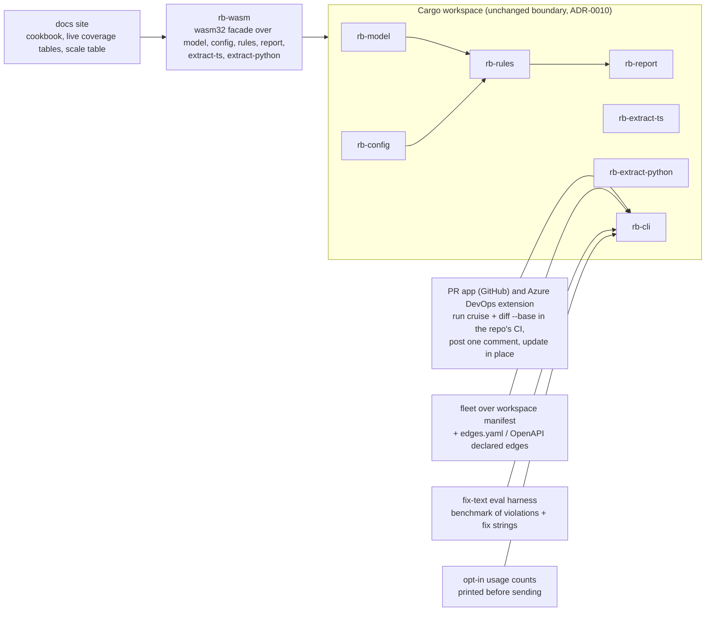
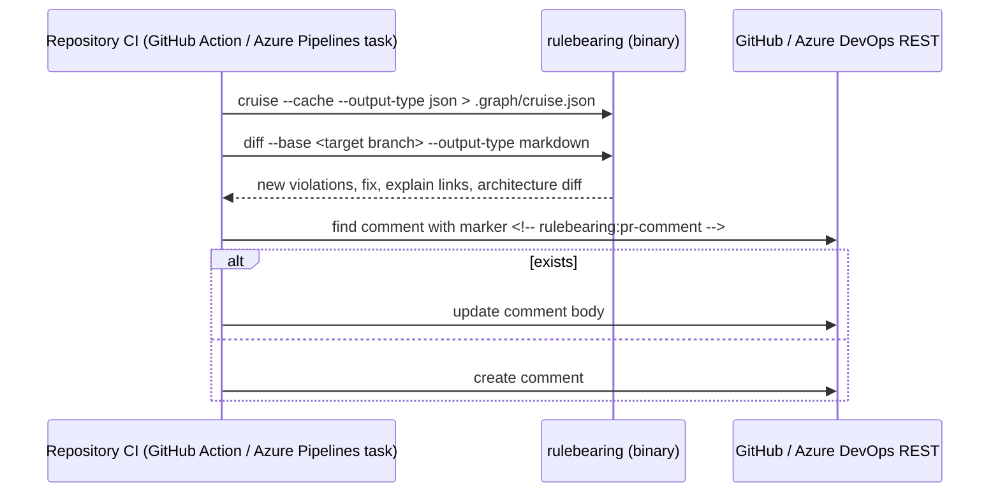
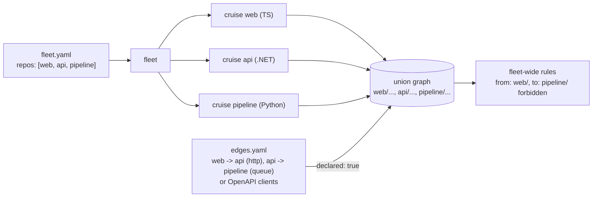

# Plan 0004: Wave 4: Reach, funded on the adoption numbers

- **Status:** Pending
- **Owner:** Ben Bahrenburg (@benbahrenburg)
- **Created:** 2026-09-20
- **Calendar estimate:** 8 weeks at ~10 h/week (from design § Waves), funded only when the entry criterion in § 1.2 is met
- **Derives from:** [design § Waves](../../artifacts/design.md#waves) (row 4), [design § How to know, rather than believe](../../artifacts/design.md#how-to-know-rather-than-believe), [design § The developer relations hat](../../artifacts/design.md#the-developer-relations-hat-the-first-ten-minutes-and-the-brownfield-repo), [design § The agentic engineering hat](../../artifacts/design.md#the-agentic-engineering-hat-turn-two), [design § The architect's hat](../../artifacts/design.md#the-architects-hat-across-repos-and-across-time), [design § The five to fund first](../../artifacts/design.md#the-five-to-fund-first), [design § What stays honest across the boundary](../../artifacts/design.md#what-stays-honest-across-the-boundary), [design § Specification coverage](../../artifacts/design.md#specification-coverage), [design § Test beds](../../artifacts/design.md#test-beds-open-source-repositories-to-validate-against), [design § Adoption order](../../artifacts/design.md#adoption-order), [design § Open questions](../../artifacts/design.md#open-questions), [design § Why Rust wins](../../artifacts/design.md#why-rust-wins); [dependency-cruiser coverage](../../artifacts/dependency-cruiser-18.2.0-coverage.md) and [ArchUnitNET coverage](../../artifacts/archunitnet-0.13.4-coverage.md) (the live coverage tables render these)
- **Satisfies:** [FR-REACH-01](../../prd.md#fr-reach-01), [FR-REACH-02](../../prd.md#fr-reach-02), [FR-REACH-03](../../prd.md#fr-reach-03), [NFR-ADOPT-01](../../prd.md#nfr-adopt-01), [NFR-CONF-03](../../prd.md#nfr-conf-03), [NFR-SEC-01](../../prd.md#nfr-sec-01), [NFR-QUAL-01](../../prd.md#nfr-qual-01), [NFR-DOC-01](../../prd.md#nfr-doc-01)
- **Applies:** [ADR-0002](../../adr/0002-rust-as-implementation-language.md), [ADR-0004](../../adr/0004-graph-document-is-cruise-result-superset.md), [ADR-0006](../../adr/0006-embedded-quickjs-config-evaluator.md), [ADR-0009](../../adr/0009-conformance-suites-as-specification.md), [ADR-0010](../../adr/0010-crate-layout-and-extractor-boundary.md), [ADR-0014](../../adr/0014-no-invented-cross-language-edges.md), [ADR-0015](../../adr/0015-stable-violation-id.md), [ADR-0018](../../adr/0018-test-coverage-threshold.md), [ADR-0019](../../adr/0019-mit-licence.md), [ADR-0021](../../adr/0021-agent-surface-cli-first.md)
- **Architecture:** [§ System context](../../architecture.md#system-context), [§ Crate layout](../../architecture.md#crate-layout), [§ The graph document](../../architecture.md#the-graph-document), [§ Agent surface](../../architecture.md#agent-surface), [§ Distribution](../../architecture.md#distribution), [§ Security posture](../../architecture.md#security-posture), [§ Verification strategy](../../architecture.md#verification-strategy), [§ Risks and their mitigations](../../architecture.md#risks-and-their-mitigations)
- **Depends on:** [Plan 0003 (wave 3)](0003-wave-3-operations-surface-inner-loop.md) and [NFR-ADOPT-01](../../prd.md#nfr-adopt-01) met for two consecutive months; **Enables:** nothing scheduled; the adoption review in 4E decides what follows
- **Exit criterion (from design § Waves):** "The six adoption signals met for two consecutive months on the repos where they can be measured; one greenfield test bed maintainer accepting a proposed rule set."

## 1. Architect section (for the architectural review board)

### 1.1 Purpose and business value

Waves 0 to 3 build the tool. Wave 4 builds the reach around it, and the design is explicit that it is paid for by evidence rather than in advance: "the playground, the pull-request app, `fix --plan`, `fleet` and the eval harness are a fourth wave, funded on the adoption numbers" ([design § The five to fund first](../../artifacts/design.md#the-five-to-fund-first)); "wave 4 is funded on the adoption numbers, not in advance" ([design § Delivery plan](../../artifacts/design.md#delivery-plan)).

The value of each item is stated in the three hats:

| Item | What it buys (design) | Hat |
| --- | --- | --- |
| Browser playground from the same crates compiled to WebAssembly | "Try before install; the docs site embeds it beside every rule kind; Rust makes this nearly free" | developer relations |
| Rules cookbook | "The doc an agent and a human both read when they do not know the syntax" | developer relations |
| Pull-request app for GitHub and an Azure DevOps extension | "The place a reviewer and an agent both see the same finding" | developer relations |
| `fix --plan <rule>` | "`place` says where; `fix --plan` says how; an agent picks the cheapest and executes it" | agentic engineering |
| Eval harness for `fix` text | "Turns 'is our fix text any good' into a number, and catches the boilerplate the config linter cannot" | agentic engineering |
| `fleet` over a workspace manifest | "A microservice estate is a fleet, not a repo, and its boundaries are between repos" | architect |
| Declared cross-service edges | "Lets a rule span a TypeScript app and the .NET service it calls, without pretending the tool found the edge" | architect |
| Opt-in anonymous usage counts | "Tells me which rules fire and which commands nobody uses, which decides the next cookbook page" | developer relations |

### 1.2 Entry criterion and the decision rule

This plan is not started on a date. It is started when [NFR-ADOPT-01](../../prd.md#nfr-adopt-01)'s six signals, measured from wave 1 on "the repositories where I can see agent-authored pull requests: my own, the private monorepo where dependency-cruiser runs today, and any test bed whose maintainers accept the drop-in" ([design § How to know, rather than believe](../../artifacts/design.md#how-to-know-rather-than-believe)), have been met for two consecutive months:

| Signal | Target after two months |
| --- | --- |
| Share of agent-authored pull requests whose first CI run passes the boundary gate | above 90%, from a baseline measured before the switch |
| Median time from a violation appearing to green, in agent turns | one turn |
| Rules added by agents that fail `rulebearing test` or liveness before merge | any number, as long as it is caught |
| p95 of the Stop-hook run with `--affected` | under 2 seconds |
| Rules carrying `fix` text | above 80% |
| Budget-file edits that raise a ceiling | zero merged |

**The decision rule, verbatim in substance from the design:** "If the first two numbers do not move, the tool is a better dependency-cruiser and nothing more, which is still worth having for the .NET and Python repos, and the agent surface should be cut back to the `agent` reporter and the hook." Applied to this plan:

- If the first two signals (first-run pass rate, one-turn median) have not moved from their baseline after two months of measurement, the agent surface is cut back to the `agent` reporter and the Stop hook ([ADR-0021](../../adr/0021-agent-surface-cli-first.md) item 4), and wave 4's agent features (`fix --plan`, the eval harness, sub-wave 4C) are **not funded**. The remaining sub-waves (4A, 4B, 4D, 4E) may still be funded on the other four signals and on the .NET and Python adoption, because they serve reviewers and architects rather than agents.
- If all six are met for two consecutive months, the whole wave is funded in the order of § 3.
- The measurement itself is a wave 1 deliverable ([ADR-0021](../../adr/0021-agent-surface-cli-first.md)); this plan adds nothing to it except the review in 4E that reads it.

### 1.3 Scope

**In scope**, verbatim from [design § Waves](../../artifacts/design.md#waves) row 4:

| Item | Specified by |
| --- | --- |
| The WebAssembly playground and docs site with the cookbook and live coverage tables (the crates compile to `wasm32`) | [design § The developer relations hat](../../artifacts/design.md#the-developer-relations-hat-the-first-ten-minutes-and-the-brownfield-repo) (playground, cookbook); [design § Specification coverage](../../artifacts/design.md#specification-coverage) (the two tables as the ledger); [ADR-0002](../../adr/0002-rust-as-implementation-language.md) (consequence: "a WebAssembly playground is nearly free because the crates compile to `wasm32`") |
| The pull-request app for GitHub and an Azure DevOps extension: "one comment per run with new violations, the `fix`, an `explain` link and the architecture diff, updated in place" | [design § The developer relations hat](../../artifacts/design.md#the-developer-relations-hat-the-first-ten-minutes-and-the-brownfield-repo) |
| `fix --plan <rule>`: "for each violation, the three cheapest refactors that clear it, as a machine-readable plan (move file to a legal directory, introduce a port in package X, invert the edge), each with the number of edges it touches" | [design § The agentic engineering hat](../../artifacts/design.md#the-agentic-engineering-hat-turn-two) |
| `fleet` over a workspace manifest listing sibling repositories: "one run, one report across ten repositories, with per-repo and fleet-wide rules" | [design § The architect's hat](../../artifacts/design.md#the-architects-hat-across-repos-and-across-time) |
| Declared cross-service edges (`edges.yaml`, or read from OpenAPI clients), marked `declared` rather than detected | [design § The architect's hat](../../artifacts/design.md#the-architects-hat-across-repos-and-across-time); [ADR-0014](../../adr/0014-no-invented-cross-language-edges.md); [architecture § The graph document](../../architecture.md#the-graph-document) (`declared` on a dependency) |
| The `fix`-text eval harness: "a benchmark of violations with their `fix` strings, run against an agent, scoring whether the fix cleared the rule without widening it" | [design § The agentic engineering hat](../../artifacts/design.md#the-agentic-engineering-hat-turn-two) |
| Opt-in, anonymous usage counts per rule and per command, off by default and printed before sending | [design § The developer relations hat](../../artifacts/design.md#the-developer-relations-hat-the-first-ten-minutes-and-the-brownfield-repo); [architecture § Security posture](../../architecture.md#security-posture) |
| The adoption review that reads the six signals and applies the decision rule | [design § How to know, rather than believe](../../artifacts/design.md#how-to-know-rather-than-believe) |

**Out of scope:** any inferred cross-language edge (the tool "does not guess"; [design § What stays honest across the boundary](../../artifacts/design.md#what-stays-honest-across-the-boundary)); automatic application of a `fix --plan` step (the plan is machine-readable; the agent executes it); a hosted service that holds repository credentials (see the decision in § 1.7); usage counts that are on by default or that carry identifying data; any new rule family or reporter beyond those the earlier waves delivered.

### 1.4 Requirements traceability

| Requirement | What this wave delivers for it | Verification |
| --- | --- | --- |
| [FR-REACH-01](../../prd.md#fr-reach-01) | `rb-wasm` (the crates for `wasm32-unknown-unknown`), the playground page, the docs site, the cookbook, the live coverage tables | playground evaluates the wave 1 mutation fixture in the browser with the same violations as the CLI; coverage tables regenerated from conformance results by the nightly; each cookbook page's rule passes `rulebearing test` in CI |
| [FR-REACH-02](../../prd.md#fr-reach-02) | the GitHub pull-request app and the Azure DevOps extension, each posting one comment per run, updated in place | end-to-end test on a fixture repository: two runs, one comment, edited; the comment body byte-equal to `diff --output-type markdown` plus the `fix` and `explain` link block |
| [FR-REACH-03](../../prd.md#fr-reach-03) | `fix --plan`; `fleet`; `edges.yaml` and OpenAPI-derived declared edges; the eval harness; usage counts | plan fixture with expected JSON; fleet fixture of three repositories; declared-edge fixture with `declared: true` and a rule spanning languages that now matches; harness scores on the benchmark; the printed-before-sending test and the off-by-default test |
| [NFR-ADOPT-01](../../prd.md#nfr-adopt-01) | the adoption review (4E) reading the six signals and applying the decision rule | review document with the numbers, linked from the status table |
| [NFR-CONF-03](../../prd.md#nfr-conf-03) | the live coverage tables and scale table on the docs site | nightly publishes them |
| [NFR-SEC-01](../../prd.md#nfr-sec-01) | usage counts off by default, printed before sending; the playground runs entirely in the browser; the PR app runs inside the repository's own CI | tests; no network call from the binary unless `telemetry.enabled: true` |
| [NFR-QUAL-01](../../prd.md#nfr-qual-01) | 70% lines on `rb-wasm`, the app, the extension, the harness | CI |
| [NFR-DOC-01](../../prd.md#nfr-doc-01) | the docs site renders `docs/` and the coverage tabs; every page links its design section | link checker in the docs build |

### 1.5 Architecture of what this wave builds

The binary and its crates are unchanged in shape. Wave 4 adds four things around them:



#### The playground and docs site

`rb-wasm` is a thin facade crate compiled to `wasm32-unknown-unknown` exposing `evaluate(config: &str, cruise_json: &str) -> String` (rules over a pasted graph document), `cruise_ts(files: Map, config: &str) -> String` and `cruise_py(files: Map, config: &str) -> String` (extract and evaluate a dropped small repository), and `explain(config, cruise_json, rule) -> String`. It links `rb-model`, `rb-config` (native front-end; the QuickJS evaluator behind a feature that is off unless `rquickjs` builds for `wasm32`), `rb-rules`, `rb-report`, `rb-extract-ts` and `rb-extract-python`. The .NET extractor reads assemblies that require a build, which a browser cannot run, so the playground accepts a pasted cruise JSON for .NET rather than dropped `.dll` files. The docs site is static, built from `docs/`, the cookbook pages and the two coverage tabs, and embeds the playground beside each rule kind ([design § The developer relations hat](../../artifacts/design.md#the-developer-relations-hat-the-first-ten-minutes-and-the-brownfield-repo)). "Live" coverage tables means the Parity status column is written by the nightly from the conformance results rather than by hand, which is what makes the tables "the ledger the delivery plan's conformance gates report against" ([design § Specification coverage](../../artifacts/design.md#specification-coverage)).

#### The pull-request comment



The comment carries what the design lists and nothing else: new violations, the `fix`, an `explain` link, and the architecture diff, updated in place. The `diff --base` command from wave 3 produces the body; the app and the extension only post it.

#### `fix --plan`

`fix --plan <rule>` reads the cached graph and, for each violation of the rule, enumerates candidate refactors from three templates the design names (move the file to a legal directory, introduce a port in a package, invert the edge), costs each by the number of edges it touches, and prints the three cheapest as JSON. The "move" candidate reuses `place` (wave 2) to find legal directories; the "port" candidate reuses `can-import` to find a package both sides may import; the "invert" candidate checks that the reversed edge is legal and counts the dependents that must change. The plan is machine-readable and the agent executes it; the tool does not edit files.

#### `fleet` and declared edges

`fleet` reads a workspace manifest listing sibling repositories, runs one cruise per repository (using each repository's own config and cache), and evaluates fleet-wide rules over the union of the graph documents with each module path prefixed by its repository name. Declared edges come from `edges.yaml` or from OpenAPI clients found in a repository, and every one carries `declared: true` on the dependency ([architecture § The graph document](../../architecture.md#the-graph-document)) so a reader can tell it from a detected edge. [ADR-0014](../../adr/0014-no-invented-cross-language-edges.md) stays intact: the tool records what the manifest declares and never infers.



#### The eval harness and usage counts

The harness is a benchmark: a set of violations with their `fix` strings and the repository state they occur in, an agent invoked per violation with the `agent` reporter output, and a score for whether the fix cleared the rule without widening it (the widened case is detected by `config lint` on the resulting config and by the ratchet refusing a raised ceiling). It runs outside CI, on demand, and its results are a table in the docs. Usage counts are a per-rule and per-command counter, off by default, printed to stdout before any send, and sent only when `telemetry.enabled: true` is set in the config or `--usage-counts send` is passed.

### 1.6 Interfaces and contracts this wave freezes

**`rb-wasm` exports** (wasm-bindgen; strings in, strings out, so the page needs no shared types):

```rust
#[wasm_bindgen] pub fn evaluate(config: &str, cruise_json: &str, output_type: &str) -> Result<String, JsValue>;
#[wasm_bindgen] pub fn cruise_ts(files: JsValue /* Map<path, source> */, config: &str, output_type: &str) -> Result<String, JsValue>;
#[wasm_bindgen] pub fn cruise_py(files: JsValue, config: &str, output_type: &str) -> Result<String, JsValue>;
#[wasm_bindgen] pub fn explain(config: &str, cruise_json: &str, rule: &str) -> Result<String, JsValue>;
#[wasm_bindgen] pub fn version() -> String;
```

**Pull-request comment body**: a marker line `<!-- rulebearing:pr-comment v1 -->`, then the `diff --output-type markdown` output, then a "Fix" block per new violation (`fix` text and the `explain` link into the docs site), then the receipt line. The GitHub Action input and the Azure DevOps task input are the same four fields: `base`, `config`, `cache`, `comment: update|always-new`.

**`fix --plan` output**:

```json
{
  "rule": "no-cross-app-imports",
  "violations": [
    { "id": "RB-4f2a9c1e", "from": "apps/web/src/x.ts", "to": "apps/worker/src/y.ts",
      "plans": [
        { "kind": "move", "target": "packages/shared/src/", "edgesTouched": 1, "legalBy": "can-import" },
        { "kind": "port", "package": "packages/contracts", "edgesTouched": 2 },
        { "kind": "invert", "edgesTouched": 5, "dependentsToChange": ["apps/worker/src/z.ts"] }
      ] }
  ]
}
```

**Workspace manifest and declared edges**:

```yaml
# fleet.yaml
repos:
  - { name: web,      path: ../web,      config: rulebearing.yaml }
  - { name: api,      path: ../api,      config: rulebearing.yaml }
  - { name: pipeline, path: ../pipeline, config: rulebearing.yaml }
rules:
  dependencies:
    forbidden:
      - name: web-never-reaches-pipeline
        comment: "adr:0021"
        from: { path: "^web/" }
        to:   { path: "^pipeline/" }
```

```yaml
# edges.yaml
declared:
  - from: web/src/api/client.ts
    to: api/src/Web/Endpoints/Orders.cs
    kind: http
    comment: "OrdersClient calls POST /orders. adr:0007"
openapi:
  - client: web/src/api/generated/     # edges read from the client's operation ids to the server's endpoints
    server: api/openapi.json
```

Every edge from either source carries `declared: true` and `dependencyKind: declared`; `--strict-schema` strips them ([ADR-0004](../../adr/0004-graph-document-is-cruise-result-superset.md)).

**Eval harness record**:

```json
{ "case": "no-cross-app-imports/RB-4f2a9c1e", "fix": "Call the other app over its API, or move the shared code into packages/*.",
  "agent": "claude-code", "turns": 1, "cleared": true, "widened": false, "budgetRaised": false }
```

**Usage counts payload** (printed in full before any send):

```json
{ "tool": "rulebearing", "version": "0.4.0", "period": "2026-11", "commands": { "cruise": 412, "can-import": 3891, "fix": 12 },
  "rules": { "sha256:…": 14, "rulebearing-rules/nextjs/pages-only-import-features": 3 } }
```

No path, no repository name, no user. Rule names from the public library are sent as is; any other rule name is hashed with a per-repository salt stored beside the cache, so counts are comparable within a repository and meaningless across them.

### 1.7 Decisions applied, and decisions this wave must make

| ADR | Why it matters in this wave |
| --- | --- |
| [ADR-0002](../../adr/0002-rust-as-implementation-language.md) | the playground is the consequence the ADR names: the crates compile to `wasm32` |
| [ADR-0004](../../adr/0004-graph-document-is-cruise-result-superset.md) | `declared: true` and `dependencyKind: declared` are additive and stripped by `--strict-schema` |
| [ADR-0006](../../adr/0006-embedded-quickjs-config-evaluator.md) | the playground's config evaluator is the same sandbox or is absent; never a page-level `eval` |
| [ADR-0009](../../adr/0009-conformance-suites-as-specification.md) | the live coverage tables are written from conformance results; a row cannot say Parity by hand |
| [ADR-0010](../../adr/0010-crate-layout-and-extractor-boundary.md) | `rb-wasm` is a facade outside the dependency direction; no crate depends on it |
| [ADR-0014](../../adr/0014-no-invented-cross-language-edges.md) | declared edges are the ADR's named wave 4 addition and are marked, never inferred |
| [ADR-0015](../../adr/0015-stable-violation-id.md) | the PR comment, `fix --plan` and the harness reference violations by stable id |
| [ADR-0018](../../adr/0018-test-coverage-threshold.md) | the app, the extension, `rb-wasm` and the harness are at or above 70% |
| [ADR-0019](../../adr/0019-mit-licence.md) | the docs site generator and wasm toolchain pass `cargo deny` and the npm licence check |
| [ADR-0021](../../adr/0021-agent-surface-cli-first.md) | item 4 is the funding decision rule for this wave |

Decisions the design leaves open, with the rule this plan applies:

| Open point | Decision rule |
| --- | --- |
| Hosting of the pull-request "app" | No hosted service. The GitHub app is a GitHub Action using the workflow token to create and update the comment, listed on the Marketplace; the Azure DevOps extension is a pipeline task on the Visual Studio Marketplace using the build's system token. If a capability the design names (updated in place, an `explain` link) cannot be delivered that way, a hosted app becomes a new ADR; until then no credential leaves the repository's own CI. |
| Which crates the `wasm32` build includes | Every crate that compiles to `wasm32-unknown-unknown` without a patch; one that does not (the candidates are `rquickjs` and any `notify` or process code in `rb-cli`) is feature-gated out of `rb-wasm`, and the playground page says which inputs it therefore cannot take. `rb-cli` is never linked; `rb-wasm` calls the library crates directly. |
| .NET in the playground | Pasted cruise JSON only; no assembly upload. The page says so. |
| `fix --plan` candidate templates | Exactly the three the design names. A fourth template is a design change. |
| `fleet` union path prefix | The repository `name` from the manifest followed by `/`; module identity inside each repository is unchanged, so per-repo rules and caches are reused as is. |
| OpenAPI-derived edges | Read only from a client directory that the manifest names, matching operation ids to the server's endpoint handlers by the operation id the server's OpenAPI document records; when the server document lacks operation ids, no edge is produced and the receipt says why. |
| Eval harness agent and budget | The agent under test and its token budget are parameters of the run, recorded in every result row; the harness ships with one configuration (Claude Code with the repository's `hooks install` output) and the benchmark of violations from the mutation branch and the .NET oracles' imported rules. |
| Usage counts transport and endpoint | HTTPS POST to a single documented endpoint under the project's domain, sent at most once per calendar month, only when enabled, and only after the payload has been printed. `--usage-counts print` shows the payload without sending. A CI environment (detected by `CI=true`) never sends unless `telemetry.ciAllowed: true`. |
| Cookbook page format | One page per architecture question with the rule in both config formats, the failing edge, and the fix, as the design lists; each rule in a page is a fixture that `rulebearing test` runs in the docs build so a page cannot drift. |

### 1.8 Quality attributes

| Attribute | Target | How measured |
| --- | --- | --- |
| Performance: playground | evaluate the wave 1 mutation fixture in the browser in under 500 ms after load; the wasm binary under 8 MB compressed | Playwright test in the docs build; size check |
| Performance: PR comment | end to end under the cruise's own time plus 5 s | Action integration test timing |
| Performance: `fleet` | linear in the sum of the repositories' cruise times; caches reused | fixture timing |
| Security | the binary makes no network call unless usage counts are enabled; the PR app holds no credentials beyond the CI token; the playground runs entirely client-side | network assertion test; code review checklist; CSP on the docs site |
| Reliability | a missing repository in a fleet manifest or a malformed `edges.yaml` exits 2 with a named reason; a failed comment update does not fail the gate (the exit code is the cruise's) | error-path tests |
| Compatibility | `declared` edges validate after `--strict-schema` stripping; the playground's output equals the CLI's for the same inputs | gate 1 layer 4; equality test |
| Observability | receipts record `declared: { edgesYaml: n, openapi: n }` and `fleet: { repos: n }`; usage payload printed | fixtures |

### 1.9 Dependencies

| Dependency | Version policy | Licence | Used by |
| --- | --- | --- | --- |
| `wasm-bindgen`, `wasm-pack`, `wasm-opt` | pinned | MIT / Apache-2.0 | `rb-wasm` |
| a static site generator (`mdbook` or `zola`) | pinned; choose the one whose licence and plugin model pass `cargo deny` and that can embed the playground | MPL-2.0 (mdbook) / MIT (zola); mdbook is used as a build tool, not linked, so MPL is acceptable under [ADR-0019](../../adr/0019-mit-licence.md) | docs site |
| Playwright | pinned | Apache-2.0 | playground tests |
| `@actions/core`, `@actions/github` | pinned | MIT | the GitHub Action |
| `azure-pipelines-task-lib`, `tfx-cli` | pinned | MIT | the Azure DevOps task |
| `openapiv3` (Rust) | pinned | MIT / Apache-2.0 | declared edges from OpenAPI |
| `ureq` or `reqwest` (rustls) | pinned; behind the `usage-counts` feature so the default build carries no HTTP client if the feature is off | MIT / Apache-2.0 | usage counts |
| An agent runtime for the harness (Claude Code) | recorded per run, not pinned | n/a | the eval harness, outside CI |

### 1.10 Risks

| Risk | Likelihood | Impact | Mitigation | Trigger |
| --- | --- | --- | --- | --- |
| The entry criterion is never met, so the wave is never funded | medium | low for the project (the design says the tool is still worth having); high for this plan | the decision rule in § 1.2 funds 4A, 4B, 4D and 4E on the other signals; only 4C depends on the first two | the two-month review |
| `rquickjs` or another crate does not build for `wasm32` | medium | low | feature-gate; the playground accepts native-format configs and pasted JSON | `wasm-pack build` failure |
| GitHub or Azure DevOps API changes break comment updating | low | low | the marker-based find-and-update is a single function with a recorded HTTP fixture | integration test failure |
| `fix --plan` recommends a refactor that is not legal | medium | medium | every candidate is checked with `can-import` before it is printed; an unverifiable candidate is omitted | a plan fixture with an illegal candidate |
| Declared edges drift from reality | high | medium | they are marked `declared`, listed in the receipt, and `config lint` warns when a declared edge's `from` or `to` no longer exists | lint warning count |
| The eval harness measures the agent more than the fix text | high | low | the harness reports per-fix scores across at least two agent configurations before a fix string is called bad; the result is a table, not a gate | first results review |
| Usage counts erode trust | low | high | off by default; printed before sending; no path or name; documented payload; the code path is a feature | any report of unexpected sending: disable the feature in the next release |
| Single maintainer: five sub-waves after a possibly late start | high | medium | cut order fixed in § 3; 4E (the review) is the only sub-wave that cannot be cut | any sub-wave overrunning by more than a week |

### 1.11 Compliance and licence review

- Every Rust dependency passes `cargo deny`; the site generator is a build tool, not a linked dependency.
- The playground executes user-pasted configs only through the same sandbox as the CLI or not at all; the docs site sets a content security policy that forbids inline script from pasted content.
- The pull-request comment contains repository content the CI already has; nothing is sent to a third party.
- Usage counts: the payload schema is published in the docs; the endpoint's retention is stated (aggregates only, no raw payload kept beyond 30 days); this is the only network call the binary can make, and it is documented as such in [architecture § Security posture](../../architecture.md#security-posture).
- The cookbook's example rules are MIT like the rest of the repository; cookbook examples drawn from a test bed cite it.

### 1.12 Operational impact

| Area | Impact |
| --- | --- |
| CI minutes | the docs build with the wasm compile (about 6 min) on every docs change; Playwright (about 3 min); the Action and task integration tests against a fixture repository (about 4 min); the harness runs outside CI |
| Release | `rb-wasm` published to npm as `@rulebearing/wasm` if the organisation is verified, otherwise `rulebearing-wasm`; the Action and the task versioned with the binary; the docs site deployed from `main` to GitHub Pages at the `$schema` host |
| Docs | the docs site replaces the README as the primary entry; the README keeps the quick start, the scale table and the coverage summary with links |
| Support | the docs site gains a "report a wrong Parity cell" link that opens an issue with the row prefilled |

### 1.13 ARB checklist

| Question | Answer |
| --- | --- |
| What decides whether this wave runs? | The six signals for two consecutive months, with the design's rule for the first two (§ 1.2). The review is written down before any sub-wave starts. |
| Does any item change the binary's contracts? | Only additive fields (`declared`), one new subcommand family (`fix --plan`, `fleet`) and one opt-in network path. Exit codes and the graph document's frozen fields are untouched. |
| Can the playground disagree with the CLI? | No: it links the same crates, and the equality test runs the same inputs through both. |
| What credentials does the PR app hold? | None beyond the CI's own token, because there is no hosted service. |
| Can the tool now invent an edge? | No. Declared edges are read from a file the team wrote or a client the team generated, and every one is marked. |
| What is the single network call? | Usage counts, off by default, printed before sending, feature-gated. |
| What is cut first? | 4C (`fix --plan`, harness) by the decision rule; then 4D `fleet` OpenAPI edges (keeping `edges.yaml`); then the Azure DevOps extension (keeping the GitHub Action). 4E is never cut. |

## 2. Lead developer section (step-by-step implementation)

### 2.0 Conventions

- **Do not start without the gate.** The first PR of this wave is the adoption review document (step 1), and it must show the entry criterion met before any other step's branch is opened.
- **Branches and PRs.** `w4/<step-slug>`; every PR links this plan, the requirement ids and the ADRs. Required checks unchanged from wave 3, plus the docs build once 4A lands.
- **Labels.** `wave:4`, `subwave:4A` to `subwave:4E`, plus `reach`, `wasm`, `pr-app`, `fleet`, `telemetry`. Milestone `Wave 4`.
- **Running things locally.** `just docs` builds the site with the playground; `just wasm` builds `rb-wasm`; `just pr-comment --base main` renders the comment body without posting; `just fleet fixtures/fleet` runs the fleet fixture; `just eval --agent claude-code --cases fixtures/eval` runs the harness; `just usage print` prints the payload.
- **Fixtures.** `just fixtures <area>` regenerates committed expected outputs; never edit by hand.

### 2.1 Steps for sub-wave 4A: docs site, playground, cookbook, live tables

**Step 1. The adoption review that opens the wave** ([NFR-ADOPT-01](../../prd.md#nfr-adopt-01); [ADR-0021](../../adr/0021-agent-surface-cli-first.md)).
Write `docs/adoption/2026-MM-review.md` from the wave 1 measurement job's output: the six signals, per month, per repository where measurable, with the baseline. State which of the funding outcomes in § 1.2 applies. This document is the evidence for the wave's entry criterion and is linked from the 4E status table; 4E repeats it at the end of the wave.

**Step 2. `rb-wasm`** ([FR-REACH-01](../../prd.md#fr-reach-01); [ADR-0002](../../adr/0002-rust-as-implementation-language.md), [ADR-0010](../../adr/0010-crate-layout-and-extractor-boundary.md)).
New crate `crates/rb-wasm` (added to the workspace; no crate depends on it) with the five exports in § 1.6, an in-memory file system adapter for `rb-extract-ts` and `rb-extract-python` (both already take a `Fs` trait from wave 1 for testing; if they do not, add it here as the smallest change), and features `js-config` (on only when `rquickjs` builds for `wasm32`). Tests: `wasm-bindgen-test` running the wave 1 mutation fixture and comparing `evaluate()` output to the committed CLI JSON; the `cruise_ts` and `cruise_py` fixtures; a size check. Coverage 70% (measured on the native build of the same crate).

**Step 3. The docs site** ([FR-REACH-01](../../prd.md#fr-reach-01), [NFR-DOC-01](../../prd.md#nfr-doc-01)).
Under `site/`: the generator config, a theme that embeds the playground component, pages generated from `docs/` (architecture, ADRs, plans, the reference pages written in waves 1 to 3), and the schema at `/schema/v1.json` (the `$schema` URL the config names). A link checker runs in the build. Deployed to GitHub Pages from `main`.

**Step 4. Live coverage tables and the scale table** ([NFR-CONF-03](../../prd.md#nfr-conf-03); [ADR-0009](../../adr/0009-conformance-suites-as-specification.md)).
`testbeds/scripts/coverage_status.py` reads the conformance results (`target/conformance/*.json` from gate 1 and gate 2) and the two coverage tabs, and writes `site/data/coverage.json` with a status and an evidence link per row. The site renders the two tables from that file; a row whose evidence is missing renders as "unproven" regardless of the tab's text. The nightly publishes the file and the scale table alongside.

**Step 5. The cookbook** ([FR-REACH-01](../../prd.md#fr-reach-01)).
`site/cookbook/<question>.md`, one page per architecture question, starting with the three the design names ("features must not know each other", "controllers only through services", "nothing imports the producer") and the import-linter contract kinds, each with the rule in both config formats, the failing edge, and the fix. Each page's rules live in `site/cookbook/fixtures/<question>/rulebearing.yaml` with `examples`, and the docs build runs `rulebearing test` and `config convert` over them so the two formats cannot drift. The playground on each page is preloaded with the page's fixture.

### 2.2 Steps for sub-wave 4B: the pull-request app and the Azure DevOps extension

**Step 6. The comment body** ([FR-REACH-02](../../prd.md#fr-reach-02); [ADR-0015](../../adr/0015-stable-violation-id.md)).
`crates/rb-cli/src/commands/pr_comment.rs`: `rulebearing pr-comment --base <ref>` renders the marker, the wave 3 `diff --output-type markdown` body, the per-violation `fix` and `explain` link (into the docs site's rule page, `#<rule-name>`), and the receipt line. Tests: a fixture repository with two commits and the expected body byte-compared; the no-change case renders a one-line "no new violations" body.

**Step 7. The GitHub Action** ([FR-REACH-02](../../prd.md#fr-reach-02); [NFR-SEC-01](../../prd.md#nfr-sec-01)).
Under `frontends/github-pr-app/` (a TypeScript action): inputs `base`, `config`, `cache`, `comment`; runs the binary (already downloaded by the wave 1 GitHub Action), then finds the comment by marker with `@actions/github` and updates it, or creates it. Tests: vitest with recorded API fixtures for create and update; an integration workflow against a fixture repository that opens a PR, runs twice, and asserts one comment. Marketplace listing metadata in `action.yml`. Coverage 70%.

**Step 8. The Azure DevOps extension** ([FR-REACH-02](../../prd.md#fr-reach-02)).
Under `frontends/azure-devops-extension/`: a pipeline task with the same four inputs, posting a PR thread through the REST API with the system token, finding the thread by the marker and updating it. Tests: recorded fixtures; `tfx extension create` in CI; a smoke run on a fixture project. Coverage 70%.

### 2.3 Steps for sub-wave 4C: `fix --plan` and the eval harness (funded only by the § 1.2 rule)

**Step 9. `fix --plan`** ([FR-REACH-03](../../prd.md#fr-reach-03); [ADR-0021](../../adr/0021-agent-surface-cli-first.md)).
`crates/rb-cli/src/commands/fix_plan.rs` with:

```rust
pub enum PlanKind { Move { target: PathBuf }, Port { package: String }, Invert { dependents: Vec<PathBuf> } }
pub struct Plan { pub kind: PlanKind, pub edges_touched: usize, pub legal_by: &'static str }
pub fn plan_for(doc: &GraphDocument, cfg: &Config, violation: &Violation) -> Vec<Plan>; // sorted by edges_touched, at most three
```

`Move` candidates come from `place --imports <to> --imported-by <dependents of from>`; `Port` candidates from packages both sides may import per `can-import`; `Invert` from checking the reversed edge and counting dependents. Every candidate is verified with `can-import` against a synthetic graph with the change applied before it is printed. Tests: the mutation branch, one expected plan JSON per rule shape; a case where no candidate is legal prints an empty `plans` array with a reason. Also add the `--plan` block to the `agent` reporter when `--with-plans` is passed, so an agent gets the plan with the finding.

**Step 10. The eval harness** ([FR-REACH-03](../../prd.md#fr-reach-03)).
Under `eval/`: `cases/` (a violation, its repository state as a git ref in a fixture repository, the `fix` string), `run.py` (checks out the case, writes the `agent` reporter output, invokes the configured agent with a fixed prompt that includes only that output, then runs `cruise --exit-code`, `config lint` and `count` to score `cleared`, `widened` and `budgetRaised`), and `report.py` (the table). Cases: every violation on the mutation branch and the imported rules of two .NET oracles. Runs outside CI; results committed under `eval/results/<date>-<agent>.json` and rendered on the docs site. Coverage 70% on the harness code (mocked agent).

### 2.4 Steps for sub-wave 4D: `fleet` and declared edges

**Step 11. `fleet`** ([FR-REACH-03](../../prd.md#fr-reach-03); [ADR-0010](../../adr/0010-crate-layout-and-extractor-boundary.md)).
`crates/rb-cli/src/commands/fleet.rs`: read `fleet.yaml`, run each repository's cruise with its own config and cache (in parallel, bounded), prefix module paths with `<name>/`, union the documents, evaluate the manifest's fleet-wide rules with `rb-rules` unchanged, and report with any reporter. `fleet --output-type json` writes one document whose receipt carries `fleet: { repos, perRepo: {...} }`. Tests: a three-repository fixture (TypeScript, .NET compiled fixture, Python) with one fleet rule that fires and one that does not; a missing repository exits 2.

**Step 12. Declared edges** ([FR-REACH-03](../../prd.md#fr-reach-03); [ADR-0014](../../adr/0014-no-invented-cross-language-edges.md), [ADR-0004](../../adr/0004-graph-document-is-cruise-result-superset.md)).
`crates/rb-ingest/src/declared.rs`: read `edges.yaml` and, when the manifest names a client directory and a server document, match OpenAPI operation ids to the server's endpoint handlers as recorded in the server's own OpenAPI document; produce dependencies with `declared: true`, `dependencyKind: declared`, and the `comment`. `config lint` warns on a declared edge whose `from` or `to` no longer exists. Schema regenerated; `--strict-schema` strips the fields. Tests: fixture `edges.yaml`; an OpenAPI pair with and without operation ids; the liveness case: a cross-language rule that was vacuous before the declared edge now matches, proving the design's point that such a rule "matches nothing until an edge exists".

### 2.5 Steps for sub-wave 4E: usage counts and the adoption review

**Step 13. Usage counts** ([FR-REACH-03](../../prd.md#fr-reach-03), [NFR-SEC-01](../../prd.md#nfr-sec-01)).
`crates/rb-cli/src/usage/{mod.rs, payload.rs, send.rs}` behind the Cargo feature `usage-counts`: a local counter file under the cache folder incremented per command and per firing rule; `rulebearing usage print` renders the payload; `usage send` (or the monthly automatic send when `telemetry.enabled: true`) prints the payload, then posts it. Hashing of non-library rule names with the per-repository salt. Tests: off by default (no counter file written without the config key); the printed-before-sending test (a mock endpoint receives exactly what stdout showed); the CI guard; the salt test (two repositories, same rule name, different hashes).

**Step 14. The closing adoption review** ([NFR-ADOPT-01](../../prd.md#nfr-adopt-01), [NFR-ADOPT-02](../../prd.md#nfr-adopt-02)).
Repeat step 1 at the end of the wave: the six signals for the two months of the wave, the usage-count aggregates if any repository opted in, the greenfield issues opened in wave 3 and their outcomes, and whether a maintainer accepted a proposed rule set. Record which of the three outcomes in § 1.2 applies going forward and open the ADR or plan it calls for.

### 2.6 Documentation to update

| Where | What |
| --- | --- |
| docs site | everything in 4A; the `fix --plan`, `fleet`, `edges.yaml`, usage-counts pages; the eval results table |
| `README.md` | quick start pointing at the site; the Action and task snippets; the usage-counts statement |
| `CLAUDE.md` | `rb-wasm`, `site/`, `eval/` conventions and coverage exclusions |
| `schema/v1.json` | `declared`, `dependencyKind: declared`, `telemetry`, the fleet manifest schema (`schema/fleet-v1.json`), `edges.yaml` schema |
| [architecture § Security posture](../../architecture.md#security-posture) | already names usage counts as the one opt-in send; add the endpoint and retention statement |
| `docs --format skill` | `fix --plan` and `fleet` |

### 2.7 How to move this plan to implemented

1. The entry review (step 1) and the closing review (step 14) are both committed under `docs/adoption/` and show the six signals met for two consecutive months on the repositories where they can be measured.
2. One greenfield test bed maintainer has accepted a proposed rule set, linked from the 4E status table (a merged PR or an issue closed as accepted).
3. Every status-table row in § 3 is `Done` with evidence, or is marked cut with the decision rule that cut it.
4. The docs site is live at the `$schema` host and the nightly rewrites its coverage and scale tables.
5. The PR that moves the file to `docs/plans/implemented/` shows items 1 to 4 and changes only the status line.

## 3. Wave-based delivery plan

Sizing scale (from [plans/README.md](../README.md)): XS up to 1 day, S up to 3 days, M up to 1 week, L up to 2 weeks, XL more than 2 weeks, all at about 10 hours a week. The design's own cost column per feature is: playground M, cookbook S, pull-request app M, `fix --plan` L, eval harness M, `fleet` M, declared edges M, usage counts S; the sub-wave sizes below combine those with the site and review work.

Status tracking: the tables are the record; `Evidence` links the CI check, fixture, published page, review document or issue. Labels `wave:4`, `subwave:4A` to `subwave:4E`, milestone `Wave 4`, project columns `Not started`, `In progress`, `Blocked`, `Done`. A sub-wave not funded by the § 1.2 rule is marked `Blocked` with the review linked.

### Wave 4A: docs site, playground, cookbook, live coverage tables

- **Goal:** try before install, and a ledger nobody edits by hand.
- **Deliverables:** the opening adoption review; `rb-wasm`; the docs site on GitHub Pages; the cookbook with executable fixtures; coverage and scale tables written by the nightly.
- **Status table:**

| Sub-wave | Item | Status | Evidence |
| --- | --- | --- | --- |
| 4A | opening adoption review shows the entry criterion met | Not started | `docs/adoption/<date>-review.md` |
| 4A | `rb-wasm` builds; `evaluate()` equals the CLI on the mutation fixture; size under 8 MB compressed | Not started | wasm test job |
| 4A | docs site deployed; link checker green; schema served at the `$schema` URL | Not started | site URL |
| 4A | playground under 500 ms on the mutation fixture | Not started | Playwright timing |
| 4A | cookbook: the three design pages plus the import-linter kinds, fixtures under `rulebearing test` | Not started | docs build |
| 4A | coverage tables and scale table written from conformance and nightly results | Not started | `site/data/coverage.json` commit by the nightly |

- **Size:** L. **LOE:** 20 h, 2.0 weeks. Roles: maintainer.
- **Entry criteria:** wave 3 exit met; the entry criterion in § 1.2 met (or the partial-funding outcome recorded).
- **Exit criteria and gating metric:** site live; playground equality test green; coverage tables rendered from data. Gates 4B (the `explain` links point at the site).

### Wave 4B: the pull-request app and the Azure DevOps extension

- **Goal:** one comment per run where a reviewer and an agent both look.
- **Deliverables:** `pr-comment` command; the GitHub Action on the Marketplace; the Azure DevOps task on the Marketplace.
- **Status table:**

| Sub-wave | Item | Status | Evidence |
| --- | --- | --- | --- |
| 4B | `pr-comment` body fixture byte-equal | Not started | fixture |
| 4B | GitHub Action: two runs, one comment, updated in place | Not started | integration workflow |
| 4B | Azure DevOps task: same on a fixture project | Not started | smoke run |
| 4B | both at 70% coverage; Marketplace listings live | Not started | CI; listing links |

- **Size:** L. **LOE:** 18 h, 1.8 weeks. Roles: maintainer (TypeScript hat).
- **Entry criteria:** 4A merged.
- **Exit criteria and gating metric:** the integration workflow green on both platforms.

### Wave 4C: `fix --plan` and the `fix`-text eval harness

- **Goal:** the agent is told how, not only where; the `fix` text has a score.
- **Deliverables:** `fix --plan` with verified candidates; `--with-plans` in the `agent` reporter; the harness under `eval/` with its first results table.
- **Status table:**

| Sub-wave | Item | Status | Evidence |
| --- | --- | --- | --- |
| 4C | funded by the § 1.2 rule (first two signals moved) | Not started | opening review |
| 4C | `fix --plan` fixtures, one per rule shape, every candidate verified by `can-import` | Not started | fixture tests |
| 4C | `agent --with-plans` | Not started | reporter fixture |
| 4C | harness runs the benchmark against one agent configuration; results table on the site | Not started | `eval/results/` |

- **Size:** L. **LOE:** 20 h, 2.0 weeks. Roles: maintainer; the harness needs an agent budget outside CI.
- **Entry criteria:** 4A merged; the funding outcome in § 1.2 permits it. Otherwise `Blocked` with the review linked and the hours reassigned to 4D and 4E.
- **Exit criteria and gating metric:** every plan candidate legal by construction (test); the first results table published.

### Wave 4D: `fleet` and declared edges

- **Goal:** boundaries between repositories, without inventing an edge.
- **Deliverables:** `fleet` with the manifest schema; `edges.yaml`; OpenAPI-derived declared edges; `config lint` on stale declared edges.
- **Status table:**

| Sub-wave | Item | Status | Evidence |
| --- | --- | --- | --- |
| 4D | `fleet` three-repository fixture; per-repo caches reused | Not started | fixture tests |
| 4D | `edges.yaml` edges marked `declared: true`; `--strict-schema` strips them | Not started | schema test |
| 4D | OpenAPI edges with and without operation ids | Not started | fixtures |
| 4D | a formerly vacuous cross-language rule matches through a declared edge | Not started | liveness fixture |

- **Size:** L. **LOE:** 14 h, 1.4 weeks. Roles: maintainer.
- **Entry criteria:** wave 3's cache and `diff` in place (they are); 4A not required.
- **Exit criteria and gating metric:** the fleet fixture and the liveness fixture green.

### Wave 4E: usage counts and the closing adoption review

- **Goal:** know which rules fire and which commands nobody uses, with consent; and decide what comes after wave 4 on the numbers.
- **Deliverables:** the `usage-counts` feature; the payload documentation; the closing review under `docs/adoption/`.
- **Status table:**

| Sub-wave | Item | Status | Evidence |
| --- | --- | --- | --- |
| 4E | off by default; printed before sending; CI guard; salted hashes | Not started | tests |
| 4E | payload schema and retention published on the site | Not started | page link |
| 4E | closing adoption review with the six signals for the wave's two months | Not started | `docs/adoption/<date>-review.md` |
| 4E | one greenfield maintainer accepted a proposed rule set | Not started | merged PR or accepted issue |

- **Size:** M. **LOE:** 8 h, 0.8 weeks. Roles: maintainer.
- **Entry criteria:** 4A merged (the payload page lives on the site); the wave's two months elapsed for the review.
- **Exit criteria and gating metric:** the exit criterion of the plan: six signals for two consecutive months; one maintainer acceptance.

### Wave summary

| Sub-wave | Size | LOE hours | Calendar weeks | Gating metric |
| --- | --- | --- | --- | --- |
| 4A docs site, playground, cookbook, live tables | L | 20 | 2.0 | site live; playground equals CLI; tables from data |
| 4B PR app and Azure DevOps extension | L | 18 | 1.8 | one comment, updated in place, both platforms |
| 4C `fix --plan` and eval harness | L | 20 | 2.0 | candidates legal by construction; first results table |
| 4D `fleet` and declared edges | L | 14 | 1.4 | fleet and liveness fixtures |
| 4E usage counts and adoption review | M | 8 | 0.8 | six signals two months; one acceptance |
| **Total** |  | **80** | **8.0** | matches the 8-week calendar estimate |

**What could slip and what we cut first.** The funding rule is the first cut: if the first two signals have not moved, 4C is not started and its 20 hours are returned; the wave then runs at 6 weeks. After that, the cut order is: the OpenAPI half of 4D (keeping `edges.yaml`, which delivers the design's marked-edge promise on its own); the Azure DevOps extension in 4B (keeping the GitHub Action, since every oracle repository found is on GitHub); the cookbook beyond the three design pages in 4A. 4E is never cut, because the closing review is what decides whether anything follows this wave. The exit criterion depends on maintainers as much as on code, so the greenfield acceptance may arrive after the code is done; the plan stays pending until it does.

**Exit criterion checklist for moving this plan to `docs/plans/implemented/`:**

- [ ] the six adoption signals met for two consecutive months on the repos where they can be measured, shown in the opening and closing reviews
- [ ] one greenfield test bed maintainer accepting a proposed rule set, linked
- [ ] docs site live with the playground, cookbook and tables written from data
- [ ] pull-request comment working on GitHub and Azure DevOps fixture repositories
- [ ] `fix --plan` and the harness delivered, or marked cut by the § 1.2 rule with the review linked
- [ ] `fleet` and declared edges delivered with every declared edge marked
- [ ] usage counts off by default and printed before sending, with the payload documented
- [ ] every status-table row `Done` or cut with its rule
