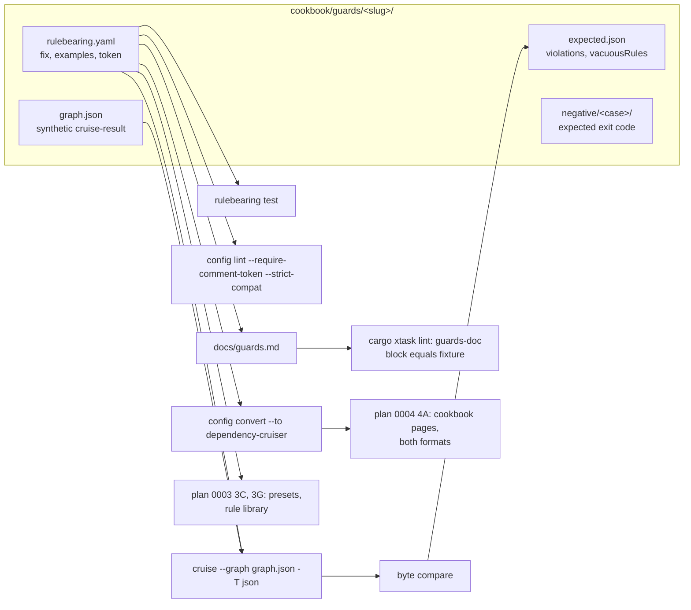

# Plan 0005: The guard catalogue: quality, convention and lifecycle guards as executable recipes

- **Status:** Pending
- **Owner:** Ben Bahrenburg (@benbahrenburg)
- **Created:** 2026-09-24
- **Calendar estimate:** 5 weeks at ~10 h/week, of which one sub-wave waits on wave 2
- **Derives from:** [design § The rule file](../../artifacts/design.md#the-rule-file) (the guards a heavy user writes by hand), [design § The native format](../../artifacts/design.md#the-native-format), [design § Dependency rules](../../artifacts/design.md#dependency-rules-the-whole-of-dependency-cruiser-1820), [design § Element rules](../../artifacts/design.md#element-rules-archunitnet-declarative), [design § Slice rules](../../artifacts/design.md#slice-rules), [design § Diagram rules](../../artifacts/design.md#diagram-rules), [design § Shorthands](../../artifacts/design.md#shorthands), [design § Rule metadata that says what to do](../../artifacts/design.md#rule-metadata-that-says-what-to-do), [design § Rules an agent writes](../../artifacts/design.md#rules-an-agent-writes-held-to-the-same-bar), [design § Where it would be ignored](../../artifacts/design.md#where-it-would-be-ignored) (the cheapest path to green), [design § Docs derived from the rules](../../artifacts/design.md#docs-derived-from-the-rules-never-written-beside-them), [design § The developer relations hat](../../artifacts/design.md#the-developer-relations-hat-the-first-ten-minutes-and-the-brownfield-repo) (the cookbook row); the [guard cookbook](../../artifacts/guard-cookbook.html), the derived artifact this plan turns into fixtures
- **Satisfies:** [FR-CFG-02](../../prd.md#fr-cfg-02) (the families in one file, exercised), [FR-CFG-04](../../prd.md#fr-cfg-04), [FR-CFG-05](../../prd.md#fr-cfg-05) (`config lint` and `config convert` over every recipe), [FR-CFG-06](../../prd.md#fr-cfg-06) (the preset decision), [FR-CFG-07](../../prd.md#fr-cfg-07) (`fix`, `examples`, `owner`, `expires` on every recipe), [FR-RULE-01](../../prd.md#fr-rule-01), [FR-RULE-06](../../prd.md#fr-rule-06), [FR-RULE-07](../../prd.md#fr-rule-07), [FR-RULE-09](../../prd.md#fr-rule-09) (the baseline recipe), [FR-RULE-10](../../prd.md#fr-rule-10) (no lookaround in any recipe); [FR-RULE-03](../../prd.md#fr-rule-03), [FR-RULE-04](../../prd.md#fr-rule-04), [FR-RULE-05](../../prd.md#fr-rule-05) in the sub-wave that waits on wave 2; [NFR-QUAL-01](../../prd.md#nfr-qual-01) (the recipes are tests), [NFR-DOC-01](../../prd.md#nfr-doc-01) (every recipe carries a decision token and the page cannot drift). Feeds [FR-REACH-01](../../prd.md#fr-reach-01) (the cookbook) and [FR-REACH-04](../../prd.md#fr-reach-04) (the rule library) without delivering them
- **Applies:** [ADR-0001](../../adr/0001-record-architecture-decisions.md), [ADR-0005](../../adr/0005-native-config-superset-and-compat.md), [ADR-0007](../../adr/0007-vacuous-rules-fail-by-default.md), [ADR-0008](../../adr/0008-exit-code-contract.md), [ADR-0009](../../adr/0009-conformance-suites-as-specification.md), [ADR-0014](../../adr/0014-no-invented-cross-language-edges.md), [ADR-0015](../../adr/0015-stable-violation-id.md), [ADR-0016](../../adr/0016-linear-time-regex-and-strict-compat.md), [ADR-0019](../../adr/0019-mit-licence.md), [ADR-0021](../../adr/0021-agent-surface-cli-first.md), [ADR-0023](../../adr/0023-documentation-link-and-lint-gates.md), [ADR-0024](../../adr/0024-test-quality-gates.md), [ADR-0029](../../adr/0029-ratchets-enforced-by-cruise-and-reported-in-the-summary.md), [ADR-0032](../../adr/0032-liveness-follows-the-configuration-format.md)
- **Architecture:** [Configuration and the rule language](../../architecture.md#configuration-and-the-rule-language), [The rule engine](../../architecture.md#the-rule-engine), [Outputs and CI contract](../../architecture.md#outputs-and-ci-contract), [Agent surface](../../architecture.md#agent-surface), [Verification strategy](../../architecture.md#verification-strategy), [Repository layout](../../architecture.md#repository-layout)
- **Depends on:** [Plan 0001 (Wave 1)](0001-wave-1-typescript-parity.md) sub-waves 1A, 1B and 1E (the native format, the engine, `test`, `config lint`, `explain`) for sub-waves 5A to 5C and 5E; [Plan 0002 (Wave 2)](0002-wave-2-dotnet-python-element-rules.md) (element, slice and diagram rules) for sub-wave 5D. **Feeds:** [Plan 0003 (Wave 3)](0003-wave-3-operations-surface-inner-loop.md) sub-waves 3C and 3G (framework presets and the rule library draw on the catalogue); [Plan 0004 (Wave 4)](0004-wave-4-reach.md) sub-wave 4A (the cookbook pages render from these fixtures)
- **Exit criterion:** every recipe in the guard cookbook exists as a fixture that `rulebearing test`, `config lint --require-comment-token` and a byte-compared `cruise` run prove in CI; `docs/guards.md` is verified against the fixtures by `cargo xtask lint`; the preset decision is recorded as an ADR; the element, slice and diagram recipes are proven against the wave 2 engine, or the sub-wave is marked `Blocked` with the wave 2 status row linked

## 1. Architect section (for the architectural review board)

### 1.1 Purpose and business value

The design's opening evidence is a private monorepo whose team wrote, by hand, forty-eight dependency-cruiser rules, over two hundred custom guards, a ratchet script, and a Stop hook, because "prose rules do not hold and executable rules do" ([design § Will agentic developers embrace it?](../../artifacts/design.md#will-agentic-developers-embrace-it)). Rulebearing's rule language already has a shape for each of those guards: a cycle check is `to.circular`, a dead-code sweep is `from.orphan`, a licence gate is `to.license`, a layer fence is `rules.layers`, a budget that may only fall is `rules.ratchets`, and a temporary exception is `expires` with an `owner`. What does not yet exist is the proof that each shape does what the design says on a concrete graph, written in a form a team can copy.

This plan delivers that proof as a **guard catalogue**: one fixture per guard, each a small `rulebearing.yaml` with its `examples`, a synthetic graph document, and the expected result, run in CI by the same commands a user runs. The [guard cookbook](../../artifacts/guard-cookbook.html), exported to `docs/artifacts/` on 2026-09-24, is the catalogue's first draft; this plan turns each of its recipes into a fixture and generates the user-facing page from the fixtures, so the page cannot drift from what the engine does ([design § Docs derived from the rules](../../artifacts/design.md#docs-derived-from-the-rules-never-written-beside-them)).

The business value is in three places the design names:

| Where | What the catalogue buys | Design source |
| --- | --- | --- |
| The first ten minutes | The first rule most teams want is "the usual one" for cycles, orphans, layers or features. A copied recipe that already carries `fix`, `examples` and a decision token is the fastest path from zero to a rule that passes `config lint` | [design § The developer relations hat](../../artifacts/design.md#the-developer-relations-hat-the-first-ten-minutes-and-the-brownfield-repo), cookbook row |
| Agents writing rules | An agent asked to "stop UI importing server code" will write the regex from memory in dependency-cruiser syntax. A catalogue of proven recipes is what `propose` and `init` should draw from, and what `docs --format skill` should teach | [design § Rules an agent writes](../../artifacts/design.md#rules-an-agent-writes-held-to-the-same-bar), [§ Where it would be ignored](../../artifacts/design.md#where-it-would-be-ignored) |
| The later waves | Framework presets (3C), the public rule library (3G) and the cookbook site (4A) each need a body of proven rules. Without this plan each would author its own; with it each renders or copies from one tested source | [Plan 0003 § 1.2](0003-wave-3-operations-surface-inner-loop.md#12-scope), [Plan 0004 § 2.1](0004-wave-4-reach.md#21-steps-for-sub-wave-4a-docs-site-playground-cookbook-live-tables) |

### 1.2 Scope

**In scope**

| Item | Detail |
| --- | --- |
| The catalogue fixtures | One directory per recipe under `cookbook/guards/<slug>/`: `rulebearing.yaml` (the recipe, with `fix`, `examples`, a decision token, and `owner` where the recipe is a lifecycle guard), `graph.json` (a synthetic graph document in the cruise-result shape, small enough to read), `expected.json` (the `summary.violations` and `summary.vacuousRules` the recipe must produce over that graph), and where a recipe has a failure path (a raised ceiling, an expired exception, a missing budget) a `negative/` case with the expected exit code |
| The three guard families of the cookbook | Code quality guards (cycles at module and folder scope, orphans with entry-point exclusions, unresolvable imports, test and dev-dependency leakage, copyleft licences, instability, hub modules, single-user shared code); convention guards (layers, independence in both forms, entry-point-only package imports, UI-never-imports-server, must-reach with `required`, feature public APIs); lifecycle guards (a ratchet with its budget, a baseline entry in both shapes, an expiring rule, a `defines` exception list, `allowEmpty` by rule and by list) |
| The element, slice and diagram recipes | Handlers internal and sealed, controllers named and placed, endpoints' return types, immutable entities, snake-case public Python functions, two slice rules, one diagram rule: as fixtures over the ArchUnitNET `TestAssembly` and a synthetic Python package, proven when wave 2's engine lands (5D) |
| The `guards` CI job | Builds the binary, then for each fixture runs `test`, `config lint --require-comment-token`, `config convert --to dependency-cruiser`, and `cruise --graph` compared byte for byte with `expected.json`; a negative case must exit with the code it names ([ADR-0008](../../adr/0008-exit-code-contract.md)) |
| `docs/guards.md` | The user-facing page: the cookbook's structure, every YAML block copied from a fixture. `cargo xtask lint` fails when a block differs from its fixture, in the same way the doc link check fails a broken anchor ([ADR-0023](../../adr/0023-documentation-link-and-lint-gates.md)) |
| The preset decision | Whether the quality guards that `rulebearing:recommended` does not carry become a second bundled preset, off by default, or stay recipes only. Decided by the rule in § 1.6 and recorded as an ADR |
| The hand-off | Plan 0003's 3C and 3G and plan 0004's 4A read from `cookbook/guards/` rather than authoring rules; their status tables record the source |

**Out of scope** (and where it lands)

| Item | Where |
| --- | --- |
| The cookbook web pages, the playground, "one page per architecture question with the rule in both formats" | [Plan 0004 sub-wave 4A](0004-wave-4-reach.md#wave-4a-docs-site-playground-cookbook-live-coverage-tables); this plan supplies the fixtures and the both-formats output 4A renders |
| Framework presets `nextjs`, `clean-architecture`, `django`, `fastapi`, `vertical-slices` and the `rulebearing-rules` package | [Plan 0003 sub-waves 3C and 3G](0003-wave-3-operations-surface-inner-loop.md#12-scope) ([FR-REACH-04](../../prd.md#fr-reach-04)) |
| `propose`, `test --generate`, `docs --format agents-md|skill` | [Plan 0002](0002-wave-2-dotnet-python-element-rules.md); this plan's fixtures are what `propose` should be measured against once it exists |
| Any engine change | None. A recipe that the engine cannot evaluate as the design specifies is a defect filed against plan 0001 or 0002 and the fixture is marked `Blocked` on that issue; this plan never edits `rb-rules` or `rb-config` to make a recipe pass |
| Rules for this repository's own crate graph | Already enforced by `rulebearing.yaml` (Step 9 of [Plan 0001 § 2](0001-wave-1-typescript-parity.md#2-lead-developer-section-step-by-step-implementation)) |

### 1.3 Requirements traceability

| Requirement | What this plan delivers | Verification |
| --- | --- | --- |
| [FR-CFG-02](../../prd.md#fr-cfg-02) | Every rule family of the native format appears in at least one fixture; the skeleton in the cookbook's first section validates against `schema/config-v1.json` | `guards` job; the schema test already in `rb-config` extended with the skeleton |
| [FR-CFG-04](../../prd.md#fr-cfg-04) | The `defines` exception-list recipe with `fromJson`, `select` and the default `joinWith` | Fixture `defines-exception-list`; `config expand` output committed beside it |
| [FR-CFG-05](../../prd.md#fr-cfg-05) | Every recipe passes `config lint`; every dependency-layer recipe converts to dependency-cruiser's format and the conversion report names exactly the metadata it dropped | `guards` job; `converted/.dependency-cruiser.json` committed per fixture |
| [FR-CFG-06](../../prd.md#fr-cfg-06) | The decision on a second bundled preset, and if taken, `presets/rulebearing/quality.yaml` with every rule selecting every module on its `from` side so it is never vacuous | ADR; a preset test that `extends: rulebearing:quality` alone is non-vacuous on the gate 1 layer 5 oracles |
| [FR-CFG-07](../../prd.md#fr-cfg-07) | Every recipe carries `fix` and `examples`; lifecycle recipes carry `owner` and `expires`; every `comment` carries `plan:0005-guard-catalogue` or the ADR it serves | `test` and `config lint --require-comment-token` in the `guards` job |
| [FR-RULE-01](../../prd.md#fr-rule-01) | The quality and convention recipes exercise `circular`, `orphan`, `couldNotResolve`, `dependencyTypes(Not)`, `license`, `moreUnstable`, `numberOfDependents*`, `reachable`, `scope: folder`, `$1` and `$2` captures, `pathNot` in place of lookaround | `expected.json` per fixture; a table in `docs/guards.md` maps each attribute to the recipe that proves it |
| [FR-RULE-06](../../prd.md#fr-rule-06) | The ratchet recipe with its budget file; the negative case where `count --write` would raise the ceiling | Fixture `ratchet-routes-via-service` and its `negative/raise-refused` case (non-zero exit, file unchanged) |
| [FR-RULE-07](../../prd.md#fr-rule-07) | The `layers` and `independence` recipes, and the `config expand` output that shows their expansion | Fixtures `layers-clean` and `independence-features`; expansion committed and compared |
| [FR-RULE-09](../../prd.md#fr-rule-09) | The baseline recipe in both shapes (a stable `id` with `expires` and `owner`; dependency-cruiser's `from`, `to`, `rule`); the negative case where an entry is past its date | Fixture `baseline-known-violations`; `negative/expired` exits 2 and names the entry |
| [FR-RULE-10](../../prd.md#fr-rule-10) | No recipe uses lookaround or a backreference; the entry-point recipe shows the `pathNot` form | `config lint --strict-compat` over every dependency-layer fixture |
| [FR-RULE-03](../../prd.md#fr-rule-03), [FR-RULE-04](../../prd.md#fr-rule-04), [FR-RULE-05](../../prd.md#fr-rule-05) | The element, slice and diagram recipes as fixtures over `TestAssembly` and a synthetic Python package; one negative case where a C#-only predicate is applied to a Python-only selection and exits 3 | Sub-wave 5D, after wave 2's engine; blocked until then |
| [NFR-QUAL-01](../../prd.md#nfr-qual-01) | The fixtures are tests: each asserts a result, and the negative cases assert the refusal paths the design promises | `guards` job required on every pull request |
| [NFR-DOC-01](../../prd.md#nfr-doc-01) | `docs/guards.md` cannot drift from the fixtures; every recipe carries a decision token; every link in the plan and the page resolves | `cargo xtask lint` (`guards-doc` check and the link check) |

### 1.4 Architecture of what this plan builds

Nothing in the five stages changes ([architecture § The five stages](../../architecture.md#the-five-stages)). The plan adds a verification asset and one documentation check.



**The graph documents are synthetic and small.** Each `graph.json` is written by hand or by a small generator script and contains only the modules the recipe needs, in dependency-cruiser's `cruise-result` shape ([ADR-0004](../../adr/0004-graph-document-is-cruise-result-superset.md)). The recipes are proven against the module layer, which is what a user's rule sees; the extractors are proven elsewhere by the conformance gates ([ADR-0009](../../adr/0009-conformance-suites-as-specification.md)). Where a recipe depends on a module fact the extractor supplies (`dependencyTypes: [npm-dev]`, `license`, `couldNotResolve`, instability), the graph carries the fact as the extractor would write it, and the fixture's README says which extractor row supplies it in a real run.

**The `guards` job is a user, not a test harness.** It runs the released binary with the public commands and flags, and nothing else: no test-only entry point, no hidden subcommand. That is what makes each fixture a recipe a team can copy and run the same way.

**The documentation check follows the link-check pattern.** `xtask/src/guards_doc.rs` reads `docs/guards.md`, finds each fenced YAML block whose info string names a fixture (` ```yaml guard=layers-clean `), and compares it byte for byte with that fixture's `rulebearing.yaml`. It runs inside `cargo xtask lint` and as part of the `docs` CI job, beside the link check ([ADR-0023](../../adr/0023-documentation-link-and-lint-gates.md)). It does not run inside `cargo build`, because a stale example is a documentation defect, not a compile-time one.

### 1.5 Interfaces and contracts frozen by this plan

| Contract | Frozen as |
| --- | --- |
| Fixture layout | `cookbook/guards/<slug>/{rulebearing.yaml,graph.json,expected.json,README.md}` plus optional `converted/.dependency-cruiser.json`, `expanded.yaml`, `budget.json`, `negative/<case>/{...,exit-code}`. Plan 0004's 4A renders from this layout, so a change is a change to two plans |
| Recipe slugs | Kebab-case, stable, named for the guard rather than the rule (`layers-clean`, `ratchet-routes-via-service`); the slug is the anchor in `docs/guards.md` and in the cookbook site |
| Decision token | `plan:0005-guard-catalogue` on every recipe that exists to demonstrate a shape; a real ADR where the recipe enforces a decision this repository made (the licence recipe cites [ADR-0019](../../adr/0019-mit-licence.md); the ratchet recipe cites [ADR-0029](../../adr/0029-ratchets-enforced-by-cruise-and-reported-in-the-summary.md)) |
| `expected.json` shape | `summary.violations[]` and `summary.vacuousRules[]` exactly as `cruise -T json` prints them, sorted as the engine sorts them, with the version string normalised as gate 1 layer 3 normalises it |
| The `guards-doc` info string | ` ```yaml guard=<slug> ` on a fenced block marks it as a copy of `cookbook/guards/<slug>/rulebearing.yaml`; a block with `guard=<slug>#<rule-name>` is a copy of that one rule from the file |
| The preset name, if the decision in § 1.6 adds one | `rulebearing:quality`, off by default, resolvable through `extends` like the framework presets; listed in `presets/README.md` with its wave |

### 1.6 Decisions applied and decisions to make

| ADR | Why it matters in this plan |
| --- | --- |
| [ADR-0001](../../adr/0001-record-architecture-decisions.md) | Every recipe cites a decision; the preset choice is a new ADR |
| [ADR-0005](../../adr/0005-native-config-superset-and-compat.md) | Every dependency-layer recipe converts to dependency-cruiser's format and the report names what was dropped |
| [ADR-0007](../../adr/0007-vacuous-rules-fail-by-default.md), [ADR-0032](../../adr/0032-liveness-follows-the-configuration-format.md) | Every fixture graph makes every recipe non-vacuous, except the `allowEmpty` recipe, whose point is the excuse |
| [ADR-0008](../../adr/0008-exit-code-contract.md) | Negative cases assert 2 (expired entry, missing budget) and 3 (missing token, lookaround, unanswerable predicate) |
| [ADR-0014](../../adr/0014-no-invented-cross-language-edges.md) | The element recipes never rely on a predicate the language cannot answer; the negative case proves exit 3 |
| [ADR-0015](../../adr/0015-stable-violation-id.md) | The baseline recipe keys its first entry by id, and the fixture asserts the id is stable across an unrelated edit to the graph |
| [ADR-0016](../../adr/0016-linear-time-regex-and-strict-compat.md) | `--strict-compat` over every recipe; the entry-point recipe documents the `pathNot` form |
| [ADR-0021](../../adr/0021-agent-surface-cli-first.md) | The `guards` job uses public commands only |
| [ADR-0023](../../adr/0023-documentation-link-and-lint-gates.md), [ADR-0024](../../adr/0024-test-quality-gates.md) | The `guards-doc` check joins `cargo xtask lint`; a fixture that asserts nothing is a missing assertion |
| [ADR-0029](../../adr/0029-ratchets-enforced-by-cruise-and-reported-in-the-summary.md) | The ratchet recipe asserts `summary.ratchets` and the exit code, not a separate command's output |

**Decisions this plan must make**

| Decision | Decision rule |
| --- | --- |
| Whether the quality guards `rulebearing:recommended` does not carry (test leakage, dev-dependency leakage, copyleft licence, instability, hub modules, folder cycles) become a bundled preset | `rulebearing:recommended` stays as the design and [FR-CFG-06](../../prd.md#fr-cfg-06) define it: rules with `from: {}` that are never vacuous on a repository that has files. A guard qualifies for a second preset `rulebearing:quality` only if it is also never vacuous on the three gate 1 layer 5 oracles and needs no repository-specific path. Guards that pass the rule ship in the preset, off by default like the framework presets ([FR-REACH-04](../../prd.md#fr-reach-04)); guards that need a layout (`src/shared/`, `packages/`) stay recipes only. If no guard qualifies, the ADR records that and no preset is added. Either outcome is ADR-0033 |
| Where the fixtures live | `cookbook/guards/` at the repository root, beside `conformance/` and `testbeds/`, because the fixtures are a verification asset the `guards` job runs, not documentation, and because plan 0004's 4A renders the site from them. Plan 0004's Step 5 path (`site/cookbook/fixtures/`) becomes a pointer to this directory; its status table records the move when 4A starts. `docs/` holds only the generated page |
| How `expected.json` is kept honest when the engine's output order or a field changes | The compare is byte for byte after the layer 3 version normalisation; a diff is regenerated only by a pull request that explains the engine change and links the plan step that made it, the same rule as for a snapshot ([ADR-0024](../../adr/0024-test-quality-gates.md)) |
| Whether the element recipes wait for all of wave 2 or for its engine sub-wave | They wait for the sub-wave of plan 0002 that lands element, slice and diagram evaluation in `rb-rules` and the `TestAssembly` fixture in gate 2, not for the whole wave; 5D's status row links that row |
| Whether the guard cookbook artifact under `docs/artifacts/` is edited when a recipe changes | No. It is the dated export this plan started from. `docs/guards.md` is the living page; when the page and the export disagree, the page is right and the export's README says so ([docs/artifacts/README.md](../../artifacts/README.md)) |

### 1.7 Quality attributes

| Attribute | Target | Measurement |
| --- | --- | --- |
| Correctness | Every recipe produces exactly the violations its `expected.json` lists, and every negative case exits with the code it names | `guards` job, required on every pull request |
| Non-vacuity | No recipe is vacuous on its fixture graph; a preset rule is non-vacuous on the oracles | `summary.vacuousRules` empty in every `expected.json` except the `allowEmpty` recipe; the nightly preset run |
| Portability | Every dependency-layer recipe passes `--strict-compat` and converts to a dependency-cruiser file that dependency-cruiser 18.2.0 loads | `guards` job; the converted file validated against the pinned schema (gate 1 layer 4 tooling) |
| Documentation fidelity | Zero drift between `docs/guards.md` and the fixtures | `cargo xtask lint` |
| Determinism | Two runs of the `guards` job on the same commit produce identical outputs | The byte compare is the determinism assertion |
| Run time | The whole `guards` job under 2 minutes on the CI runner | Job timing; the graphs are tens of modules each |

### 1.8 Dependencies

| Dependency | Licence | Used by |
| --- | --- | --- |
| The `rulebearing` binary built in the same job | MIT | `guards` job |
| `jq` (CI runner image) | MIT | version normalisation in the compare, as gate 1 layer 3 does it |
| ArchUnitNET `TestAssembly` fixture from gate 2 | Apache 2.0, with `NOTICE` under `conformance/archunitnet/` | Sub-wave 5D |
| No new Rust dependency | | `xtask/src/guards_doc.rs` uses the standard library and the `pulldown-cmark` or hand-rolled fence scanner already used by `doclinks.rs`; if a Markdown parser is not already in `xtask`, the scanner is a fence-matching loop, not a new crate |

### 1.9 Risks

| Risk | Likelihood | Impact | Mitigation | Trigger |
| --- | --- | --- | --- | --- |
| A recipe the cookbook shows does not behave as written once run against the engine | medium | medium | That is the plan's purpose: the fixture fails, an issue is filed against plan 0001 or 0002 with the fixture attached, and the recipe is corrected or marked `Blocked`. The cookbook export is not edited | Any red fixture in 5A |
| A convention recipe is too specific to one layout to be useful as a copy | medium | low | Each recipe's README names the layout it assumes and the one-line change for the two other common layouts (`src/` only, `apps/` and `packages/`, a .NET solution) | Reviewer cannot map a recipe to a test bed |
| The synthetic graphs drift from what the extractor writes | low | medium | Each graph is validated against the `cruise-result` schema in the `guards` job; a field the extractor would write differently is a defect against the extractor's coverage row | Schema validation fails |
| `docs/guards.md` and the wave 4A cookbook say different things | low | medium | 4A renders from the same fixtures; the `guards-doc` check covers the page, and 4A's docs build runs `rulebearing test` over the same directory | 4A opens with its own fixtures |
| The preset decision widens `recommended` | low | high | The decision rule in § 1.6 forbids it; `recommended` may change only by a plan 0001 step | A pull request edits `recommended.yaml` under this plan |
| Wave 2 slips and 5D never starts | medium | low | 5D is `Blocked`, not cut; the plan's other sub-waves are complete and the plan waits in `pending/` with 5D's row linking wave 2's status | 5D still `Blocked` at plan 0002's exit |

### 1.10 Compliance and licence review

- The recipes and the synthetic graphs are original and MIT, like the rest of the repository ([ADR-0019](../../adr/0019-mit-licence.md)). None copies a dependency-cruiser preset rule; `rulebearing:recommended` remains the only place its six rules live.
- The element recipes in 5D run over ArchUnitNET's `TestAssembly`, already vendored under `conformance/archunitnet/` with its Apache 2.0 `NOTICE`; this plan adds no new upstream material.
- The `guards` job runs the binary with no network and no code execution outside the config sandbox; no fixture is a JavaScript configuration, so the sandbox is not exercised here.
- No workflow permission widens; the `guards` job runs with `contents: read` like every other job ([ADR-0025](../../adr/0025-ci-and-supply-chain-hardening.md)).

### 1.11 Operational impact

| Area | Impact |
| --- | --- |
| CI minutes | The `guards` job adds about two minutes to every pull request; it shares the release-profile binary with the self-check job |
| Repository size | About thirty fixture directories, each a few kilobytes; no binary assets |
| Docs | `docs/guards.md` new; `docs/rules.md` and `docs/config.md` gain a one-line pointer each; `presets/README.md` gains a row if the preset is added; `CLAUDE.md` gains the `guards` job in the commands list and the fixture path in the "where things are" table |
| Support | A user who copies a recipe and gets a different result has a fixture to compare against; the fixture's README says which extractor facts a real run supplies |

### 1.12 ARB checklist

| Question | Answer |
| --- | --- |
| Does this plan change the engine, the rule language, or any contract? | No. It adds fixtures, one documentation check and one bundled preset at most. A recipe the engine cannot run is a defect against another plan |
| Why fixtures rather than documentation? | The design's finding is that prose rules do not hold. A recipe that is not run is prose |
| Why now rather than as part of wave 4's cookbook? | Waves 3 and 4 both need a proven rule body; the wave 1 engine can prove the dependency-layer recipes today, and every week the recipes exist untested is a week `init`, `propose` and agents copy unproven regexes |
| How is drift between the page and the engine prevented? | The page's YAML blocks are byte copies of fixtures checked by `cargo xtask lint`; the fixtures are run by CI |
| What does the preset decision protect? | `rulebearing:recommended` stays what the design defines; an opinionated guard is opt-in, as the framework presets are |
| What waits, and on what? | The element, slice and diagram recipes wait on wave 2's engine, with the row linked |
| What is cut first if the plan slips? | § 3, "what could slip" |

## 2. Lead developer section (step-by-step implementation)

**Conventions.** Branches `w5/<sub-wave>-<slug>`; one pull request per step or smaller; every PR names the step, the requirement IDs and the recipe slugs it adds. A recipe PR contains the fixture, its README, its `expected.json`, and the `docs/guards.md` block that copies it; nothing else. No PR under this plan touches `crates/rb-rules`, `crates/rb-config` or `presets/rulebearing/recommended.yaml`. Every recipe's `comment` ends with `plan:0005-guard-catalogue` unless it enforces a decision this repository has recorded, in which case it cites that ADR.

**Running a fixture locally**

```sh
cargo build --release
B=./target/release/rulebearing
F=cookbook/guards/layers-clean
$B test --config $F/rulebearing.yaml
$B config lint --config $F/rulebearing.yaml --graph $F/graph.json --require-comment-token --strict-compat
$B config expand --config $F/rulebearing.yaml | diff - $F/expanded.yaml
$B config convert $F/rulebearing.yaml --to dependency-cruiser | diff - $F/converted/.dependency-cruiser.json
$B cruise --config $F/rulebearing.yaml --graph $F/graph.json -T json | jq 'del(.summary.optionsUsed.version)' | diff - $F/expected.json
```

`cookbook/guards/run.sh <slug>` wraps those lines and is what the CI job calls; `run.sh --all` runs every fixture and prints one line per fixture.

### Step 1: Fixture layout, the runner and the first recipe (5A)

[FR-RULE-01](../../prd.md#fr-rule-01), [FR-CFG-07](../../prd.md#fr-cfg-07). Create `cookbook/README.md` (what a fixture is, how to add one, the info-string convention) and `cookbook/guards/run.sh` (the five commands above; `--all`; exit non-zero on the first difference; `shellcheck` clean). Write the first fixture, `no-circular`, from the cookbook's cycles recipe: a graph of six modules with one three-module cycle and one type-only edge that must not count; `expected.json` with the one violation and its `cycle[]` path; `expanded.yaml` and `converted/` committed. Add the `guards` job to `.github/workflows/ci.yml`: build the release binary, run `run.sh --all`, `permissions: contents: read`, pinned actions, a timeout. Done when the job is green on the one fixture.

### Step 2: The code quality recipes (5A)

[FR-RULE-01](../../prd.md#fr-rule-01), [FR-RULE-08](../../prd.md#fr-rule-08). One fixture each, in this order, each PR adding one or two:

| Slug | Attribute proven | Graph must contain |
| --- | --- | --- |
| `no-folder-cycles` | `scope: folder`, `circular` | Two folders whose files form a folder-level cycle without a file-level one |
| `no-orphans` | `from.orphan`, `pathNot` list | One orphan that must fire; one `page.tsx` and one `vite.config.ts` orphan that must not |
| `not-to-unresolvable` | `to.couldNotResolve` | One edge with `couldNotResolve: true` |
| `production-never-imports-tests` | `from.pathNot`, `to.path` arrays | A `src/` module importing `__tests__/fixtures.ts`; a `.test.ts` doing the same (allowed) |
| `production-never-uses-dev-dependencies` | `dependencyTypes: [npm-dev]`, `dependencyTypesNot: [type-only]` | One `npm-dev` edge from `src/`; one `npm-dev` edge that is also `type-only` (allowed) |
| `no-copyleft-in-product` | `to.license` | One package edge with `license: "GPL-3.0"`; one under `packages/tooling/` (allowed) |
| `stable-never-depends-on-unstable` | `to.moreUnstable` | Instability values that make one edge fire; the graph carries `instability` as the metrics option writes it |
| `no-hub-modules` | `module.numberOfDependentsMoreThan` | A module with 41 dependents; its `index.ts` neighbour with 41 dependents (allowed by `pathNot`) |
| `shared-means-shared` | `module.numberOfDependentsLessThan` | A `src/shared/` module with one dependent |

Every fixture graph makes the rule non-vacuous; every `examples` list has at least one `forbidden` and one `allowed` edge. `docs/guards.md` is started in this step with the "Code quality guards" section, each block carrying its `guard=<slug>` info string. Done when nine fixtures are green.

### Step 3: The convention recipes (5A)

[FR-RULE-01](../../prd.md#fr-rule-01), [FR-RULE-07](../../prd.md#fr-rule-07), [FR-RULE-10](../../prd.md#fr-rule-10).

| Slug | Attribute proven | Notes |
| --- | --- | --- |
| `layers-clean` | `rules.layers` | `expanded.yaml` shows the three expanded rules and their names `clean:<lower>-to-<higher>` |
| `independence-features` | `rules.independence` and the longhand with `${legacyApps}` | `eng/legacy-apps.json` beside the fixture; `expanded.yaml` shows the substitution |
| `packages-entered-through-index` | `$2` capture, `pathNot` in place of lookaround | A negative case `negative/lookahead` holds the same rule written with `(?!...)` and expects exit 3 |
| `ui-never-imports-server` | `$1` capture, `dependencyTypesNot: [type-only]` | One type-only edge that must not fire |
| `routes-reach-the-auth-guard` | `required` with `to.reachable: true` | One route that reaches the guard through a middleware; one that does not; one under `api/health/` excluded |
| `features-register-their-public-api` | `required` with `$1` in `to` | One feature with an index; one without |

Done when the six fixtures are green and `docs/guards.md` has its "Convention guards" section.

### Step 4: The lifecycle recipes and their negative cases (5E)

[FR-RULE-06](../../prd.md#fr-rule-06), [FR-RULE-09](../../prd.md#fr-rule-09), [FR-CFG-04](../../prd.md#fr-cfg-04), [FR-CFG-07](../../prd.md#fr-cfg-07); [ADR-0029](../../adr/0029-ratchets-enforced-by-cruise-and-reported-in-the-summary.md), [ADR-0015](../../adr/0015-stable-violation-id.md), [ADR-0032](../../adr/0032-liveness-follows-the-configuration-format.md).

| Slug | Positive case | Negative cases |
| --- | --- | --- |
| `ratchet-routes-via-service` | `budget.json` at the current count; `summary.ratchets` shows headroom zero; exit 0 | `negative/exceeded`: budget one below the count, one error; `negative/missing-budget`: no file, exit 2; `negative/raise-refused`: `count --write` against a lower count exits non-zero and leaves the file byte-identical |
| `baseline-known-violations` | Two entries, one by id with `expires` and `owner`, one in dependency-cruiser's shape; both findings reported at severity `ignore`; exit 0 | `negative/expired`: the id entry dated yesterday relative to a fixed past date, exit 2 naming the entry; `negative/unrelated-edit`: the graph with one extra module elsewhere, the id unchanged (the compare asserts the id) |
| `expiring-exception-rule` | A rule with `expires` in the future and `owner`; passes | `negative/expired`: `expires` in the past; exit 2 naming the rule |
| `defines-exception-list` | `${migratingPackages}` substituted from JSON; `expanded.yaml` shows the alternation | `negative/missing-file`: `fromJson` names a file that does not exist; `config lint` error |
| `allow-empty-by-rule` | `allowEmpty: true` on a rule matching nothing; exit 0; `summary.vacuousRules` empty | `negative/without-excuse`: the same rule without `allowEmpty`; exit 2 with the rule in `vacuousRules[]` |
| `allow-empty-by-list` | `extends: ./.dependency-cruiser.json` with the rule named in the top-level `allowEmpty` list | `negative/unknown-name`: a name that is no rule; exit 3 |

`run.sh` learns the negative convention: each `negative/<case>/` holds the files that differ and an `exit-code` file; the runner overlays the case on the fixture in a temporary directory, runs the command named in `command` (default `cruise`), and compares the exit code. The "expired" cases use dates in the past so the fixture is deterministic on any day. Done when the six fixtures and eleven negative cases are green and `docs/guards.md` has its "Budgets and exceptions" section.

### Step 5: The `guards-doc` check in xtask (5B)

[NFR-DOC-01](../../prd.md#nfr-doc-01); [ADR-0023](../../adr/0023-documentation-link-and-lint-gates.md). `xtask/src/guards_doc.rs`: scan `docs/guards.md` for fenced blocks whose info string is `yaml guard=<slug>` or `yaml guard=<slug>#<rule>`; for the first form compare the block with `cookbook/guards/<slug>/rulebearing.yaml`; for the second, with that one top-level rule extracted by name (a line-based extraction from the list item that starts the rule to the line before the next item, not a YAML round-trip, so the bytes are the author's). Report every mismatch with the file, the slug and the first differing line. Wire it into `cargo xtask lint` and into the `docs` job. Tests: a fixture directory under `xtask/tests/guards_doc/` with a matching page, a mismatching page, an unknown slug and an unknown rule name; the property test that any block equal to its fixture passes. `cargo mutants --package xtask` must show no survivor ([ADR-0024](../../adr/0024-test-quality-gates.md)). Done when a deliberate one-character edit to a block fails `cargo lint`.

### Step 6: `docs/guards.md` complete, and the pointers (5B)

Finish the page in the cookbook's order: the file, anatomy of a rule, the guard catalogue table (with a "proven by" column linking each row's fixture), the three guard sections, "prove the rule", "before you merge". Every YAML block carries a `guard=` info string except the file skeleton in the first section, which is validated by the schema test instead. Add the one-line pointers in `docs/rules.md` and `docs/config.md`, the `guards` job and `cookbook/guards/run.sh --all` to `CLAUDE.md`'s commands, and the `cookbook/` row to its "where things are" table. Done when `cargo lint` is green with the new check on.

### Step 7: The preset decision and, if taken, `rulebearing:quality` (5C)

[FR-CFG-06](../../prd.md#fr-cfg-06), [FR-REACH-04](../../prd.md#fr-reach-04); [ADR-0005](../../adr/0005-native-config-superset-and-compat.md). Run each candidate quality recipe, rewritten with `from: {}` where its layout-specific `from` allowed, over the three gate 1 layer 5 oracle checkouts with `rules --json` and record the `from`-side and `to`-side match counts per oracle in a table under `cookbook/guards/PRESET-DECISION.md`. Apply the § 1.6 rule. Write ADR-0033 with the table as its context and one of the two outcomes as its decision. If the preset is added: `presets/rulebearing/quality.yaml` (embedded through `extends.rs` like the two existing presets, which is the one permitted touch of `rb-config`, and it adds a line, not logic), a row in `presets/README.md`, a test that `extends: rulebearing:quality` alone is non-vacuous on each oracle, and a nightly row that runs it. Done when the ADR is accepted and, if applicable, the preset test is green.

### Step 8: The element, slice and diagram recipes (5D, after wave 2's engine)

[FR-RULE-03](../../prd.md#fr-rule-03), [FR-RULE-04](../../prd.md#fr-rule-04), [FR-RULE-05](../../prd.md#fr-rule-05); [ADR-0014](../../adr/0014-no-invented-cross-language-edges.md). Entry condition: plan 0002's status table shows element, slice and diagram evaluation `Done` in `rb-rules` and the `TestAssembly` fixture in gate 2. Fixtures run over the graph document the .NET extractor writes for `TestAssembly` (committed as `graph.json` by the gate 2 harness, regenerated when the fixture is) and a synthetic Python package under `cookbook/guards/_python-svc/` extracted by the Python extractor:

| Slug | Vocabulary proven | Source |
| --- | --- | --- |
| `handlers-are-internal-and-sealed` | `kind: class`, `haveNameEndingWith`, `resideInNamespaceMatching`, `not: { areAbstract }`, `beInternal`, `beSealed`, `because` | `TestAssembly` |
| `controllers-are-named-and-placed` | `areAssignableTo`, conditions `haveNameEndingWith`, `resideInNamespaceMatching` | `TestAssembly` |
| `endpoints-do-not-return-http-response-message` | `kind: method`, `declaredInTypesThat`, `arePublic`, `notHaveReturnType` | `TestAssembly` |
| `domain-entities-are-immutable` | `beImmutable` | `TestAssembly` |
| `public-python-functions-are-snake-case` | `kind: function`, `arePublic` as a leading underscore, `haveNameMatching` | `_python-svc` |
| `slices-bounded-contexts` | `matching: "(*)"`, `notDependOnEachOther`, `beFreeOfCycles`, `ignore` | `TestAssembly` |
| `slices-web-features` | `matching` as a path pattern | a TypeScript graph |
| `diagram-components` | `adhereTo`, one dependency the diagram does not draw | `TestAssembly` and a committed `.puml` |
| `negative/unanswerable-predicate` | `areSealed` over a Python-only selection | exit 3 naming the rule and the predicate |

The `guards-doc` blocks for these recipes exist from Step 6 and are marked in the page as "proven by wave 2"; this step removes the marker. Done when every fixture is green and the marker is gone.

### Step 9: Hand-off and moving this plan (5F)

Add to plan 0003's 3C and 3G status tables and plan 0004's 4A status table a row "reads from `cookbook/guards/`" with this plan linked; those plans' text is not otherwise edited. Confirm the exit criterion checklist in § 3. The PR that moves this file to `docs/plans/implemented/` links the `guards` job, the `docs` job with `guards-doc`, ADR-0033 and, for 5D, the green fixtures or the `Blocked` row.

## 3. Wave-based delivery plan

Sizing scale (from [plans/README.md](../README.md)): XS up to 1 day, S up to 3 days, M up to 1 week, L up to 2 weeks, XL more than 2 weeks, all at about 10 hours a week.

Status tracking: the tables below are the record; `Evidence` links the CI run, the fixture directory, the ADR or the status row of another plan. Labels `plan:0005`, `subwave:5A` to `subwave:5F`, milestone `Guard catalogue`, project columns `Not started`, `In progress`, `Blocked`, `Done`. A sub-wave is `Done` only when its gating metric is green and linked.

### Wave 5A: fixture layout, runner, the quality and convention recipes

- **Goal:** every dependency-layer recipe in the cookbook runs against the engine and produces exactly what it claims.
- **Deliverables:** `cookbook/README.md`, `cookbook/guards/run.sh`, the `guards` CI job, sixteen fixtures (Steps 1 to 3), the first two sections of `docs/guards.md` (unchecked until 5B).
- **Status table:**

| Sub-wave | Item | Status | Evidence |
| --- | --- | --- | --- |
| 5A | layout, runner, `no-circular`, `guards` job green | Not started | CI run |
| 5A | nine code quality fixtures green | Not started | CI run; `cookbook/guards/` |
| 5A | six convention fixtures green, including the `lookahead` negative case at exit 3 | Not started | CI run |
| 5A | every fixture passes `--strict-compat` and its `converted/` file validates against the pinned dependency-cruiser schema | Not started | CI run |
| 5A | defects found by a fixture filed against plan 0001 with the fixture attached | Not started | issue links |

- **Size:** M. **LOE:** 10 h, 1.0 week. Roles: maintainer.
- **Entry criteria:** plan 0001 sub-waves 1A, 1B and 1E `Done` (`test`, `config lint`, `config expand`, `config convert`, `cruise --graph`).
- **Exit criteria and gating metric:** the `guards` job green with sixteen fixtures; zero vacuous recipes.

### Wave 5B: the `guards-doc` check and `docs/guards.md`

- **Goal:** the page cannot drift from the fixtures.
- **Deliverables:** `xtask/src/guards_doc.rs` in `cargo xtask lint` and the `docs` job; `docs/guards.md` complete; pointers in `docs/rules.md`, `docs/config.md`, `CLAUDE.md`.
- **Status table:**

| Sub-wave | Item | Status | Evidence |
| --- | --- | --- | --- |
| 5B | `guards-doc` check with its four test fixtures; no surviving mutant in `xtask` | Not started | `cargo mutants` run |
| 5B | `docs/guards.md` complete; every block carries `guard=`; `cargo lint` green | Not started | `docs` job |
| 5B | a deliberate one-character drift fails `cargo lint` (recorded once in the PR) | Not started | PR description |

- **Size:** S. **LOE:** 6 h, 0.6 weeks. Roles: maintainer.
- **Entry criteria:** 5A merged.
- **Exit criteria and gating metric:** `cargo xtask lint --strict` green with the new check on.

### Wave 5C: the preset decision

- **Goal:** decide, on measured match counts, whether any quality guard becomes a bundled opt-in preset.
- **Deliverables:** `cookbook/guards/PRESET-DECISION.md` with the per-oracle table; ADR-0033; if taken, `presets/rulebearing/quality.yaml`, its `presets/README.md` row, its non-vacuity test and nightly row.
- **Status table:**

| Sub-wave | Item | Status | Evidence |
| --- | --- | --- | --- |
| 5C | match-count table over the three layer 5 oracles | Not started | `PRESET-DECISION.md` |
| 5C | ADR-0033 accepted with one of the two outcomes | Not started | ADR link |
| 5C | if a preset: `extends: rulebearing:quality` alone non-vacuous on each oracle; nightly row | Not started | test; nightly table |

- **Size:** M. **LOE:** 8 h, 0.8 weeks. Roles: maintainer.
- **Entry criteria:** 5A merged; the layer 5 oracle checkouts available (they are, from plan 0001 Step 18).
- **Exit criteria and gating metric:** the ADR accepted; if applicable, the preset test green.

### Wave 5D: the element, slice and diagram recipes

- **Goal:** the cookbook's wave 2 recipes are proven, not described.
- **Deliverables:** eight fixtures and one negative case over `TestAssembly` and the synthetic Python package; the "proven by wave 2" markers removed from `docs/guards.md`.
- **Status table:**

| Sub-wave | Item | Status | Evidence |
| --- | --- | --- | --- |
| 5D | entry condition: plan 0002's element, slice and diagram engine rows `Done` | Blocked | plan 0002 status table |
| 5D | five element fixtures green | Not started | CI run |
| 5D | two slice fixtures and the diagram fixture green | Not started | CI run |
| 5D | `unanswerable-predicate` exits 3 naming the rule | Not started | CI run |
| 5D | markers removed; `guards-doc` green | Not started | `docs` job |

- **Size:** L. **LOE:** 16 h, 1.6 weeks. Roles: maintainer (.NET and Python hats).
- **Entry criteria:** the first row above. Until then the sub-wave is `Blocked` and the plan stays in `pending/` with its other sub-waves complete.
- **Exit criteria and gating metric:** nine green fixtures; no "proven by wave 2" marker left in the page.

### Wave 5E: the lifecycle recipes and their negative cases

- **Goal:** the refusal paths the design promises (a ceiling cannot rise, an exception expires, a vacuous rule fails, a missing budget is exit 2) are asserted, not asserted about.
- **Deliverables:** six fixtures with eleven negative cases; the negative-case convention in `run.sh`; the "Budgets and exceptions" section of the page.
- **Status table:**

| Sub-wave | Item | Status | Evidence |
| --- | --- | --- | --- |
| 5E | `run.sh` negative-case overlay; `shellcheck` clean | Not started | CI run |
| 5E | ratchet fixture: exceeded, missing budget, raise refused with the file byte-identical | Not started | CI run |
| 5E | baseline fixture: expired entry exit 2; id stable across an unrelated edit | Not started | CI run |
| 5E | expiring rule, `defines` missing file, `allowEmpty` by rule and by list, unknown name exit 3 | Not started | CI run |

- **Size:** S. **LOE:** 6 h, 0.6 weeks. Roles: maintainer.
- **Entry criteria:** 5A merged. Independent of 5B to 5D.
- **Exit criteria and gating metric:** every negative case exits with the code its `exit-code` file names.

### Wave 5F: hand-off and the plan move

- **Goal:** the later waves read from the catalogue rather than authoring rules; the plan moves.
- **Deliverables:** status rows in plans 0003 and 0004; the move PR.
- **Status table:**

| Sub-wave | Item | Status | Evidence |
| --- | --- | --- | --- |
| 5F | rows added to plan 0003 (3C, 3G) and plan 0004 (4A) status tables | Not started | commits |
| 5F | exit criterion checklist complete; plan moved | Not started | move PR |

- **Size:** XS. **LOE:** 2 h, 0.2 weeks. Roles: maintainer.
- **Entry criteria:** 5A, 5B, 5C and 5E `Done`; 5D `Done` or `Blocked` with the row linked.
- **Exit criteria and gating metric:** the move PR merged.

### Wave summary

| Sub-wave | Size | LOE hours | Calendar weeks | Gating metric |
| --- | --- | --- | --- | --- |
| 5A layout, runner, quality and convention recipes | M | 10 | 1.0 | `guards` job green, sixteen fixtures, zero vacuous |
| 5B `guards-doc` check and the page | S | 6 | 0.6 | `cargo xtask lint --strict` green with the check on |
| 5C preset decision | M | 8 | 0.8 | ADR-0033 accepted; preset test green if taken |
| 5D element, slice and diagram recipes | L | 16 | 1.6 | nine fixtures green; markers gone |
| 5E lifecycle recipes and negative cases | S | 6 | 0.6 | every negative case at its exit code |
| 5F hand-off and move | XS | 2 | 0.2 | move PR merged |
| **Total** |  | **48** | **4.8** | rounds to the 5-week calendar estimate; 5D's 1.6 weeks run whenever wave 2's engine lands |

**What could slip and what we cut first.** 5D is not cut; it waits, and the plan waits with it. If the wave 1 engine cannot run a recipe as the design specifies, the recipe is not softened to pass: it is marked `Blocked` on the plan 0001 issue, and the cut is the recipe, not the assertion. After that the cut order is: the preset in 5C (the ADR can record "no preset" and be superseded later by a new ADR when the counts change); the `converted/` files and the `--strict-compat` row in 5A (keeping `test`, `lint` and the byte compare, which are the proof); the pointers and the `CLAUDE.md` rows in 5B. The `guards-doc` check is never cut, because a page that can drift is the failure mode this plan exists to remove.

**Exit criterion checklist for moving this plan to `docs/plans/implemented/`:**

- [ ] `guards` job required and green on `main` with every 5A and 5E fixture and negative case
- [ ] `docs/guards.md` complete and `cargo xtask lint --strict` green with `guards-doc` on
- [ ] ADR-0033 accepted; if a preset was added, `rulebearing:quality` non-vacuous on the three oracles in the nightly table
- [ ] 5D fixtures green, or 5D `Blocked` with plan 0002's status row linked
- [ ] status rows added to plans 0003 and 0004
- [ ] every status-table row `Done`, or `Blocked` with its link
- [ ] status line changed and the file moved in one pull request
